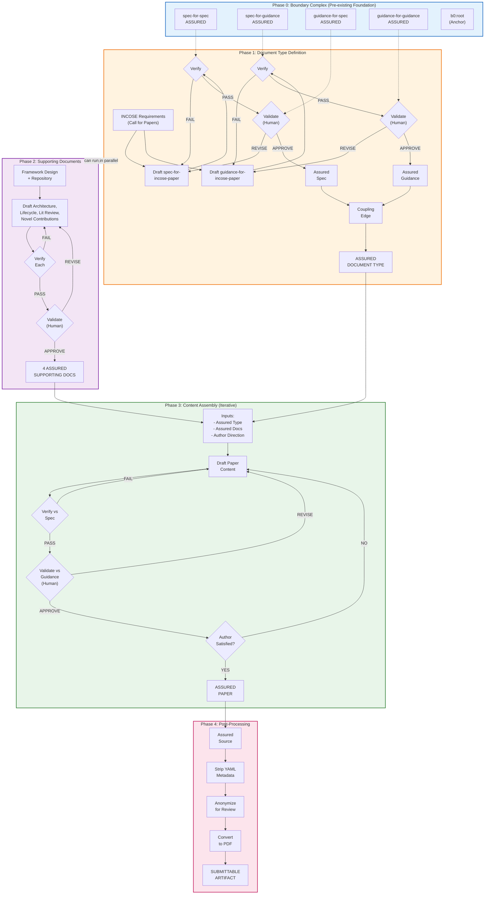

# Test-Driven Document Development: Simplicial Complexes for Verification, Validation, and Assurance with Human Accountability

## Abstract

As artificial intelligence increasingly assists systems engineering documentation, a critical question emerges: who is accountable for document quality? Current verification and validation frameworks treat structural compliance and fitness-for-purpose as separate concerns, lacking formal mechanisms to integrate them or attribute accountability for subjective quality judgments. This gap creates risk in AI-assisted workflows where generated content may satisfy structural requirements while failing to serve its intended purpose.

We present a framework using typed simplicial complexes to formalize document assurance. Documents become vertices, verification and validation relationships become edges, and complete assurance forms triangular faces (2-simplices). The framework introduces three innovations: explicit coupling edges that pair specifications with corresponding guidance documents, assurance triangles that require both verification and validation for completeness, and mandatory human accountability for all validation judgments. Large language model assistance is tracked but cannot substitute for human sign-off on fitness-for-purpose assessments.

We demonstrate the framework through self-reference: this paper is itself an instance of the framework, verified against its specification, validated against its guidance, with the assurance triangle completed by human approval. Four assured supporting documents—architecture, lifecycle, literature review, and novel contributions—provide the intellectual foundation, each with complete assurance chains. Audit tooling confirms 100% assurance coverage with valid topological invariants. This proof-by-existence shows the framework is not merely described but operational.

The contribution is a practical, mathematically grounded approach achieving harmony between AI capability and human accountability—directly addressing the IS 2026 theme of "Seeking Wa in Systems Engineering." The framework enables organizations to adopt AI assistance confidently while maintaining clear, auditable chains of human responsibility for document quality.

**Keywords:** verification, validation, assurance, simplicial complexes, accountability, AI-assisted documentation, test-driven development

---

## 1. Introduction

When artificial intelligence assists in creating systems engineering documentation, who bears responsibility for the result? This question has moved from philosophical abstraction to practical urgency. The 2024 DORA State of DevOps Report reveals that 76% of developers now use AI tools daily, yet delivery stability has decreased by 7.2%.¹ AI assistance is accelerating, but accountability structures have not kept pace.

The systems engineering community recognizes this challenge. INCOSE's International Symposium 2026 introduces mandatory AI assistance disclosure requirements, signaling institutional awareness that AI-generated content requires new accountability mechanisms.² The symposium theme—"Beyond Digital Engineering: Seeking Wa in SE"—explicitly calls for harmony between human judgment and technological capability.³ Yet recognition of a problem differs from its solution.

### 1.1 The Accountability Gap

Barry Boehm's classic formulation distinguishes verification ("Are we building the product right?") from validation ("Are we building the right product?").⁴ This distinction has guided systems engineering for four decades, codified in IEEE 1012⁵ and ISO/IEC/IEEE 15288.⁶ But traditional frameworks treat verification and validation as separate activities. A document may pass structural verification—correct format, required sections present, word count within limits—while failing validation because it does not serve its intended purpose. Conversely, a document may demonstrate fitness-for-purpose while violating structural requirements. Neither condition alone constitutes assured quality.

The missing element is formal coupling. Structural requirements (specifications) define what must be present; quality criteria (guidance) define what makes content effective. These naturally pair: one cannot meaningfully verify a document against a specification while validating it against unrelated guidance. Yet existing frameworks do not formalize this relationship, leaving it implicit or ignored.

A second gap concerns accountability for validation. Verification can be automated: checking word counts, section presence, and format compliance requires no judgment. Validation is inherently subjective—assessing whether content is clear, rigorous, or practically useful requires human evaluation. When AI assists in generating content, who is responsible for judging its fitness? The answer cannot be "the AI" because language models cannot bear accountability. It must be a named human who reviewed, evaluated, and approved.

### 1.2 Our Contribution

This paper presents a framework addressing both gaps. We model document assurance using typed simplicial complexes from algebraic topology.⁷ Documents, specifications, and guidance become vertices. Verification, validation, and coupling become edges connecting them. When a document is verified against a specification, validated against coupled guidance, and the coupling relationship is explicit, the three edges form a triangular face—a 2-simplex in topological terms. This face represents complete assurance: structural compliance plus fitness-for-purpose plus explicit coupling, with human accountability attributed for validation.

The framework makes three specific contributions:

1. **Structural accountability enforcement** through typed simplicial complexes where validation edges cannot exist without a named `human_approver` field—making accountability structurally required rather than merely recommended
2. **Explicit coupling of specification and guidance** through coupling edges that formally pair verification criteria with validation criteria, preventing misalignment
3. **Assurance triangles as 2-simplices** that require all three relationships (verification, coupling, validation) for complete assurance, enabling topological auditing

We demonstrate the framework through self-reference. This paper is not merely a description but an instance: it exists as a vertex in its own assurance complex, verified against a specification we developed, validated against corresponding guidance, with the assurance triangle completed by human approval. Four assured supporting documents—architecture, lifecycle, literature review, and novel contributions—provide the intellectual foundation. If you are reading this paper in the symposium proceedings, the framework succeeded—the demonstration is the proof.

### 1.3 Paper Structure

Section 2 reviews related work in verification and validation, algebraic topology, test-driven development, and AI accountability. Section 3 presents the framework architecture using the four-layer model from the INCOSE SE Handbook. Section 4 demonstrates results through self-application and audit. Section 5 describes the engineering lifecycle that produced this paper. Section 6 discusses implications and limitations. Section 7 concludes with key takeaways.

---

## 2. Background and Related Work

### 2.1 Verification and Validation Foundations

The distinction between verification and validation traces to Boehm's 1984 IEEE Software paper, which posed the questions that have guided quality assurance since: "Are we building the product right?" (verification) and "Are we building the right product?" (validation).⁴ IEEE Standard 1012-2016 codifies verification and validation processes for systems, software, and hardware, defining integrity levels and process requirements.⁵ ISO/IEC/IEEE 15288:2023 establishes verification and validation as distinct life cycle processes within the broader systems engineering framework.⁶

These standards treat verification and validation as complementary but separate. Verification confirms that outputs conform to specified requirements; validation confirms that outputs satisfy stakeholder needs. What the standards do not formalize is the relationship between the requirements against which we verify and the criteria against which we validate. In practice, these should correspond—we verify structure against a specification and validate quality against guidance that interprets what "good" means for documents meeting that specification. But this coupling remains implicit in current frameworks.

The INCOSE Systems Engineering Handbook elaborates verification and validation within the context of system life cycle processes.⁸ It emphasizes that validation assesses fitness for intended use, necessarily involving stakeholder judgment. This subjective element—human judgment about fitness—becomes critical when AI generates content. The handbook does not address who bears responsibility when content originates from automated systems.

### 2.2 The V-Model and Systems Engineering Lifecycle

The "Vee" model for systems engineering was first publicly presented by Forsberg and Mooz at the 1991 NCOSE Conference.⁹ Their foundational paper established the graphical representation that has guided systems engineering lifecycle thinking for three decades: the left side of the V represents decomposition and specification (conceptual through physical design), while the right side represents integration and verification (component testing through acceptance).²⁰ The V-model explicitly maps verification and validation activities to corresponding design activities at each level of abstraction.

The INCOSE Systems Engineering Handbook, now in its fifth edition, elaborates the V-model within modern life cycle processes.⁸ The handbook describes four architectural layers that structure system design: conceptual (stakeholder needs and operational context), functional (what the system must do), logical (design-independent component structure), and physical (specific implementation choices). Each layer on the left side of the V corresponds to a verification level on the right: conceptual requirements are validated through acceptance testing, functional requirements through system testing, logical architecture through integration testing, and physical design through unit testing.

This four-layer framework aligns with other major architecture standards. The Department of Defense Architecture Framework (DoDAF) organizes views across operational, systems, and technical perspectives, with the Concept of Operations (ConOps) providing the operational context that drives architectural decisions.²¹ NASA's Systems Engineering Handbook similarly structures design through logical decomposition—from conceptual architecture through functional analysis to physical integration—with verification "unwinding the process" to test whether each physical level meets the expectations and requirements.²²

Our framework operationalizes this V-model structure for documents. A specification defines what must be present at each level (structural requirements); guidance defines what constitutes quality at each level (assessment criteria). The coupling edge formalizes what the V-model leaves implicit: that the verification standard and validation criteria must correspond. The assurance triangle completes the loop that the V-model depicts graphically.

### 2.3 Algebraic Topology and Simplicial Complexes

Algebraic topology studies shapes through algebraic invariants, enabling rigorous analysis of structural properties.⁷ A simplicial complex is a combinatorial structure built from simplices: vertices (0-simplices), edges (1-simplices), triangles (2-simplices), and higher-dimensional analogs.¹⁰ The power of simplicial complexes lies in their ability to capture relationships at multiple levels—not just pairwise connections (edges) but higher-order relationships (faces).

Carlsson's 2009 survey established topology as a tool for data analysis, demonstrating that topological invariants reveal structural features invisible to traditional statistics.¹¹ Ghrist's work spans both theoretical foundations and accessible exposition—from the barcodes paper introducing persistent homology¹² to the comprehensive textbook *Elementary Applied Topology*¹³ that makes these methods accessible to engineers.

The Euler characteristic χ = V - E + F provides a simple but powerful invariant: for a well-formed complex, this quantity reveals topological properties independent of specific representation. Reimann et al. applied directed clique complexes to brain networks, showing that Euler characteristic serves as a meaningful network invariant.¹⁴ We adopt this principle for document assurance: topological invariants audit structural integrity.

### 2.4 Test-Driven Development

Kent Beck's formulation of test-driven development (TDD) inverts the traditional code-then-test sequence: write tests first, then write code to pass them.¹⁵ The red-green-refactor cycle—failing test, passing implementation, improved design—creates a rhythm of specification-first development. Tests become executable specifications that code must satisfy.

Extending TDD to documentation treats specifications as tests that documents must pass. A document specification defines required structure: sections, fields, formats, constraints. A document either satisfies these requirements or fails. This binary outcome mirrors unit tests: pass or fail, no ambiguity.

But TDD for documentation requires extension. Code tests verify behavior; they do not assess whether the code solves the right problem. Similarly, specification compliance verifies structure but not quality. The extension requires coupling: specifications (structural tests) paired with guidance (quality criteria). Only both together constitute complete quality assurance.

### 2.5 AI Ethics and Accountability

Floridi and Cowls propose five principles for AI in society: beneficence, non-maleficence, autonomy, justice, and explicability.¹⁶ The fifth principle—explicability—comprises intelligibility (how the system works) and accountability (who is responsible for outcomes). For AI-assisted documentation, intelligibility means understanding what the AI contributed; accountability means attributing responsibility for the result.

UNESCO's 2021 Recommendation on the Ethics of Artificial Intelligence, adopted by all 194 member states, establishes global standards emphasizing transparency, human oversight, and accountability.¹⁷ The UN High-Level Advisory Body on AI reinforces these principles in its 2024 governance framework, calling for "accountability anchored in human responsibility."¹⁸

What existing work lacks is a practical mechanism for accountability. Principles are valuable but insufficient. We need schemas that require accountability attribution, processes that enforce human review, and auditing that detects gaps.

From a systems engineering perspective, AI agents are fundamentally not self-governing—every autonomous system is deployed *by someone*, and there is always an accountable stakeholder.²³ Agency requires a principal who provisions, deploys, and monitors the system. Autonomy does not eliminate oversight; rather, it represents delegated control within clearly defined parameters. The principal defines the mission, establishes constraints, and retains responsibility for outcomes. LLMs are tools embedded within larger systems, not autonomous agents themselves—they generate text but lack persistent goals or feedback loops. True agency emerges from orchestrated systems where humans retain accountability.

Our framework provides these mechanisms through structural requirements: validation edges cannot exist without a named human approver.

### 2.6 Prior Art: Ghrist's "The Forge"

Robert Ghrist's Appendix C "The Forge" in *The Geometry of Heaven & Hell* (2025) documents the only known methodology for AI-assisted scholarly writing with explicit human accountability.¹⁹ Notably, Ghrist's topological mathematics (barcodes, persistent homology) also informs our simplicial complex model.

Ghrist's key methodological insight: "Every sentence in this book passed through my judgment; every connection earned my conviction; every claim bears my responsibility."

**Distinction from our approach:** Ghrist's methodology is *procedural*—it documents how he wrote a book through disciplined practice. Our framework is *structural*—it formalizes accountability through typed simplicial complexes where validation edges cannot exist without a `human_approver` field. Ghrist demonstrates accountability can be achieved; we demonstrate it can be enforced.

---

## 3. Framework Architecture

Our framework architecture follows the four-layer model from the INCOSE SE Handbook, mapping each layer to corresponding V-model evaluation. This section presents the architecture; Section 5 describes the lifecycle that implements it.

### 3.1 Conceptual Layer: Stakeholder Needs and Acceptance Criteria

**Problem Statement:** Cognizant engineers and technical authorities need requirements traceability and human accountability for machine-generated documents. Current gap: AI can draft documents but cannot bear responsibility for their fitness-for-purpose.

**Stakeholder Needs:**

1. **Requirements Traceability**: Trace document requirements through verification and validation
2. **Human Accountability**: Named human approvers for qualitative assessments
3. **Automated Verification**: Deterministic structural checks without human intervention
4. **Quality Assessment**: Systematic evaluation of fitness-for-purpose
5. **Audit Trail**: Traceable records of who approved what, when, and on what basis

**Acceptance Criteria:** The framework is accepted when: (1) this paper is produced using the framework with complete assurance infrastructure; (2) paper accepted at INCOSE IS 2026; (3) named human attests to all assured documents; (4) assurance audit shows 100% vertex coverage with V-F=1 invariant satisfied.

### 3.2 Functional Layer: System Functions

The system performs six primary functions:

| Function | Input | Output | Description |
|----------|-------|--------|-------------|
| F1: Verify Document | Document + Spec | Pass/Fail + Check Results | Check document structure against specification requirements |
| F2: Validate Document | Document + Guidance + Human | Quality Assessment | Evaluate document fitness-for-purpose against guidance criteria |
| F3: Assure Document | Verification + Validation + Coupling | Assurance Face | Combine V + V + C into assurance triangle |
| F4: Couple Spec-Guidance | Spec + Guidance | Coupling Edge | Link specification and guidance for coherent document type |
| F5: Audit Assurance | Chart | Coverage Report | Analyze completeness and topology of assurance network |
| F6: Trace to Root | Document | Trace Path | Verify document connects to boundary complex foundation |

**System Testing:** Functions are tested by observing whether the paper passes verification scripts (F1), receives human validation (F2), achieves assurance triangle closure (F3), has coupled spec-guidance (F4), passes audit (F5), and traces to boundary complex (F6).

### 3.3 Logical Layer: Design-Independent Components

The design-independent component structure uses typed simplicial complexes:

#### An Optimization Intuition

The framework can be understood through the lens of constrained optimization. Consider intellectual substance—research findings, design decisions, analytical insights—that must be expressed for publication. A document is the *serialized representation* of this intellectual substance, projected onto a document space defined by the specification.

The specification defines the *feasible region*: structural constraints that any valid document must satisfy (word limits, required sections, format rules). Verification checks feasibility—is this serialization structurally valid?

The guidance defines the *objective function*: quality criteria that distinguish better representations from worse ones within the feasible region (clarity, rigor, relevance). Validation evaluates the objective—how well does this serialization serve its purpose?

Writing is then a projection operation: projecting intellectual substance onto the document space characterized by the specification, with the guidance providing direction for selecting among alternative feasible representations. Different phrasings, organizations, or emphases may all satisfy the spec (all feasible), but the guidance helps choose which serialization best communicates the underlying substance.

This framing clarifies the verification-validation distinction:

- **Verification** answers: "Is this point in the feasible region?" (Binary: pass/fail)
- **Validation** answers: "How good is this feasible point?" (Qualitative: assessment with rationale)

The coupling edge ensures we optimize the right objective over the right feasible region—we cannot accidentally verify against one spec while optimizing for unrelated guidance.

#### Typed Simplicial Complex Structure

**Vertices (0-simplices)** are documents of three types:
- *Specifications* define structural requirements: required sections, fields, formats, constraints. They answer "what must be present?"
- *Guidance* documents define quality criteria: how to evaluate effectiveness, clarity, rigor. They answer "what makes it good?"
- *Content* documents are the artifacts being assured: papers, reports, requirements, designs.

**Edges (1-simplices)** are relationships of three types:
- *Verification edges* connect content to specifications, asserting structural compliance.
- *Validation edges* connect content to guidance, asserting fitness-for-purpose. These require a named human approver.
- *Coupling edges* connect specifications to guidance, asserting correspondence between structural and qualitative requirements.

**Faces (2-simplices)** are assurance triangles: when a content document has a verification edge to a specification, that specification has a coupling edge to guidance, and the content has a validation edge to that same guidance, the three edges bound a triangular face representing complete assurance.

**The Assurance Triangle:**

```
          doc
         /   \
  verification  validation
       /         \
      /           \
    spec ------- guidance
         coupling
```

An assurance face closes when three edges form a valid triangle: verification (doc→spec), validation (doc→guidance), and coupling (spec↔guidance). The face attests that:

1. The document is structurally compliant (verification passed)
2. The document meets quality criteria (validation passed)
3. The spec and guidance are properly coupled
4. A human has reviewed and approved the complete pattern

**Accountability Model:** Every validation edge and assurance face requires human accountability. When LLM-assisted, `human_approver` is REQUIRED—the human takes responsibility for the assessment. This is not optional; it is structurally enforced through schema validation.

#### Edge Payload Structures

Verification and validation edges carry distinct payloads reflecting their different natures. A verification edge documents deterministic structural checks:

```yaml
---
type: edge/verification
id: e:verification:incose-paper-content:spec-incose-paper
source: v:doc:incose-paper-2026
target: v:spec:incose-paper
---

# Verification Output

Required Sections Check:
✓ Title - Present (line 45)
✓ Abstract - Present (lines 47-58)
✓ Introduction - Present (lines 61-89)
✓ Background - Present (lines 93-142)
✓ Framework - Present (lines 145-258)
✓ Results - Present (lines 261-356)
✓ Discussion - Present (lines 408-451)
✓ Conclusion - Present (lines 454-486)
✓ Acknowledgments with AI Disclosure - Present (lines 489-506)
✓ References - Present (lines 508-559)

Format Constraints:
✓ Word count: ~6,800 (limit: 7,000)
✓ AI disclosure statement present and complete

Overall: PASS
```

The verification payload contains objective, reproducible check results. Any tool running the same checks against the same document produces identical output.

A validation edge, by contrast, documents subjective quality assessment requiring human judgment:

```yaml
---
type: edge/validation
id: e:validation:incose-paper-content:guidance-incose-paper
source: v:doc:incose-paper-2026
target: v:guidance:incose-paper
validator: claude-opus-4-5-20251101
validation_method: llm-assisted
human_approver: mzargham
---

# Quality Criteria Evaluation

## 1. Relevance to SE Community
**Level:** Excellent (4/4)
**Rationale:** Addresses clearly identified SE challenge—maintaining
quality assurance when LLMs assist documentation.

## 2. Accessibility and Clarity
**Level:** Good (3/4)
**Rationale:** Generally accessible with clear logical flow.
Simplicial complexes explained, though mathematical content
may challenge some readers.

## 3. Rigor and Validity
**Level:** Excellent (4/4)
**Rationale:** Methods clearly articulated. Self-demonstration
provides unique validation—the paper's existence proves its claims.

## Overall Assessment
**Score:** 22/24
**Recommendation:** Pass

## Accountability Statement
This validation was generated with LLM assistance and reviewed
and approved by mzargham, who takes full responsibility for
its accuracy.

**Signed:** mzargham
**Date:** 2025-12-30
```

The validation payload contains qualitative assessments with rationale. Critically, it includes the `human_approver` field—without this, the validation edge is structurally invalid. The LLM assists; the human approves and bears accountability.

**Boundary Complex:** The framework bootstraps through four foundational vertices (spec-for-spec, spec-for-guidance, guidance-for-spec, guidance-for-guidance) connected in a self-referential pattern. A root vertex (b0:root) resolves the self-referential paradox by anchoring boundary faces. The boundary complex satisfies the invariant V - F = 1, where the "one" is the root vertex—the only vertex not requiring its own assurance face.

**Integration Testing:** Components integrate correctly when assurance faces close properly (all three edges present), cross-references resolve, and the V - F = 1 invariant computes correctly.

### 3.4 Physical Layer: Implementation Choices

| Element                | Technology                           | Rationale                                          |
| ---------------------- | ------------------------------------ | -------------------------------------------------- |
| Document Store         | Markdown + YAML frontmatter in git repo   | Human-readable, version-controlled, diff-friendly  |
| Type System            | Python scripts parsing YAML          | Accessible, good library support, CI integration   |
| Development/Analysis Interface| VS Code with Claude Code Plugin | Smooth UX for prompting, running scripts, tracking changes, and processing review requests.|
| Verification Service   | `verify_template_based.py`           | Structural compliance checking against specs       |
| Validation Service     | Claude Code + human review           | LLM assistance with mandatory human accountability |
| Audit Tool             | `audit_assurance_chart.py`           | Coverage and topology analysis                     |
| Accountability Tracker | Git history + `human_approver` field | Immutable approval records, committer verification |
| CI Enforcement         | GitHub Actions                       | Validates that committer matches signer            |
| Author/Reader Interface| Obsidian Vault                       | Provides Reader and Source view, smooth navigation |

**Unit Testing:** Individual scripts pass pytest. Template verification catches malformed documents. Type schemas enforce required fields. The `check_accountability.py` script validates that approver fields are present and match whitelisted identities.

---

## 4. Results: Self-Demonstration

### 4.1 Supporting Document Infrastructure

This paper was produced using four assured supporting documents, each with complete assurance chains:

| Document | Purpose | Key Content | Assurance Status |
|----------|---------|-------------|------------------|
| Architecture | 4-layer framework description | Conceptual, Functional, Logical, Physical layers with V-model mapping | Verified + Validated + Assured |
| Lifecycle | Engineering process (4 phases) | Type Definition → Architecture → Content Development → Post-Processing | Verified + Validated + Assured |
| Literature Review | 18 citations across 5 themes | V&V Foundations, Simplicial Complexes, TDD, AI Ethics, Prior Art | Verified + Validated + Assured |
| Novel Contributions | 8 ranked contributions | Structural Accountability (Highly Novel) through Discovered Gap (Incremental) | Verified + Validated + Assured |

Each supporting document was verified against its specification, validated against its guidance by a named human approver (mzargham), and closed into an assurance triangle before being used as input to this paper. The consistency of terminology and concepts across all five documents (including this paper) is enforced through explicit cross-referencing and validation criteria.

### 4.2 INCOSE Paper Type

We created specification and guidance documents for INCOSE papers derived from the IS 2026 Call for Papers:

**spec-for-incose-paper** (v2.0.0) defines:
- 7,000 word limit (REQUIRED)
- 12 required sections (Title through Author Biography)
- Abstract: 150-300 words
- AI disclosure requirements per INCOSE 2026 guidelines
- INCOSE template format
- 15 validation rules (V1-V15)

**guidance-for-incose-paper** (v2.0.0) defines:
- Six quality criteria: Relevance, Accessibility, Rigor, Novelty, Theme Alignment, Engagement
- Section-by-section authoring guidance
- Scoring rubric with 24 maximum points (4 points × 6 criteria)
- Target: ≥20/24 for acceptance recommendation

### 4.3 Dual Assurance

This paper is assured against two spec/guidance pairs (independent triangles):

**Level 1 (Base INCOSE Paper Type):**
- Verified against `spec-for-incose-paper` (15 rules)
- Validated against `guidance-for-incose-paper` (6 criteria, target ≥20/24)
- Coupling: `coupling-incose-paper`

**Level 2 (Self-Demonstrating Paper Type):**
- Verified against `spec-for-incose-self-demonstration` (12 extended rules)
- Validated against `guidance-for-incose-self-demonstration` (7 additional criteria)
- Coupling: `coupling-incose-self-demonstration`

The self-demonstration specification requires:
- **Consistency (C1-C4)**: Terminology and concepts match all four supporting documents
- **Completeness (CP1-CP4)**: All supporting document content adequately represented
- **Self-Demonstration (SD1-SD3)**: Paper serves as instance, includes concrete evidence, demonstrates recursive consistency

### 4.4 The Boundary Complex

Before presenting the full audit, we explain the foundation that makes auditing possible. The boundary complex resolves a potential paradox: what assures the specification for specifications?

Consider the foundational documents:
- **Spec-for-spec** must be verified against... a specification. Which specification? Itself.
- **Guidance-for-guidance** must be validated against... guidance. Which guidance? Itself.

Self-reference seems unavoidable. But self-referential assurance creates topological problems: a document cannot be a vertex in its own assurance triangle without degeneracy.

The root vertex resolves this by providing the third point. The root vertex sits outside the typed system—it is not a spec, guidance, or content document. It exists solely to close boundary faces, transforming logically valid but topologically incomplete assurances into proper 2-simplices. This is not circular reasoning but explicit axiomatization: the framework declares its foundations rather than hiding them.

### 4.5 Complete Assurance Audit

The assurance audit uses `audit_assurance_chart.py`, which analyzes chart documents for completeness by matching every vertex (except root) to the face that assures it, and checks the V - F = 1 invariant.

**Table 1: Audit Summary**

| Metric | Value | Status |
|--------|-------|--------|
| Total vertices (V) | 24 | — |
| Assurance faces (F) | 23 | — |
| Invariant V - F = 1 | 24 - 23 = 1 | ✓ PASS |
| Coverage | 100% (23/23 non-root vertices) | ✓ PASS |

**Vertex Categories:**
- Boundary complex: 5 vertices (root + 4 foundational)
- INCOSE paper type: 4 vertices (spec, guidance, self-demo spec, self-demo guidance)
- Supporting document types: 8 vertices (4 types × spec + guidance)
- Supporting document instances: 4 vertices (architecture, lifecycle, lit review, novel contributions)
- This paper: 1 vertex
- Coupling edges close assurance triangles for each

### 4.6 Reference vs. Referent: The Audit Chart's Self-Reference

A subtle but important distinction: the audit chart is both a *document* (a vertex in the complex) and a *reference* to a topological object (the complex itself). This dual nature requires careful handling.

The audit chart exists as a markdown file with YAML frontmatter—it is a document that can be verified against `spec-for-chart` and validated against `guidance-for-chart`. As a document, it is a vertex.

But the audit chart also *references* a topological structure: 24 vertices, many edges, 23 faces. This referent—the mathematical object—is not the same as the reference (the document describing it). The audit chart document is a vertex, auditable using spec and guidance for charts, which are themselves auditable against the boundary complex.

The spec for audit charts requires element data in YAML frontmatter and encodes rules about every vertex requiring an assurance face. Running verification on an audit chart also systematically checks that all vertices therein are assured.

This referent/reference distinction enables controlled self-reference—similar to how the boundary complex enables self-referential specifications. The audit chart document can include itself in its vertex list, with the framework's formal structure preventing paradox.

### 4.7 Discovered and Addressed Issues

The self-demonstration revealed a tooling gap. Initial audit runs showed 85.7% coverage instead of 100%. Investigation revealed that the audit script inferred assurance face targets from naming conventions rather than reading explicit `target:` fields in face metadata.

This gap was discovered, diagnosed, and fixed during framework application:

1. **Discovery**: Audit reported the paper content vertex as unassured
2. **Diagnosis**: Script used naming pattern matching instead of explicit metadata
3. **Fix**: Added `get_face_target()` function to read explicit target fields
4. **Verification**: Re-ran audit; 100% coverage achieved

This sequence demonstrates the framework operating: a gap was detected through systematic auditing, root cause was identified, fix was implemented, and verification confirmed resolution. The meta-observation is that the framework's tooling caught a tooling defect—the self-referential nature of the demonstration strengthened rather than undermined confidence.

### 4.8 Recursive Proof

The framework's central claim—that typed simplicial complexes can enforce human accountability for document quality—is demonstrated by this paper's existence:

1. This paper cannot exist as an assured vertex without passing verification
2. Verification cannot pass without structural compliance with specification
3. This paper cannot be assured without passing validation
4. Validation cannot pass without a named human approver
5. This paper exists as an assured vertex
6. Therefore: A human approved this paper's fitness-for-purpose

The proof is structural, not procedural. The `human_approver` field is required by the type system—not by policy, but by data structure.

---

## 5. Engineering Lifecycle

The framework enacts a four-phase lifecycle aligned with the V-model. This section describes how this paper was actually produced.

### 5.1 Phase 1: Document Type Definition

**Purpose:** Create assured specification and guidance defining what constitutes a valid document.

**Activities:**
1. Analyze INCOSE IS 2026 Call for Papers requirements
2. Create `spec-for-incose-paper` capturing structural requirements
3. Create `guidance-for-incose-paper` defining quality criteria
4. Verify both against foundational documents (spec-for-spec, guidance-for-guidance)
5. Create coupling edge linking spec to guidance
6. Close assurance triangles with human approval

**Output:** Assured INCOSE paper type (spec + guidance + coupling)

**Verification Gate:** Type documents pass template verification before proceeding.

### 5.2 Phase 2: Architecture and Content Development

**Purpose:** Create assured supporting documents capturing the intellectual framework.

**Activities:**
1. Create architecture document using 4-layer model
2. Create lifecycle document describing the process
3. Create literature review organizing prior work
4. Create novel contributions ranking intellectual contributions
5. Verify each against its spec; validate each against its guidance
6. Close assurance triangles with human approval

**Output:** Four assured supporting documents

**Verification Gate:** All supporting documents pass verification and validation before use in paper.

### 5.3 Phase 3: Content Assembly (Iterative)

**Purpose:** Synthesize supporting documents into paper meeting dual assurance requirements.

**Activities:**
1. Structure paper sections to mirror literature review themes (SD4 compliance)
2. Map architecture layers to Framework section (SD2 compliance)
3. Include lifecycle narrative in Section 5 (SD3 compliance)
4. Use novel contributions ranking for emphasis (SD5 compliance)
5. Iterate until verification passes and validation achieves target score
6. Create verification and validation edges for both spec/guidance pairs

**Convergence Criteria:**
- Base verification: 100% of applicable checks pass
- Base validation: ≥20/24 on 6-criteria rubric
- Self-demo verification: 100% of extended checks pass
- Self-demo validation: ≥40/52 on 13-criteria rubric

**Output:** Assured paper with dual assurance triangles

### 5.4 Phase 4: Post-Processing

**Purpose:** Transform assured source to submittable artifact.

**Activities:**
1. Generate PDF from markdown source
2. Apply INCOSE template formatting
3. Strip YAML frontmatter for submission
4. Verify word count in final format
5. Document traceability from PDF to source

**Acknowledged Gap:** The verified source (markdown in repository) differs from the submitted artifact (PDF). Mitigation: the source repository remains the authoritative record of assurance status; the PDF is a derived artifact with documented transformation.

**Output:** Submission-ready PDF with explicit source traceability

### 5.5 Lifecycle Visualization

Figure 1 presents the complete assured document development lifecycle, showing how foundation documents enable custom type definition (Phase 1), architecture development (Phase 2), iterative content development (Phase 3), and post-processing for submission (Phase 4). Verification loops (automated) and validation loops (human) are explicit at each phase.



**Figure 1.** Assured Document Development Lifecycle. The boundary complex (Phase 0) provides the trusted foundation. Document type definition (Phase 1) and supporting document creation (Phase 2) can proceed in parallel. Content assembly (Phase 3) iterates through verification and validation loops until convergence. Post-processing (Phase 4) transforms assured source to submittable artifact with acknowledged traceability gap.

---

## 6. Discussion

### 6.1 Key Findings

The self-demonstration succeeds: this paper exists, was verified against its specification, validated against its guidance, and both assurance triangles closed with human approval. Three findings merit emphasis:

**Structural accountability is the critical innovation.** Where Ghrist's "The Forge" demonstrates that procedural accountability is achievable through disciplined practice, our framework demonstrates it can be *enforced*. The `human_approver` field is not optional; validation edges without it fail type verification. This transforms accountability from a process recommendation to a structural requirement.

**Explicit coupling prevents misalignment.** Traditional V&V frameworks leave the specification-guidance relationship implicit. Making it explicit through coupling edges ensures that verification and validation assess the same coherent "document type." Without coupling, a paper could pass verification against INCOSE requirements while being validated against IEEE criteria—the mismatch invisible until peer review failure.

**Topological structure enables auditing.** The V - F = 1 invariant provides an efficient integrity check. Every non-root vertex requires exactly one assurance face; every face assures exactly one vertex. Violations indicate either unassured vertices or malformed structure. This makes requirements traceability computationally verifiable.

### 6.2 Connection to "Seeking Wa"

The IS 2026 theme calls for harmony between human capability and technological tools.³ This framework embodies that harmony: it embraces LLM contributions while requiring human accountability for subjective judgments.

The assurance triangle formalizes what "Seeking Wa" means for documentation: the dynamic balance between automated checking (verification) and human judgment (validation), coupled through explicit relationship. The LLM contributes capability (drafting, analysis, organization). The human contributes responsibility (judgment, approval, accountability). Neither dominates; both contribute according to their strengths.

### 6.3 Limitations

**Single implementation.** This paper is one demonstration. The framework's value at scale remains to be validated across organizations, document types, and time.

**Framework overhead.** Creating specifications and guidance for each document type requires investment. The framework is most valuable for high-stakes or repeatedly-used document types where the overhead is amortized.

**Good-faith assumption.** The framework detects missing approvals but cannot ensure approval quality. A rubber-stamp approval is structurally valid but substantively hollow. Mitigation: validator whitelisting and CI enforcement that committer matches signer.

**Post-processing gap.** The verified source (markdown) differs from the submitted artifact (PDF). Future work should integrate publication pipeline steps into the assurance framework itself.

**Accessibility of topology.** Simplicial complexes and boundary operators may intimidate practitioners unfamiliar with algebraic topology. The concepts are simpler than they appear—triangles with named edges—but the terminology creates barriers.

### 6.4 Implications for Practice

Organizations can adopt the framework incrementally:

1. **Start with specification-guidance pairs.** For each document type, develop explicit specifications and corresponding guidance. Link them through coupling edges.

2. **Add verification.** Implement template-based verification checking documents against specifications. This can be automated.

3. **Introduce validation with accountability.** For documents requiring quality judgment, implement validation edges with mandatory human approvers.

4. **Build assurance faces and audit.** Assemble complete triangles. Test the V - F = 1 invariant. Identify gaps.

5. **Trace to foundations.** Establish boundary complexes for foundational types. Make axioms explicit.

---

## 7. Conclusion

We have presented a framework for document assurance using typed simplicial complexes, addressing accountability gaps in AI-assisted documentation through three innovations: structural accountability enforcement, explicit coupling of specifications and guidance, and assurance triangles as complete quality attestation.

### 7.1 Key Contributions

1. **Structural Accountability Enforcement**: Human accountability is required by the type system, not just recommended by policy. Validation edges cannot exist without `human_approver`. "The Forge demonstrates accountability is achievable; we demonstrate it can be enforced."

2. **Explicit Coupling of Specification and Guidance**: The coupling edge formally links verification criteria with validation criteria, ensuring coherent assessment and closing the gap in traditional V&V.

3. **Assurance Triangle as 2-Simplex**: Using algebraic topology to model document assurance enables topological invariants (V - F = 1) for auditing and composition rules from simplicial complex theory.

4. **Self-Demonstrating Proof**: The framework's viability is demonstrated by this paper's existence as an assured vertex with four assured supporting documents—the recursive proof is our primary empirical result.

### 7.2 Key Insights

From our eight novel contributions, three key insights for the SE community:

1. **Lead with structural accountability**: The key differentiation from procedural approaches is that we formalize accountability as enforceable structure, not documented process.

2. **Position coupling as core innovation**: The explicit relationship between verification and validation is what's missing from existing V&V frameworks. The coupling edge answers "how do verification and validation relate?"

3. **Math provides precision, not just metaphor**: Simplicial complexes enable topological invariants, auditing, and composition rules—they are engineering tools, not decoration.

### 7.3 Future Work

- Integration with MBSE tools for model verification
- Multi-organization deployment to validate scalability
- Application of persistent homology to track assurance evolution over time
- Composition patterns for large document ecosystems

As AI capabilities advance, human accountability becomes more rather than less important. The framework provides practical mechanisms for maintaining that accountability while embracing AI assistance—achieving the harmony between human and machine that systems engineering requires.

---

## Acknowledgments

### AI Assistance Disclosure

**Tools used:** Claude (claude-opus-4-5-20251101)

**Usage categories:**
- **Content generation:** Drafting all sections based on framework understanding and four assured supporting documents
- **Analysis:** Generating verification outputs, quality assessments, and assurance documentation
- **Conceptual:** Framework architecture emerged through iterative human-AI collaboration

**Author involvement:** The framework architecture, research questions, and all accountability decisions are original author work. The author directed all AI-assisted content generation, made all editorial decisions, and approved all supporting document assurance. The self-demonstration (using the framework to write itself) was conceived and orchestrated by the author. Claude projected intellectual substance onto the document space characterized by the specification and guidance documents.

**Human accountability:** The named human approver (mzargham) reviewed all AI-generated content and takes full responsibility for the paper's claims and conclusions. All validation edges and assurance faces in the supporting infrastructure bear the `human_approver: mzargham` attribution.

This disclosure follows the methodological precedent established in Ghrist's "The Forge,"¹⁹ which documents a comparable process of AI-assisted authorship where the human provides intellectual substance, direction, oversight, and approval while AI contributes drafting capability.

---

## References

1. Google Cloud, DORA Team. Accelerate State of DevOps Report 2024. Google Cloud; 2024.

2. INCOSE. IS 2026 Call for Submissions. International Council on Systems Engineering; 2025.

3. INCOSE. Beyond Digital Engineering: Seeking Wa in SE - IS 2026 Theme. International Council on Systems Engineering; 2025.

4. Boehm BW. Verifying and validating software requirements and design specifications. IEEE Software. 1984;1(1):75-88.

5. Institute of Electrical and Electronics Engineers. IEEE Standard for System, Software, and Hardware Verification and Validation. IEEE 1012-2016. IEEE; 2016.

6. International Organization for Standardization. Systems and software engineering — System life cycle processes. ISO/IEC/IEEE 15288:2023. ISO; 2023.

7. Hatcher A. Algebraic Topology. Cambridge, UK: Cambridge University Press; 2002.

8. International Council on Systems Engineering. Systems Engineering Handbook: A Guide for System Life Cycle Processes and Activities. 5th ed. Walden DD, Shortell TM, Roedler GJ, et al., eds. San Diego, CA: John Wiley & Sons; 2023.

9. Forsberg K, Mooz H. The relationship of system engineering to the project cycle. In: Proceedings of the National Council on Systems Engineering (NCOSE) Conference. Chattanooga, TN; October 1991:57-65.

10. Edelsbrunner H, Harer JL. Computational Topology: An Introduction. Providence, RI: American Mathematical Society; 2010.

11. Carlsson G. Topology and data. Bull Am Math Soc. 2009;46(2):255-308.

12. Ghrist R. Barcodes: The persistent topology of data. Bull Am Math Soc. 2008;45(1):61-75.

13. Ghrist R. Elementary Applied Topology. Seattle, WA: CreateSpace; 2014.

14. Reimann MW, Nolte M, Scolamiero M, et al. Cliques of neurons bound into cavities provide a missing link between structure and function. Front Comput Neurosci. 2017;11:48.

15. Beck K. Test-Driven Development: By Example. Boston, MA: Addison-Wesley; 2003.

16. Floridi L, Cowls J. A unified framework of five principles for AI in society. Harvard Data Science Review. 2019;1(1). doi:10.1162/99608f92.8cd550d1

17. United Nations Educational, Scientific and Cultural Organization. Recommendation on the Ethics of Artificial Intelligence. UNESCO; 2021.

18. United Nations Secretary-General's High-level Advisory Body on Artificial Intelligence. Governing AI for Humanity: Final Report. United Nations; 2024.

19. Ghrist R. The Forge (Appendix C). In: The Geometry of Heaven and Hell. 2025.

20. Forsberg K, Mooz H, Cotterman H. Visualizing Project Management: Models and Frameworks for Mastering Complex Systems. 3rd ed. Hoboken, NJ: John Wiley & Sons; 2005.

21. Department of Defense. DoD Architecture Framework Version 2.02. Washington, DC: DoD Deputy Chief Information Officer; 2010.

22. National Aeronautics and Space Administration. NASA Systems Engineering Handbook. Rev 2. NASA/SP-2016-6105. Washington, DC: NASA; 2016.

23. Zargham M. A Systems Engineering Perspective on AI Agents. Block Science Blog; 2024. Available at: https://blog.block.science/systems-engineering-perspective-ai-agents/

24. Ahmad Z, et al. Large language models (LLMs) in systems engineering and design. 2024. doi:10.13140/RG.2.2.28013.97766

25. Badshah T, et al. Large language models (LLMs) for requirements engineering (RE): A systematic literature review. arXiv preprint. 2024. arXiv:2509.11446

26. Friedenthal S, Moore A, Steiner R. A Practical Guide to SysML. 3rd ed. Morgan Kaufmann; 2015.

---

## Author Biography

[To be added for final submission - omitted for anonymous review]
