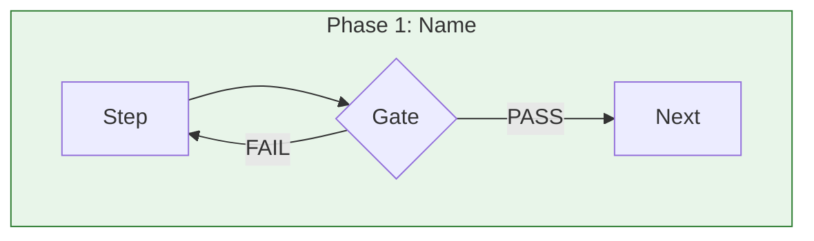

# Guidance for Lifecycle Documents

**This guidance defines quality criteria and best practices for creating excellent engineering lifecycle documents that describe assured document development workflows.**

## Purpose

While spec-for-lifecycle defines what structural elements must be present, this guidance helps authors assess **how well** a lifecycle document serves its purpose. Great lifecycle documents are clear, complete, actionable, and enable practitioners to successfully follow the process to produce assured artifacts.

## Document Overview

### What This Guidance Covers

This guidance supports authors creating lifecycle documents by providing:
- Quality assessment criteria specific to process documentation
- Best practices for describing workflows clearly
- Common pitfalls in lifecycle documentation
- Section-by-section authoring recommendations
- Workflow for creating lifecycle documents

### Best Use Cases

Use this guidance when:
- Creating a new lifecycle document for a document type
- Reviewing existing lifecycle documentation for clarity and completeness
- Standardizing lifecycle documentation across an organization
- Teaching others how to document engineering processes
- Evaluating whether a lifecycle can be successfully followed

## Quality Criteria

### 1. Clarity of Flow

**Excellent:**
- Phases follow a logical, natural progression
- Decision points are unambiguous (clear pass/fail criteria)
- Iteration loops are explicitly documented with exit conditions
- Reader can trace any path through the flowchart
- Parallel vs. sequential phases are clearly distinguished

**Good:**
- Flow is generally understandable
- Most decision points are clear
- Major paths documented
- Some ambiguity in edge cases

**Needs Improvement:**
- Confusing phase ordering
- Decision criteria unclear or missing
- Iteration not addressed
- Cannot determine what happens on failure
- Parallel/sequential relationships unclear

### 2. Completeness

**Excellent:**
- Every phase has Goal, Inputs, Process, Outputs, Gates
- All decision paths documented (success AND failure)
- Prerequisites explicitly stated and justified
- No gaps between one phase's output and next phase's input
- Edge cases and exceptions addressed

**Good:**
- Major phases complete
- Success paths documented
- Prerequisites listed
- Minor gaps acceptable

**Needs Improvement:**
- Missing phase components (no inputs or no outputs)
- Only happy path documented
- Prerequisites assumed but not stated
- Obvious gaps in flow
- No exception handling

### 3. Actionability

**Excellent:**
- Practitioner can follow lifecycle without additional guidance
- Process steps are specific enough to execute
- Verification commands or checks are provided
- Time expectations realistic and stated where applicable
- Examples reference real artifacts

**Good:**
- Most steps executable
- Some verification guidance
- Generally followable

**Needs Improvement:**
- Steps too vague to execute ("ensure quality")
- No verification mechanisms documented
- Requires extensive interpretation
- Abstract without concrete examples

### 4. Assurance Integration

**Excellent:**
- Clear distinction between verification (automated) and validation (human)
- Human accountability explicitly required for validation gates
- Assurance triangle formation explicitly documented
- Connection to broader assurance framework clear
- Edge and face creation documented

**Good:**
- Verification and validation distinguished
- Human involvement noted
- Assurance concepts referenced

**Needs Improvement:**
- Verification/validation conflated
- Human accountability unclear
- No connection to assurance framework
- Unclear when assurance is achieved

### 5. Visual Quality

**Excellent:**
- Flowchart is readable and well-organized
- Color coding meaningful and consistent
- Subgraphs logically group related elements
- Decision diamonds clearly labeled
- All paths visible and traceable
- Legend provided if using non-obvious notation

**Good:**
- Flowchart understandable
- Some organization
- Major elements visible

**Needs Improvement:**
- Flowchart cluttered or unreadable
- No logical grouping
- Decision points unclear
- Paths difficult to trace
- Inconsistent notation

### 6. Narrative Coherence

**Excellent:**
- Prose walkthrough tells a coherent story
- Explains "why" behind key decisions
- Connects phases to outcomes
- Addresses common questions proactively
- Suitable for both reference and learning

**Good:**
- Narrative understandable
- Major decisions explained
- Generally coherent

**Needs Improvement:**
- Disconnected descriptions
- No explanation of rationale
- Only procedural (no "why")
- Assumes too much context

### 7. Traceability

**Excellent:**
- Every output can be traced to its inputs
- Prerequisites trace to foundation documents
- Artifacts produced are explicitly named
- Lifecycle connects to specific document types (specs, guidance)
- References to actual documents in repository

**Good:**
- Major artifacts traceable
- Prerequisites referenced
- General document types mentioned

**Needs Improvement:**
- Outputs appear from nowhere
- Prerequisites vague ("some foundation")
- Artifacts unnamed or generic
- No connection to actual documents

## Section-by-Section Guidance

### Introduction

**Purpose:** Orient the reader and establish context

**Tips:**
- State the target artifact type in the first paragraph
- Explain what problem this lifecycle solves
- Connect to the assurance framework explicitly
- Keep to 2-3 paragraphs maximum

**Anti-patterns:**

- ❌ Starting with abstract definitions
- ❌ Not stating what gets produced
- ❌ Assuming reader knows the context

**Preferred:**

- ✅ State the target artifact type in the first paragraph
- ✅ Connect to the assurance framework explicitly

**Example opening:**
> "This lifecycle documents the systematic process for developing assured research papers within the typed simplicial complex framework. It produces a paper document that has been verified against its specification, validated against its guidance, and closed into an assurance triangle with explicit human accountability."

### Foundation / Prerequisites

**Purpose:** Establish what must exist before starting

**Tips:**
- Use a table format for clarity
- Specify assurance status ("assumed assured")
- Explain why each prerequisite is necessary
- Reference actual document IDs where possible

**Anti-patterns:**

- ❌ Vague prerequisites ("appropriate foundation")
- ❌ Not explaining why prerequisites matter
- ❌ Assuming knowledge of boundary complex

**Preferred:**

- ✅ Use a table format listing each prerequisite with its assurance status
- ✅ Reference actual document IDs where possible

**Quality Indicators:**
- Could a newcomer determine what's needed?
- Are all referenced documents findable?

### Phase Definitions

**Purpose:** Define what happens in each phase

**Tips:**
- Start each phase with a clear, single-sentence Goal
- List Inputs as bullet points
- Number Process steps sequentially
- List Outputs explicitly
- Include Gates for phases involving assurance

**For Process Steps:**
- Use imperative voice ("Draft the specification")
- Be specific ("Run `verify_template_based.py`" not "Verify")
- Include failure paths ("If verification fails → revise and re-verify")
- Number steps for reference

**For Gates:**
- Distinguish verification (automated, deterministic) from validation (human, qualitative)
- State what constitutes PASS vs FAIL
- Name the human role for validation gates

**Anti-patterns:**

- ❌ Vague goals ("Prepare content")
- ❌ Missing inputs or outputs
- ❌ Steps without failure handling
- ❌ Gates without criteria

**Preferred:**

- ✅ Clear, single-sentence Goal for each phase
- ✅ Explicit failure paths ("If verification fails → revise and re-verify")

### Flowchart Visualization

**Purpose:** Provide visual overview of the lifecycle

**Tips:**
- Use subgraphs to group phases
- Color-code by phase type (foundation, development, assurance, delivery)
- Use decision diamonds (`{}`) for gates
- Show PASS/FAIL paths explicitly
- Label arrows with transition conditions
- Keep readable—split complex charts if needed

**Mermaid Best Practices:**


**Anti-patterns:**

- ❌ Unlabeled decision paths
- ❌ Missing failure loops
- ❌ Cramming too much into one diagram
- ❌ Inconsistent notation

**Preferred:**

- ✅ Use subgraphs to group phases with consistent color coding
- ✅ Show PASS/FAIL paths explicitly with labeled arrows

### Narrative Walkthrough

**Purpose:** Tell the story of the lifecycle in prose

**Tips:**
- Structure around major steps (not necessarily 1:1 with phases)
- Explain the "why" behind decisions
- Use concrete examples where possible
- Address iteration explicitly
- Connect to assurance concepts naturally

**Anti-patterns:**

- ❌ Just repeating the flowchart in words
- ❌ Only procedural (no rationale)
- ❌ Disconnected paragraphs
- ❌ Assuming reader followed flowchart

**Preferred:**

- ✅ Explain the "why" behind key decisions
- ✅ Address iteration explicitly with exit conditions

### Key Properties

**Purpose:** Highlight important characteristics

**Tips:**
- Choose 4-6 distinctive properties
- Each property should explain why it matters
- Consider: trust, parallelism, iteration, human involvement, traceability
- Make properties memorable and referenceable

**Example properties:**
- **Layered Trust:** Instance → Type → Foundation
- **Human-in-the-Loop:** Validation requires named human
- **Explicit Traceability:** Every output traces to inputs

**Anti-patterns:**

- ❌ Generic properties ("It's systematic")
- ❌ Too many properties (>7 becomes noise)
- ❌ Properties without explanation

**Preferred:**

- ✅ 4-6 distinctive properties that explain why they matter
- ✅ Properties that are memorable and referenceable (e.g., "Layered Trust", "Human-in-the-Loop")

## Workflow Guidance

### Recommended Authoring Sequence

1. **Understand the Target** (15-30 min)
   - What artifact does this lifecycle produce?
   - What foundation does it require?
   - Who will follow this lifecycle?

2. **Draft Phases** (45-60 min)
   - Identify major phases (aim for 3-6)
   - For each phase: Goal, Inputs, Process, Outputs
   - Identify which phases involve assurance gates

3. **Create Flowchart** (30-45 min)
   - Draw the flow in Mermaid
   - Add decision points and failure paths
   - Group into subgraphs
   - Apply color coding

4. **Write Narrative** (30-45 min)
   - Walk through the flow in prose
   - Add rationale for key decisions
   - Address iteration and exceptions

5. **Identify Key Properties** (15-20 min)
   - What makes this lifecycle distinctive?
   - What principles does it embody?

6. **Add Supporting Sections** (20-30 min)
   - V-Model relationship (if applicable)
   - Accountability statement
   - Examples

7. **Review for Quality** (20-30 min)
   - Check against this guidance's criteria
   - Verify flowchart matches narrative
   - Ensure actionability

**Total estimated time:** 3-4 hours for a comprehensive lifecycle document

### Quality Checkpoints

- **After step 2:** Can you trace a complete path from start to assured artifact?
- **After step 3:** Does the flowchart show all decision paths including failures?
- **After step 4:** Does the narrative explain "why" for key decisions?
- **After step 7:** Could a newcomer follow this lifecycle successfully?

## Common Issues and Solutions

| Issue | Problem | Solution |
|-------|---------|----------|
| **Vague Gates** | "Verify the document" without criteria | Specify: "Run `verify_template_based.py doc.md`; PASS if exit code 0" |
| **Missing Failure Paths** | Only happy path documented | Add explicit failure handling: "If FAIL → revise and return to step 2" |
| **Conflated V&V** | "Verify and validate the document" | Separate: verification (automated structural checks) then validation (human quality assessment) |
| **Abstract Phases** | "Prepare the content" | Be specific: "Draft document using architecture as reference, repository as evidence" |
| **Unconnected Prerequisites** | "Assume foundation exists" | Name them: "Requires assured `spec-for-X` and `guidance-for-X`" |
| **Cluttered Flowchart** | 50+ nodes in one diagram | Split into overview + detailed phase diagrams |
| **No Iteration** | Linear flow only | Add iteration loops with exit conditions |
| **Missing Human** | Validation without approver | "Human approver named in validation edge" |

## Best Practices

1. **Start with the End** - Know what artifact you're producing before designing the process
2. **Design for Failure** - Every gate should have an explicit failure path
3. **Separate V from V** - Verification is automated; validation requires human judgment
4. **Name Your Humans** - Validation requires a named human approver, not "someone"
5. **Be Specific** - "Run this command" beats "verify the document"
6. **Show Iteration** - Real processes iterate; document the loops and exit conditions
7. **Connect to Framework** - Reference actual specs, guidance, and assurance concepts
8. **Test Your Flowchart** - Can you trace every path from start to end?
9. **Tell the Story** - Narrative should explain "why", not just repeat "what"
10. **Keep It Maintainable** - Lifecycle docs need updates; structure for easy modification

## Validation vs. Verification

**Verification** (deterministic, against spec-for-lifecycle):
- Are all required sections present?
- Are all phases defined with Goal, Inputs, Process, Outputs?
- Is there a Mermaid flowchart?
- Are at least 2 phases defined?

**Validation** (qualitative, against this guidance):
- Is the flow clear and followable?
- Are decision criteria unambiguous?
- Is it complete (all paths documented)?
- Is it actionable (steps executable)?
- Is assurance properly integrated?
- Is the visualization high quality?
- Is the narrative coherent?

This guidance document supports **validation** - assessing fitness-for-purpose.

## Self-Consistency

This guidance document demonstrates the quality criteria it defines:

- **Clarity of Flow:** Criteria presented in logical order from structure to quality
- **Completeness:** All spec sections have corresponding guidance
- **Actionability:** Specific tips, anti-patterns, examples provided
- **Assurance Integration:** Clear distinction between verification and validation
- **Visual Quality:** Tables used effectively for scannability
- **Narrative Coherence:** Purpose and context established throughout
- **Traceability:** References spec-for-lifecycle explicitly

## Examples

| Lifecycle Document | Target Artifact | Key Phases |
|--------------------|-----------------|------------|
| `lifecycle-incose-paper` | INCOSE IS 2026 paper | Type Definition → Architecture → Content Development → Post-Processing |

## Tooling Support

### Verification Commands

```bash
# Verify lifecycle document structure against spec-for-lifecycle
python scripts/verify_template_based.py 00_vertices/lifecycle-*.md --templates templates

# Verify complete chart including lifecycle
python scripts/verify_chart.py charts/my-chart.md
```

### Validation Support

Human review using this guidance document.

## Document Metadata

| Property | Value |
|----------|-------|
| Specification | [[spec-for-lifecycle]] |
| Guidance Version | 1.0.0 |
| Specification Version | 1.0.0 |
| Terminology | VERIFICATION = structural compliance; VALIDATION = quality assessment |
| Target Users | Engineers documenting development processes |

---

**Note:** This guidance is coupled with [[spec-for-lifecycle]] via a coupling edge, supporting the assurance of engineering lifecycle documentation.
