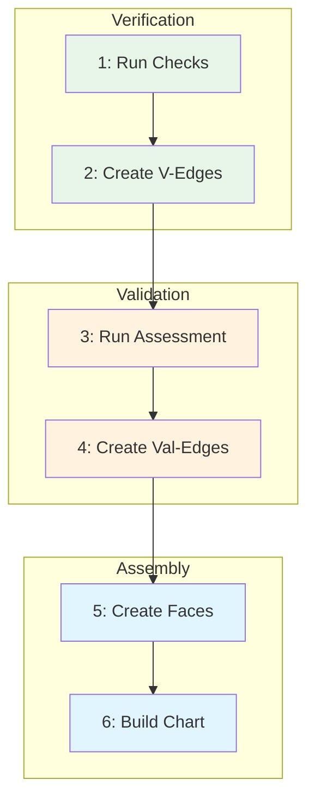

# Runbook - Assurance Audit Chart Creation

This runbook guides practitioners through creating assurance audit charts that verify complete assurance coverage for document sets. The workflow combines YAML metadata with automated verification, LLM-assisted validation, and visualization to produce auditable assurance artifacts.

## Context

### Why: Problem Statement

After creating a set of related documents (e.g., a program development package), practitioners need to demonstrate that every document is properly assured—verified against its spec and validated against its guidance. Without a systematic approach, assurance gaps go undetected, sign-offs are incomplete, and the relationship between documents is not visible.

**Value Delivered:**
- Complete assurance verification for document sets
- Visual representation of document relationships and assurance status
- Automated detection of missing reviews and sign-offs
- Audit trail with accountability for human approvers
- Exportable artifacts for reporting and archival

### What: Scope and Artifacts

This workflow produces a complete assurance audit package demonstrating coverage for a document set.

| Artifact | Type | Description |
|----------|------|-------------|
| Verification Edges | `edge/verification` | Deterministic structural checks (PASS/FAIL) for each document |
| Validation Edges | `edge/validation` | LLM-assisted quality assessments with human approval |
| Assurance Faces | `face/assurance` | Triangles linking document + spec + guidance via edges |
| Dependency Edges | `edge/dependency` | Document flow relationships (informational/structural) |
| Assurance Audit Chart | `chart/assurance_audit` | Complete network with all elements |
| Audit Trail Report | markdown | Generated report documenting assurance status |

**In Scope:**
- Creating assurance elements for existing documents
- Running verification and validation checks
- Building and exporting audit charts
- Generating visualizations for inspection
- Escalating missing sign-offs

**Out of Scope:**
- Creating the source documents (use [[runbook-program-development]])
- Defining new document types (use [[runbook-document-type-creation]])

### Who: Roles and Skills

| Role | Responsibilities | Required Skills |
|------|------------------|-----------------|
| Quality Assurance Engineer | Run verification scripts, create edges and faces | Command-line tools, YAML editing |
| Systems Engineer | Review technical accuracy, approve validations | Domain expertise, assurance concepts |
| Documentation Lead | Coordinate reviews, escalate missing sign-offs | Process management, stakeholder coordination |

**Estimated Time:** 2-4 hours for a 5-document set

## Prerequisites

### Required Knowledge

- Understanding of assurance triangles: coupling edge (spec↔guidance), verification edge (doc→spec), validation edge (doc→guidance)
- Familiarity with YAML frontmatter structure in knowledge complex documents
- Understanding of boundary anchoring (for charts that trace to root)

### Required Tools

| Tool | Command | Purpose |
|------|---------|---------|
| verify_spec.py | `python scripts/verify_spec.py <doc> <spec>` | Deterministic structural verification |
| audit_assurance_chart.py | `python scripts/audit_assurance_chart.py <chart> --search-dir <dir>` | Audit chart for assurance coverage |
| export_chart_direct.py | `python scripts/export_chart_direct.py <chart> <output.json> --search-dir <dir>` | Export chart to JSON |
| visualize_chart.py | `python scripts/visualize_chart.py <chart.json>` | Generate HTML visualization |
| check_accountability.py | `python scripts/check_accountability.py <edge>` | Verify accountability statements |

### Required Access

- Write access to document set directory
- Read access to specs and guidances in `00_vertices/`
- Read access to coupling edges in `01_edges/`
- Read access to type-level assurance faces in `02_faces/`

### Entry Criteria

- [ ] Source documents exist and pass verification against their specs
- [ ] Specs and guidances exist for all document types in the set
- [ ] Coupling edges exist for all document types
- [ ] Human approvers are identified for validation edges
- [ ] Python environment is configured with required dependencies

## Workflow Overview

### Dependency Diagram



**Legend:**
- Green: Verification (deterministic, automated)
- Orange: Validation (LLM-assisted, requires human approval)
- Blue: Assembly (chart construction and audit)

**Parallelization Opportunities:**

| Parallel Group | Steps | Condition |
|----------------|-------|-----------|
| Document verification | Step 1 across documents | Each document verifies independently |
| Document validation | Step 3 across documents | Each document validates independently |

### Workflow Summary

| Step | Activity | Inputs | Output | Depends On |
|------|----------|--------|--------|------------|
| 1 | Run verification scripts | Source documents, specs | Verification results | - |
| 2 | Create verification edges | Verification results | Verification edge files | Step 1 |
| 3 | Run validation assessments | Source documents, guidances | Validation assessments | Step 2 |
| 4 | Create validation edges | Validation assessments, human approval | Validation edge files | Step 3 |
| 5 | Create assurance elements | All edges | Assurance faces, dependency edges | Step 4 |
| 6 | Build and audit chart | All elements | Chart file, audit trail, visualization | Step 5 |

## Step 1: Run Verification Scripts

**Goal:** Execute deterministic structural checks on all source documents against their specs.

**Inputs:**
- Source documents (e.g., `field-survey-*.md`, `architecture-*.md`, etc.)
- Specification documents (e.g., `spec-for-field-survey.md`, `spec-for-architecture.md`)

**Activities:**

1. **List all documents to verify**
   ```bash
   ls program_development_dryrun/*.md
   ```

2. **Run verification for each document**
   ```bash
   python scripts/verify_spec.py <document>.md 00_vertices/spec-for-<type>.md
   ```

3. **Record results in a verification table**

   | Document | Spec | Result | Checks |
   |----------|------|--------|--------|
   | field-survey-bfe.md | spec-for-field-survey | PASS | 4/4 |
   | architecture-bfe.md | spec-for-architecture | PASS | 4/4 |

4. **If any FAIL:** Stop and fix the document before proceeding. Verification must pass before creating verification edges.

**Tools and References:**

- `python scripts/verify_spec.py <doc> <spec>` - Deterministic verification
- [[spec-for-field-survey]], [[spec-for-architecture]], etc. - Document type specs

**Outputs:**
- Verification results table with PASS/FAIL for each document
- All documents must PASS to proceed

**Checkpoint:** All documents pass verification. No FAIL results.

## Step 2: Create Verification Edges

**Goal:** Create edge documents recording verification results with accountability.

**Inputs:**
- Verification results from Step 1
- Source documents
- Spec documents

**Activities:**

1. **Create directory for assurance elements** (if not exists)
   ```bash
   mkdir -p program_development_dryrun/assurance-<program-name>/
   ```

2. **For each document, create a verification edge file**

   Use this template structure:
   ```yaml
   ---
   type: edge/verification
   extends: edge
   id: e:verification:<doc-id>:spec-<type>
   name: Verification Edge - <doc-name> against spec-for-<type>
   description: Deterministic structural verification
   source: v:doc:<doc-id>
   target: v:spec:<type>
   orientation: directed
   verification_method: deterministic
   verification_result: PASS
   checks_passed: 4
   checks_total: 4
   verified_by: verify_spec.py
   verified_date: <ISO8601>
   tags:
     - edge
     - verification
   version: 1.0.0
   created: <ISO8601>
   modified: <ISO8601>
   ---
   ```

3. **Include verification details in the body**
   - List checks performed
   - Include pass/fail status for each
   - Add accountability statement

**Tools and References:**

- [[spec-for-verification]] - Structure requirements for verification edges
- [[guidance-for-verification]] - Quality criteria

**Outputs:**
- One verification edge file per document
- Files saved in assurance directory

**Consistency Checks:**
- [ ] Edge `source` matches document `id` exactly
- [ ] Edge `target` matches spec `id` exactly
- [ ] `checks_passed` and `checks_total` match actual verification output
- [ ] Date fields use ISO 8601 format

**Checkpoint:** Verification edges exist for all documents. IDs are consistent.

## Step 3: Run Validation Assessments

**Goal:** Generate LLM-assisted quality assessments against guidance documents.

**Inputs:**
- Source documents (verified in Step 1)
- Guidance documents (e.g., `guidance-for-field-survey.md`)

**Activities:**

1. **For each document, read the corresponding guidance**
   - Identify quality criteria from guidance document
   - Note assessment dimensions (e.g., clarity, completeness, accuracy)

2. **Run LLM-assisted validation**

   Prompt pattern:
   ```
   Review <document> against the quality criteria in <guidance>.
   For each criterion, assess:
   - Rating (Excellent/Good/Acceptable/Needs Improvement)
   - Evidence from the document
   - Specific observations

   Provide overall assessment and any recommendations.
   ```

3. **Record validation results**

   | Document | Guidance | Overall | Key Observations |
   |----------|----------|---------|------------------|
   | field-survey-bfe | guidance-for-field-survey | Excellent | Clear actor/resource mapping |

4. **Flag any "Needs Improvement" results** for revision before proceeding

**Tools and References:**

- [[guidance-for-field-survey]], [[guidance-for-architecture]], etc. - Quality criteria
- LLM assistant for assessment generation

**Outputs:**
- Validation assessment for each document
- Overall rating (Excellent/Good/Acceptable/Needs Improvement)
- Specific observations and evidence

**Checkpoint:** All documents receive at least "Acceptable" rating. "Needs Improvement" results are addressed.

## Step 4: Create Validation Edges

**Goal:** Create edge documents recording validation assessments with human approval.

**Inputs:**
- Validation assessments from Step 3
- Human approver identity

**Activities:**

1. **For each document, create a validation edge file**

   Use this template structure:
   ```yaml
   ---
   type: edge/validation
   extends: edge
   id: e:validation:<doc-id>:guidance-<type>
   name: Validation Edge - <doc-name> against guidance-for-<type>
   description: LLM-assisted quality validation with human approval
   source: v:doc:<doc-id>
   target: v:guidance:<type>
   orientation: directed
   validation_method: llm-assisted
   llm_model: claude-opus-4-5-20251101
   validation_result: Excellent
   human_approver: <github-username>
   approval_date: <ISO8601>
   tags:
     - edge
     - validation
   version: 1.0.0
   created: <ISO8601>
   modified: <ISO8601>
   ---
   ```

2. **Include detailed assessment in the body**
   - Quality criteria evaluated
   - Evidence and observations
   - Overall assessment justification

3. **Add approval statement**
   ```markdown
   ## Approval

   **APPROVED:** <approver> reviewed and approved on <date>.
   ```

4. **Human approver reviews and signs**
   - Approver reviews the assessment
   - Confirms accuracy of observations
   - Adds their approval to the edge document

**Tools and References:**

- [[spec-for-validation]] - Structure requirements for validation edges
- [[guidance-for-validation]] - Quality criteria
- `python scripts/check_accountability.py <edge>` - Verify accountability

**Outputs:**
- One validation edge file per document
- Each edge includes human approval statement

**Consistency Checks:**
- [ ] Edge `source` matches document `id` exactly
- [ ] Edge `target` matches guidance `id` exactly
- [ ] `human_approver` is a valid identifier
- [ ] Approval statement is present and signed

**Checkpoint:** Validation edges exist for all documents. All edges have human approval.

## Step 5: Create Assurance Elements

**Goal:** Create assurance faces linking documents to their spec/guidance triangles, plus dependency edges.

**Inputs:**
- Verification edges (from Step 2)
- Validation edges (from Step 4)
- Coupling edges (from repository)
- Document dependency information

**Activities:**

1. **Identify coupling edges for each document type**
   ```bash
   ls 01_edges/coupling-*.md
   ```

2. **For each document, create an assurance face**

   Template structure:
   ```yaml
   ---
   type: face/assurance
   extends: face
   id: f:assurance:<doc-id>
   name: Assurance Face - <doc-name>
   description: Complete assurance pattern for <doc-name>
   edges:
     - e:coupling:<type>
     - e:verification:<doc-id>:spec-<type>
     - e:validation:<doc-id>:guidance-<type>
   orientation: oriented
   vertices:
     - v:doc:<doc-id>
     - v:spec:<type>
     - v:guidance:<type>
   target: v:doc:<doc-id>
   spec: v:spec:<type>
   guidance: v:guidance:<type>
   coupling_edge: e:coupling:<type>
   verification_edge: e:verification:<doc-id>:spec-<type>
   validation_edge: e:validation:<doc-id>:guidance-<type>
   assurer: claude-opus-4-5-20251101
   assurance_method: llm-assisted
   llm_model: claude-opus-4-5-20251101
   human_approver: <approver>
   ---
   ```

3. **Create dependency edges for document flow**

   For program development, dependencies flow:
   - Field Survey → Architecture
   - Architecture → Lifecycle
   - Lifecycle → Program Plan
   - Program Plan → Program Memo

   Template:
   ```yaml
   ---
   type: edge/dependency
   extends: edge
   id: e:dependency:<source-id>:<target-id>
   name: Dependency Edge - <source> requires <target>
   source: v:doc:<source-id>
   target: v:doc:<target-id>
   orientation: directed
   dependency_type: informational
   ---
   ```

4. **Include transitive dependencies** where meaningful
   - Architecture also depends on Field Survey
   - Program Memo depends on Architecture and Lifecycle

**Tools and References:**

- [[spec-for-assurance]] - Structure for assurance faces
- [[spec-for-dependency-edges]] - Structure for dependency edges
- `ls 01_edges/coupling-*.md` - Find coupling edges

**Outputs:**
- One assurance face per document
- Dependency edges showing document flow (typically 6-10 for a 5-document set)

**Consistency Checks:**
- [ ] Face `edges` array includes coupling, verification, and validation edge IDs
- [ ] Face `vertices` array includes document, spec, and guidance vertex IDs
- [ ] All referenced edge IDs exist as files
- [ ] Dependency edge source/target match actual document IDs

**Checkpoint:** Assurance faces exist for all documents. Dependency edges capture document flow.

## Step 6: Build and Audit Chart

**Goal:** Assemble all elements into an audit chart, verify coverage, and generate visualization.

**Inputs:**
- All verification edges
- All validation edges
- All assurance faces
- All dependency edges
- Type-level assurance faces (from `02_faces/`)
- Boundary vertices (if boundary anchoring required)

**Activities:**

1. **Create the assurance audit chart file**

   Template structure:
   ```yaml
   ---
   type: chart/assurance_audit
   extends: chart
   id: c:<program-name>-assurance-audit
   name: <Program Name> Assurance Audit
   description: Complete assurance network for <program>

   constructed_by: "claude-opus-4-5-20251101"
   construction_method: llm-assisted
   construction_date: <ISO8601>

   audit_date: <ISO8601>
   auditor: "claude-opus-4-5-20251101"
   audit_status: PENDING
   audit_coverage: 0%

   assurance_requirements:
     all_vertices_assured: true
     assurance_method: mixed
     minimum_assurance_level: ASSURED
     requires_boundary_anchoring: true  # or false for instance-only

   elements:
     vertices:
       # Boundary complex (if boundary anchoring)
       - b0:root
       - v:spec:spec
       - v:spec:guidance
       - v:guidance:spec
       - v:guidance:guidance
       # Type-level specs and guidances
       - v:spec:<type1>
       - v:guidance:<type1>
       # ... more types
       # Instance documents
       - v:doc:<doc1>
       # ... more documents
     edges:
       # Boundary edges (if boundary anchoring)
       - e:coupling:spec
       - e:coupling:guidance
       # ... more boundary edges
       # Type-level edges
       - e:coupling:<type1>
       # ... more type edges
       # Instance edges
       - e:verification:<doc1>:spec-<type1>
       - e:validation:<doc1>:guidance-<type1>
       # Dependency edges
       - e:dependency:<source>:<target>
     faces:
       # Boundary faces (if boundary anchoring)
       - b2:spec-spec
       - b2:guidance-guidance
       # Type-level assurance faces
       - f:assurance:<type1>-spec
       - f:assurance:<type1>-guidance
       # Instance assurance faces
       - f:assurance:<doc1>
   ---
   ```

2. **Run the audit script**
   ```bash
   python scripts/audit_assurance_chart.py <chart>.md \
     --search-dir <assurance-dir> \
     --search-dir <documents-dir> \
     --search-dir 00_vertices \
     --search-dir 01_edges \
     --search-dir 02_faces
   ```

3. **Review audit output**
   - Check for unassured vertices
   - Verify boundary anchoring (if required)
   - Confirm V-F invariant

4. **If audit fails:** Identify missing elements and return to earlier steps

5. **Export to JSON**
   ```bash
   python scripts/export_chart_direct.py <chart>.md <chart>.json \
     --search-dir <assurance-dir> \
     --search-dir <documents-dir>
   ```

6. **Generate visualization**
   ```bash
   python scripts/visualize_chart.py <chart>.json
   open <chart>.html
   ```

7. **Visual inspection**
   - Verify all documents appear in graph
   - Check edge connections are correct
   - Confirm layer structure (boundary → type → instance)

8. **Update chart with audit results**
   - Set `audit_status: PASS`
   - Set `audit_coverage: 100%`
   - Add accountability statement

**Tools and References:**

- `python scripts/audit_assurance_chart.py` - Verify assurance coverage
- `python scripts/export_chart_direct.py` - Export to JSON
- `python scripts/visualize_chart.py` - Generate HTML visualization
- [[spec-for-assurance-audits]] - Chart structure requirements

**Outputs:**
- Assurance audit chart (PASS status)
- Audit trail report (generated by audit script)
- JSON export
- HTML visualization

**Consistency Checks:**
- [ ] All vertices listed in chart have corresponding files
- [ ] All edges listed in chart have corresponding files
- [ ] All faces listed in chart have corresponding files
- [ ] Audit shows 100% coverage
- [ ] V-F = 1 (root is only unassured vertex) or matches expected value

**Checkpoint:** Audit passes with 100% coverage. Visualization shows complete graph. Chart has PASS status.

## Decision Points

### Decision: Boundary Anchoring

**When:** Creating the chart (Step 6)

**Options:**

| Option | When to Choose | Implications |
|--------|----------------|--------------|
| With boundary anchoring | Formal assurance required, publication-ready | Includes root, boundary faces, type-level assurance; more elements |
| Without boundary anchoring | Quick validation, internal review | Instance-only; simpler chart; set `requires_boundary_anchoring: false` |

**Default:** Use boundary anchoring for formal deliverables; skip for internal reviews.

### Decision: Missing Sign-off Escalation

**When:** Validation edges lack human approval (Step 4)

**Options:**

| Option | When to Choose | Implications |
|--------|----------------|--------------|
| Wait for approval | Approver is available soon | Delay chart completion |
| Escalate to manager | Approver is unresponsive | Manager assigns alternate or expedites |
| Document as pending | Time-critical delivery | Chart shows incomplete assurance; revisit later |

**Default:** Escalate if no response within 24 hours.

## Completion Criteria

### Exit Checklist

- [ ] Verification edges exist for all documents with PASS results
- [ ] Validation edges exist for all documents with human approval
- [ ] Assurance faces exist for all documents
- [ ] Dependency edges capture document flow
- [ ] Assurance audit chart exists and passes audit
- [ ] Audit trail report is generated
- [ ] JSON export is created
- [ ] HTML visualization is generated and inspected
- [ ] All elements reference correct IDs (no broken links)
- [ ] Chart `audit_status` is PASS with 100% coverage

### Success Indicators

- Audit script reports PASS with 100% coverage
- Visualization shows complete graph with no orphan nodes
- All validation edges have human approval statements
- V-F invariant matches expected value (typically 1 for boundary-anchored charts)

### Common Completion Issues

| Issue | Resolution |
|-------|------------|
| Audit reports unassured vertices | Check for missing assurance faces; verify face target IDs |
| Verification edge missing | Return to Step 2; create edge for missing document |
| Validation lacks approval | Escalate to approver; add pending status if time-critical |
| Visualization shows orphan nodes | Check edge source/target IDs match vertex IDs exactly |
| V-F invariant wrong | Count vertices and faces; check for duplicate or missing faces |

## Troubleshooting

| Problem | Likely Cause | Solution |
|---------|--------------|----------|
| Verification script fails | Document doesn't match spec | Return to source document; fix structural issues |
| Audit can't find elements | Wrong `--search-dir` paths | Add all directories containing elements to search path |
| Edge IDs don't match | Typo in ID or inconsistent naming | Use consistent kebab-case; check source/target fields |
| Face references wrong edges | Copy-paste error | Verify edge IDs in face match actual edge files |
| Visualization blank | JSON export failed or empty | Check export output; verify elements were found |
| Human approver missing | Edge created without approval | Add approval statement; have approver sign |
| Boundary faces not found | Looking in wrong directory | Boundary faces are in `02_faces/`; add to search path |
| Dependency edge wrong direction | Source/target reversed | Source depends on target; source points to its dependency |

## Maintenance

### When to Revisit

| Trigger | Affected Artifacts | Action Required |
|---------|-------------------|-----------------|
| Source document updated | Verification edge, validation edge, assurance face | Re-verify, potentially re-validate |
| Spec or guidance updated | All edges and faces of that type | Re-verify all documents of that type |
| New document added to set | New edges, face, dependencies; chart update | Create new edges/face; update chart elements |
| Document removed from set | All related edges, face | Remove elements; update chart |
| Approver changes | Validation edges | Update approver; may need re-approval |

### Change Propagation

| If Changed | Then Review | Propagation Steps |
|------------|-------------|-------------------|
| Source document | Verification edge | 1. Re-run verify_spec.py; 2. Update edge result; 3. Re-validate if major change |
| Verification result | Assurance face | 1. Update face status if verification fails; 2. Block until re-verified |
| Validation assessment | Assurance face | 1. Update validation edge; 2. Get new human approval |
| Assurance face | Chart | 1. Update chart elements if face ID changed; 2. Re-run audit |
| Chart elements | Visualization | 1. Re-export JSON; 2. Re-generate HTML |

### Regression Testing

After changes, verify consistency:

1. **Re-verify affected documents**
   ```bash
   python scripts/verify_spec.py <changed-doc>.md <spec>.md
   ```

2. **Re-run audit on chart**
   ```bash
   python scripts/audit_assurance_chart.py <chart>.md --search-dir <dirs>
   ```

3. **Re-export and visualize**
   ```bash
   python scripts/export_chart_direct.py <chart>.md <chart>.json --search-dir <dirs>
   python scripts/visualize_chart.py <chart>.json
   ```

4. **Visual inspection** of updated graph

### Re-Assurance Protocol

| Change Type | Re-Assurance Required | Process |
|-------------|----------------------|---------|
| Minor (typos, formatting) | Verification only | Re-run verify_spec.py; update verification edge |
| Moderate (content changes) | Verification + Validation | Re-verify; re-validate; get new human approval |
| Major (structure changes) | Full re-assurance | Re-verify; re-validate; update face; re-run audit |
| New document added | New assurance triangle | Create verification edge, validation edge, assurance face |

### Currency Tracking

| Artifact | Current Version | Last Verified | Owner |
|----------|-----------------|---------------|-------|
| Verification edges | [version] | [date] | [who] |
| Validation edges | [version] | [date] | [who] |
| Assurance faces | [version] | [date] | [who] |
| Audit chart | [version] | [date] | [who] |

## Quick Reference

| Step | Command/Action | Verify With |
|------|----------------|-------------|
| 1 | `python scripts/verify_spec.py <doc> <spec>` | PASS result |
| 2 | Create verification edge YAML | File exists with correct IDs |
| 3 | LLM validation against guidance | Rating of Acceptable or better |
| 4 | Create validation edge with approval | Approval statement present |
| 5 | Create assurance face + dependency edges | Files exist with correct references |
| 6 | `python scripts/audit_assurance_chart.py <chart> --search-dir <dirs>` | PASS with 100% coverage |

**Key Commands:**

```bash
# Verify a document
python scripts/verify_spec.py <doc>.md 00_vertices/spec-for-<type>.md

# Audit a chart
python scripts/audit_assurance_chart.py <chart>.md \
  --search-dir <assurance-dir> \
  --search-dir 00_vertices \
  --search-dir 01_edges \
  --search-dir 02_faces

# Export and visualize
python scripts/export_chart_direct.py <chart>.md <chart>.json --search-dir <dirs>
python scripts/visualize_chart.py <chart>.json
open <chart>.html
```

## Examples

### Example 1: Bus Electrification Program (Boundary Anchored)

A complete assurance audit with full boundary anchoring for a 5-document program package.

**Documents:** Field Survey, Architecture, Lifecycle, Program Plan, Program Memo

**Key Characteristics:**
- 20 vertices (5 boundary + 10 type-level + 5 instance)
- 56 edges (13 boundary + 25 type-level + 10 instance + 8 dependency)
- 19 faces (4 boundary + 10 type-level + 5 instance)
- V-F = 1 (root is anchor)

**Artifacts:**
- [[bus-electrification-assurance-audit]] - Complete audit chart
- Located in `program_development_dryrun/assurance-bus-electrification/`

### Example 2: Water Quality Monitoring (Instance-Only)

A simpler assurance audit without boundary anchoring for internal review.

**Documents:** Same 5-document set

**Key Characteristics:**
- Instance documents only
- `requires_boundary_anchoring: false`
- Faster to create for informal reviews

**Artifacts:**
- Located in `program_development_dryrun/assurance/`

## Related Workflows

- [[runbook-program-development]] - For creating the source documents to be assured
- [[runbook-document-type-creation]] - For creating new spec/guidance pairs
- [[runbook-llm-specialization]] - For creating specialized LLM configurations using PPP framework

---

**Note:** This runbook produces assurance audit artifacts that demonstrate complete coverage for document sets. The visualization provides visual verification, the audit script provides automated checks, and the accountability statements provide human sign-off. For formal deliverables, use boundary anchoring to trace assurance to root.
