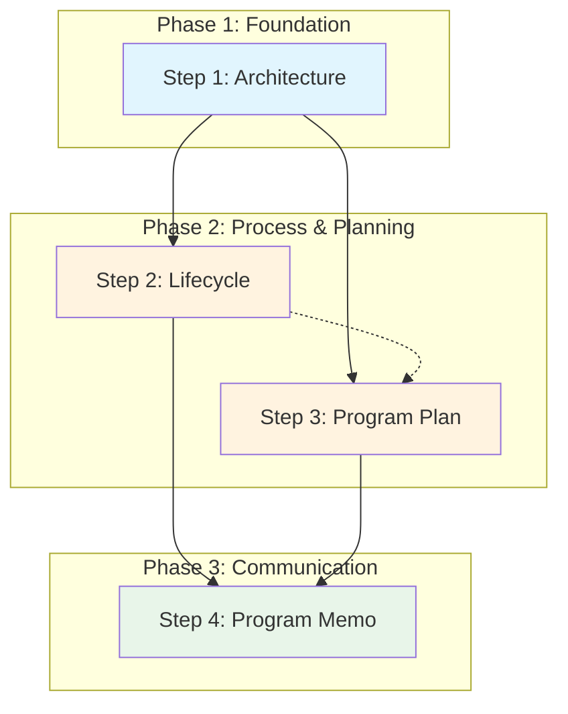

# Runbook - Program Development Workflow

This runbook guides practitioners through the complete program development workflow, transforming an idea into a fully documented, communicable program with architecture, lifecycle, program plan, and program memo documents.

## Context

### Why: Problem Statement

Organizations need to transform program ideas into actionable, communicable plans that stakeholders and funders can understand and approve. Without a systematic approach, documentation is inconsistent, incomplete, or fails to address stakeholder needs. This workflow produces a coherent documentation package where each document builds on its predecessors, maintaining traceability from conceptual needs through execution planning.

**Value Delivered:**
- Complete documentation package ready for stakeholder review
- Clear traceability from requirements through execution
- Consistent quality through spec/guidance assurance
- Executive-friendly entry point via program memo

### What: Scope and Artifacts

This workflow produces a four-document package representing progressive refinement from architecture through execution communication.

| Artifact | Type | Description |
|----------|------|-------------|
| Architecture Document | `vertex/doc` (architecture) | Four-layer system description (Conceptual, Functional, Logical, Physical) with V-model alignment |
| Lifecycle Document | `vertex/doc` (lifecycle) | Process algorithm for developing assured artifacts with phases, gates, and verification/validation |
| Program Plan Document | `vertex/doc` (program-plan) | Execution plan with teams, timelines, resources, milestones, and risk management |
| Program Memo Document | `vertex/doc` (program-memo) | Executive summary synthesizing all three documents for stakeholder communication |

**In Scope:**
- Creating all four documents from scratch
- Verifying each document against its spec
- Validating each document against its guidance
- Maintaining consistency across documents

**Out of Scope:**
- Creating assurance edges and faces (separate workflow)
- Actual program execution (this produces planning documents)
- Stakeholder approval processes (organization-specific)

### Who: Roles and Skills

| Role | Responsibilities | Required Skills |
|------|------------------|-----------------|
| Systems Engineer | Architecture and lifecycle authoring, technical accuracy | Systems engineering, 4-layer architecture, V-model |
| Program Manager | Program plan authoring, resource and risk management | Project planning, risk management, budgeting |
| Technical Lead | Review and integration, technical decision-making | Technical leadership, cross-document consistency |

**Estimated Time:** 2-4 weeks for a medium-complexity program (can be compressed with parallel execution)

## Prerequisites

### Required Knowledge

- Understanding of the 4-layer architecture framework (Conceptual, Functional, Logical, Physical)
- Familiarity with V-model lifecycle and verification/validation concepts
- Knowledge of program planning elements (WBS, milestones, RACI, risk management)
- Understanding of spec/guidance document pairs and assurance concepts

### Required Tools

- **Knowledge Complex Repository**: Access to specs and guidances for all document types
- **Markdown Editor**: For authoring documents (Obsidian recommended for wiki-links)
- **Mermaid Renderer**: For visualizing diagrams (built into many editors)
- **Verification Scripts**: `verify_template_based.py` for structural checking

### Required Access

- Write access to documentation repository
- Access to stakeholder requirements and constraints
- Budget and resource allocation authority or information

### Entry Criteria

- [ ] Program idea or initiative is defined at high level
- [ ] Sponsoring organization is identified
- [ ] Recipient stakeholders are identified
- [ ] Budget envelope is known (even if approximate)
- [ ] Target timeline is established (even if tentative)
- [ ] Required specs and guidances are available in repository

## Workflow Overview

### Dependency Diagram

**Legend:**
- Solid arrows (→): Required dependency
- Dashed arrows (-.->): Recommended but not strictly required
- Colors: Blue=Foundation, Orange=Process & Planning, Green=Communication

### Parallelization Opportunities

| Parallel Group | Steps | Condition |
|----------------|-------|-----------|
| Process & Planning | Step 2 (Lifecycle), Step 3 (Program Plan) | Can run in parallel once Architecture is complete. Lifecycle provides process structure; Program Plan provides execution details. Sync point before Program Memo. |

**Note:** While Steps 2 and 3 can run in parallel, the Program Plan benefits from having the Lifecycle's phase structure available. If resources allow parallel execution, plan a sync checkpoint before starting Step 4.

### Workflow Summary

| Step | Activity | Inputs | Output | Depends On |
|------|----------|--------|--------|------------|
| 1 | Create Architecture Document | Program idea, stakeholder needs | Architecture document | - |
| 2 | Create Lifecycle Document | Architecture document | Lifecycle document | Step 1 |
| 3 | Create Program Plan Document | Architecture, Lifecycle (if available) | Program plan document | Step 1 (Step 2 recommended) |
| 4 | Create Program Memo Document | Architecture, Lifecycle, Program Plan | Program memo document | Steps 1, 2, 3 |

## Step 1: Create Architecture Document

**Goal:** Define what the system will be across four abstraction layers with corresponding evaluation criteria.

**Inputs:**
- Program idea or initiative description
- Stakeholder needs and operational context
- Technical constraints and assumptions
- Prior art or reference architectures (if any)

**Activities:**

1. **Define Conceptual Layer (ConOps)**
   - Identify stakeholder needs (minimum 3)
   - Describe operational context
   - Define acceptance criteria (minimum 2)

2. **Define Functional Layer**
   - Identify system functions (minimum 3)
   - Specify inputs and outputs for each function
   - Define system testing criteria

3. **Define Logical Layer**
   - Identify components (minimum 3) without technology choices
   - Describe component interfaces
   - Define integration testing criteria

4. **Define Physical Layer**
   - Specify concrete technologies and tools (minimum 3)
   - Map to logical components
   - Define unit testing criteria

5. **Create V-Model Summary Table**
   - Map each layer to its evaluation counterpart
   - Document current status of each layer

6. **Verify against spec-for-architecture**

**Tools and References:**
- [[spec-for-architecture]] - Use for structural requirements (4 layers, V-model table)
- [[guidance-for-architecture]] - Use for quality criteria (layer coherence, testability)
- `python scripts/verify_template_based.py 00_vertices/<architecture-file>.md --templates templates`

**Outputs:**
- Architecture document (verified against spec)
- Clear understanding of what is being built
- Testability criteria at each layer

**Checkpoint:** Architecture document passes verification. All four layers are substantive with minimum required elements. V-model table is complete.

## Step 2: Create Lifecycle Document

**Goal:** Define how the system will be built through a phased process with verification/validation gates.

**Inputs:**
- Architecture document (from Step 1)
- Organizational process constraints
- Quality assurance requirements

**Activities:**

1. **Define Foundation/Prerequisites**
   - List required pre-existing documents
   - Specify assurance status of prerequisites
   - Document why each prerequisite is necessary

2. **Define Lifecycle Phases (minimum 2)**
   - For each phase, specify: Goal, Inputs, Process (numbered steps), Outputs
   - Include Verification/Validation Gates for assurance-related phases
   - Distinguish automated verification from human validation

3. **Create Lifecycle Flowchart**
   - Use Mermaid syntax
   - Show all phases with decision points
   - Indicate pass/fail paths at gates

4. **Write Narrative Walkthrough**
   - Cover all phases in prose form
   - Explain the "why" behind key decisions
   - Connect phases to assurance concepts

5. **Document Key Properties**
   - Include at least 3 key properties
   - Address: trust relationships, parallelism, iteration, human involvement

6. **Verify against spec-for-lifecycle**

**Tools and References:**
- [[spec-for-lifecycle]] - Use for structural requirements (phases, flowchart, gates)
- [[guidance-for-lifecycle]] - Use for quality criteria (clarity, completeness)
- `python scripts/verify_template_based.py 00_vertices/<lifecycle-file>.md --templates templates`

**Outputs:**
- Lifecycle document (verified against spec)
- Clear process algorithm for building the system
- Defined verification/validation gates

**Consistency Checks:**
- [ ] Lifecycle target artifact aligns with architecture's system
- [ ] Lifecycle phases map to architecture layers appropriately
- [ ] Prerequisites reference architecture elements correctly

**Checkpoint:** Lifecycle document passes verification. Flowchart shows complete process with gates. Phases have all required elements.

## Step 3: Create Program Plan Document

**Goal:** Define how execution will be resourced, scheduled, and managed with teams, milestones, and risk mitigation.

**Inputs:**
- Architecture document (from Step 1)
- Lifecycle document (from Step 2, if available)
- Budget and resource constraints
- Organizational context (teams, governance)

**Activities:**

1. **Write Executive Summary**
   - Summarize deliverables, timeline, key risks
   - Include confidence statement
   - Make readable by non-technical stakeholders

2. **Define Scope and Objectives**
   - State scope boundaries explicitly
   - Define objectives (minimum 3) with measurable success criteria
   - Trace objectives to architecture elements
   - Document constraints and assumptions

3. **Document Execution Approach**
   - Reference lifecycle document explicitly
   - Summarize phases with expected durations
   - Describe V&V strategy

4. **Create Work Breakdown**
   - List all major activities with IDs and dependencies
   - Identify critical path
   - Create Gantt chart visualization

5. **Define Teams and Responsibilities**
   - Identify all teams/roles involved
   - Create RACI matrix
   - Document external dependencies

6. **Establish Timeline and Milestones**
   - Define milestones (minimum 3) with measurable criteria
   - Create visual schedule
   - Assess schedule confidence

7. **Specify Resource Requirements**
   - Detail personnel by role
   - Create budget breakdown by category
   - Indicate confidence levels

8. **Document Risks and Mitigations**
   - Identify risks (minimum 5) with probability, impact, mitigation, owner
   - Create risk matrix
   - Define contingency plans for high-impact risks

9. **Define Deliverables and Acceptance**
   - List deliverables with acceptance criteria
   - Map to milestones
   - Specify acceptance process

10. **Establish Operations and Assessment**
    - Define governance structure
    - Specify reporting cadence
    - Document change management process

11. **Verify against spec-for-program-plan**

**Tools and References:**
- [[spec-for-program-plan]] - Use for structural requirements (10 required sections)
- [[guidance-for-program-plan]] - Use for quality criteria (realism, traceability)
- `python scripts/verify_template_based.py 00_vertices/<program-plan-file>.md --templates templates`

**Outputs:**
- Program plan document (verified against spec)
- Actionable execution roadmap
- Clear accountability assignments

**Consistency Checks:**
- [ ] Objectives trace to architecture elements
- [ ] Phases align with lifecycle document
- [ ] Deliverables map to architecture components
- [ ] Timeline is realistic given lifecycle phases
- [ ] Sponsor and recipient match across documents

**Checkpoint:** Program plan document passes verification. All 10 required sections present. Minimum elements met (3 objectives, 3 milestones, 5 risks). Visual elements included.

## Step 4: Create Program Memo Document

**Goal:** Synthesize all three documents into an executive-friendly summary that serves as the entry point to the documentation package.

**Inputs:**
- Architecture document (from Step 1)
- Lifecycle document (from Step 2)
- Program plan document (from Step 3)

**Activities:**

1. **Write Program Overview**
   - Describe problem and capability (from architecture)
   - Include key attributes table (sponsor, recipient, timeline, budget)
   - Ensure readability for non-technical audience

2. **Summarize "What We're Building"**
   - Distill goal state from architecture conceptual layer
   - List key components from logical layer (3-5 items)
   - Include success criteria from acceptance criteria
   - Add reference to architecture document

3. **Summarize "How We're Building It"**
   - Describe development approach from lifecycle
   - Create phases table with purpose and duration
   - Mention quality assurance approach
   - Add reference to lifecycle document

4. **Create Execution Summary**
   - Create visual timeline with major milestones (≤7)
   - Summarize resource allocation
   - List top 3-5 risks with impact and mitigation
   - Add reference to program plan document

5. **Build Document Package Section**
   - List all three source documents with navigation guidance
   - Create document currency table with versions and dates

6. **Complete Approval and Accountability**
   - Identify preparer, reviewer, approver
   - Write accountability statement

7. **Verify against spec-for-program-memo**

**Tools and References:**
- [[spec-for-program-memo]] - Use for structural requirements (6 required sections)
- [[guidance-for-program-memo]] - Use for quality criteria (synthesis, accessibility)
- `python scripts/verify_template_based.py 00_vertices/<program-memo-file>.md --templates templates`

**Outputs:**
- Program memo document (verified against spec)
- Executive-ready entry point to documentation package
- Complete traceability to source documents

**Consistency Checks:**
- [ ] All three source document references are valid and current
- [ ] Sponsor and recipient match program plan
- [ ] Timeline milestones match program plan
- [ ] Budget range matches program plan
- [ ] Component list matches architecture logical layer
- [ ] Phase table matches lifecycle phases
- [ ] Risk list is subset of program plan risks

**Checkpoint:** Program memo document passes verification. All sections reference source documents. Length is appropriate (3-5 pages). Non-technical stakeholders can understand the program without consulting other documents.

## Decision Points

### Decision: Plan Level (Strategic vs. Tactical)

**When:** At the start of Step 3 (Program Plan)

**Options:**

| Option | When to Choose | Implications |
|--------|----------------|--------------|
| Strategic | Multi-year programs, portfolio-level planning, high-level resource allocation | Activities at milestone/phase level, teams/organizations (not individuals), quarterly milestones |
| Tactical | Project-level execution, detailed scheduling, specific team assignments | Activities at task level, individual assignments, weekly/bi-weekly milestones |

**Default:** Start with strategic unless the program is a single focused project with defined team.

### Decision: Parallel Execution of Steps 2 and 3

**When:** After completing Step 1, when planning remaining work

**Options:**

| Option | When to Choose | Implications |
|--------|----------------|--------------|
| Sequential (2 → 3) | Single author, or need tight lifecycle-plan integration | Slower but ensures plan phases align with lifecycle |
| Parallel (2 ‖ 3) | Multiple authors available, time pressure | Faster but requires sync checkpoint before Step 4 |

**Default:** Sequential for first-time users; parallel for experienced teams.

## Completion Criteria

### Exit Checklist

- [ ] Architecture document exists and passes verification against spec-for-architecture
- [ ] Lifecycle document exists and passes verification against spec-for-lifecycle
- [ ] Program plan document exists and passes verification against spec-for-program-plan
- [ ] Program memo document exists and passes verification against spec-for-program-memo
- [ ] All documents reference each other correctly (wiki-links or explicit references)
- [ ] Consistency checks pass across all documents
- [ ] Document currency table in program memo is accurate

### Success Indicators

- All four documents pass template verification on first or second attempt
- Cross-document references resolve correctly
- Non-technical stakeholders can understand program from memo alone
- Technical stakeholders can navigate to details as needed

### Common Completion Issues

| Issue | Resolution |
|-------|------------|
| Verification fails repeatedly | Review spec requirements; check frontmatter field types; ensure all required sections present |
| Cross-document inconsistency | Run consistency checks; update documents from most recent source of truth |
| Memo too long | Distill rather than duplicate; move details to source documents |
| Memo not self-contained | Add context; ensure reader doesn't need other documents to understand basics |

## Troubleshooting

| Problem | Likely Cause | Solution |
|---------|--------------|----------|
| Architecture missing layer content | Rushed initial draft | Return to spec-for-architecture; add minimum required elements per layer |
| Lifecycle phases don't have gates | Verification/validation not considered | Add explicit gates with pass/fail criteria at phase boundaries |
| Program plan objectives not traceable | Architecture created without clear needs | Review architecture conceptual layer; strengthen needs statements |
| Memo references outdated documents | Source documents updated after memo | Update document currency table; refresh synthesized content |
| Verification script errors | Wrong file path or missing frontmatter | Check file location; verify YAML frontmatter syntax |
| Mermaid diagrams don't render | Syntax errors in diagram | Use Mermaid live editor to validate; check for missing quotes or brackets |

## Maintenance

### When to Revisit

| Trigger | Affected Artifacts | Action Required |
|---------|-------------------|-----------------|
| Stakeholder requirements change | Architecture (first), then cascade | Update architecture; propagate to lifecycle, plan, memo |
| Budget or timeline changes | Program Plan, Program Memo | Update plan; update memo execution summary |
| Technology decisions change | Architecture (physical layer) | Update architecture; verify no impact on logical layer |
| Team composition changes | Program Plan | Update teams section, RACI; check milestone feasibility |
| Lifecycle process changes | Lifecycle, Program Plan, Program Memo | Update lifecycle; verify plan phases align; update memo |

### Change Propagation

When earlier documents change, updates may need to propagate forward:

| If Changed | Then Review | Propagation Steps |
|------------|-------------|-------------------|
| Architecture | Lifecycle, Program Plan, Program Memo | 1. Check lifecycle target artifact still valid; 2. Verify plan objectives still trace; 3. Update memo "What We're Building" |
| Lifecycle | Program Plan, Program Memo | 1. Verify plan phases align with lifecycle; 2. Update memo "How We're Building It" |
| Program Plan | Program Memo | 1. Update memo execution summary; 2. Verify timeline and risks current |

### Regression Testing

After changes, verify consistency using specs and guidance:

1. **Re-verify changed document:** `python scripts/verify_template_based.py <changed-file>.md --templates templates`
2. **Check downstream documents:** Run verification on all dependent documents
3. **Cross-document consistency:** Manually review consistency checks for changed sections
4. **Validate quality:** Review changed document against its guidance criteria

### Re-Assurance Protocol

When documents are updated, re-assurance may be required:

| Change Type | Re-Assurance Required | Process |
|-------------|----------------------|---------|
| Minor (typos, formatting) | No | Update `modified` timestamp only |
| Moderate (content changes within scope) | Verification only | Re-run verification; update verification edge if exists |
| Major (scope or structure changes) | Full re-assurance | Re-verify, re-validate, update assurance face if exists |

### Currency Tracking

| Artifact | Current Version | Last Verified | Owner |
|----------|-----------------|---------------|-------|
| Architecture | [version] | [date] | [who] |
| Lifecycle | [version] | [date] | [who] |
| Program Plan | [version] | [date] | [who] |
| Program Memo | [version] | [date] | [who] |

## Quick Reference

| Step | Command/Action | Verify With |
|------|----------------|-------------|
| 1 | Create architecture with 4 layers + V-model table | `verify_template_based.py` against spec-for-architecture |
| 2 | Create lifecycle with phases + flowchart + gates | `verify_template_based.py` against spec-for-lifecycle |
| 3 | Create program plan with 10 sections + visuals | `verify_template_based.py` against spec-for-program-plan |
| 4 | Create program memo synthesizing all three | `verify_template_based.py` against spec-for-program-memo |

## Related Workflows

- [[runbook-document-type-creation]] - For creating new spec/guidance pairs
- [[runbook-assurance-workflow]] - For creating verification edges, validation edges, and assurance faces
- [[HOWTO-CREATE-DOCUMENT-TYPE]] - Reference for document type creation pattern

---

**Note:** This runbook produces the core documentation package for a program. After completing this workflow, consider running the assurance workflow to create verification edges, validation edges, and assurance faces for each document.
