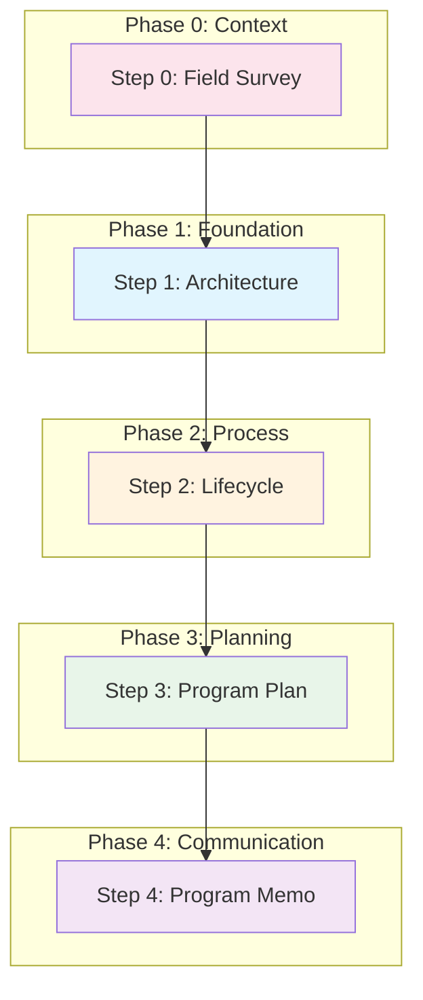

# Runbook - Program Development Workflow

This runbook guides practitioners through the complete program development workflow, transforming an idea into a fully documented, communicable program with field survey, architecture, lifecycle, program plan, and program memo documents.

## Context

### Why: Problem Statement

Organizations need to transform program ideas into actionable, communicable plans that stakeholders and funders can understand and approve. Without a systematic approach, documentation is inconsistent, incomplete, or fails to address stakeholder needs. This workflow produces a coherent documentation package where each document builds on its predecessors, maintaining traceability from conceptual needs through execution planning.

**Value Delivered:**
- Complete documentation package ready for stakeholder review
- Clear traceability from requirements through execution
- Consistent quality through spec/guidance assurance
- Executive-friendly entry point via program memo

### What: Scope and Artifacts

This workflow produces a five-document package representing progressive refinement from context mapping through execution communication.

| Artifact | Type | Description |
|----------|------|-------------|
| Field Survey Document | `vertex/doc` (field-survey) | Bipartite graph of actors and resources establishing context and scope boundaries |
| Architecture Document | `vertex/doc` (architecture) | Four-layer system description (Conceptual, Functional, Logical, Physical) with V-model alignment |
| Lifecycle Document | `vertex/doc` (lifecycle) | Process algorithm for developing assured artifacts with phases, gates, and verification/validation |
| Program Plan Document | `vertex/doc` (program-plan) | Execution plan with teams, timelines, resources, milestones, and risk management |
| Program Memo Document | `vertex/doc` (program-memo) | Executive summary synthesizing all documents for stakeholder communication |

**In Scope:**
- Creating all five documents from scratch
- Verifying each document against its spec
- Validating each document against its guidance
- Maintaining consistency across documents

**Out of Scope:**
- Actual program execution (this workflow produces planning documents)
- Stakeholder approval processes (organization-specific)

### Who: Roles and Skills

| Role | Responsibilities | Required Skills |
|------|------------------|-----------------|
| Systems Engineer | Architecture and lifecycle authoring, technical accuracy | Systems engineering, 4-layer architecture, V-model |
| Program Manager | Program plan authoring, resource and risk management | Project planning, risk management, budgeting |
| Technical Lead | Review and integration, technical decision-making | Technical leadership, cross-document consistency |

**Estimated Time:** 2-4 weeks for a medium-complexity program

## Prerequisites

### Required Knowledge

- Understanding of the 4-layer architecture framework (Conceptual, Functional, Logical, Physical)
- Familiarity with V-model lifecycle and verification/validation concepts
- Knowledge of program planning elements (WBS, milestones, RACI, risk management)
- Understanding of spec/guidance document pairs and assurance concepts

### Required Tools

- **Knowledge Complex Repository**: Access to specs and guidances for all document types
- **Markdown Editor**: For authoring documents (Obsidian recommended for wiki-links)
- **Mermaid Renderer**: For visualizing diagrams (built into many editors)
- **Verification Script**: `python scripts/verify_spec.py <doc>.md <spec>.md` — deterministic structural checking

### Required Access

- Write access to documentation repository
- Access to stakeholder requirements and constraints
- Budget and resource allocation authority or information

### Entry Criteria

- [ ] Program idea or initiative is defined at high level
- [ ] Sponsoring organization is identified
- [ ] Recipient stakeholders are identified
- [ ] Budget envelope is known (even if approximate)
- [ ] Target timeline is established (even if tentative)
- [ ] Required specs and guidances are available in repository

## Workflow Overview

### Dependency Diagram

**Legend:**
- Pink: Context (what exists)
- Blue: Foundation (what we're building)
- Orange: Process (how we build it)
- Green: Planning (who, when, with what resources)
- Purple: Communication (executive summary)

**Note:** This workflow is strictly sequential. The Field Survey establishes context before Architecture. The Program Plan enriches the Lifecycle with accountability, staffing, resourcing, and risk management—it cannot be developed until the Lifecycle phases are defined.

### Workflow Summary

| Step | Activity | Inputs | Output | Depends On |
|------|----------|--------|--------|------------|
| 0 | Create Field Survey Document | Program idea, stakeholder context | Field survey document | - |
| 1 | Create Architecture Document | Field survey, stakeholder needs | Architecture document | Step 0 |
| 2 | Create Lifecycle Document | Architecture document | Lifecycle document | Step 1 |
| 3 | Create Program Plan Document | Architecture, Lifecycle | Program plan document | Step 2 |
| 4 | Create Program Memo Document | Field Survey, Architecture, Lifecycle, Program Plan | Program memo document | Step 3 |

## Step 0: Create Field Survey Document

**Goal:** Map actors (stakeholders), resources, and their relationships to establish context and scope before architecture work.

**Inputs:**
- Program idea or initiative description
- Knowledge of stakeholder landscape
- Understanding of existing technologies and resources
- Geographical, jurisdictional, or functional scope constraints

**Activities:**

1. **Define Animating Purpose**
   - Explain why this survey is being conducted
   - Write clear scope statement (1-2 sentences)
   - List key questions to answer (minimum 3)

2. **Inventory Actors (Stakeholders)**
   - Identify all relevant stakeholder classes (minimum 2)
   - Classify by type: Organization, Role, User Class, External Party
   - Write clear descriptions and accountabilities
   - Use consistent ID format (A1, A2, etc.)

3. **Inventory Resources**
   - Identify technologies, data, infrastructure, services, capital (minimum 2)
   - Classify by type: Technology, Data, Infrastructure, Service, Capital, Process
   - Document current status: Active, Planned, Legacy, Deprecated
   - Use consistent ID format (R1, R2, etc.)

4. **Map Relationships (Bipartite Graph)**
   - For each actor, identify resource connections (minimum 3 total)
   - Use relationship types: Produces, Consumes, Maintains, Depends On, Governs, Funds
   - Don't force connections—sparse graph is expected
   - Create Mermaid diagram (recommended)
   - Identify key dependencies

5. **Define Scope Boundaries**
   - List in-scope items explicitly (minimum 3)
   - List out-of-scope items explicitly (minimum 2)
   - Write boundary rationale

6. **Synthesize Key Findings**
   - Write summary observations (minimum 3)
   - Identify gaps and tensions
   - Document implications for architecture

7. **Verify against spec-for-field-survey**

**Tools and References:**

- [[spec-for-field-survey]] - Structural requirements (actors, resources, relationships)
- [[guidance-for-field-survey]] - Quality criteria (completeness, accuracy, accessibility)
- **Verify structure** (deterministic script): `python scripts/verify_spec.py <doc>.md <spec>.md` — automated structural checks
- **Generate validation** (LLM-assisted + human approval): Ask LLM to evaluate against guidance criteria; human reviews, approves, and signs the validation edge in `01_edges/`
- **Log assurance** (manual): Create assurance face document in `02_faces/` linking coupling edge + verification edge + validation edge

**Outputs:**
- Field survey document (verified against spec)
- Clear understanding of actors and resources in scope
- Bipartite graph of relationships
- Explicit scope boundaries for architecture work

**Checkpoint:** Field survey document passes verification. Minimum counts met (≥2 actors, ≥2 resources, ≥3 relationships). Scope boundaries are explicit. Key findings inform architecture.

## Step 1: Create Architecture Document

**Goal:** Define what the system will be across four abstraction layers with corresponding evaluation criteria.

**Inputs:**
- Field survey document (from Step 0)
- Stakeholder needs and operational context (informed by field survey actors)
- Technical constraints and assumptions
- Prior art or reference architectures (if any)

**Activities:**

1. **Define Conceptual Layer (ConOps)**
   - Identify stakeholder needs (minimum 3)
   - Describe operational context
   - Define acceptance criteria (minimum 2)

2. **Define Functional Layer**
   - Identify system functions (minimum 3)
   - Specify inputs and outputs for each function
   - Define system testing criteria

3. **Define Logical Layer**
   - Identify components (minimum 3) without technology choices
   - Describe component interfaces
   - Define integration testing criteria

4. **Define Physical Layer**
   - Specify concrete technologies and tools (minimum 3)
   - Map to logical components
   - Define unit testing criteria

5. **Create V-Model Summary Table**
   - Map each layer to its evaluation counterpart
   - Document current status of each layer

6. **Verify against spec-for-architecture**

**Tools and References:**

- [[spec-for-architecture]] - Structural requirements (4 layers, V-model table)
- [[guidance-for-architecture]] - Quality criteria (layer coherence, testability)
- **Verify structure** (deterministic script): `python scripts/verify_spec.py <doc>.md <spec>.md` — automated structural checks
- **Generate validation** (LLM-assisted + human approval): Ask LLM to evaluate against guidance criteria; human reviews, approves, and signs the validation edge in `01_edges/`
- **Log assurance** (manual): Create assurance face document in `02_faces/` linking coupling edge + verification edge + validation edge

**Outputs:**
- Architecture document (verified against spec)
- Clear understanding of what is being built
- Testability criteria at each layer

**Consistency Checks:**
- [ ] Stakeholders in architecture align with actors from field survey
- [ ] Scope statement is consistent with field survey scope boundaries
- [ ] Architecture `field_survey_ref` references the field survey document

**Checkpoint:** Architecture document passes verification. All four layers are substantive with minimum required elements. V-model table is complete.

## Step 2: Create Lifecycle Document

**Goal:** Define how the system will be built through a phased process with verification/validation gates.

**Inputs:**
- Architecture document (from Step 1)
- Organizational process constraints
- Quality assurance requirements

**Activities:**

1. **Define Foundation/Prerequisites**
   - List required pre-existing documents
   - Specify assurance status of prerequisites
   - Document why each prerequisite is necessary

2. **Define Lifecycle Phases (minimum 2)**
   - For each phase, specify: Goal, Inputs, Process (numbered steps), Outputs
   - Include Verification/Validation Gates for assurance-related phases
   - Distinguish automated verification from human validation

3. **Create Lifecycle Flowchart**
   - Use Mermaid syntax
   - Show all phases with decision points
   - Indicate pass/fail paths at gates

4. **Write Narrative Walkthrough**
   - Cover all phases in prose form
   - Explain the "why" behind key decisions
   - Connect phases to assurance concepts

5. **Document Key Properties**
   - Include at least 3 key properties
   - Address: trust relationships, parallelism, iteration, human involvement

6. **Verify against spec-for-lifecycle**

**Tools and References:**

- [[spec-for-lifecycle]] - Structural requirements (phases, flowchart, gates)
- [[guidance-for-lifecycle]] - Quality criteria (clarity, completeness)
- **Verify structure** (deterministic script): `python scripts/verify_spec.py <doc>.md <spec>.md` — automated structural checks
- **Generate validation** (LLM-assisted + human approval): Ask LLM to evaluate against guidance criteria; human reviews, approves, and signs the validation edge in `01_edges/`
- **Log assurance** (manual): Create assurance face document in `02_faces/` linking coupling edge + verification edge + validation edge

**Outputs:**
- Lifecycle document (verified against spec)
- Clear process algorithm for building the system
- Defined verification/validation gates

**Consistency Checks:**
- [ ] Lifecycle target artifact aligns with architecture's system
- [ ] Lifecycle phases map to architecture layers appropriately
- [ ] Prerequisites reference architecture elements correctly

**Checkpoint:** Lifecycle document passes verification. Flowchart shows complete process with gates. Phases have all required elements.

## Step 3: Create Program Plan Document

**Goal:** Define how execution will be resourced, scheduled, and managed with teams, milestones, and risk mitigation.

**Inputs:**
- Architecture document (from Step 1)
- Lifecycle document (from Step 2, if available)
- Budget and resource constraints
- Organizational context (teams, governance)

**Activities:**

1. **Write Executive Summary**
   - Summarize deliverables, timeline, key risks
   - Include confidence statement
   - Make readable by non-technical stakeholders

2. **Define Scope and Objectives**
   - State scope boundaries explicitly
   - Define objectives (minimum 3) with measurable success criteria
   - Trace objectives to architecture elements
   - Document constraints and assumptions

3. **Document Execution Approach**
   - Reference lifecycle document explicitly
   - Summarize V-model phases: Design (3 phases), Implementation, Evaluation (4 phases), Operations
   - Create Phase Overview table with Gate Type column (Verification vs Validation)
   - Describe V&V strategy distinguishing verification gates (automated, per-phase) from validation gates (human approval)

4. **Create Work Breakdown**
   - List all major activities with IDs and dependencies
   - Identify critical path
   - Create Gantt chart visualization

5. **Define Teams and Responsibilities**
   - Identify all teams/roles involved
   - Create RACI matrix
   - Document external dependencies

6. **Establish Timeline and Milestones**
   - Define milestones (minimum 3) with measurable criteria
   - Create visual schedule
   - Assess schedule confidence

7. **Specify Resource Requirements**
   - Detail personnel by role
   - Create budget breakdown by category
   - Indicate confidence levels

8. **Document Risks and Mitigations**
   - Identify risks (minimum 5) with probability, impact, mitigation, owner
   - Create risk matrix
   - Define contingency plans for high-impact risks

9. **Define Deliverables and Acceptance**
   - List deliverables with acceptance criteria
   - Map to milestones
   - Specify acceptance process

10. **Establish Operations and Assessment**
    - Define governance structure
    - Specify reporting cadence
    - Document change management process

11. **Verify against spec-for-program-plan**

**Tools and References:**

- [[spec-for-program-plan]] - Structural requirements (10 required sections)
- [[guidance-for-program-plan]] - Quality criteria (realism, traceability)
- **Verify structure** (deterministic script): `python scripts/verify_spec.py <doc>.md <spec>.md` — automated structural checks
- **Generate validation** (LLM-assisted + human approval): Ask LLM to evaluate against guidance criteria; human reviews, approves, and signs the validation edge in `01_edges/`
- **Log assurance** (manual): Create assurance face document in `02_faces/` linking coupling edge + verification edge + validation edge

**Outputs:**
- Program plan document (verified against spec)
- Actionable execution roadmap
- Clear accountability assignments

**Consistency Checks:**
- [ ] Objectives trace to architecture elements
- [ ] Phase groups align with V-model lifecycle (Design, Implementation, Evaluation, Operations)
- [ ] Gate types correctly distinguish verification (automated) from validation (human approval)
- [ ] Deliverables map to architecture components
- [ ] Timeline is realistic given lifecycle phases
- [ ] Sponsor and recipient match across documents

**Checkpoint:** Program plan document passes verification. All 10 required sections present. Minimum elements met (3 objectives, 3 milestones, 5 risks). Visual elements included.

## Step 4: Create Program Memo Document

**Goal:** Synthesize all three documents into an executive-friendly summary that serves as the entry point to the documentation package.

**Inputs:**
- Architecture document (from Step 1)
- Lifecycle document (from Step 2)
- Program plan document (from Step 3)

**Activities:**

1. **Write Program Overview**
   - Describe problem and capability (from architecture)
   - Include key attributes table (sponsor, recipient, timeline, budget)
   - Ensure readability for non-technical audience

2. **Summarize "What We're Building"**
   - Distill goal state from architecture conceptual layer
   - List key components from logical layer (3-5 items)
   - Include success criteria from acceptance criteria
   - Add reference to architecture document

3. **Summarize "How We're Building It"**
   - Describe V-model development approach from lifecycle
   - Create phase groups table (Design, Implementation, Evaluation, Operations) with purpose and duration
   - Summarize quality assurance distinguishing verification (automated) from validation (human approval)
   - Add reference to lifecycle document

4. **Create Execution Summary**
   - Create visual timeline with major milestones (≤7)
   - Summarize resource allocation
   - List top 3-5 risks with impact and mitigation
   - Add reference to program plan document

5. **Build Document Package Section**
   - List all three source documents with navigation guidance
   - Create document currency table with versions and dates

6. **Complete Approval and Accountability**
   - Identify preparer, reviewer, approver
   - Write accountability statement

7. **Verify against spec-for-program-memo**

**Tools and References:**

- [[spec-for-program-memo]] - Structural requirements (6 required sections)
- [[guidance-for-program-memo]] - Quality criteria (synthesis, accessibility)
- **Verify structure** (deterministic script): `python scripts/verify_spec.py <doc>.md <spec>.md` — automated structural checks
- **Generate validation** (LLM-assisted + human approval): Ask LLM to evaluate against guidance criteria; human reviews, approves, and signs the validation edge in `01_edges/`
- **Log assurance** (manual): Create assurance face document in `02_faces/` linking coupling edge + verification edge + validation edge

**Outputs:**
- Program memo document (verified against spec)
- Executive-ready entry point to documentation package
- Complete traceability to source documents

**Consistency Checks:**
- [ ] All three source document references are valid and current
- [ ] Sponsor and recipient match program plan
- [ ] Timeline milestones match program plan
- [ ] Budget range matches program plan
- [ ] Component list matches architecture logical layer
- [ ] Phase groups table uses 4 groups (Design, Implementation, Evaluation, Operations)
- [ ] Quality assurance summary distinguishes verification from validation
- [ ] Risk list is subset of program plan risks

**Checkpoint:** Program memo document passes verification. All sections reference source documents. Length is appropriate (3-5 pages). Non-technical stakeholders can understand the program without consulting other documents.

## Decision Points

### Decision: Plan Level

**When:** At the start of Step 3 (Program Plan)

**Options:**

| Option | Duration | When to Choose | Implications |
|--------|----------|----------------|--------------|
| Multi-year | 2+ years | Large complex programs composed of multiple strategic programs | Activities at program/initiative level, organizational units, annual/semi-annual milestones |
| Strategic | 6-18 months | Mid-range programs with defined scope and team structure | Activities at milestone/phase level, teams/organizations, quarterly milestones |
| Tactical | 6-12 weeks | Focused projects with specific deliverables and assigned team | Activities at task level, individual assignments, weekly/bi-weekly milestones |

**Default:** Start with strategic for most programs; use multi-year for portfolio-level initiatives; use tactical for well-scoped projects with defined teams.

## Cross-Document Consistency Review

After completing all five documents, perform this final consistency review to catch discrepancies before finalizing the package.

### Numeric Consistency

| Check | Documents | What to Verify |
|-------|-----------|----------------|
| Budget figures | Program Plan, Program Memo | Total capital, operating costs, and budget range match exactly |
| Timeline dates | Program Plan, Program Memo | Target completion, milestone dates are identical |
| Counts | All documents | Actor/resource counts, sensor counts, team counts are consistent |
| Durations | Lifecycle, Program Plan, Program Memo | Phase durations sum correctly; memo matches plan |

### Reference Consistency

| Check | Documents | What to Verify |
|-------|-----------|----------------|
| Sponsor/Recipient | Field Survey (actors), Program Plan, Program Memo | Same organizations named consistently |
| Stakeholders | Field Survey (actors), Architecture, Lifecycle, Program Plan | Stakeholder lists align; no actors missing from architecture |
| System name | Architecture, Lifecycle, Program Plan, Program Memo | Identical system name throughout |
| Document references | All documents | All `_ref` fields point to correct document IDs |

### Content Consistency

| Check | Documents | What to Verify |
|-------|-----------|----------------|
| Acceptance criteria | Architecture, Lifecycle, Program Plan | AC1-ACn identical; lifecycle gates trace to ACs |
| Objectives | Architecture (needs), Program Plan (objectives) | Plan objectives trace to architecture needs |
| Risks | Architecture, Program Plan, Program Memo | Memo risks are subset of plan; plan addresses architecture risks |
| Components | Architecture (logical), Program Memo | Memo component list matches architecture |
| Phase structure | Lifecycle, Program Plan, Program Memo | V-model phases align across all three |

### How to Perform the Review

1. **Extract key values:** Create a simple table listing budget, timeline, counts from each document
2. **Compare side-by-side:** Any discrepancy indicates an update was made without propagating
3. **Resolve from source of truth:**
   - Field Survey is source for actors/resources
   - Architecture is source for system name, acceptance criteria, components
   - Program Plan is source for budget, timeline, teams, risks
   - Memo synthesizes from these sources
4. **Update and re-verify:** After fixing discrepancies, re-run verification on changed documents

**Common Discrepancies:**

- Executive summary states different budget than detailed budget section
- Memo timeline doesn't reflect latest program plan updates
- Operating costs stated differently in different sections
- Milestone dates rounded or approximated inconsistently

## Completion Criteria

### Exit Checklist

- [ ] Field survey document exists and passes verification against spec-for-field-survey
- [ ] Architecture document exists and passes verification against spec-for-architecture
- [ ] Lifecycle document exists and passes verification against spec-for-lifecycle
- [ ] Program plan document exists and passes verification against spec-for-program-plan
- [ ] Program memo document exists and passes verification against spec-for-program-memo
- [ ] All documents reference each other correctly (wiki-links or explicit references)
- [ ] Cross-document consistency review completed (see previous section)
- [ ] Numeric consistency verified (budget, timeline, counts match)
- [ ] Reference consistency verified (sponsor, recipient, stakeholders align)
- [ ] Content consistency verified (acceptance criteria, objectives, risks align)
- [ ] Document currency table in program memo is accurate

### Success Indicators

- All five documents pass template verification on first or second attempt
- Cross-document references resolve correctly
- Non-technical stakeholders can understand program from memo alone
- Technical stakeholders can navigate to details as needed

### Common Completion Issues

| Issue | Resolution |
|-------|------------|
| Verification fails repeatedly | Review spec requirements; check frontmatter field types; ensure all required sections present |
| Cross-document inconsistency | Run consistency checks; update documents from most recent source of truth |
| Memo too long | Distill rather than duplicate; move details to source documents |
| Memo not self-contained | Add context; ensure reader doesn't need other documents to understand basics |

## Troubleshooting

| Problem | Likely Cause | Solution |
|---------|--------------|----------|
| Architecture missing layer content | Rushed initial draft | Return to spec-for-architecture; add minimum required elements per layer |
| Lifecycle phases don't have gates | Verification/validation not considered | Add explicit gates with pass/fail criteria at phase boundaries |
| Program plan objectives not traceable | Architecture created without clear needs | Review architecture conceptual layer; strengthen needs statements |
| Memo references outdated documents | Source documents updated after memo | Update document currency table; refresh synthesized content |
| Verification script errors | Wrong file path or missing frontmatter | Check file location; verify YAML frontmatter syntax |
| Mermaid diagrams don't render | Syntax errors in diagram | Use Mermaid live editor to validate; check for missing quotes or brackets |

## Maintenance

### When to Revisit

| Trigger | Affected Artifacts | Action Required |
|---------|-------------------|-----------------|
| New stakeholders discovered | Field Survey, Architecture | Update field survey actors; check architecture stakeholders align |
| Stakeholder requirements change | Architecture (first), then cascade | Update architecture; propagate to lifecycle, plan, memo |
| Resource landscape changes | Field Survey | Update field survey resources and relationships |
| Budget or timeline changes | Program Plan, Program Memo | Update plan; update memo execution summary |
| Technology decisions change | Architecture (physical layer) | Update architecture; verify no impact on logical layer |
| Team composition changes | Program Plan | Update teams section, RACI; check milestone feasibility |
| Lifecycle process changes | Lifecycle, Program Plan, Program Memo | Update lifecycle; verify plan phases align; update memo |

### Change Propagation

When earlier documents change, updates may need to propagate forward:

| If Changed | Then Review | Propagation Steps |
|------------|-------------|-------------------|
| Field Survey | Architecture | 1. Check architecture stakeholders align with actors; 2. Verify scope consistency |
| Architecture | Lifecycle, Program Plan, Program Memo | 1. Check lifecycle target artifact still valid; 2. Verify plan objectives still trace; 3. Update memo "What We're Building" |
| Lifecycle | Program Plan, Program Memo | 1. Verify plan phases align with lifecycle; 2. Update memo "How We're Building It" |
| Program Plan | Program Memo | 1. Update memo execution summary; 2. Verify timeline and risks current |

### Regression Testing

After changes, verify consistency using specs and guidance:

1. **Re-verify changed document** (deterministic): `python scripts/verify_spec.py <changed-file>.md <spec>.md`
2. **Check downstream documents:** Run verification on all dependent documents
3. **Cross-document consistency:** Manually review consistency checks for changed sections
4. **Validate quality** (LLM-assisted): Review changed document against its guidance criteria

### Re-Assurance Protocol

When documents are updated, re-assurance may be required:

| Change Type | Re-Assurance Required | Process |
|-------------|----------------------|---------|
| Minor (typos, formatting) | No | Update `modified` timestamp only |
| Moderate (content changes within scope) | Verification only | Re-run verification; update verification edge if exists |
| Major (scope or structure changes) | Full re-assurance | Re-verify, re-validate, update assurance face if exists |

### Currency Tracking

| Artifact | Current Version | Last Verified | Owner |
|----------|-----------------|---------------|-------|
| Field Survey | [version] | [date] | [who] |
| Architecture | [version] | [date] | [who] |
| Lifecycle | [version] | [date] | [who] |
| Program Plan | [version] | [date] | [who] |
| Program Memo | [version] | [date] | [who] |

## Quick Reference

| Step | Command/Action | Verify With (deterministic) |
|------|----------------|-------------|
| 0 | Create field survey with actors, resources, relationships | `python scripts/verify_spec.py <doc>.md 00_vertices/spec-for-field-survey.md` |
| 1 | Create architecture with 4 layers + V-model table | `python scripts/verify_spec.py <doc>.md 00_vertices/spec-for-architecture.md` |
| 2 | Create lifecycle with phases + flowchart + gates | `python scripts/verify_spec.py <doc>.md 00_vertices/spec-for-lifecycle.md` |
| 3 | Create program plan with 10 sections + visuals | `python scripts/verify_spec.py <doc>.md 00_vertices/spec-for-program-plan.md` |
| 4 | Create program memo synthesizing all documents | `python scripts/verify_spec.py <doc>.md 00_vertices/spec-for-program-memo.md` |

**Operation Types:**

- **Verify structure** — Deterministic script; pass/fail based on spec requirements
- **Generate validation** — LLM-assisted evaluation against guidance; requires human review and approval
- **Log assurance** — Manual creation of assurance face document linking coupling + verification + validation edges

## Examples

Two complete example packages demonstrate this workflow applied to different domains. Each example includes all five documents produced by following this runbook.

### Example 1: Municipal Water Quality Monitoring

A public utilities program deploying real-time water quality sensors across a municipal distribution network.

**Domain:** Public infrastructure, IoT/SCADA integration, regulatory compliance

**Key Characteristics:**

- 9-month tactical program with $780K capital budget
- 25 sensor stations with cloud-based analytics
- Integration with existing Wonderware SCADA system
- State EPA compliance reporting requirements

**Documents:**

- [[field-survey-water-quality-monitoring]] - 5 actors, 5 resources, regulatory and operational context
- [[architecture-water-quality-monitoring]] - Sensor network, data platform, analytics, alerting
- [[lifecycle-water-quality-monitoring]] - V-model with SCADA integration emphasis
- [[program-plan-water-quality-monitoring]] - Detailed WBS, RACI, risk register
- [[program-memo-water-quality-monitoring]] - Executive summary for Water Authority board

### Example 2: Regional Bus Fleet Electrification

A transit authority program transitioning diesel buses to battery-electric with depot charging infrastructure.

**Domain:** Transportation, fleet management, utility coordination, workforce development

**Key Characteristics:**

- 36-month strategic program with $44M capital budget
- 60 electric buses across two depot facilities
- Infrastructure-first sequencing (utility upgrades precede bus delivery)
- State zero-emission mandate compliance (50% by 2032)

**Documents:**

- [[field-survey-bus-electrification]] - Transit authority stakeholders, infrastructure, regulatory context
- [[architecture-bus-electrification]] - Electric buses, charging infrastructure, fleet management integration
- [[lifecycle-bus-electrification]] - V-model addressing infrastructure/vehicle sequencing challenge
- [[program-plan-bus-electrification]] - Multi-year timeline, grant funding structure, workforce training
- [[program-memo-bus-electrification]] - Executive summary for MRTA Board and State DOT

### What the Examples Demonstrate

| Aspect               | Water Quality              | Bus Electrification              |
|----------------------|----------------------------|----------------------------------|
| Program scale        | Tactical (9 months)        | Strategic (36 months)            |
| Budget magnitude     | $780K                      | $44M                             |
| Technical complexity | Software/integration focus | Hardware/infrastructure focus    |
| Stakeholder breadth  | Internal + regulator       | Multi-agency + utility + union   |
| V-model emphasis     | Testing/validation         | Infrastructure sequencing        |

Both examples pass verification and demonstrate cross-document consistency as required by this runbook.

## Related Workflows

- [[runbook-assurance-audit-chart]] - For creating assurance audit charts after completing program documents
- [[runbook-llm-specialization]] - For creating specialized LLM configurations using PPP framework
- [[runbook-document-type-creation]] - For creating new spec/guidance pairs

## Beyond Individual Documents: Charts and Assurance Audits

This runbook produces individual documents with per-document verification. For formal assurance of the complete documentation package, the knowledge complex provides chart and assurance audit capabilities.

### Charts

A **chart** is a named collection of vertices, edges, and faces forming a coherent subcomplex. You can construct a chart containing all five program documents plus their coupling, verification, and validation edges.

| Resource                                                          | Purpose                                              |
| ----------------------------------------------------------------- | ---------------------------------------------------- |
| [[spec-for-charts]]                                               | Structural requirements for chart documents          |
| [[guidance-for-charts]]                                           | Quality criteria for well-formed charts              |
| `python scripts/verify_chart.py <chart>.md`                       | Verify chart structure                               |
| `python scripts/topology.py <chart>`                              | Verify topological properties (Euler characteristic) |
| `python scripts/export_chart_direct.py <chart>.md <output>.json`  | Export chart to JSON                                 |
| `python scripts/visualize_chart.py <chart>.json`                  | Generate HTML visualization                          |

### Assurance Audits

An **assurance audit** is a special chart that validates assurance status across all vertices. For a program documentation package, this verifies that every document has valid coupling edge, verification edge, validation edge, and assurance face.

| Resource                                              | Purpose                                            |
| ----------------------------------------------------- | -------------------------------------------------- |
| [[spec-for-assurance-audits]]                         | Structural requirements for assurance audit charts |
| [[guidance-for-assurance-audits]]                     | Quality criteria for valid assurance audits        |
| `python scripts/audit_assurance_chart.py <chart>.md`  | Verify all vertices in chart are assured           |
| `python scripts/generate_assurance_audit_elements.py` | Generate assurance audit boilerplate               |

### When to Use Charts and Audits

- **Individual verification** (this runbook): Sufficient for draft documents, iterative development, and informal review
- **Chart construction**: When you need to define a coherent subcomplex for export, visualization, or composition
- **Assurance audit**: When you need formal attestation that a complete package meets assurance requirements—typically before major approvals, handoffs, or publication

For the complete assurance audit workflow, see [[runbook-assurance-audit-chart]].

---

**Note:** This runbook produces the core documentation package for a program. After completing this workflow, use [[runbook-assurance-audit-chart]] to create verification edges, validation edges, assurance faces, and a complete assurance audit chart with visualization.
