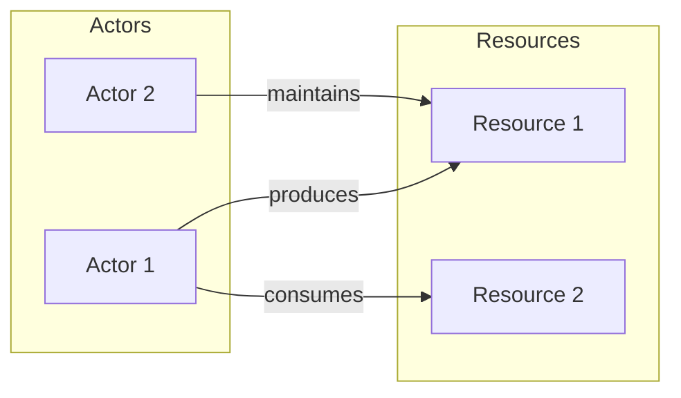

# Specification for Field Survey Documents

**This specification defines the structure and requirements for field survey documents that map stakeholders (actors), resources, and their relationships to establish context and scope before architecture work begins.**

## Purpose

Field survey documents answer the question: "What exists?" They provide a systematic inventory of actors (stakeholders) and resources (technologies, data,facilities, infrastructure) within a defined scope, along with the relationships between them. The field survey establishes context for intervention by documenting the current state of a system or domain before architecture defines what will be built.

Field surveys are fundamentally **bipartite graphs** with two partitions:
- **Actors:** Organizations accountable for activities, or classes of users affected by the system
- **Resources:** Technologies, data, infrastructure, services, or capital that actors produce, consume, or depend on

This document type is designed to:
- Establish context before architecture work begins
- Identify all relevant stakeholders and their accountabilities
- Inventory resources that the system produces or depends on
- Map relationships between actors and resources (sparse bipartite graph)
- Define clear scope boundaries (in-scope vs. out-of-scope)
- Enable informed architecture decisions based on existing context

## Required Frontmatter Fields

All field survey documents MUST include the following YAML frontmatter:

### Core Identification

| Field | Type | Requirement | Description |
|-------|------|-------------|-------------|
| `type` | string | REQUIRED | Must be `vertex/doc` |
| `extends` | string | REQUIRED | Must be `doc` |
| `id` | string | REQUIRED | Unique identifier (format: `v:doc:field-survey-<name>`) |
| `name` | string | REQUIRED | Human-readable field survey name |
| `tags` | array[string] | REQUIRED | Must include `[vertex, doc, field-survey]` |
| `version` | string | REQUIRED | Semantic version (e.g., `1.0.0`) |

### Timestamps

| Field | Type | Requirement | Description |
|-------|------|-------------|-------------|
| `created` | datetime | REQUIRED | ISO 8601 creation timestamp |
| `modified` | datetime | REQUIRED | ISO 8601 last modification timestamp |

### Field Survey-Specific Metadata

| Field | Type | Requirement | Description |
|-------|------|-------------|-------------|
| `survey_scope` | string | REQUIRED | Brief description of the geographical, jurisdictional, or functional scope |
| `actor_count` | integer | REQUIRED | Number of actors identified (must be ≥2) |
| `resource_count` | integer | REQUIRED | Number of resources identified (must be ≥2) |
| `relationship_count` | integer | REQUIRED | Number of actor-resource relationships documented (must be ≥3) |

### Optional Metadata

| Field | Type | Requirement | Description |
|-------|------|-------------|-------------|
| `description` | string | RECOMMENDED | Brief description of survey purpose |
| `survey_date` | date | RECOMMENDED | Date when survey was conducted |
| `prior_survey_ref` | string | OPTIONAL | Reference to prior survey (if updating or extending) |
| `geographical_bounds` | string | OPTIONAL | Explicit geographical limits |
| `jurisdictional_bounds` | string | OPTIONAL | Explicit jurisdictional/regulatory limits |

## Required Body Sections

The markdown body of a field survey document MUST contain:

### 1. Animating Purpose

Establishes why this survey is being conducted and what questions it aims to answer.

**Format:**
```markdown
## Animating Purpose

### Why This Survey

[1-2 paragraphs explaining:
- What problem or opportunity motivates this survey
- What intervention is being considered
- Why understanding the current state matters]

### Scope Statement

[1-2 sentences clearly defining the boundaries of this survey]

### Key Questions

This survey aims to answer:

1. [Question about actors/stakeholders]
2. [Question about resources/technologies]
3. [Question about relationships/dependencies]
4. [Additional questions as needed]
```

**Requirements:**
- MUST explain why the survey is being conducted
- MUST include a clear scope statement
- MUST list at least 3 key questions the survey aims to answer
- MUST be understandable by non-technical readers

### 2. Actors (Stakeholders)

A comprehensive inventory of actors within the survey scope.

**Format:**
```markdown
## Actors

[Brief introduction to the actor inventory]

| ID | Name | Type | Description | Accountability |
|----|------|------|-------------|----------------|
| A1 | [Actor Name] | [Type] | [Clear, concise description] | [What they are accountable for] |
| A2 | [Actor Name] | [Type] | [Clear, concise description] | [What they are accountable for] |

### Actor Definitions

#### A1: [Actor Name]

[2-3 sentences providing additional context if needed]

#### A2: [Actor Name]

[2-3 sentences providing additional context if needed]
```

**Requirements:**
- MUST include at least 2 actors
- MUST use unique IDs for each actor (format: A1, A2, etc.)
- MUST specify actor Type from: `Organization`, `Role`, `User Class`, `External Party`
- MUST provide clear, concise descriptions (1-2 sentences in table)
- MUST specify accountability (what the actor is responsible for)
- SHOULD include expanded definitions for actors requiring additional context

### 3. Resources

A comprehensive inventory of resources within the survey scope.

**Format:**
```markdown
## Resources

[Brief introduction to the resource inventory]

| ID | Name | Type | Description | Status |
|----|------|------|-------------|--------|
| R1 | [Resource Name] | [Type] | [Clear, concise description] | [Current status] |
| R2 | [Resource Name] | [Type] | [Clear, concise description] | [Current status] |

### Resource Definitions

#### R1: [Resource Name]

[2-3 sentences providing additional context if needed]

#### R2: [Resource Name]

[2-3 sentences providing additional context if needed]
```

**Requirements:**
- MUST include at least 2 resources
- MUST use unique IDs for each resource (format: R1, R2, etc.)
- MUST specify resource Type from: `Technology`, `Data`, `Infrastructure`, `Service`, `Capital`, `Process`
- MUST provide clear, concise descriptions (1-2 sentences in table)
- MUST specify current Status (e.g., `Active`, `Planned`, `Legacy`, `Deprecated`)
- SHOULD include expanded definitions for resources requiring additional context

### 4. Relationships (Bipartite Graph)

Documents how actors relate to resources, forming a sparse bipartite graph.

**Format:**
```markdown
## Relationships

[Brief introduction explaining the actor-resource relationship structure]

| Actor ID | Resource ID | Relationship | Description |
|----------|-------------|--------------|-------------|
| A1 | R1 | [Relationship Type] | [Brief description of relationship] |
| A1 | R2 | [Relationship Type] | [Brief description of relationship] |
| A2 | R1 | [Relationship Type] | [Brief description of relationship] |

### Relationship Diagram



### Key Dependencies

[Summary of critical dependencies identified in the relationships]
```

**Requirements:**
- MUST include at least 3 relationships
- MUST reference valid Actor IDs and Resource IDs from previous tables
- MUST specify Relationship Type from: `Produces`, `Consumes`, `Maintains`, `Depends On`, `Governs`, `Funds`
- MUST provide brief description of each relationship
- MUST NOT force relationships (sparse graph is expected—not every actor relates to every resource)
- RECOMMENDED: Include Mermaid bipartite graph diagram
- SHOULD summarize key dependencies identified

### 5. Scope Boundaries

Explicitly defines what is in-scope and out-of-scope for this survey.

**Format:**
```markdown
## Scope Boundaries

### In Scope

The following are explicitly within the scope of this survey:

- [In-scope item 1]
- [In-scope item 2]
- [In-scope item 3]

### Out of Scope

The following are explicitly outside the scope of this survey:

- [Out-of-scope item 1]
- [Out-of-scope item 2]
- [Out-of-scope item 3]

### Boundary Rationale

[Explanation of why these boundaries were chosen, including any geographical, jurisdictional, or functional constraints]
```

**Requirements:**
- MUST include explicit In Scope list (at least 3 items)
- MUST include explicit Out of Scope list (at least 2 items)
- MUST include Boundary Rationale explaining why boundaries were chosen
- Boundaries MAY be geographical, jurisdictional, functional, or organizational

### 6. Key Findings

Summarizes observations and implications from the survey.

**Format:**
```markdown
## Key Findings

### Summary Observations

1. [Major finding about actors]
2. [Major finding about resources]
3. [Major finding about relationships]

### Gaps and Tensions

| Gap/Tension | Description | Implication |
|-------------|-------------|-------------|
| [Gap 1] | [What is missing or conflicting] | [Impact on future work] |

### Implications for Architecture

[1-2 paragraphs describing what these findings mean for subsequent architecture work]
```

**Requirements:**
- MUST include at least 3 summary observations
- SHOULD identify gaps (missing actors, resources, or relationships)
- SHOULD identify tensions (conflicting accountabilities, competing resources)
- MUST include implications for architecture work
- Content SHOULD inform subsequent architecture decisions

## Optional Body Sections

### Prior Survey References

If updating or extending a prior survey.

**Format:**
```markdown
## Prior Survey References

| Survey | Date | Relationship |
|--------|------|--------------|
| [[prior-survey]] | [date] | [Updated, Extended, Supersedes] |

### Changes from Prior Survey

[Summary of what changed]
```

### Methodology

How the survey was conducted.

**Format:**
```markdown
## Methodology

### Data Sources

- [Source 1]
- [Source 2]

### Collection Methods

[How information was gathered]

### Limitations

[Known limitations of the survey]
```

### Approval and Accountability

Documents who prepared and approved the survey.

**Format:**
```markdown
## Approval and Accountability

| Role | Name | Date |
|------|------|------|
| Prepared By | [name] | [date] |
| Reviewed By | [name] | [date] |
| Approved By | [name] | [date] |
```

## Type Constraints

1. **Type Field:** MUST be exactly `vertex/doc`
2. **Extends Field:** MUST be exactly `doc`
3. **ID Format:** MUST match pattern `v:doc:field-survey-[kebab-case-name]`
4. **Tag Requirement:** Tags MUST include `field-survey`

## Content Requirements

1. **Objectivity:** Survey MUST document what exists, not what should exist
2. **Completeness:** All significant actors and resources within scope MUST be documented
3. **Clarity:** Each actor and resource MUST be clearly and concisely described
4. **Sparsity:** Relationships MUST only document actual connections (not forced completeness)
5. **Accessibility:** MUST be readable by non-technical stakeholders
6. **Traceability:** Findings MUST be traceable to documented actors, resources, and relationships
7. **Scope Discipline:** MUST clearly distinguish in-scope from out-of-scope elements

## Bipartite Graph Properties

The field survey represents a bipartite graph G = (A, R, E) where:
- **A** = Set of Actors (vertices in partition 1)
- **R** = Set of Resources (vertices in partition 2)
- **E** = Set of Relationships (edges connecting A to R)

Properties:
- Edges only connect actors to resources (never actor-to-actor or resource-to-resource)
- The graph is typically sparse (|E| << |A| × |R|)
- Each edge has a type and direction implied by the relationship type

## Coupling Requirement

Every field survey document SHOULD be:
1. Verified against this spec for structural compliance
2. Validated against `guidance-for-field-survey` for quality
3. Referenced by subsequent architecture documents when applicable

## Verification vs. Validation

- **Verification** (against this spec): Deterministic checking that all required sections, fields, actor/resource counts, and relationship minimums are present
- **Validation** (against guidance-for-field-survey): Qualitative assessment that the survey effectively maps the relevant actors, resources, and relationships within scope

## Schema Summary

```yaml
# Required frontmatter
type: vertex/doc
extends: doc
id: v:doc:field-survey-<name>
name: <string>
tags: [vertex, doc, field-survey]
version: <semver>
created: <ISO8601>
modified: <ISO8601>
survey_scope: <string>
actor_count: <integer ≥2>
resource_count: <integer ≥2>
relationship_count: <integer ≥3>

# Optional frontmatter
description: <string>
survey_date: <date>
prior_survey_ref: <string>
geographical_bounds: <string>
jurisdictional_bounds: <string>

# Required body sections
## Animating Purpose
  ### Why This Survey
  ### Scope Statement
  ### Key Questions
## Actors
  - Actor table (ID, Name, Type, Description, Accountability)
  - Actor Definitions (expanded)
## Resources
  - Resource table (ID, Name, Type, Description, Status)
  - Resource Definitions (expanded)
## Relationships
  - Relationships table (Actor ID, Resource ID, Relationship, Description)
  - Relationship Diagram (RECOMMENDED: Mermaid bipartite graph)
  - Key Dependencies
## Scope Boundaries
  ### In Scope
  ### Out of Scope
  ### Boundary Rationale
## Key Findings
  ### Summary Observations
  ### Gaps and Tensions
  ### Implications for Architecture

# Optional body sections
## Prior Survey References
## Methodology
## Approval and Accountability
```

## Compliance

A document claiming to be a field survey document is compliant with this specification if and only if:

1. All REQUIRED frontmatter fields are present and correctly typed
2. `actor_count` matches the number of actors in the Actors table and is ≥2
3. `resource_count` matches the number of resources in the Resources table and is ≥2
4. `relationship_count` matches the number of relationships in the Relationships table and is ≥3
5. All actor IDs in Relationships table exist in Actors table
6. All resource IDs in Relationships table exist in Resources table
7. Animating Purpose includes Why, Scope Statement, and Key Questions (≥3)
8. Scope Boundaries includes In Scope (≥3 items), Out of Scope (≥2 items), and Boundary Rationale
9. Key Findings includes Summary Observations (≥3) and Implications for Architecture
10. Type constraints are satisfied

---

**Note:** This specification establishes field survey as the prerequisite context-gathering step before architecture work. The survey documents "what exists" so that architecture can define "what will be built" with full awareness of stakeholders, resources, and their relationships. The bipartite graph structure (actors ↔ resources) provides a systematic framework for mapping complex systems.
