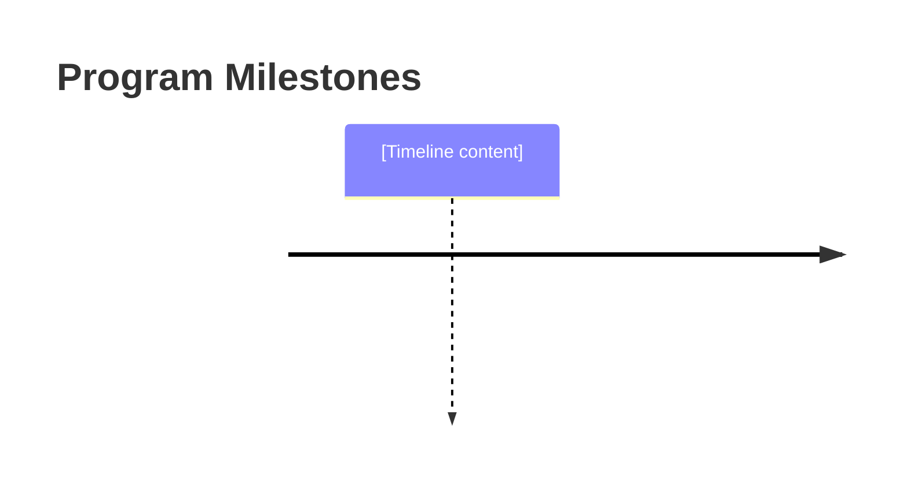

# Specification for Program Plan Documents

**This specification defines the structure and requirements for program plan documents that operationalize an architecture through a lifecycle by equipping the execution path with teams, timelines, resources, milestones, and risk management.**

## Purpose

Program plan documents answer the question: "How will we execute?" They build on architecture documents (what we're building) and lifecycle documents (how we build it) to create an actionable execution plan. The program plan equips the lifecycle path with specific teams, schedules, resource allocations, and risk mitigations—enabling stakeholders and funders to have confidence that delivery is achievable.

This spec supports both strategic (portfolio/program-level) and tactical (project/sprint-level) plans through a shared structure with guidance-specified granularity differences.

## Required Frontmatter Fields

All program plan documents MUST include the following YAML frontmatter:

### Core Identification

| Field | Type | Requirement | Description |
|-------|------|-------------|-------------|
| `type` | string | REQUIRED | Must be `vertex/doc` |
| `extends` | string | REQUIRED | Must be `doc` |
| `id` | string | REQUIRED | Unique identifier (format: `v:doc:program-plan-<name>`) |
| `name` | string | REQUIRED | Human-readable program plan name |
| `tags` | array[string] | REQUIRED | Must include `[vertex, doc, program-plan]` |
| `version` | string | REQUIRED | Semantic version (e.g., `1.0.0`) |

### Timestamps

| Field | Type | Requirement | Description |
|-------|------|-------------|-------------|
| `created` | datetime | REQUIRED | ISO 8601 creation timestamp |
| `modified` | datetime | REQUIRED | ISO 8601 last modification timestamp |

### Program Plan-Specific Metadata

| Field | Type | Requirement | Description |
|-------|------|-------------|-------------|
| `plan_level` | string | REQUIRED | Must be `strategic` or `tactical` |
| `program_name` | string | REQUIRED | Name of the program being planned |
| `architecture_ref` | string | REQUIRED | Reference to architecture document (id or path) |
| `lifecycle_ref` | string | REQUIRED | Reference to lifecycle document (id or path) |
| `target_completion` | date | REQUIRED | Target completion date (ISO 8601 date) |
| `sponsoring_organization` | string | REQUIRED | Organization funding/sponsoring the work |

### Optional Metadata

| Field | Type | Requirement | Description |
|-------|------|-------------|-------------|
| `description` | string | RECOMMENDED | Brief description of program plan purpose |
| `budget_range` | string | RECOMMENDED | Budget range or envelope (e.g., "$100K-$150K") |
| `team_count` | integer | RECOMMENDED | Number of teams involved |
| `parent_plan` | string | OPTIONAL | Reference to parent strategic plan (for tactical plans) |
| `child_plans` | array[string] | OPTIONAL | References to child tactical plans (for strategic plans) |

## Required Body Sections

The markdown body of a program plan document MUST contain:

### 1. Executive Summary

A concise overview for stakeholders and funders who need to understand the plan without reading details.

**Format:**
```markdown
## Executive Summary

[2-4 paragraphs covering:
- What is being delivered (from architecture)
- How it will be delivered (from lifecycle)
- Key timeline and milestones
- Resource requirements summary
- Critical risks and mitigations
- Confidence statement]
```

**Requirements:**
- MUST be readable by non-technical stakeholders
- MUST summarize deliverables, timeline, and key risks
- MUST include a confidence statement about delivery feasibility
- SHOULD fit on one page when rendered

### 2. Scope and Objectives

Defines what the program will deliver, derived from the referenced architecture.

**Format:**
```markdown
## Scope and Objectives

### Program Scope

[Clear statement of what is in scope and out of scope]

### Objectives

| Objective | Success Criteria | Architecture Trace |
|-----------|-----------------|-------------------|
| [O1] | [measurable criteria] | [architecture element] |
| [O2] | [measurable criteria] | [architecture element] |

### Constraints

- [Constraint 1]
- [Constraint 2]

### Assumptions

- [Assumption 1]
- [Assumption 2]
```

**Requirements:**
- MUST explicitly state scope boundaries
- MUST include at least 3 objectives with measurable success criteria
- MUST trace objectives to architecture elements
- MUST document constraints and assumptions

### 3. Execution Approach

Summarizes how the work will be executed, derived from the referenced lifecycle.

**Format:**
```markdown
## Execution Approach

### Lifecycle Summary

[Brief description of the lifecycle being followed, with reference to lifecycle document]

### Phase Overview

| Phase | Duration | Key Activities | Deliverables |
|-------|----------|----------------|--------------|
| [Phase 1] | [duration] | [activities] | [deliverables] |
| [Phase 2] | [duration] | [activities] | [deliverables] |

### Verification and Validation Strategy

[Description of how quality will be assured throughout execution]
```

**Requirements:**
- MUST reference the lifecycle document explicitly
- MUST summarize lifecycle phases with expected durations
- MUST describe V&V strategy
- SHOULD NOT duplicate lifecycle detail (reference instead)

### 4. Work Breakdown

Decomposes the work into manageable activities with dependencies.

**Format:**
```markdown
## Work Breakdown

### Activity Structure

| ID | Activity | Phase | Dependencies | Estimated Effort |
|----|----------|-------|--------------|------------------|
| A1 | [activity] | [phase] | [deps] | [effort] |
| A2 | [activity] | [phase] | A1 | [effort] |

### Critical Path

[Description of the critical path through activities]

```mermaid
gantt
    title Program Timeline
    [Gantt chart content]
```
```

**Requirements:**
- MUST list all major activities with IDs
- MUST specify dependencies between activities
- MUST identify critical path
- MUST include a visual timeline (Gantt chart or similar)
- Strategic plans: activities at milestone/phase level
- Tactical plans: activities at task/work-package level

### 5. Teams and Responsibilities

Defines who will execute the work.

**Format:**
```markdown
## Teams and Responsibilities

### Team Structure

| Team | Lead | Responsibilities | Phases |
|------|------|-----------------|--------|
| [Team 1] | [name/role] | [responsibilities] | [phases] |
| [Team 2] | [name/role] | [responsibilities] | [phases] |

### RACI Matrix

| Activity | Team 1 | Team 2 | Sponsor | ... |
|----------|--------|--------|---------|-----|
| [A1] | R | C | I | ... |
| [A2] | A | R | I | ... |

### External Dependencies

[Description of dependencies on external parties]
```

**Requirements:**
- MUST identify all teams or roles involved
- MUST assign responsibilities to activities
- MUST include RACI or similar accountability matrix
- MUST identify external dependencies
- Strategic plans: teams/organizations
- Tactical plans: individuals/roles

### 6. Timeline and Milestones

Defines when work will happen and key checkpoints.

**Format:**
```markdown
## Timeline and Milestones

### Milestone Schedule

| Milestone | Target Date | Criteria | Dependencies |
|-----------|-------------|----------|--------------|
| M1: [name] | [date] | [criteria] | [deps] |
| M2: [name] | [date] | [criteria] | M1 |

### Schedule Visualization



### Schedule Confidence

[Assessment of schedule confidence with basis for estimates]
```

**Requirements:**
- MUST include at least 3 milestones
- MUST specify measurable completion criteria for each milestone
- MUST include visual schedule representation
- MUST include schedule confidence assessment
- Strategic plans: quarterly/monthly milestones
- Tactical plans: weekly/bi-weekly milestones

### 7. Resource Requirements

Specifies what resources are needed to execute.

**Format:**
```markdown
## Resource Requirements

### Personnel

| Role | Count | Duration | Skills Required |
|------|-------|----------|-----------------|
| [role] | [count] | [duration] | [skills] |

### Budget

| Category | Estimate | Confidence | Notes |
|----------|----------|------------|-------|
| Personnel | [amount] | [H/M/L] | [notes] |
| Infrastructure | [amount] | [H/M/L] | [notes] |
| **Total** | [total] | | |

### Infrastructure and Tools

[Description of required infrastructure, tools, and environments]
```

**Requirements:**
- MUST specify personnel requirements by role
- MUST include budget breakdown by category
- MUST indicate estimate confidence levels
- SHOULD include infrastructure and tooling needs

### 8. Risks and Mitigations

Identifies what could go wrong and how it will be addressed.

**Format:**
```markdown
## Risks and Mitigations

### Risk Register

| ID | Risk | Probability | Impact | Mitigation | Owner |
|----|------|-------------|--------|------------|-------|
| R1 | [risk] | [H/M/L] | [H/M/L] | [mitigation] | [owner] |
| R2 | [risk] | [H/M/L] | [H/M/L] | [mitigation] | [owner] |

### Risk Matrix

| | Low Impact | Medium Impact | High Impact |
|---|------------|---------------|-------------|
| **High Prob** | | [risks] | [risks] |
| **Medium Prob** | | [risks] | [risks] |
| **Low Prob** | [risks] | | |

### Contingency Plans

[Description of contingency approaches for high-impact risks]
```

**Requirements:**
- MUST include at least 5 identified risks
- MUST assess probability and impact for each risk
- MUST specify mitigation strategy and owner for each risk
- MUST include contingency plans for high-impact risks
- SHOULD include risk matrix visualization

### 9. Deliverables and Acceptance

Specifies what will be delivered and how acceptance is determined.

**Format:**
```markdown
## Deliverables and Acceptance

### Deliverable Schedule

| Deliverable | Milestone | Acceptance Criteria | Recipient |
|-------------|-----------|---------------------|-----------|
| [D1] | [milestone] | [criteria] | [recipient] |
| [D2] | [milestone] | [criteria] | [recipient] |

### Acceptance Process

[Description of how deliverables will be reviewed and accepted]
```

**Requirements:**
- MUST list all deliverables with acceptance criteria
- MUST map deliverables to milestones
- MUST specify acceptance process
- MUST trace deliverables to architecture objectives

### 10. Operations and Assessment

Defines how program execution will be monitored and assessed.

**Format:**
```markdown
## Operations and Assessment

### Governance Structure

[Description of governance bodies, meeting cadence, decision authority]

### Progress Reporting

| Report | Frequency | Audience | Content |
|--------|-----------|----------|---------|
| [report type] | [frequency] | [audience] | [content] |

### Performance Metrics

| Metric | Target | Measurement Method |
|--------|--------|-------------------|
| [metric] | [target] | [method] |

### Change Management

[Process for handling scope, schedule, or resource changes]

### Lessons Learned

[Process for capturing and applying lessons learned]
```

**Requirements:**
- MUST define governance structure and decision authority
- MUST specify reporting cadence and content
- MUST include performance metrics
- MUST describe change management process
- SHOULD include lessons learned approach

## Optional Body Sections

### Stakeholder Register

Documents key stakeholders and their interests.

**Format:**
```markdown
## Stakeholder Register

| Stakeholder | Interest | Influence | Communication Needs |
|-------------|----------|-----------|---------------------|
| [stakeholder] | [interest] | [H/M/L] | [needs] |
```

### Communication Plan

Details how communication will be managed.

**Format:**
```markdown
## Communication Plan

| Audience | Channel | Frequency | Owner |
|----------|---------|-----------|-------|
| [audience] | [channel] | [frequency] | [owner] |
```

### Quality Plan

Detailed quality assurance approach.

**Format:**
```markdown
## Quality Plan

[Detailed quality assurance approach beyond V&V strategy]
```

## Type Constraints

1. **Type Field:** MUST be exactly `vertex/doc`
2. **Extends Field:** MUST be exactly `doc`
3. **ID Format:** MUST match pattern `v:doc:program-plan-[kebab-case-name]`
4. **Tag Requirement:** Tags MUST include `program-plan`
5. **Plan Level:** MUST be either `strategic` or `tactical`

## Content Requirements

1. **Traceability:** Objectives MUST trace to architecture; execution approach MUST trace to lifecycle
2. **Measurability:** Milestones and acceptance criteria MUST be measurable
3. **Accountability:** All activities and risks MUST have assigned owners
4. **Completeness:** All required sections MUST be substantive, not placeholder
5. **Audience Awareness:** Executive summary MUST be accessible to non-technical stakeholders
6. **Confidence:** Schedule and budget estimates MUST include confidence assessments

## Coupling Requirement

Every program plan document SHOULD be:
1. Verified against this spec for structural compliance
2. Validated against `guidance-for-program-plan` for quality
3. Traced to its referenced architecture and lifecycle documents

## Verification vs. Validation

- **Verification** (against this spec): Deterministic checking that all required sections, fields, and elements are present
- **Validation** (against guidance-for-program-plan): Qualitative assessment that the plan is realistic, complete, and fit for securing stakeholder confidence

## Schema Summary

```yaml
# Required frontmatter
type: vertex/doc
extends: doc
id: v:doc:program-plan-<name>
name: <string>
tags: [vertex, doc, program-plan]
version: <semver>
created: <ISO8601>
modified: <ISO8601>
plan_level: strategic | tactical
program_name: <string>
architecture_ref: <string>
lifecycle_ref: <string>
target_completion: <ISO8601-date>
sponsoring_organization: <string>

# Optional frontmatter
description: <string>
budget_range: <string>
team_count: <integer>
parent_plan: <string>
child_plans: [<strings>]

# Required body sections
## Executive Summary
## Scope and Objectives
  ### Program Scope
  ### Objectives (table with architecture trace)
  ### Constraints
  ### Assumptions
## Execution Approach
  ### Lifecycle Summary
  ### Phase Overview
  ### Verification and Validation Strategy
## Work Breakdown
  ### Activity Structure
  ### Critical Path
## Teams and Responsibilities
  ### Team Structure
  ### RACI Matrix
  ### External Dependencies
## Timeline and Milestones
  ### Milestone Schedule
  ### Schedule Visualization
  ### Schedule Confidence
## Resource Requirements
  ### Personnel
  ### Budget
  ### Infrastructure and Tools
## Risks and Mitigations
  ### Risk Register
  ### Risk Matrix
  ### Contingency Plans
## Deliverables and Acceptance
  ### Deliverable Schedule
  ### Acceptance Process
## Operations and Assessment
  ### Governance Structure
  ### Progress Reporting
  ### Performance Metrics
  ### Change Management

# Optional body sections
## Stakeholder Register
## Communication Plan
## Quality Plan
```

## Compliance

A document claiming to be a program plan document is compliant with this specification if and only if:

1. All REQUIRED frontmatter fields are present and correctly typed
2. `plan_level` is either `strategic` or `tactical`
3. `architecture_ref` and `lifecycle_ref` reference valid documents
4. All REQUIRED body sections are present with required subsections
5. At least 3 objectives, 3 milestones, and 5 risks are documented
6. All activities have dependencies specified
7. All risks have probability, impact, mitigation, and owner
8. Visual elements (Gantt chart, timeline) are present
9. Type constraints are satisfied

---

**Note:** This specification establishes program plan as the third document in the architecture → lifecycle → program plan progression. Together these three documents fully specify what is being built, how it will be built, and the execution plan for delivery.
