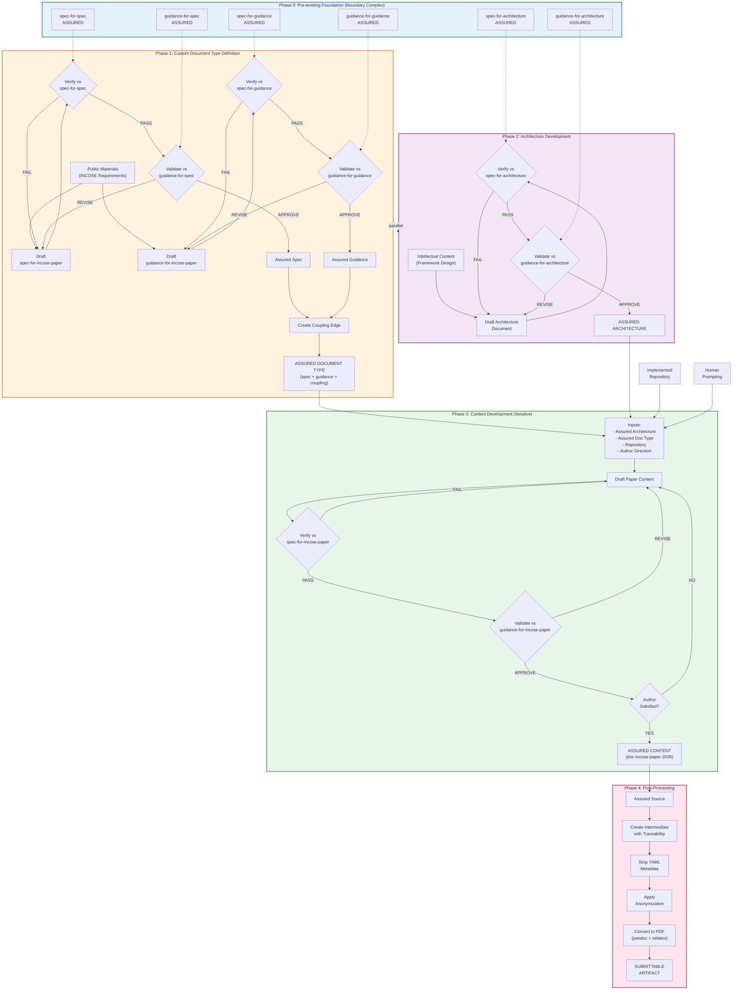

# Engineering Lifecycle for Assured Document Development

This document describes the systematic process—the "algorithm"—for developing documents that achieve assurance within the typed simplicial complex framework. The INCOSE IS 2026 paper serves as the concrete example, demonstrating each phase from foundation through submission.

The lifecycle follows a layered approach: foundational documents provide the basis for custom document types, which in turn enable instance-level content to be verified, validated, and assured. Throughout, human accountability is structurally required for all validation judgments.

---

## Pre-existing Foundation (Assumed)

The framework assumes a **boundary complex** of foundational documents already exists and is assured. These self-referential foundations are resolved through a root vertex that anchors the system:

### Foundational Document Types (Assured)

| Specification | Guidance | Purpose |
|---------------|----------|---------|
| `spec-for-spec` | `guidance-for-spec` | Defines what makes a valid specification |
| `spec-for-guidance` | `guidance-for-guidance` | Defines what makes valid guidance |
| `spec-for-architecture` | `guidance-for-architecture` | Defines 4-layer architecture documents |
| `spec-for-charts` | `guidance-for-charts` | Defines audit chart structure |
| `spec-for-assurance-audits` | `guidance-for-assurance-audits` | Defines assurance audit requirements |

These form the **boundary complex**—the trusted foundation upon which all custom document types are built. The boundary faces (`b2:spec-spec`, `b2:guidance-guidance`) provide assurance for the self-referential documents through the root vertex anchor.

---

## Lifecycle Phases

### Phase 1: Custom Document Type Definition

**Goal:** Create an assured specification and guidance pair defining what constitutes a valid instance document.

**Inputs:**
- Public materials and requirements (e.g., INCOSE submission guidelines)
- Foundational specs and guidance (from boundary complex)
- Domain expertise

**Process:**

1. **Draft Specification**
   - Analyze source requirements (INCOSE's published paper requirements)
   - Define structural requirements: required sections, word limits, formatting
   - Create `spec-for-incose-paper` conforming to `spec-for-spec`

2. **Draft Guidance**
   - Define quality criteria: clarity, rigor, contribution, theme alignment
   - Establish assessment rubrics (Excellent/Good/Acceptable/Needs Work)
   - Create `guidance-for-incose-paper` conforming to `spec-for-guidance`

3. **Verify Specification**
   - Run `verify_template_based.py spec-for-incose-paper.md`
   - Must pass all structural checks against `spec-for-spec`
   - If FAIL → revise and re-verify

4. **Validate Specification**
   - Human reviews against `guidance-for-spec`
   - Assesses fitness-for-purpose: Is this spec clear? Complete? Useful?
   - If concerns → revise and re-assess
   - Human approver named in validation edge

5. **Verify Guidance**
   - Run `verify_template_based.py guidance-for-incose-paper.md`
   - Must pass structural checks against `spec-for-guidance`
   - If FAIL → revise and re-verify

6. **Validate Guidance**
   - Human reviews against `guidance-for-guidance`
   - Assesses: Are criteria measurable? Fair? Comprehensive?
   - Human approver named in validation edge

7. **Create Coupling Edge**
   - Link `spec-for-incose-paper` ↔ `guidance-for-incose-paper`
   - Coupling ensures verification and validation use paired documents

8. **Close Assurance Triangles**
   - `f:assurance:incose-paper-spec` for the specification
   - `f:assurance:incose-paper-guidance` for the guidance

**Output:** Assured custom document type (spec + guidance + coupling)

---

### Phase 2: Architecture Development (Parallel Track)

**Goal:** Create an assured architecture document capturing the intellectual framework independently of any specific paper.

**Inputs:**
- Intellectual content and framework design
- Domain expertise
- `spec-for-architecture` and `guidance-for-architecture`

**Process:**

1. **Draft Architecture Document**
   - Capture framework across four layers:
     - **Conceptual:** Problem statement, stakeholder needs (ConOps)
     - **Functional:** What functions the system performs
     - **Logical:** Design-independent component structure
     - **Physical:** Specific implementation choices
   - Include V-model mapping: each layer pairs design with testing

2. **Verify Architecture**
   - Run `verify_template_based.py doc-architecture-*.md`
   - Check: All four layers present? V-model summary complete?
   - If FAIL → revise and re-verify

3. **Validate Architecture**
   - Human assesses against `guidance-for-architecture`
   - Is the architecture coherent? Complete? Traceable?
   - Human approver named in validation edge

4. **Close Assurance Triangle**
   - Create `f:assurance:architecture-*`

**Output:** Assured architecture document serving as technical reference

**Note:** This phase can proceed in parallel with Phase 1. The architecture document captures "what we built" independently of "how we describe it for publication."

---

### Phase 3: Content Development (Iterative)

**Goal:** Create an assured content document that passes verification, satisfies validation, and adequately captures the author's work.

**Inputs:**
- Assured architecture document (from Phase 2)
- Assured document type—spec + guidance (from Phase 1)
- Implemented repository (scripts, tests, examples)
- Human prompting and author direction

**Process:**

1. **Initialize Draft**
   - Use architecture document as conceptual foundation
   - Reference implemented repository as evidence
   - Author provides direction on narrative, emphasis, framing

2. **Verification Loop** (Automated)
   ```
   while not verified:
       run verify_template_based.py doc-incose-paper-2026.md
       if PASS:
           verified = true
       else:
           analyze failures
           revise document
           # Typical issues: missing sections, word count, format
   ```

3. **Validation Loop** (Human)
   ```
   while not validated:
       human reviews against guidance-for-incose-paper
       assess each criterion (Excellent/Good/Acceptable/Needs Work)
       if satisfactory to author:
           validated = true
       else:
           identify improvements
           revise document
           # Return to verification loop if structure changed
   ```

4. **Author Satisfaction Check**
   - Beyond passing checks: Does this adequately capture the work?
   - Does the narrative serve the author's intent?
   - Is the contribution clear and compelling?
   - If not → continue iteration

5. **Create Edges**
   - `e:verification:incose-paper-content:spec-incose-paper` (automated result)
   - `e:validation:incose-paper-content:guidance-incose-paper` (human approver)

6. **Close Assurance Triangle**
   - `f:assurance:incose-paper-content`
   - Document is now **assured**

**Output:** Assured content document (`doc-incose-paper-2026.md`)

---

### Phase 4: Post-Processing for Submission

**Goal:** Transform the assured source document into a submittable artifact while maintaining traceability.

**Inputs:**
- Assured source document (from Phase 3)
- Venue requirements (INCOSE formatting, anonymization)

**Process:**

1. **Create Intermediate File**
   - Copy source to `submission/` directory
   - Add traceability header (HTML comment) documenting:
     - Source file and vertex ID
     - Derivation date
     - Assurance status reference
     - Transformations applied

2. **Strip Metadata**
   - Remove YAML frontmatter (not needed in PDF)
   - Remove horizontal rule separators
   - Clean internal references

3. **Apply Venue Requirements**
   - Anonymization (remove author names for blind review)
   - Format adjustments

4. **Convert to Submission Format**
   ```bash
   pandoc submission/incose-paper-2026-anonymous.md \
     -o submission/incose-paper-2026-anonymous.pdf \
     --pdf-engine=xelatex \
     -V geometry:margin=1in \
     -V fontsize=11pt \
     --number-sections
   ```

5. **Final Review**
   - Visual inspection of PDF
   - Word count verification
   - Anonymization check

**Output:** Submittable artifact with documented traceability

**Acknowledged Limitation:** A gap exists between the verified source (markdown in repository) and the submitted artifact (PDF). We mitigate this through:
- Explicit traceability in intermediate file
- Source repository as authoritative record
- Documentation of transformation steps

---

## Lifecycle Flowchart



---

## Narrative Walkthrough

### Step 1: Foundation Assumed

The lifecycle begins with an **assured boundary complex**. These foundational documents answer the bootstrap question "who validates the validators?" through a combination of self-reference and root anchoring. The spec-for-spec verifies against itself; boundary faces close through the root vertex. We assume this foundation exists and all elements are assured before beginning custom work.

### Step 2: Document Type Creation (Phase 1)

Before creating content, we must define what "valid" content looks like. This is not arbitrary—we derive requirements from authoritative sources. For the INCOSE paper:

- **Specification** captures INCOSE's published structural requirements: word limits, required sections, formatting rules, AI disclosure mandate
- **Guidance** captures quality criteria: clarity, rigor, contribution significance, theme alignment

Each document is verified (automated structural checks) and validated (human quality judgment) against the foundational spec/guidance documents. Only when both are assured do we create a **coupling edge** linking them into a coherent "document type." This coupling is crucial: it ensures that verification and validation use semantically related documents, not arbitrary pairings.

### Step 3: Architecture as Intellectual Anchor (Phase 2)

In parallel with document type definition, the author develops an **architecture document**. This captures the intellectual content—the actual framework being described—independently of any particular paper format. The architecture document:

- Uses the 4-layer model (Conceptual → Functional → Logical → Physical)
- Maps to the V-model (ConOps ↔ Acceptance, Functions ↔ System Testing, etc.)
- Serves as the authoritative technical reference

This separation matters: the architecture exists independently of how it's communicated. The INCOSE paper is one rendering of the architecture; other renderings (presentations, tutorials, implementations) can derive from the same assured source.

### Step 4: Iterative Content Development (Phase 3)

With an assured document type and an assured architecture, we begin content development. This is inherently iterative—writing is not a linear process. The author uses:

- The **architecture document** as conceptual foundation
- The **implemented repository** (scripts, tests, passing audits) as evidence
- **Human judgment** for narrative, emphasis, and framing

Each draft iteration runs through:
1. **Verification** (automated): Does it meet structural requirements?
2. **Validation** (human): Does it meet quality criteria?
3. **Author satisfaction**: Does it adequately capture the work?

The cycle continues until all three conditions are satisfied. Only then are formal edges created and the assurance triangle closed. This is important: iteration happens *before* claiming assurance, not after.

### Step 5: Post-Processing Gap (Phase 4)

The assured document exists as markdown with YAML frontmatter in a git repository. Submission to INCOSE requires transformation:

- Strip metadata (PDF doesn't need YAML)
- Convert formats (markdown → PDF via pandoc)
- Apply venue requirements (anonymization for blind review)

This creates an acknowledged gap between the **verified source** and the **submitted artifact**. We mitigate this by:

- Creating an intermediate file with explicit traceability
- Documenting all transformations applied
- Maintaining the source repository as the authoritative assurance record

Future work should integrate publication pipeline steps into the assurance framework itself, potentially through "deployment edges" or similar mechanisms.

---

## Key Properties of the Lifecycle

### Layered Trust
Instance documents (the paper) trace to type documents (spec/guidance for INCOSE papers) which trace to foundational documents (spec-for-spec, etc.). Trust propagates upward through this hierarchy.

### Parallel Independence
Architecture development (Phase 2) can proceed independently of document type definition (Phase 1). They converge only in Phase 3 when content development begins.

### Iteration Within Assurance
Content development is highly iterative, but assurance is only claimed after convergence. You don't verify/validate every draft—you iterate until ready, then create the formal edges.

### Human-in-the-Loop
Validation always requires human judgment. Verification can be automated (structural checks), but fitness-for-purpose assessment requires a named human approver who takes responsibility for the judgment.

### Explicit Traceability
Every phase produces artifacts that trace to their inputs. The final submission traces to the assured source, which traces to its spec/guidance, which traces to the boundary complex.

---

## Relationship to the Engineering V

This lifecycle maps naturally to the systems engineering V-model:

| V-Model Phase | Lifecycle Phase | Activity |
|---------------|-----------------|----------|
| **Left Side (Top-Down)** | | |
| Concept | Foundation | Boundary complex provides conceptual basis |
| Requirements | Phase 1 | Document type defines requirements (spec) |
| Design | Phase 1 | Quality criteria defined (guidance) |
| **Bottom (Implementation)** | | |
| Implementation | Phase 2 + 3 | Architecture + iterative content development |
| **Right Side (Bottom-Up)** | | |
| Unit Test | Phase 3 | Verification (automated structural checks) |
| Integration Test | Phase 3 | Validation (human quality assessment) |
| Acceptance | Phase 3 | Author satisfaction + assurance closure |
| **Deployment** | | |
| Delivery | Phase 4 | Post-processing and submission |

The V-model's key insight—that each design phase has a corresponding test phase—is preserved. Specifications (left side) are verified against; guidance (left side) is validated against. The assurance triangle formalizes the relationship between these paired activities.

---

## Summary

The engineering lifecycle for assured document development follows a systematic progression:

1. **Assume foundation**: Boundary complex provides trusted base
2. **Define types**: Create assured spec/guidance pairs for target document type
3. **Capture content**: Develop architecture independent of publication format
4. **Iterate to assurance**: Draft, verify, validate, revise until satisfied
5. **Close triangles**: Formal edges and faces record assurance claims
6. **Transform for delivery**: Post-process with explicit traceability

This process ensures that every assured document has a clear chain of evidence: instance → type → foundation, with human accountability at every validation step.

---

**Document Status:** This lifecycle description itself could be assured against a "spec-for-process-documents" and "guidance-for-process-documents"—demonstrating the recursive applicability of the framework.

**Accountability:** This document was drafted with Claude (Opus 4.5) assistance based on author direction. The author maintains responsibility for the accuracy of the lifecycle description.
