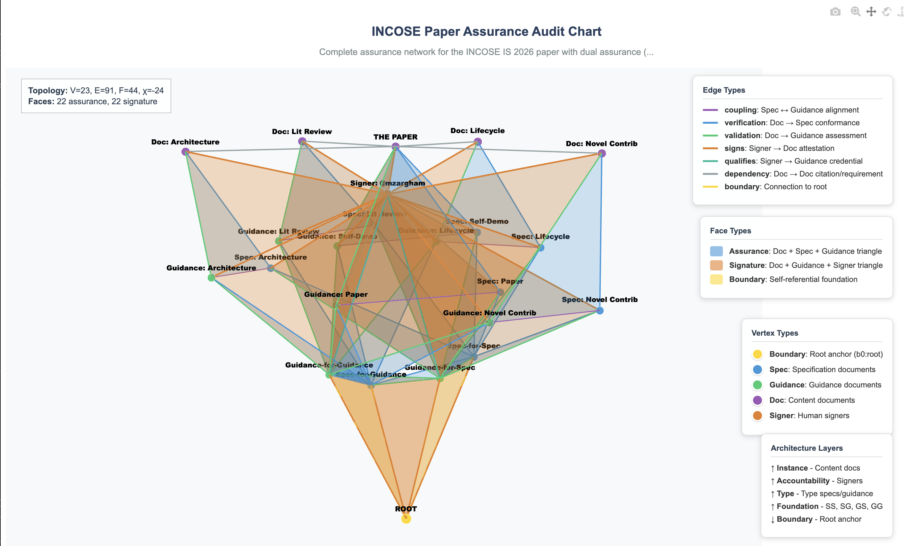
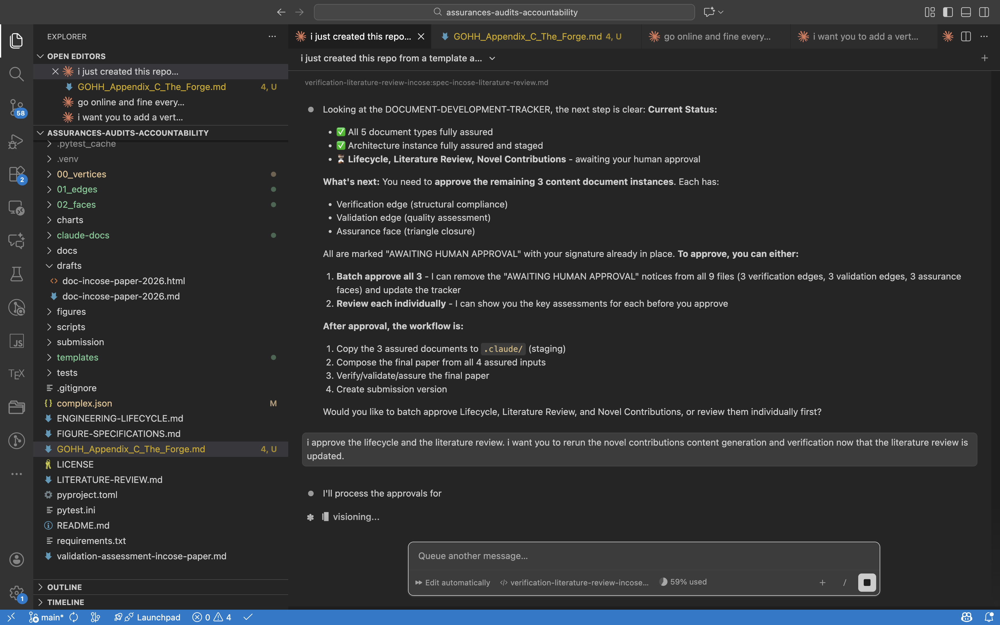

# Assurances, Audits & Accountability

This repository contains the implementation and demonstration of a typed simplicial complex framework for document verification, validation, and assurance of AI Generated Content with explicit human accountability.



**INCOSE Paper Assurance Complex:** 23 vertices | 91 edges | 44 faces | χ = -24
21 documents + 1 root + 1 signer | 22 assurances + 22 signatures | Paper has 2 distinct assurance faces

## The Paper

The paper **"Test-Driven Document Development: Simplicial Complexes for Verification, Validation, and Assurance with Human Accountability"** demonstrates a framework where:

- **Documents are vertices** (0-simplices) in a typed complex
- **Verification, validation, and coupling are edges** (1-simplices) connecting documents
- **Assurance triangles are faces** (2-simplices) representing complete quality attestation
- **Human accountability** is structurally required for validation judgments

**The paper is its own proof.** The file [`doc-incose-paper-2026.md`](00_vertices/doc-incose-paper-2026.md) exists as a vertex in an assurance complex, verified against its specification, validated against its guidance, with all checks passing.

## Dual Interface: VS Code + Obsidian

This repository is designed for **two complementary workflows**:

### VS Code + Claude Code (Construction & Verification)



**Best for:** Building, verifying, and analyzing the knowledge complex

- Run verification scripts directly from terminal
- Edit documents with full IDE features
- Use Claude Code for AI-assisted document development
- Git integration for version control and accountability

**Key commands:**
```bash
python scripts/verify_template_based.py <file> --templates templates
python scripts/audit_assurance_chart.py charts/<chart>/<chart>.md
python scripts/build_cache.py
```

### Obsidian (Navigation & Exploration)


**Best for:** Exploring relationships and understanding structure

- Wiki-style `[[wikilinks]]` for seamless navigation
- Graph view visualizes document relationships
- Backlinks show what references each document
- Local-first, works offline

**To use:** Open this repository as an Obsidian vault. See [[QUICKSTART]] for a 5-minute guide.

---

## Quick Verification

```bash
# Setup
git clone https://github.com/BlockScience/assurances-audits-accountability
cd assurances-audits-accountability
uv venv && source .venv/bin/activate
uv pip install -r requirements.txt

# Verify the paper
python scripts/verify_template_based.py 00_vertices/doc-incose-paper-2026.md --templates templates

# Run the assurance audit
python scripts/audit_assurance_chart.py charts/incose-paper-assurance/incose-paper-assurance.md

# Run all tests
python -m pytest tests/ -v
```

**Expected output:**

```text
Result: ✓ PASS
Checks: 6/6 passed

Status: PASS
Invariant: F = V - 1: 7 = 8 - 1 ✓
Coverage: 100.0% (7/7 targets assured)
```

## Repository Structure

```text
assurances-audits-accountability/
├── 00_vertices/                       # Document vertices (56 files)
│   ├── doc-incose-paper-2026.md      # THE PAPER (also a vertex)
│   ├── spec-for-*.md                 # Specifications (27 files)
│   ├── guidance-for-*.md             # Guidance documents (22 files)
│   └── doc-*.md                      # Content documents (5 files)
├── 01_edges/                          # Relationship edges (148 files)
│   ├── verification-*.md             # Verification edges
│   ├── validation-*.md               # Validation edges (with approvers)
│   ├── coupling-*.md                 # Spec-guidance coupling
│   └── signs-*.md, qualifies-*.md    # Signature infrastructure
├── 02_faces/                          # Faces (65 files)
│   ├── assurance-*.md                # Assurance triangles
│   ├── signature-*.md                # Signature triangles
│   └── b2-*.md                       # Boundary faces
├── charts/                            # Composed subcomplexes
│   ├── incose-paper-assurance/       # THE AUDIT CHART
│   ├── boundary-complex/             # Foundational structure
│   └── test-tetrahedron/             # Test fixture
├── docs/                              # Documentation
│   ├── concepts/                     # Core concepts explained
│   └── images/                       # Screen captures for documentation
├── figures/                           # Paper figures
├── scripts/                           # CLI tools
├── templates/                         # Type definitions
└── tests/                             # Test suite
```

## Navigation

**Central hub:** [[NAVIGATION]] — Start here for exploring the knowledge complex

| Directory | Obsidian | GitHub/VS Code | Contents |
|-----------|----------|----------------|----------|
| Vertices | [[00_vertices/README]] | [00_vertices/](00_vertices/) | 56 document vertices |
| Edges | [[01_edges/README]] | [01_edges/](01_edges/) | 148 relationship edges |
| Faces | [[02_faces/README]] | [02_faces/](02_faces/) | 65 triangular faces |
| Charts | [[charts/README]] | [charts/](charts/) | Composed subcomplexes |
| Docs | [[docs/README]] | [docs/](docs/) | Concepts & use cases |
| Templates | [[templates/README]] | [templates/](templates/) | Type definitions |

## Key Concepts Demonstrated

### The Assurance Triangle

Every assured document requires three edges forming a closed triangle:

1. **Verification edge** → document passes structural checks against spec
2. **Coupling edge** → spec is linked to corresponding guidance
3. **Validation edge** → document assessed against guidance (requires human approver)

### The V - F ≤ 1 Invariant

In a valid assurance complex:

- Every non-root vertex must have at least one assurance face
- Every face assures exactly one vertex
- **V - F = 1** when each document is assured exactly once
- **V - F < 1** when documents have multiple assurances (e.g., dual spec-guidance pairs)
- **V - F ≤ 1** is necessary but not sufficient for validity—useful as a quick spot-check to identify invalid complexes

### The Boundary Condition and Boundary Complex

**Boundary Condition:** The framework bootstraps through four foundational vertices—spec-for-spec (SS), spec-for-guidance (SG), guidance-for-spec (GS), guidance-for-guidance (GG)—mutually assured in a self-referential pattern. Two form valid triangles (SG, GS), while two rely on self-reference (SS via self-verification, GG via self-validation), creating degenerate faces.

**Boundary Complex:** A fifth vertex, *root* (b0), is introduced as an axiomatic element (not a document requiring assurance). The self-loops are rewired to connect through the root, eliminating degeneracy faces and providing a valid simplicial complex foundation. The root provides assurance but doesn't need it—this is what makes V - F = 1 work.

## Runbooks

Step-by-step workflows for common tasks in the knowledge complex:

| Runbook | Purpose | Steps |
|---------|---------|-------|
| [[runbook-program-development]] | Create program documentation (memo, plan, architecture, lifecycle, field survey) | 7 |
| [[runbook-assurance-audit-chart]] | Build assurance audit charts with full V&V coverage | 6 |
| [[runbook-document-type-creation]] | Create new document types (spec, guidance, coupling) | 10 |
| [[runbook-llm-specialization]] | Create specialized LLM configurations using PPP framework | 8 |

**Direct links:**
- [runbook-program-development.md](00_vertices/runbook-program-development.md)
- [runbook-assurance-audit-chart.md](00_vertices/runbook-assurance-audit-chart.md)
- [runbook-document-type-creation.md](00_vertices/runbook-document-type-creation.md)
- [runbook-llm-specialization.md](00_vertices/runbook-llm-specialization.md)

## Example Programs

Two complete program development examples demonstrating the framework in practice:

### Bus Electrification Program

A municipal transit electrification program demonstrating the full V-model lifecycle:

| Document | Type | Description |
|----------|------|-------------|
| [program-memo-bus-electrification.md](program_development_dryrun/program-memo-bus-electrification.md) | Program Memo | Stakeholder authorization and scope |
| [program-plan-bus-electrification.md](program_development_dryrun/program-plan-bus-electrification.md) | Program Plan | Phased implementation strategy |
| [architecture-bus-electrification.md](program_development_dryrun/architecture-bus-electrification.md) | Architecture | Technical system design |
| [lifecycle-bus-electrification.md](program_development_dryrun/lifecycle-bus-electrification.md) | Lifecycle | 25-year operational model |
| [field-survey-bus-electrification.md](program_development_dryrun/field-survey-bus-electrification.md) | Field Survey | Site assessments and infrastructure |
| [bus-electrification-assurance-audit.md](program_development_dryrun/assurance-bus-electrification/bus-electrification-assurance-audit.md) | Audit Chart | Full assurance coverage with V-F=1 |

### Water Quality Monitoring Program

An IoT-based environmental monitoring program for water quality:

| Document | Type | Description |
|----------|------|-------------|
| [program-memo-water-quality-monitoring.md](program_development_dryrun/program-memo-water-quality-monitoring.md) | Program Memo | Stakeholder authorization and scope |
| [program-plan-water-quality-monitoring.md](program_development_dryrun/program-plan-water-quality-monitoring.md) | Program Plan | Deployment and integration strategy |
| [architecture-water-quality-monitoring.md](program_development_dryrun/architecture-water-quality-monitoring.md) | Architecture | Sensor network and data pipeline |
| [lifecycle-water-quality-monitoring.md](program_development_dryrun/lifecycle-water-quality-monitoring.md) | Lifecycle | 10-year operational model |
| [field-survey-water-quality-monitoring.md](program_development_dryrun/field-survey-water-quality-monitoring.md) | Field Survey | Site assessments and sensor placement |
| [water-quality-assurance-audit.md](program_development_dryrun/assurance/water-quality-assurance-audit.md) | Audit Chart | Full assurance coverage with V-F=1 |

## Scripts Reference

| Script | Purpose |
|--------|---------|
| `verify_template_based.py` | Verify document against its type template |
| `audit_assurance_chart.py` | Check assurance coverage and V-F=1 invariant |
| `topology.py` | Compute Euler characteristic |
| `visualize_chart.py` | Generate interactive visualization |
| `visualize_assured_signed.py` | Enhanced 3D visualization with layered architecture |
| `build_cache.py` | Build element cache and validate all documents |

## The Self-Demonstration

This repository IS the evidence for the paper's claims:

1. **The paper exists** as [[doc-incose-paper-2026]] ([GitHub](00_vertices/doc-incose-paper-2026.md))
2. **Verification passes** against [[spec-for-incose-paper]] ([GitHub](00_vertices/spec-for-incose-paper.md))
3. **Validation recorded** in [[validation-incose-paper-2026:guidance-incose-paper]] ([GitHub](01_edges/validation-incose-paper-2026:guidance-incose-paper.md))
4. **Assurance face closed** in [[assurance-incose-paper-2026-base]] ([GitHub](02_faces/assurance-incose-paper-2026-base.md))
5. **Audit passes** with 100% coverage and V-F=1 verified

The existence of this repository with passing audits proves the framework works.

## Requirements

- Python 3.12+
- [uv](https://github.com/astral-sh/uv) (recommended) or pip

## License

**Copyright (c) 2025 Michael Zargham / Block Science. All rights reserved.**

This repository is currently **proprietary** and **not open source**. No license is granted for use, modification, or distribution without explicit written permission.

We are actively researching the right balance between open source availability and commercial sustainability for this technology. If you are interested in using this framework, please reach out to us at **info@block.science**.

### AI Training Restriction

This repository and its contents may **not** be used for training machine learning models, large language models, or any AI/ML systems without explicit written permission. Automated scraping or crawling for AI training purposes is prohibited.

See [LICENSE](LICENSE) for full terms.

## AI Disclosure

This repository was developed with assistance from Claude (Opus 4.5). All framework architecture, validation methodology, and approval decisions are original author work. The author maintains full responsibility for all content and attestations.
