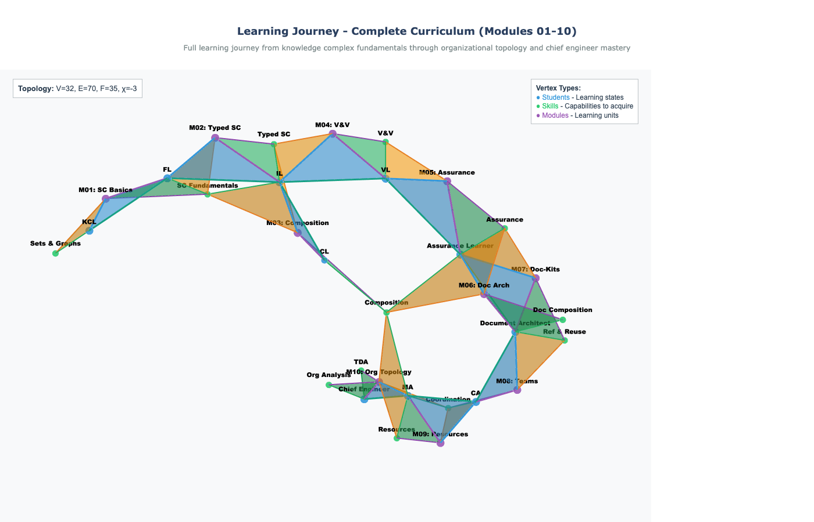

# Knowledge Complex

A typed simplicial complex framework for rigorous documentation, quality assurance, and organizational modeling.




*The [full learning journey](charts/learning-journey-full/learning-journey-full.md) as a typed simplicial complex (V=32, E=70, F=35, χ=-3)*

---

## Two Ways to Use This Repository

| Path | You want to... | Start here |
|------|----------------|------------|
| **Start Building** | Create your own knowledge complex | [Quick Start](#quick-start) |
| **Learn First** | Understand the methodology through structured modules | [Learning Journey](#learning-journey) |

---

## Quick Start

Get running in under 2 minutes.

### Prerequisites

- Python 3.12+
- [uv](https://github.com/astral-sh/uv) (recommended) or pip

### Setup

```bash
# Clone the repository
git clone https://github.com/BlockScience/knowledge-complex-demo
cd knowledge-complex-demo

# Create and activate virtual environment
uv venv && source .venv/bin/activate

# Install dependencies
uv pip install -r requirements.txt

# Verify installation
python scripts/build_cache.py
```

### Obsidian Users

Open this folder as an Obsidian vault for enhanced navigation:

- **Wikilinks**: `[[vertex-name]]` for quick navigation
- **Embeds**: `![[section]]` for document composition
- **Graph view**: Visual exploration of relationships
- **Backlinks**: Automatic reference tracking

**Tip**: Enable "Use [[Wikilinks]]" in Obsidian settings.

### Run Tests

```bash
python -m pytest tests/ -v
```

---

## Learning Journey

Master knowledge complex methodology through 10 progressive modules.

### Module Overview

**Foundations (Modules 01-03)**

| Module | Topic | Skill Developed |
|--------|-------|-----------------|
| 01 | Simplicial Complex Fundamentals | Basic graph and complex knowledge |
| 02 | Typed Simplicial Complexes | Adding semantic types to structure |
| 03 | Composing Typed Simplicial Complexes | Chart composition via pasting |

**Quality Assurance (Modules 04-05)**

| Module | Topic | Skill Developed |
|--------|-------|-----------------|
| 04 | Verification & Validation | Edge-based quality checking |
| 05 | Assurance & Audits | Complete quality triangles |

**Document Architecture (Modules 06-07)**

| Module | Topic | Skill Developed |
|--------|-------|-----------------|
| 06 | Document Composition | Modular document architecture (optional) |
| 07 | Reference & Reuse via Doc-Kits | Template-driven documentation |

**Organizational Modeling (Modules 08-10)**

| Module | Topic | Skill Developed |
|--------|-------|-----------------|
| 08 | Team Coordination | RACI patterns, role assignments |
| 09 | Resource Management | Cross-team resource flows |
| 10 | Organizational Topology (Capstone) | Hodge analysis, chart composition |

**Terminal State**: Chief Engineer with 9-10 accumulated skills

See [charts/learning-journey-full/](charts/learning-journey-full/) for the complete syllabus chart.

---

## What's Included

### Pre-Built Content

| Category | Count | Location |
|----------|-------|----------|
| Vertex templates | 19 | `templates/00_vertices/` |
| Edge templates | 12 | `templates/01_edges/` |
| Face templates | 6 | `templates/02_faces/` |
| Example charts | 16 | `charts/` |
| Working simplices | 285+ | `00_vertices/`, `01_edges/`, `02_faces/` |

### CLI Tools

**Verification & Validation**

| Script | Purpose |
|--------|---------|
| `verify_template_based.py` | Primary verification (document vs template) |
| `verify_chart.py` | Chart structure validation |
| `verify_structure.py` | YAML frontmatter validation |
| `check_accountability.py` | Accountability statement validation |

**Analysis & Visualization**

| Script | Purpose |
|--------|---------|
| `topology.py` | Euler characteristic, hole detection |
| `visualize_chart.py` | Interactive 3D visualization (HTML) |
| `visualize_syllabus.py` | Learning path visualization |
| `hodge_analysis.py` | Algebraic topology (advanced) |

**Build & Export**

| Script | Purpose |
|--------|---------|
| `build_cache.py` | Generate complex.json cache |
| `export_chart_direct.py` | Chart to JSON export |
| `compile_document.py` | Expand Obsidian embeds to standalone |

**Composition**

| Script | Purpose |
|--------|---------|
| `compose_charts.py` | Pairwise chart composition |
| `compose_charts_multi.py` | Multi-chart iterative composition |

**Audit**

| Script | Purpose |
|--------|---------|
| `audit_assurance_chart.py` | Verify complete assurance coverage |

---

## Repository Structure

```
knowledge-complex-demo/
├── 00_vertices/           # Vertex documents (0-simplices)
├── 01_edges/              # Edge documents (1-simplices)
├── 02_faces/              # Face documents (2-simplices)
├── charts/                # Named chart collections
│   ├── test-tetrahedron/  # Minimal example (4V, 6E, 3F)
│   ├── boundary-complex/  # Self-referential foundation
│   ├── learning-journey-*/  # Module syllabi (01-10 + full)
│   └── ...
├── templates/             # Type definitions for validation
│   ├── 00_vertices/       # 19 vertex types
│   ├── 01_edges/          # 12 edge types
│   ├── 02_faces/          # 6 face types
│   └── charts/            # 2 chart types
├── scripts/               # CLI tools (28 scripts)
├── tests/                 # Test suite
└── docs/                  # Documentation
    ├── learning/          # Learning path guide
    ├── concepts/          # Reference documentation
    ├── use-cases/         # Practical examples
    └── images/            # Visualizations
```

---

## Key Concepts

| Term | Definition |
|------|------------|
| **Vertex** | Atomic entity (0-simplex) - documents, actors, skills |
| **Edge** | Binary relationship (1-simplex) - has-skill, requires, validates |
| **Face** | Ternary constraint (2-simplex) - assurance triangles, prerequisites |
| **Chart** | Named collection of simplices with topological properties |
| **Template** | Type definition specifying required fields and structure |
| **Assurance** | Complete quality triangle (verification + validation + coupling) |
| **Euler Characteristic** | χ = V - E + F, topological invariant detecting holes |

See [docs/concepts/](docs/concepts/) for deeper explanations.

---

## Common Commands

```bash
# Build the element cache
python scripts/build_cache.py

# Verify a chart
python scripts/verify_chart.py charts/test-tetrahedron/test-tetrahedron.md

# Analyze topology
python scripts/topology.py charts/learning-journey-full/learning-journey-full.md --root .

# Export chart to JSON
python scripts/export_chart_direct.py charts/learning-journey-full/learning-journey-full.md output.json --root .

# Visualize a chart
python scripts/visualize_chart.py output.json

# Verify document against template
python scripts/verify_template_based.py 00_vertices/alpha.md --templates templates
```

---

## Getting Help

- **Documentation**: See the `docs/` directory
- **GitHub Issues**: Report bugs or request features
- **Examples**: Explore `charts/` for working examples

---

## License

See [LICENSE](LICENSE) file.
