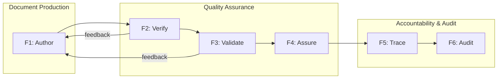
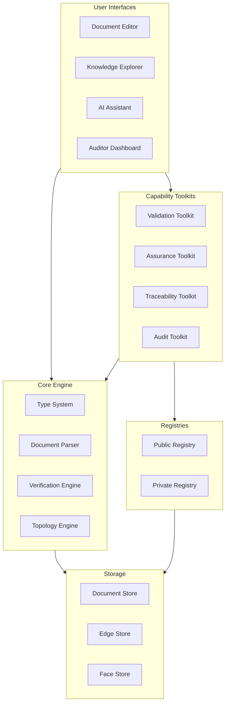

# Architecture - Knowledge Complex Framework Refactor

This architecture document defines the Knowledge Complex Framework across four layers aligned with the V-model lifecycle. The framework enables systematic documentation, verification, validation, and assurance of work products—initially for BlockScience internal use, with design accommodating eventual external productization.

## Overview

The Knowledge Complex Framework transforms how organizations manage knowledge-intensive work products. Built on the mathematical foundation of typed simplicial complexes, the framework abstracts rigorous concepts into usable tools that operators can use daily and approvers can trust for sign-off.

This architecture addresses three interconnected pain points identified in the field survey:

1. **Documentation chaos**: Documents scattered across systems, inconsistent formats, hard to verify
2. **Knowledge capture**: Institutional knowledge in people's heads, not systematized or searchable
3. **Client deliverable quality**: Need to produce demonstrably high-quality assured work products

The architecture follows a three-layer organizational model:
- **Platform Layer (A6)**: Infrastructure Builders develop the core framework
- **Configuration Layer (A5)**: Workflow Builders configure domain-specific instances
- **Execution Layer (A1-A4)**: End users (Regulators, Compliance Officers, Operators, Approvers) consume outputs

**Internal-first deployment**: BlockScience uses the framework for client engagements before external productization. Acceptance criteria focus on Operators (A3) and Approvers (A4) successfully using the system for daily work.

## V-Model Summary

| Layer | Left Side (Idealized) | Current Status | Right Side (Realized) |
|-------|----------------------|----------------|----------------------|
| **Conceptual** | ConOps: Enable systematic knowledge work with demonstrable effectiveness and compliance | Design | Acceptance Testing: Operators and Approvers can complete real work with confidence |
| **Functional** | Functional Architecture: Author, Verify, Validate, Assure, Trace, Audit | Design | System Testing: End-to-end workflow verification from document creation to assured delivery |
| **Logical** | Logical Architecture: Core Engine, Toolkits, Registries, Interfaces | Design | Integration Testing: Cross-component interaction verification |
| **Physical** | Physical Architecture: Python package, VS Code, Claude Code, Obsidian, git-based registries | Design | Unit Testing: Individual component verification |

## Conceptual Layer

### Problem Statement (ConOps)

BlockScience produces knowledge-intensive work products—research reports, system designs, technical specifications, audit findings—that must be both effective (achieving intended outcomes) and compliant (following defined processes). Currently, institutional knowledge is fragmented: documents live in scattered locations, quality assurance is manual and inconsistent, and demonstrating that work meets standards requires significant effort.

The Knowledge Complex Framework systematizes this work by treating documents as typed vertices in a mathematical structure, with explicit edges for verification (against specs) and validation (against guidance), and faces for assurance (complete quality attestation). Operators produce documents within defined workflows; Approvers attest to quality; the system provides the infrastructure to make this tractable.

**Stakeholder Needs:**

- **Operators (A3)**: Need intuitive tools to produce documents that conform to organizational standards without understanding the underlying mathematics. Need to find prior work quickly. Need clear guidance on what "good" looks like. Need LLM assistance for drafting and verification.

- **Approvers (A4)**: Need confidence that documents are ready for sign-off before review. Need to understand what they're attesting to. Need efficient review workflows. Need traceability to requirements so they know the work addresses the right problems. Need both compliance evidence (process followed) and effectiveness evidence (outcomes achieved).

- **Workflow Builders (A5)**: Need to configure document types, templates, and runbooks for specific domains without deep mathematical expertise. Need a registry of reusable components. Need APIs to build custom tooling.

- **Infrastructure Builders (A6)**: Need clean abstractions over the mathematical foundations. Need to maintain and extend the core framework. Need the system to be self-demonstrating (the framework should be documented using itself).

- **Compliance Officers (A2)**: Need audit reports that demonstrate work products meet regulatory requirements. Need gap analysis when assurance is incomplete. Need remediation tracking.

- **Regulators (A1)**: Need consumable evidence that organizational processes produce compliant outputs. (External to the system; consume outputs only.)

**Operational Context:**

BlockScience operates as a research and engineering firm producing complex deliverables for clients. Work products range from technical specifications to audit reports to research papers. Team members collaborate across time zones. Quality assurance historically depends on individual expertise rather than systematic process.

The framework must:
- Support daily work without adding friction
- Make quality visible (not just assumed)
- Capture institutional knowledge as reusable assets
- Enable both effectiveness and compliance demonstration
- Work with existing tools (git, markdown, VS Code, Obsidian)

### Acceptance Criteria

The system will be accepted for internal use when:

- **AC1**: Operators can create a new typed document from template in <5 minutes using IDE integration
- **AC2**: Verification runs automatically on save and reports pass/fail within 2 seconds
- **AC3**: Approvers can review a document's assurance status (verification passed, validation assessment, related documents) in a single view
- **AC4**: At least 3 document types are fully specified (spec, guidance, doc) with working verification
- **AC5**: At least 1 complete assurance chart exists demonstrating end-to-end workflow
- **AC6**: Prior work is searchable through Obsidian graph navigation and full-text search
- **AC7**: LLM assistant (Claude Code) can draft documents that pass verification on first attempt >80% of time
- **AC8**: Runbooks exist for common workflows (create document, verify, validate, assure)
- **AC9**: Both effectiveness metrics (did the work achieve its purpose?) and compliance metrics (was the process followed?) are visible in audit reports

## Functional Layer

### Functional Architecture

The system performs six core functions to enable systematic knowledge work.

| Function | Inputs | Outputs | Description |
|----------|--------|---------|-------------|
| F1: Author | Templates, prior work, user input | Draft documents | Create and edit typed documents with structure guidance |
| F2: Verify | Document, specification | Pass/fail result, error details | Check document structure against type specification |
| F3: Validate | Document, guidance, human judgment | Quality assessment, accountability record | Assess document quality against guidance criteria |
| F4: Assure | Verification edge, validation edge, coupling edge | Assurance face, trust attestation | Close the assurance triangle with human accountability |
| F5: Trace | Documents, requirements | Traceability chart, gap analysis | Map documents to originating requirements |
| F6: Audit | Assurance chart, requirements | Audit report, compliance evidence, effectiveness metrics | Generate consumable reports for compliance demonstration |



### Functional Decomposition

#### F1: Author

| Sub-Function | Description | Key Capability |
|--------------|-------------|----------------|
| F1.1 Create | Initialize new document from template | Template instantiation with frontmatter |
| F1.2 Edit | Modify document content | IDE integration with syntax support |
| F1.3 Navigate | Find related documents | Graph navigation, backlinks |
| F1.4 Draft | Generate content with AI assistance | LLM-powered drafting within type constraints |
| F1.5 Search | Find prior work | Full-text and metadata search |

#### F2: Verify

| Sub-Function | Description | Key Capability |
|--------------|-------------|----------------|
| F2.1 Parse | Extract frontmatter and structure | YAML parsing, section detection |
| F2.2 Check | Compare against specification | Template-based verification |
| F2.3 Report | Communicate results | Pass/fail with specific errors |
| F2.4 Integrate | Run automatically in workflow | IDE hooks, CLI, CI/CD |

#### F3: Validate

| Sub-Function | Description | Key Capability |
|--------------|-------------|----------------|
| F3.1 Assess | Evaluate against guidance criteria | Human judgment, LLM-assisted |
| F3.2 Rate | Assign quality levels | Excellent/Good/Needs Improvement per criterion |
| F3.3 Record | Document assessment with accountability | Validation edge with approver signature |
| F3.4 Recommend | Provide improvement guidance | Actionable feedback |

#### F4: Assure

| Sub-Function | Description | Key Capability |
|--------------|-------------|----------------|
| F4.1 Collect | Gather verification and validation edges | Edge reference resolution |
| F4.2 Close | Form assurance triangle | Face creation with boundary edges |
| F4.3 Attest | Record human accountability | Assurance face with approver signature |
| F4.4 Audit | Verify assurance completeness | Chart-level assurance audit |

#### F5: Trace

| Sub-Function | Description | Key Capability |
|--------------|-------------|----------------|
| F5.1 Link | Connect documents to requirements | Explicit requirement references |
| F5.2 Chart | Build requirements traceability chart | Subcomplex extraction |
| F5.3 Analyze | Identify gaps in traceability | Topological gap detection |
| F5.4 Report | Generate traceability matrix | Requirements coverage report |

#### F6: Audit

| Sub-Function | Description | Key Capability |
|--------------|-------------|----------------|
| F6.1 Extract | Build audit chart from assurance data | Chart construction |
| F6.2 Analyze | Compute completeness metrics | Euler characteristic, coverage |
| F6.3 Generate | Produce audit reports | Compliance and effectiveness reports |
| F6.4 Remediate | Track gap resolution | Remediation workflow support |

### System Testing Criteria

- **ST1**: End-to-end workflow: Create document → Verify → Validate → Assure completes without manual intervention except approval signatures
- **ST2**: Verification correctly rejects documents with missing required fields (100% detection rate)
- **ST3**: Validation assessments are recorded with proper accountability chain
- **ST4**: Assurance faces correctly reference all three boundary edges
- **ST5**: Traceability charts accurately reflect document-requirement relationships
- **ST6**: Audit reports include both compliance metrics (assurance coverage) and effectiveness metrics (performance against runbook criteria)

## Logical Layer

### Logical Architecture

The logical architecture organizes capabilities into four integrated component groups, independent of specific implementation technologies.



### Component Specifications

#### Core Engine

**Purpose:** Foundational capabilities for typed document management

| Component | Responsibility | Interfaces |
|-----------|---------------|------------|
| C1: Type System | Define and enforce document types, inheritance, constraints | Type definitions, validation rules |
| C2: Document Parser | Parse markdown with YAML frontmatter, extract structure | Raw text → structured document |
| C3: Verification Engine | Check documents against type specifications | Document + spec → pass/fail + errors |
| C4: Topology Engine | Compute simplicial complex properties, Euler characteristic | Complex → topological metrics |

**Integration Points:**
- Type System provides schemas to Verification Engine
- Document Parser feeds all other components
- Topology Engine used by Audit Toolkit for completeness analysis

**Key Design Decisions:**
- Types form inheritance hierarchy (doc → spec, guidance, etc.)
- Documents are vertices; verification/validation/coupling are edges; assurance is faces
- Sparse bipartite relationships (not every document connects to every other)

#### Capability Toolkits

**Purpose:** Higher-level capabilities built on Core Engine

| Component | Responsibility | Interfaces |
|-----------|---------------|------------|
| T1: Validation Toolkit | Support validation workflow with accountability | Document + guidance → validation edge |
| T2: Assurance Toolkit | Create and audit assurance faces | Edges → face; chart → audit results |
| T3: Traceability Toolkit | Build and analyze requirements traceability | Documents + requirements → traceability chart |
| T4: Audit Toolkit | Generate compliance and effectiveness reports | Assurance chart → audit report |

**Integration Points:**
- All toolkits use Core Engine for parsing and verification
- Toolkits are independently installable (plugin architecture)
- Toolkits share common patterns for edge/face creation

**Key Design Decisions:**
- Toolkits are optional—core functionality works without them
- Each toolkit can be extended for domain-specific needs
- Effectiveness metrics live in runbooks; toolkits extract and report them

#### Registries

**Purpose:** Share and discover document types, templates, and runbooks

| Component | Responsibility | Interfaces |
|-----------|---------------|------------|
| R1: Public Registry | Publish and discover community types/runbooks | Package manager interface (search, install, publish) |
| R2: Private Registry | Organization-specific types with access control | Same interface, private storage |

**Integration Points:**
- Registries provide types to Type System
- Toolkits can be distributed via registries
- Version control integrated (semantic versioning)

**Key Design Decisions:**
- Package manager model (like PyPI/npm for document types)
- Private registries use same interface for portability
- Registries support both types and runbooks

#### User Interfaces

**Purpose:** Enable different actors to interact with the system

| Component | Responsibility | Interfaces |
|-----------|---------------|------------|
| UI1: Document Editor | Create and edit documents with verification feedback | IDE integration, syntax highlighting, snippets |
| UI2: Knowledge Explorer | Navigate, search, and review knowledge complex | Graph visualization, backlinks, search |
| UI3: AI Assistant | Intelligent help for authoring and verification | LLM integration, context-aware prompts |
| UI4: Auditor Dashboard | Compliance and effectiveness reporting views | Analytics, charts, export |

**Integration Points:**
- Document Editor triggers Verification Engine on save
- Knowledge Explorer reads from Document/Edge/Face stores
- AI Assistant uses Type System for context-aware generation
- Auditor Dashboard uses Audit Toolkit for report generation

**Key Design Decisions:**
- Interfaces are loosely coupled—can substitute implementations
- Core functionality accessible via CLI/API (interfaces are optional)
- AI Assistant requires human approval for validation/assurance

### Integration Testing Criteria

- **IT1**: Document Editor correctly invokes Verification Engine and displays results
- **IT2**: Knowledge Explorer accurately reflects document relationships from storage
- **IT3**: AI Assistant generates documents that conform to Type System definitions
- **IT4**: Auditor Dashboard correctly aggregates data from Audit Toolkit
- **IT5**: Registry installation correctly extends Type System with new types
- **IT6**: Toolkits correctly use Core Engine APIs for document operations

## Physical Layer

### Physical Architecture

The physical layer specifies concrete technologies for the reference implementation, with documented extension points for alternative implementations.

| Logical Component | Technology Selection | Rationale |
|-------------------|---------------------|-----------|
| Core Engine | Python 3.11+ package | Widely adopted, good ecosystem, team expertise |
| Type System | YAML schemas + Python dataclasses | Human-readable definitions, runtime validation |
| Document Parser | PyYAML + python-frontmatter + custom markdown parser | Standard libraries, extensible |
| Verification Engine | Template-based Python scripts | Existing implementation, proven approach |
| Topology Engine | Custom Python + NetworkX | Graph algorithms available, extensible |
| Validation Toolkit | Python module + LLM integration | Combines automation with human judgment |
| Assurance Toolkit | Python module | Extends verification/validation |
| Traceability Toolkit | Python module + chart builder | Subcomplex extraction |
| Audit Toolkit | Python + pandas + plotly | Analytics and visualization |
| Public Registry | Custom service (PyPI-like) | Package manager model per requirements |
| Private Registry | Git repositories + registry interface | Familiar workflow, version control built-in |
| Document Editor | VS Code extension | Primary IDE for team, excellent extension API |
| Knowledge Explorer | Obsidian | Graph visualization, backlinks, markdown-native |
| AI Assistant | Claude Code integration | Current tooling, system prompt customization |
| Auditor Dashboard | Jupyter notebooks + Streamlit | Flexible analytics, shareable reports |
| Storage | Git repositories (markdown files) | Version control, collaboration, portability |

### Package Structure

```
knowledge-complex/
├── knowledge_complex/           # Core package
│   ├── __init__.py
│   ├── types/                   # Type system
│   │   ├── base.py              # Base document types
│   │   ├── spec.py              # Specification type
│   │   ├── guidance.py          # Guidance type
│   │   └── registry.py          # Type registry
│   ├── parser/                  # Document parsing
│   │   ├── frontmatter.py       # YAML frontmatter
│   │   └── markdown.py          # Markdown structure
│   ├── verification/            # Verification engine
│   │   ├── engine.py            # Core verification
│   │   └── templates.py         # Template-based checks
│   ├── topology/                # Topology engine
│   │   ├── complex.py           # Simplicial complex
│   │   └── analysis.py          # Topological analysis
│   └── cli.py                   # Command-line interface
├── knowledge_complex_validation/    # Validation toolkit (plugin)
├── knowledge_complex_assurance/     # Assurance toolkit (plugin)
├── knowledge_complex_traceability/  # Traceability toolkit (plugin)
├── knowledge_complex_audit/         # Audit toolkit (plugin)
└── knowledge_complex_registry/      # Registry service
```

### API Design

```python
# Core API examples (technology-specific)

from knowledge_complex import Document, TypeRegistry, verify

# Load type registry
registry = TypeRegistry.from_registry("public")
registry.extend_from("./private-types")

# Parse and verify document
doc = Document.from_file("my-spec.md")
result = verify(doc, registry)

if result.passed:
    print("Verification passed")
else:
    for error in result.errors:
        print(f"Error: {error}")

# Validation (requires human approval)
from knowledge_complex_validation import ValidationSession

session = ValidationSession(doc, guidance="guidance-for-spec")
assessment = session.assess_with_llm(model="claude-opus-4-5")
assessment.set_approver("mzargham")
validation_edge = assessment.create_edge()

# Assurance
from knowledge_complex_assurance import AssuranceFace

face = AssuranceFace.create(
    target=doc,
    verification_edge=verification_edge,
    validation_edge=validation_edge,
    coupling_edge=coupling_edge,
    approver="mzargham"
)
```

### CLI Design

```bash
# Verification
kc verify document.md                    # Verify single document
kc verify --all                          # Verify all documents
kc verify --watch                        # Watch mode for development

# Validation
kc validate document.md --guidance guidance-for-spec
kc validate document.md --llm-assist     # LLM-assisted assessment

# Assurance
kc assure document.md --approver mzargham
kc audit chart.md                        # Audit assurance chart

# Registry
kc registry search "field-survey"        # Search public registry
kc registry install type-name            # Install type from registry
kc registry publish ./my-type            # Publish to registry

# Traceability
kc trace document.md --requirements reqs.md
kc trace --chart project-chart.md        # Build traceability chart
```

### Extension Points

| Extension Point | Mechanism | Example |
|-----------------|-----------|---------|
| Custom document types | Type definition files in registry | Industry-specific specs |
| Alternative editors | Language Server Protocol (LSP) | Vim, Emacs, other IDEs |
| Alternative explorers | Export to standard formats | Notion, Confluence |
| Custom LLM providers | Provider interface | OpenAI, local models |
| Custom analytics | Plugin API | Domain-specific metrics |
| Alternative storage | Storage backend interface | Database, cloud storage |

### Unit Testing Criteria

- **UT1**: Document parser correctly extracts frontmatter from valid markdown files
- **UT2**: Type System correctly validates documents against type definitions
- **UT3**: Verification Engine produces correct pass/fail for known test cases
- **UT4**: Topology Engine correctly computes Euler characteristic
- **UT5**: CLI commands execute without error for valid inputs
- **UT6**: Registry client correctly searches and retrieves packages
- **UT7**: VS Code extension correctly triggers verification on save
- **UT8**: LLM integration correctly formats prompts and parses responses

## Traceability Matrix

| Conceptual Need | Functional Requirement | Logical Component | Physical Element |
|-----------------|----------------------|-------------------|------------------|
| Operators need templates (A3) | F1: Author | UI1: Document Editor | VS Code extension |
| Operators need verification feedback (A3) | F2: Verify | C3: Verification Engine | Python verification scripts |
| Approvers need confidence (A4) | F3: Validate, F4: Assure | T1: Validation, T2: Assurance | Validation/Assurance modules |
| Approvers need traceability (A4) | F5: Trace | T3: Traceability | Traceability module |
| Compliance Officers need reports (A2) | F6: Audit | T4: Audit, UI4: Dashboard | Jupyter + Streamlit |
| Workflow Builders need registry (A5) | F1.5: Search | R1: Public Registry | Registry service |
| All need search (A3, A4, A5) | F1.3: Navigate, F1.5: Search | UI2: Knowledge Explorer | Obsidian |
| All need AI assistance (A3, A4, A5) | F1.4: Draft | UI3: AI Assistant | Claude Code |

## Constraints and Assumptions

### Constraints

- **C1**: All documents must remain human-readable markdown with YAML frontmatter (no binary formats)
- **C2**: Git must remain the source of truth for version control
- **C3**: Human approval required for all validation and assurance attestations (no fully automated trust)
- **C4**: Internal-first deployment; external productization deferred
- **C5**: Budget and timeline constrained; build incrementally

### Assumptions

- **A1**: Team has Python development expertise
- **A2**: VS Code is primary IDE for most users
- **A3**: Claude Code available for LLM integration
- **A4**: Obsidian acceptable for knowledge exploration
- **A5**: Package manager infrastructure can be developed or adapted

## Risks and Mitigations

| Risk | Impact | Probability | Mitigation |
|------|--------|-------------|------------|
| Mathematical abstraction too complex | High | Medium | Extensive testing with non-mathematical users; iterative UX improvement |
| LLM reliability for verification | Medium | Medium | LLM assists only; human approval required; fallback to manual |
| Registry adoption | Medium | Low | Internal-first; external registry deferred until proven internally |
| Integration complexity (VS Code, Obsidian, Claude) | Medium | Medium | Loose coupling; graceful degradation if integrations fail |
| Scope creep to productization | High | Medium | Explicit internal-first acceptance criteria; defer external features |

---

**Note:** This architecture document follows the INCOSE SE Handbook patterns and V-model lifecycle. Physical layer specifies default tools (Python, VS Code, Claude Code, Obsidian) while Logical layer remains technology-agnostic to support future extensibility.
