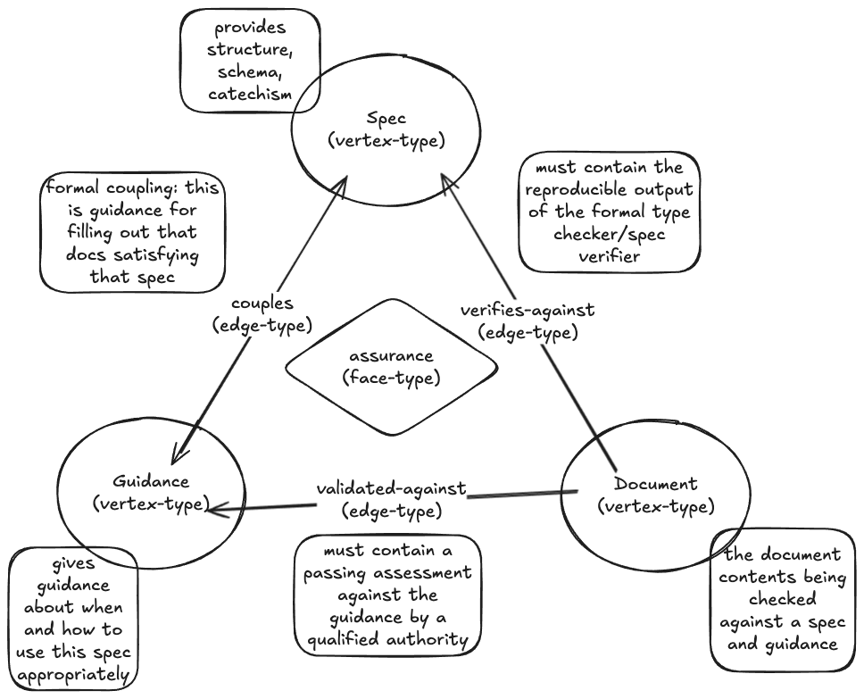
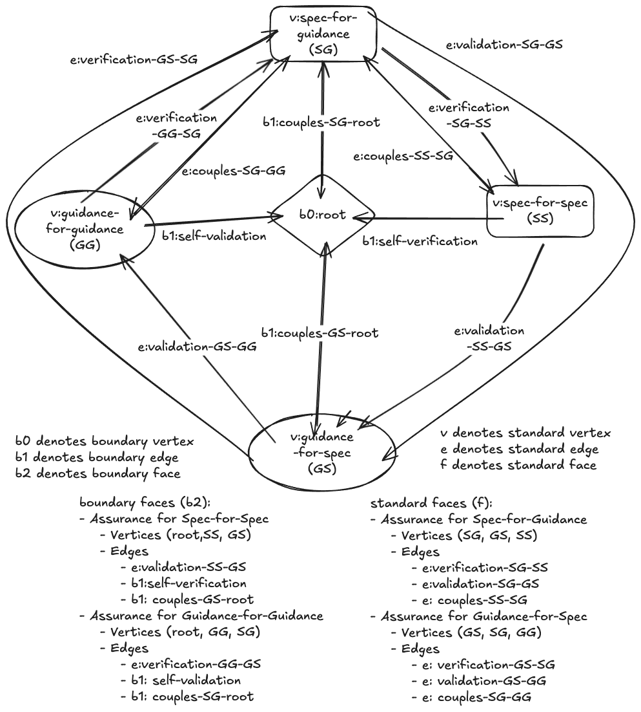

# Teaching Guide: Boundary Complex

**Stage 3: Introduction to Verification, Validation & Assurances**

**Prerequisites:** Stage 1 (Simplicial Complexes) - Understanding of vertices, edges, faces, and Euler characteristic

**Time Required:** 60-90 minutes

---

## Learning Objectives

By the end of this lesson, you will understand:

1. **What is verification?** Checking structural correctness against a specification
2. **What is validation?** Assessing quality against guidance criteria
3. **What is an assurance triangle?** The complete quality framework (verification + validation + coupling)
4. **What is the self-referential paradox?** How to verify "spec-for-spec" against itself?
5. **What are boundary elements?** How b0:root, b1 edges, and b2 faces resolve the paradox
6. **What is the boundary complex?** The self-referential foundation for all assurance

---

## What You're Looking At

The **boundary-complex** is the foundational structure that enables quality assurance for the entire knowledge complex. It resolves the circular dependency problem: "How do you verify the specification for specifications?"

### The Challenge

In any documentation system, you need:
- **Specifications** (spec) - Define what makes a document structurally valid
- **Guidance** (guidance) - Define what makes a document high quality

But to have specifications and guidance, you need... specifications and guidance for THOSE documents!

This creates four fundamental documents:
- **SS** (spec-for-spec): Specification defining valid specifications
- **GG** (guidance-for-guidance): Guidance for evaluating guidance quality
- **SG** (spec-for-guidance): Specification defining valid guidance
- **GS** (guidance-for-spec): Guidance for evaluating specification quality

**The Paradox:**
- How do you verify SS? It needs to verify against... itself?
- How do you validate GG? It needs to validate against... itself?

**The Resolution:** The **boundary complex** with a unique root vertex (b0:root) that acts as a proxy, enabling valid triangles without degenerate self-loops.

---

## Key Concepts

### 1. Document Types

**spec (specification):**
- Defines **structural requirements** for a document type
- Answers: "What fields must be present? What format?"
- Verification checks: "Does this document conform to the spec?"
- Example: spec-for-persona defines required fields for persona documents

**guidance:**
- Defines **quality criteria** for a document type
- Answers: "What makes this document good vs mediocre?"
- Validation assesses: "Does this document meet quality standards?"
- Example: guidance-for-persona defines what makes a good persona

### 2. Quality Edges

**verification edge (doc → spec):**
- **Source:** The document being checked
- **Target:** The specification it must conform to
- **Verification:** Structural compliance check (usually automated)
- **Example:** e:verification:persona-claude:spec (checks persona-claude against spec-for-persona)

**validation edge (doc → guidance):**
- **Source:** The document being assessed
- **Target:** The guidance criteria
- **Validation:** Quality assessment (often human judgment or LLM-assisted)
- **Example:** e:validation:persona-claude:guidance (assesses persona-claude quality)

**coupling edge (spec ↔ guidance):**
- **Endpoints:** A spec and its paired guidance
- **Coupling:** Alignment - they describe the same document type
- **Example:** e:coupling:persona (couples spec-for-persona ↔ guidance-for-persona)

### 3. Assurance Triangle

An **assurance face** is a triangular structure that provides complete quality assurance:

```
          child_doc (the document being assured)
           /\
          /  \
verification validation
        /      \
       v        v
   parent_spec ---- parent_guidance
        \          /
         coupling
```



*The assurance triangle showing how verification (doc→spec), validation (doc→guidance), and coupling (spec↔guidance) form a complete quality framework.*

**Three edges form the triangle:**

1. **Verification:** child_doc verified against parent_spec
2. **Validation:** child_doc validated against parent_guidance
3. **Coupling:** parent_spec and parent_guidance are aligned

**Why triangles?**
- **Completeness:** All three quality dimensions covered
- **Consistency:** Spec and guidance must be compatible (coupling)
- **Traceability:** Clear accountability for each quality check
- **Topological verification:** Can check if all documents have assurance faces

### 4. The Self-Referential Paradox

**The Problem:**

How do you assure SS (spec-for-spec)?
- Need verification edge: SS → ?? (what spec?)
- Can't be SS → SS (degenerate self-loop)
- Can't be "nothing" (incomplete assurance)

How do you assure GG (guidance-for-guidance)?
- Need validation edge: GG → ?? (what guidance?)
- Can't be GG → GG (degenerate self-loop)
- Can't be "nothing" (incomplete assurance)

**Traditional "Solution" (doesn't work):**
Accept self-loops: SS→SS, GG→GG

**Problem with self-loops:**
- Not valid 1-simplices (edge boundary must be 2 distinct vertices)
- Can't form valid triangular faces
- Violates simplicial complex requirements

### 5. Boundary Elements - The Resolution

**b0:root (boundary vertex):**
- Unique anchor vertex
- Acts as **proxy** for self-referential edges
- Enables valid edges without self-loops
- Not a document itself - purely structural

**b1 edges (boundary edges):**
- `b1:self-verification` - SS verifies against root (instead of SS→SS)
- `b1:self-validation` - GG validates against root (instead of GG→GG)
- `b1:couples-GS-root` - GS couples to root
- `b1:couples-SG-root` - SG couples to root

**b2 faces (boundary faces):**
- `b2:spec-spec` - Boundary assurance for SS (using root)
- `b2:guidance-guidance` - Boundary assurance for GG (using root)

**Result:**
- All edges connect **distinct** vertices (no self-loops!)
- All faces are valid triangles
- SS and GG have complete assurance (via boundary faces)
- The paradox is resolved

---

## The Structure

### Vertices (5 total)

| ID | Abbreviation | Type | Role |
|----|--------------|------|------|
| [b0:root](../../00_vertices/b0-root.md) | root | boundary | Unique anchor - resolves paradox |
| [v:spec:spec](../../00_vertices/spec-for-spec.md) | SS | spec | Defines valid specifications |
| [v:guidance:guidance](../../00_vertices/guidance-for-guidance.md) | GG | guidance | Defines quality guidance |
| [v:spec:guidance](../../00_vertices/spec-for-guidance.md) | SG | spec | Defines valid guidance documents |
| [v:guidance:spec](../../00_vertices/guidance-for-spec.md) | GS | guidance | Defines quality specifications |

### Edges (13 total)

**3 Coupling Edges (standard):**
- e:coupling:spec (SS ↔ SG)
- e:coupling:guidance (GS ↔ GG)
- e:coupling:spec-guidance:guidance-spec (SG ↔ GS)

**6 Verification/Validation Edges (standard):**
- e:verification:spec-guidance:spec-spec (SG → SS)
- e:verification:guidance-spec:spec-guidance (GS → SG)
- e:verification:guidance-guidance:spec-guidance (GG → SG)
- e:validation:spec-spec:guidance-spec (SS → GS)
- e:validation:spec-guidance:guidance-spec (SG → GS)
- e:validation:guidance-spec:guidance-guidance (GS → GG)

**4 Boundary Edges (b1):**
- b1:self-verification (SS → root) - Self-verification via proxy
- b1:self-validation (GG → root) - Self-validation via proxy
- b1:couples-GS-root (root ↔ GS) - Coupling proxy for GS
- b1:couples-SG-root (root ↔ SG) - Coupling proxy for SG

### Faces (4 total)

**2 Standard Assurance Faces (GREEN):**

**f:assurance:spec-guidance (assures SG):**
- Child: SG (spec-for-guidance)
- Spec: SS (spec-for-spec)
- Guidance: GS (guidance-for-spec)
- Edges: verification(SG→SS), validation(SG→GS), coupling(SS↔SG)

**f:assurance:guidance-spec (assures GS):**
- Child: GS (guidance-for-spec)
- Spec: SG (spec-for-guidance)
- Guidance: GG (guidance-for-guidance)
- Edges: verification(GS→SG), validation(GS→GG), coupling(SG↔GG)

**2 Boundary Assurance Faces (BLUE):**

**b2:spec-spec (assures SS via root):**
- Child: SS (spec-for-spec)
- Spec: (self via root)
- Guidance: GS (guidance-for-spec)
- Edges: b1:self-verification(SS→root), validation(SS→GS), b1:couples-GS-root(root↔GS)

**b2:guidance-guidance (assures GG via root):**
- Child: GG (guidance-for-guidance)
- Spec: SG (spec-for-guidance)
- Guidance: (self via root)
- Edges: verification(GG→SG), b1:self-validation(GG→root), b1:couples-SG-root(root↔SG)

### Topology

- **V** = 5 (root, SS, SG, GS, GG)
- **E** = 13 (3 coupling + 6 standard + 4 boundary)
- **F** = 4 (2 standard + 2 boundary)
- **χ** = V - E + F = 5 - 13 + 4 = **-4**

**What does χ = -4 mean?**
This is a topologically rich structure (not contractible). The negative Euler characteristic reflects the dense interconnection of foundational documents - this is the "kernel" that anchors all other assurance.

### Visualization



*The boundary complex showing root vertex (center), four foundational documents (SS, GG, SG, GS), boundary edges (b1), and the distinction between green (standard) and blue (boundary) assurance faces.*

---

## Teaching Moments

### Moment 1: The Mutual Bootstrap

**Observation:** SG and GS assure each other!

- SG (spec-for-guidance) is verified against SS and validated against **GS**
- GS (guidance-for-spec) is verified against **SG** and validated against GG

**Question:** "Isn't this circular?"

**Answer:** No, because they're **mutually supporting**, not self-referential:
- SG depends on GS for validation (quality check)
- GS depends on SG for verification (structure check)
- This is a **valid mutual dependency** (green faces)

The circularity is broken by:
- SS self-verifying via **root** (not via SG)
- GG self-validating via **root** (not via GS)

###

 Moment 2: Why Root Must Be Unique

**Observation:** There's exactly ONE b0:root vertex

**Question:** "What happens if we have multiple root vertices?"

**Answer:** The uniqueness of root is **essential**:
- Root is the anchor point - the foundation beneath the foundation
- Multiple roots → multiple conflicting foundations
- The boundary complex must have a **single** starting point
- This is enforced by the `unique_boundary_kernel` constraint in audit charts

### Moment 3: Boundary vs Standard Faces

**Observation:** SS and GG use blue (b2) faces, SG and GS use green (f:) faces

**Color Coding:**
- 🟢 **GREEN:** Standard assurance (normal cross-domain)
- 🔵 **BLUE:** Boundary assurance (involves root for self-reference)

**Distinction:**
- Green faces: Document assured by DIFFERENT spec and guidance
- Blue faces: Document assured WITH root proxy for self-reference
- Both are valid assurance - different patterns for different needs

---

## Hands-On Exercises

### Exercise 1: Verify the Boundary Complex

Run verification on the chart:

```bash
python scripts/verify_chart.py charts/boundary-complex/boundary-complex.md --root .
```

**Expected:** ✓ Chart is a valid simplicial complex

Now check topology:

```bash
python scripts/topology.py charts/boundary-complex/boundary-complex.md
```

**Expected:**
```
V=5, E=13, F=4, χ=-4
```

### Exercise 2: Examine a Boundary Vertex

Open [00_vertices/b0-root.md](../../00_vertices/b0-root.md):

```yaml
type: vertex/boundary
extends: vertex
id: b0:root
name: Root - Boundary Anchor
description: Unique boundary vertex enabling self-referential assurance without degenerate self-loops
```

**Key observation:** `type: vertex/boundary` - This is NOT a document type. It's a structural element.

**Question:** Why can't root be type: vertex/spec or vertex/guidance?

### Exercise 3: Trace an Assurance Chain

Pick a document: **SG** (spec-for-guidance)

**Assurance face:** f:assurance:spec-guidance

**Edges in the triangle:**
1. **Verification:** SG → SS (is SG structured correctly per spec-for-spec?)
2. **Validation:** SG → GS (is SG high quality per guidance-for-spec?)
3. **Coupling:** SS ↔ SG (are spec-for-spec and spec-for-guidance aligned?)

**Result:** SG is fully assured (structure checked, quality assessed, spec-guidance coupled)

**Now trace SS:**

**Assurance face:** b2:spec-spec (boundary face!)

**Edges in the triangle:**
1. **Self-verification:** SS → root (via b1, acts as SS verifies against itself)
2. **Validation:** SS → GS (is SS high quality per guidance-for-spec?)
3. **Coupling:** root ↔ GS (via b1, couples GS to root as proxy for SS)

**Result:** SS is fully assured even though it's self-referential!

### Exercise 4: Compare Green vs Blue Faces

**Green Face Example: f:assurance:spec-guidance**

```yaml
vertices: [v:spec:guidance, v:spec:spec, v:guidance:spec]
edges:
  - e:verification:spec-guidance:spec-spec  # SG → SS
  - e:validation:spec-guidance:guidance-spec  # SG → GS
  - e:coupling:spec  # SS ↔ SG
```

All vertices are standard documents, all edges are standard edges.

**Blue Face Example: b2:spec-spec**

```yaml
vertices: [b0:root, v:guidance:spec, v:spec:spec]
edges:
  - b1:self-verification  # SS → root (boundary edge!)
  - e:validation:spec-spec:guidance-spec  # SS → GS
  - b1:couples-GS-root  # root ↔ GS (boundary edge!)
```

Includes b0:root vertex and b1 boundary edges.

**Question:** What's the semantic difference between these two patterns?

### Exercise 5: Run Assurance Audit

Check that all 5 vertices in the boundary complex are assured:

```bash
python scripts/audit_assurance_chart.py charts/boundary-complex/boundary-complex.md
```

**Expected:**
```
✅ PASS - All vertices have valid assurance
Coverage: 100% (5/5 vertices assured)

Vertex Assurance Status:
- b0:root: ✅ ASSURED (participates in b2 faces)
- v:spec:spec: ✅ ASSURED (b2:spec-spec)
- v:spec:guidance: ✅ ASSURED (f:assurance:spec-guidance)
- v:guidance:spec: ✅ ASSURED (f:assurance:guidance-spec)
- v:guidance:guidance: ✅ ASSURED (b2:guidance-guidance)
```

---

## Common Questions

**Q: Why is this called the "boundary" complex?**

A: Because it uses **boundary elements** (b0, b1, b2) to resolve the foundational paradox. It's the "boundary" of the assurance system - the edge case that anchors everything else.

**Q: Does every knowledge complex need a boundary complex?**

A: Only if you want **self-referential assurance** for your specs and guidances. If you have external specs (from a standards body, for example), you might not need boundary elements. But for a self-contained system, the boundary complex provides the foundation.

**Q: Can I have multiple boundary complexes?**

A: No - the boundary complex must be **unique**. You can only have one b0:root. Multiple roots would create conflicting foundations.

**Q: Are boundary faces less "valid" than standard faces?**

A: No! Boundary faces are **equally valid** assurance. They're just a different pattern (using root as proxy) for the special case of self-reference. All faces - green or blue - provide complete quality assurance.

**Q: Why is χ = -4? Isn't negative bad?**

A: The Euler characteristic is neither good nor bad - it's **descriptive**. χ = -4 reflects the rich interconnection of the boundary complex. This is appropriate for a foundational kernel. Simpler structures (like a tree) would have higher χ. Complex structures have lower (more negative) χ.

**Q: How do I add assurance for MY documents?**

A: Once the boundary complex exists, adding assurance for your documents is straightforward:

1. **Pick your spec and guidance** (from the boundary complex, e.g., spec-for-persona, guidance-for-persona)
2. **Create verification edge** (your-doc → spec)
3. **Create validation edge** (your-doc → guidance)
4. **Use existing coupling edge** (spec ↔ guidance already coupled)
5. **Create assurance face** (triangle of 3 edges)

You only need boundary elements for **self-referential** foundational docs. All other docs use standard green assurance faces.

---

## Verification Commands

```bash
# Verify chart structure (run from repository root)
python scripts/verify_chart.py charts/boundary-complex/boundary-complex.md --root .

# Analyze topology
python scripts/topology.py charts/boundary-complex/boundary-complex.md

# Run assurance audit
python scripts/audit_assurance_chart.py charts/boundary-complex/boundary-complex.md

# Verify individual vertices pass template checks
python scripts/verify_template_based.py 00_vertices/b0-root.md --templates templates
python scripts/verify_template_based.py 00_vertices/spec-for-spec.md --templates templates

# Generate 3D interactive visualization (optional)
python scripts/export_chart_direct.py charts/boundary-complex/boundary-complex.md
python scripts/visualize_chart.py charts/boundary-complex/boundary-complex.json
# Opens in browser - explore boundary complex in 3D!
```

**Expected:** All pass

**Note:** The static images in this guide show the boundary complex structure. For interactive exploration, generate the 3D HTML visualization using the export and visualize scripts above.

---

## What's Next?

**You've learned:** Verification, validation, assurance triangles, and self-referential foundation via boundary elements

**Next stage:** [Stage 4 - Compound Documents](../../docs/teaching-guides/04-compositional-documents.md) (To be created)

In Stage 4, you'll learn:
- How to build documents from **reusable components**
- How **dependency edges** track compositional relationships
- How **compilation** expands embeds into standalone documents
- How **assurance propagates** from components to compositions

**Preview:** You'll see how the system_prompt is built from three components (persona, purpose, protocol), each individually assured, combined into a compositional document with its own assurance.

---

## Additional Resources

- **File locations:**
  - Boundary vertex: `00_vertices/b0-root.md`
  - Foundational docs: `00_vertices/{spec-for-spec,guidance-for-guidance,spec-for-guidance,guidance-for-spec}.md`
  - Boundary edges: `01_edges/b1-*.md`
  - Assurance faces: `02_faces/{f:assurance-*,b2:*}.md`
  - Chart: `charts/boundary-complex/boundary-complex.md`

- **Key concepts:**
  - Assurance triangle pattern
  - Boundary elements (b0, b1, b2)
  - Self-referential paradox and resolution
  - Verification vs validation vs coupling

- **Related docs:**
  - [spec-for-verification.md](../../00_vertices/spec-for-verification.md) - Defines verification edge requirements
  - [spec-for-validation.md](../../00_vertices/spec-for-validation.md) - Defines validation edge requirements
  - [spec-for-assurance-audits.md](../../00_vertices/spec-for-assurance-audits.md) - Defines assurance face requirements

---

**Note:** The boundary complex is the **foundational seed** of the knowledge complex assurance system. Understanding this structure is essential for creating self-contained, self-verifying documentation systems. All other assurance builds on this foundation.
