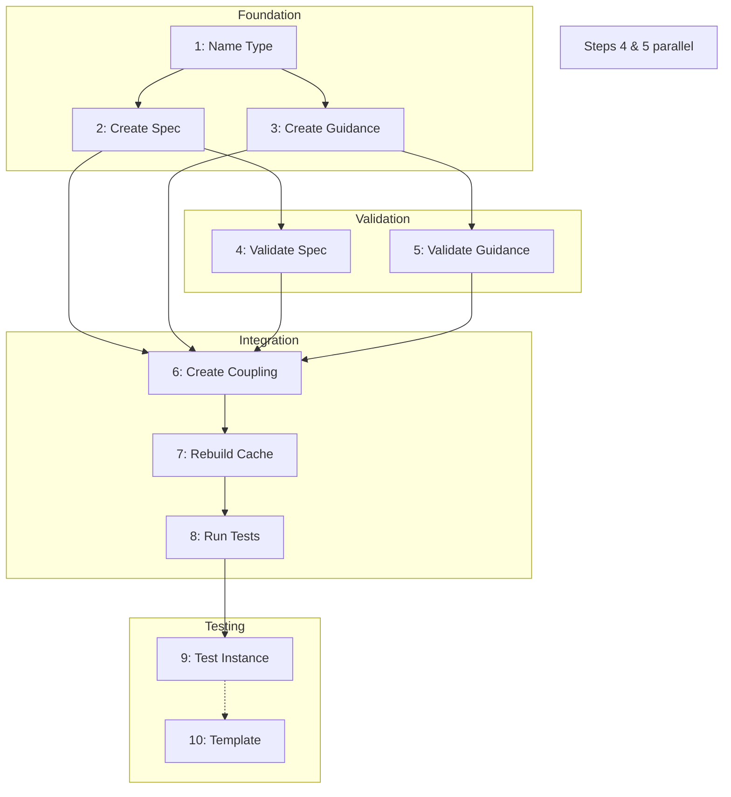

# Runbook for Document Type Creation

**This runbook guides practitioners through creating a new document type in the knowledge complex, including the spec, guidance, and coupling edge that satisfy the four-document boundary complex.**

## Context

### Why: Problem Statement

When you need to introduce a new kind of document into the knowledge complex, you must establish both structural requirements (spec) and quality criteria (guidance) that work together. Without a complete document type definition, instances cannot be verified or validated, and the assurance system cannot operate. This workflow solves the problem of creating a fully-integrated document type that satisfies the foundational boundary complex.

### What: Scope and Artifacts

This workflow produces a complete document type definition that integrates with the knowledge complex's verification and validation infrastructure.

| Artifact | Type | Description |
|----------|------|-------------|
| spec-for-\<name\>.md | vertex/spec | Structural requirements for the document type |
| guidance-for-\<name\>.md | vertex/guidance | Quality criteria and best practices |
| coupling-\<name\>.md | edge/coupling | Links spec and guidance, enables assurance faces |
| \<name\>-example.md | vertex/\<name\> | Test document validating the type works (optional) |

**Boundary Complex Satisfaction:**

Your new documents must satisfy the four foundational documents:

| Document | Your Spec Must... | Your Guidance Must... |
|----------|-------------------|----------------------|
| spec-for-spec (SS) | Verify against | - |
| guidance-for-spec (GS) | Validate against | - |
| spec-for-guidance (SG) | - | Verify against |
| guidance-for-guidance (GG) | - | Validate against |

### Who: Roles and Skills

| Role | Responsibilities | Required Skills |
|------|------------------|-----------------|
| Knowledge Engineer | Create spec and guidance, run verification, prepare for validation | YAML syntax, type system, spec/guidance authoring |
| Documentation Architect | Review quality of criteria, approve validation | Quality assessment, domain expertise |

## Prerequisites

### Required Knowledge

- Understanding of the knowledge complex type system (vertex, edge, face)
- Familiarity with YAML frontmatter structure
- Knowledge of verification (structural) vs validation (quality) distinction
- Understanding of spec-guidance coupling

### Required Tools

- `verify_template_based.py`: Verifies document structure against templates
- `build_cache.py`: Rebuilds complex.json with new vertices/edges
- `pytest`: Runs full test suite

### Required Access

- Write access to `00_vertices/` and `01_edges/` directories
- Ability to run Python scripts

### Entry Criteria

- [ ] Verification tools work: `python scripts/verify_template_based.py 00_vertices/spec-for-spec.md --templates templates` returns PASS
- [ ] Clear purpose for the new document type identified
- [ ] Document type name chosen (kebab-case, descriptive)
- [ ] Understanding of what instances of this type will contain

## Workflow Overview

### Dependency Diagram



### Parallelization Opportunities

| Parallel Group | Steps | Condition |
|----------------|-------|-----------|
| Validation | Steps 4 & 5 | After both spec and guidance are created and verified |

### Workflow Summary

| Step | Activity | Inputs | Output | Depends On |
|------|----------|--------|--------|------------|
| 1 | Choose document type name | Purpose description | Type name, ID patterns | - |
| 2 | Create spec document | Type name, SS template | spec-for-\<name\>.md (verified) | Step 1 |
| 3 | Create guidance document | Type name, SG template | guidance-for-\<name\>.md (verified) | Step 1 |
| 4 | Validate spec against GS | Spec, guidance-for-spec | Validation assessment | Step 2 |
| 5 | Validate guidance against GG | Guidance, guidance-for-guidance | Validation assessment | Step 3 |
| 6 | Create coupling edge | Spec, Guidance | coupling-\<name\>.md | Steps 2, 3, 4, 5 |
| 7 | Rebuild cache | All new documents | Updated complex.json | Step 6 |
| 8 | Run test suite | complex.json | Test results | Step 7 |
| 9 | Create test instance | Spec, Guidance | \<name\>-example.md | Step 8 |
| 10 | Create template (optional) | Verified instance | Template file | Step 9 |

## Step 1: Choose Document Type Name

**Goal:** Establish the naming convention and ID patterns for the new document type.

**Inputs:**
- Purpose description for the document type
- Understanding of what instances will contain

**Activities:**

1. Choose a clear, descriptive name in kebab-case
2. Verify the name doesn't conflict with existing types
3. Define the ID patterns:
   - Spec: `v:spec:<name>`
   - Guidance: `v:guidance:<name>`
   - Coupling: `e:coupling:<name>`

**Tools and References:**
- Check existing types: `ls 00_vertices/spec-for-*.md`
- [[spec-for-spec]] - for ID format requirements

**Outputs:**
- Document type name (kebab-case)
- ID patterns documented

**Checkpoint:** Name is unique, descriptive, and follows kebab-case convention.

## Step 2: Create the Spec Document

**Goal:** Create the specification document defining structural requirements for the new type.

**Inputs:**
- Document type name from Step 1
- [[spec-for-spec]] for structure requirements
- Existing spec examples as reference

**Activities:**

1. Create `00_vertices/spec-for-<name>.md`
2. Add required frontmatter:
   ```yaml
   type: vertex/spec
   extends: doc
   id: v:spec:<name>
   name: Specification for <Name>
   tags: [vertex, doc, spec]
   version: 1.0.0
   created: <ISO-8601>
   modified: <ISO-8601>
   ```
3. Add required body sections:
   - `## Purpose Statement`
   - `## Structural Requirements` (with field table)
   - `## Format Constraints`
   - `## Schema Definition`
4. Verify immediately:
   ```bash
   python scripts/verify_template_based.py 00_vertices/spec-for-<name>.md --templates templates
   ```
5. Fix any verification failures before proceeding

**Tools and References:**
- [[spec-for-spec]] - structural requirements for specs
- `templates/00_vertices/spec-template.md` - template structure
- `python scripts/verify_template_based.py` - verification command

**Outputs:**
- `spec-for-<name>.md` passing verification

**Consistency Checks:**
- [ ] ID follows pattern `v:spec:<name>` matching chosen name
- [ ] Tags include full inheritance chain: `[vertex, doc, spec]`
- [ ] `extends: doc` is correct

**Checkpoint:** `python scripts/verify_template_based.py 00_vertices/spec-for-<name>.md --templates templates` returns PASS.

## Step 3: Create the Guidance Document

**Goal:** Create the guidance document defining quality criteria for the new type.

**Inputs:**
- Document type name from Step 1
- [[spec-for-guidance]] for structure requirements
- Existing guidance examples as reference

**Activities:**

1. Create `00_vertices/guidance-for-<name>.md`
2. Add required frontmatter:
   ```yaml
   type: vertex/guidance
   extends: doc
   id: v:guidance:<name>
   name: Guidance for <Name>
   tags: [vertex, doc, guidance]
   version: 1.0.0
   created: <ISO-8601>
   modified: <ISO-8601>
   criteria:
     - <criterion-1>
     - <criterion-2>
   rubric: validation-assessment
   ```
3. Add required body sections:
   - `## Purpose Statement`
   - `## Document Overview`
   - `## Quality Criteria` (with levels: Excellent/Good/Needs Improvement)
   - `## Section-by-Section Guidance`
   - `## Workflow Guidance`
   - `## Common Issues and Solutions`
   - `## Best Practices`
4. Verify immediately:
   ```bash
   python scripts/verify_template_based.py 00_vertices/guidance-for-<name>.md --templates templates
   ```
5. Fix any verification failures before proceeding

**Tools and References:**
- [[spec-for-guidance]] - structural requirements for guidances
- `templates/00_vertices/guidance-template.md` - template structure
- `python scripts/verify_template_based.py` - verification command

**Outputs:**
- `guidance-for-<name>.md` passing verification

**Consistency Checks:**
- [ ] ID follows pattern `v:guidance:<name>` matching Step 1 name
- [ ] Tags include full inheritance chain: `[vertex, doc, guidance]`
- [ ] Criteria in frontmatter match criteria sections in body
- [ ] References the corresponding spec in Purpose Statement

**Checkpoint:** `python scripts/verify_template_based.py 00_vertices/guidance-for-<name>.md --templates templates` returns PASS.

## Step 4: Validate Spec Against Guidance-for-Spec

**Goal:** Assess the quality of your spec against the guidance criteria for specs.

**Inputs:**
- `spec-for-<name>.md` from Step 2
- [[guidance-for-spec]] quality criteria

**Activities:**

1. Read [[guidance-for-spec]] quality criteria:
   - Clarity: precise, unambiguous language
   - Completeness: all required elements defined
   - Testability: requirements objectively verifiable
   - Consistency: terminology used consistently
   - Maintainability: versioned, modular
   - Obsidian Compatibility: proper links/tags
   - Reference/Referent Clarity: clear what spec IS vs DESCRIBES
2. Self-check your spec against each criterion
3. Document assessment with ratings (Excellent/Good/Needs Improvement)
4. Address any "Needs Improvement" areas before proceeding

**Tools and References:**
- [[guidance-for-spec]] - quality criteria for specs

**Outputs:**
- Validation assessment documenting quality ratings
- Revised spec if improvements were needed

**Consistency Checks:**
- [ ] Spec requirements are objectively testable (not subjective)
- [ ] Examples in spec satisfy the spec's own requirements
- [ ] Terminology matches spec-for-spec conventions

**Checkpoint:** All quality criteria rated Good or Excellent; self-check questions answered affirmatively.

## Step 5: Validate Guidance Against Guidance-for-Guidance

**Goal:** Assess the quality of your guidance against the guidance criteria for guidances.

**Inputs:**
- `guidance-for-<name>.md` from Step 3
- [[guidance-for-guidance]] quality criteria

**Activities:**

1. Read [[guidance-for-guidance]] quality criteria:
   - Clarity: criteria understandable and actionable
   - Completeness: all quality dimensions covered
   - Graduated Assessment: clear levels (Excellent/Good/Needs Improvement)
   - Practical Utility: helps authors improve documents
   - Coupling Alignment: criteria align with spec requirements
2. Self-check your guidance against each criterion
3. Document assessment with ratings
4. Address any "Needs Improvement" areas before proceeding

**Tools and References:**
- [[guidance-for-guidance]] - quality criteria for guidances

**Outputs:**
- Validation assessment documenting quality ratings
- Revised guidance if improvements were needed

**Consistency Checks:**
- [ ] Quality criteria cover dimensions defined in spec
- [ ] Level indicators are specific enough to distinguish quality
- [ ] Guidance references the corresponding spec

**Checkpoint:** All quality criteria rated Good or Excellent; self-check questions answered affirmatively.

## Step 6: Create the Coupling Edge

**Goal:** Link the spec and guidance to enable assurance faces for instances.

**Inputs:**
- Validated `spec-for-<name>.md` from Steps 2, 4
- Validated `guidance-for-<name>.md` from Steps 3, 5

**Activities:**

1. Create `01_edges/coupling-<name>.md`
2. Add required frontmatter:
   ```yaml
   type: edge/coupling
   extends: edge
   id: e:coupling:<name>
   name: Coupling - Spec and Guidance for <Name>
   source: v:spec:<name>
   target: v:guidance:<name>
   source_type: vertex/spec
   target_type: vertex/guidance
   orientation: undirected
   tags: [edge, coupling]
   version: 1.0.0
   created: <ISO-8601>
   modified: <ISO-8601>
   ```
3. Add body sections:
   - `## Purpose` - what the coupling enables
   - `## Governed Document Type` - what type this governs
   - `## Role in Assurance Faces` - how it forms face bases
   - `## Semantic Alignment` - table mapping spec requirements to guidance criteria
4. Verify immediately:
   ```bash
   python scripts/verify_template_based.py 01_edges/coupling-<name>.md --templates templates
   ```

**Tools and References:**

- `templates/01_edges/coupling-template.md` - template for coupling edges
- Existing coupling edges as reference (e.g., `01_edges/coupling-spec.md`)

**Outputs:**
- `coupling-<name>.md` passing verification

**Consistency Checks:**
- [ ] `source` matches spec ID from Step 2
- [ ] `target` matches guidance ID from Step 3
- [ ] Semantic Alignment table maps requirements to criteria accurately

**Checkpoint:** `python scripts/verify_template_based.py 01_edges/coupling-<name>.md --templates templates` returns PASS.

## Step 7: Rebuild Cache

**Goal:** Update complex.json with the new vertices and edge.

**Inputs:**
- All new documents from Steps 2, 3, 6

**Activities:**

1. Run cache rebuild:
   ```bash
   python scripts/build_cache.py
   ```
2. Verify new elements appear in complex.json
3. Check for any errors or warnings

**Tools and References:**
- `python scripts/build_cache.py` - cache rebuild command
- `complex.json` - knowledge complex cache file

**Outputs:**
- Updated `complex.json` containing new type

**Consistency Checks:**
- [ ] Spec appears in complex.json with correct ID
- [ ] Guidance appears in complex.json with correct ID
- [ ] Coupling edge appears with correct source/target

**Checkpoint:** `python scripts/build_cache.py` completes without errors; new IDs visible in complex.json.

## Step 8: Run Full Test Suite

**Goal:** Ensure the new type integrates correctly with existing infrastructure.

**Inputs:**
- Updated complex.json from Step 7

**Activities:**

1. Run full test suite:
   ```bash
   python -m pytest tests/ -v --ignore=tests/archive/
   ```
2. Analyze any failures
3. Fix issues if tests fail

**Tools and References:**
- `python -m pytest` - test runner

**Outputs:**
- Test results (all passing)

**Consistency Checks:**
- [ ] No new test failures introduced
- [ ] Type system tests pass with new type

**Checkpoint:** All tests pass.

## Step 9: Create Test Instance

**Goal:** Validate that the new type works in practice by creating a real document.

**Inputs:**
- `spec-for-<name>.md` - structural requirements
- `guidance-for-<name>.md` - quality criteria

**Activities:**

1. Create `00_vertices/<name>-example.md` following your spec:
   ```yaml
   type: vertex/<name>
   extends: <parent-type>
   id: v:<name>:example
   name: Example <Name> Document
   # ... all fields required by your spec ...
   ```
2. Verify against your spec:
   ```bash
   python scripts/verify_template_based.py 00_vertices/<name>-example.md --templates templates
   ```
3. Validate manually against your guidance criteria
4. If verification fails, adjust spec (may need to revisit Steps 2-6)
5. If validation reveals issues, refine guidance criteria

**Tools and References:**
- Your new spec and guidance
- `python scripts/verify_template_based.py` - verification

**Outputs:**
- `<name>-example.md` passing verification and validation

**Consistency Checks:**
- [ ] Test document follows all spec requirements
- [ ] Test document demonstrates quality criteria from guidance
- [ ] Any spec adjustments propagated to coupling edge

**Checkpoint:** Test document passes verification; review against guidance shows Excellent/Good quality.

## Step 10: Create Template (Optional)

**Goal:** Make it easy for others to create instances of your new type.

**Inputs:**
- Verified `<name>-example.md` from Step 9
- Spec requirements

**Activities:**

1. Create template directory if needed:
   ```bash
   mkdir -p templates/00_vertices
   ```
2. Create `templates/00_vertices/<name>-template.md`
3. Replace specific values with placeholders (`<name>`, `<description>`, etc.)
4. Include comments indicating required vs optional elements
5. Test template by using it to create another instance

**Tools and References:**
- Existing templates in `templates/` directory

**Outputs:**
- Template file ready for use

**Checkpoint:** Template can be used to create valid instances.

## Decision Points

### Decision: Spec Scope

**When:** Step 2, defining structural requirements

**Options:**

| Option | When to Choose | Implications |
|--------|----------------|--------------|
| Minimal spec | Type is simple, few required fields | Easier to satisfy, less structure |
| Comprehensive spec | Type is complex, many variations | More work to create instances, stronger guarantees |

**Default:** Start minimal and expand based on actual instance needs.

### Decision: Quality Criteria Granularity

**When:** Step 3, defining guidance criteria

**Options:**

| Option | When to Choose | Implications |
|--------|----------------|--------------|
| Few broad criteria | Quality dimensions are interrelated | Faster validation, less precision |
| Many specific criteria | Quality dimensions are independent | More thorough, more effort |

**Default:** 3-5 criteria covering distinct quality dimensions.

### Decision: Test Instance Scope

**When:** Step 9, creating test document

**Options:**

| Option | When to Choose | Implications |
|--------|----------------|--------------|
| Minimal instance | Testing structural compliance only | Quick, may miss practical issues |
| Realistic instance | Testing real-world usage | More time, reveals actual problems |

**Default:** Realistic instance that would actually be useful.

## Completion Criteria

### Exit Checklist

- [ ] `spec-for-<name>.md` exists in `00_vertices/` and passes verification
- [ ] `guidance-for-<name>.md` exists in `00_vertices/` and passes verification
- [ ] `coupling-<name>.md` exists in `01_edges/` and passes verification
- [ ] Spec validated against guidance-for-spec (all criteria Good or Excellent)
- [ ] Guidance validated against guidance-for-guidance (all criteria Good or Excellent)
- [ ] Cache rebuilt and new elements visible in complex.json
- [ ] Full test suite passes
- [ ] Test instance created and verified

### Success Indicators

- New document type can be used to create instances that verify and validate
- Coupling edge enables assurance faces for instances
- Type integrates with existing verification infrastructure
- Documentation is clear enough for others to use

### Common Completion Issues

| Issue | Resolution |
|-------|------------|
| Test instance fails verification | Review spec requirements; may be too strict or missing fields |
| Guidance criteria too vague | Add specific indicators for each level |
| Coupling alignment unclear | Revisit semantic alignment table; ensure 1:1 mapping |

## Troubleshooting

| Problem | Likely Cause | Solution |
|---------|--------------|----------|
| Spec verification fails | Missing required sections or frontmatter | Check against spec-for-spec requirements; ensure all sections present |
| Guidance verification fails | Missing criteria in frontmatter or body sections | Ensure `criteria` field in frontmatter; add all required sections |
| Coupling verification fails | Wrong source/target IDs | Verify IDs match exactly with spec and guidance documents |
| Cache rebuild fails | Invalid YAML or missing required fields | Run verification on each document individually to identify issues |
| Test instance fails against new spec | Spec requirements don't match practical needs | Iterate on spec based on real usage; may need looser constraints |
| Dependencies field confusion | Putting coupling in dependencies | Remember: coupling is an edge, not a dependency; dependencies are same-category only |
| Tags missing inheritance | Only including final tag | Include full chain: [vertex, doc, spec] or [vertex, doc, guidance] |

## Maintenance

### When to Revisit

| Trigger | Affected Artifacts | Action Required |
|---------|-------------------|-----------------|
| New instance reveals spec gaps | spec-for-\<name\>.md | Update spec, re-verify coupling, re-validate |
| Quality criteria prove inadequate | guidance-for-\<name\>.md | Refine criteria, update coupling alignment |
| Boundary complex updates | All type documents | Re-verify against updated SS/SG, re-validate against updated GS/GG |
| Significant usage patterns emerge | Template | Update template based on common patterns |

### Change Propagation

When earlier documents change, updates may need to propagate forward:

| If Changed | Then Review | Propagation Steps |
|------------|-------------|-------------------|
| spec-for-spec (SS) | spec-for-\<name\>.md | Re-verify spec; update if SS requirements changed |
| guidance-for-spec (GS) | spec-for-\<name\>.md | Re-validate spec; improve quality if needed |
| spec-for-guidance (SG) | guidance-for-\<name\>.md | Re-verify guidance; update structure if needed |
| guidance-for-guidance (GG) | guidance-for-\<name\>.md | Re-validate guidance; refine criteria if needed |
| spec-for-\<name\>.md | coupling, instances, template | Update coupling alignment; re-verify instances |
| guidance-for-\<name\>.md | coupling, instances | Update coupling alignment; re-validate instances |

### Regression Testing

After changes, verify consistency using specs and guidance:

1. Re-run verification on changed document:
   ```bash
   python scripts/verify_template_based.py <changed-file> --templates templates
   ```
2. Re-run validation assessment against appropriate guidance
3. Verify coupling alignment still accurate
4. Re-verify any affected instances
5. Run full test suite:
   ```bash
   python -m pytest tests/ -v --ignore=tests/archive/
   ```

### Re-Assurance Protocol

When documents are updated, re-assurance may be required:

| Change Type | Re-Assurance Required | Process |
|-------------|----------------------|---------|
| Minor (typos, formatting) | No | Update `modified` timestamp only |
| Moderate (criteria refinement) | Verification only | Re-verify, update version (minor) |
| Major (structural changes) | Full re-assurance | Re-verify, re-validate, update coupling, bump major version |

### Currency Tracking

| Artifact | Current Version | Last Verified | Owner |
|----------|-----------------|---------------|-------|
| spec-for-\<name\>.md | 1.0.0 | \<date\> | \<author\> |
| guidance-for-\<name\>.md | 1.0.0 | \<date\> | \<author\> |
| coupling-\<name\>.md | 1.0.0 | \<date\> | \<author\> |

## Quick Reference

| Step | Command/Action | Verify With |
|------|----------------|-------------|
| 2 | Create spec | `python scripts/verify_template_based.py 00_vertices/spec-for-<name>.md --templates templates` |
| 3 | Create guidance | `python scripts/verify_template_based.py 00_vertices/guidance-for-<name>.md --templates templates` |
| 6 | Create coupling | `python scripts/verify_template_based.py 01_edges/coupling-<name>.md --templates templates` |
| 7 | Rebuild cache | `python scripts/build_cache.py` |
| 8 | Run tests | `python -m pytest tests/ -v --ignore=tests/archive/` |

## Related Workflows

- [[runbook-assurance-audit-chart]] - After creating instances, build assurance audits
- [[runbook-program-development]] - Uses document types created by this workflow

---

**Note:** This runbook transforms the informal HOWTO-CREATE-DOCUMENT-TYPE.md into a formal, structured workflow. The boundary complex (SS, SG, GS, GG) forms the foundation that all document types must satisfy. Once a document type is created and tested, instances can be verified, validated, and assured using the standard assurance infrastructure.
