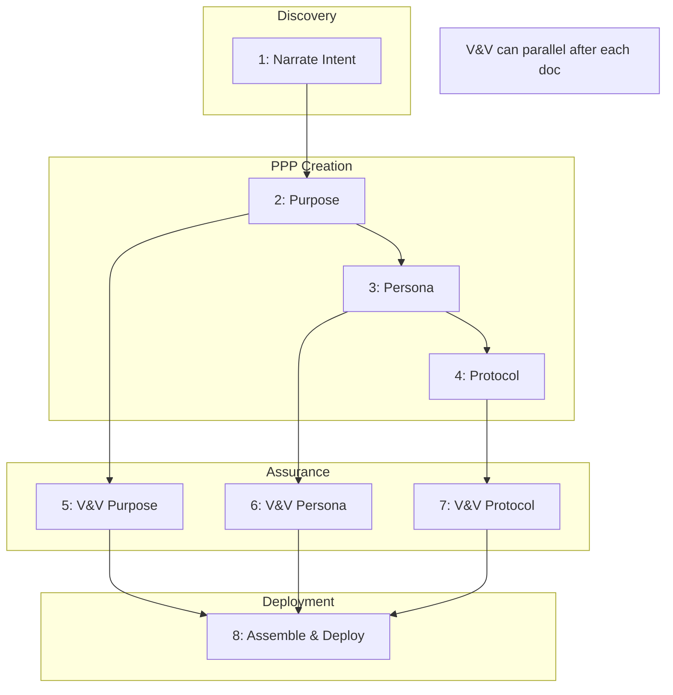

# Runbook for LLM Specialization

**This runbook guides practitioners through creating specialized LLM system prompts using the PPP (Purpose-Persona-Protocol) framework. Specialization enables creating multiple role-specific AI configurations, each with defined expertise, objectives, and operational workflows.**

## Context

### Why: Problem Statement

Generic LLM assistants lack domain-specific expertise, clear operational boundaries, and systematic workflows. When you need an AI assistant tailored to a specific role—whether for personal productivity, team collaboration, or specialized domain work—you need a structured approach to define what the assistant does (Purpose), who it is (Persona), and how it operates (Protocol).

**Use Cases for Specialization:**

- **Personalization:** Customizing an assistant for individual work styles and preferences
- **Role Definition:** Creating distinct assistant roles (e.g., code reviewer, documentation writer, test engineer)
- **Domain Expertise:** Embedding specific domain knowledge and methodologies
- **Tool Integration:** Provisioning specific scripts, commands, and automation
- **Team Standards:** Encoding organizational practices and quality requirements

### What: Scope and Artifacts

This workflow produces a complete, assured LLM configuration ready for deployment.

| Artifact | Type | Description |
|----------|------|-------------|
| purpose-\<name\>.md | vertex/purpose | Defines value delivered and success criteria |
| persona-\<name\>.md | vertex/persona | Defines identity, expertise, and communication style |
| protocol-\<name\>.md | vertex/protocol | Defines workflow, phases, tools, and quality checks |
| system-prompt-\<name\>.md | vertex/system_prompt | Assembled PPP configuration |
| dependency edges (3) | edge/dependency | Purpose→Persona, Persona→Protocol, Protocol→System Prompt |
| verification edges (4) | edge/verification | Structural compliance for each document |
| validation edges (4) | edge/validation | Quality assessment for each document |
| assurance faces (4) | face/assurance | Attestation that documents are verified and validated |
| .claude/CLAUDE.md | deployed config | Operational system prompt (stripped of metadata) |

### Who: Roles and Skills

| Role | Responsibilities | Required Skills |
|------|------------------|-----------------|
| Prompt Engineer | Design PPP components, assemble system prompt | PPP framework, prompt design, domain understanding |
| Knowledge Engineer | Verify structure, validate quality, create assurance | Verification scripts, quality assessment |
| Domain Expert | Provide expertise requirements, validate fitness | Domain knowledge, use case understanding |

## Prerequisites

### Required Knowledge

- Understanding of the PPP framework (Purpose → Persona → Protocol design order)
- Familiarity with YAML frontmatter and markdown structure
- Knowledge of verification (structural) vs validation (quality) distinction
- Understanding of tool provisioning in Protocol documents

### Required Tools

- `verify_template_based.py`: Verifies document structure against templates
- `compile_document.py`: Compiles Obsidian embeds into standalone documents
- `build_cache.py`: Rebuilds complex.json with new elements

### Required Access

- Write access to `00_vertices/`, `01_edges/`, `02_faces/`
- Write access to `.claude/CLAUDE.md`
- Ability to run Python verification scripts

### Entry Criteria

- [ ] Verification tools work: `python scripts/verify_template_based.py 00_vertices/spec-for-purpose.md --templates templates`
- [ ] Clear understanding of the specialization use case
- [ ] Domain/role requirements documented or understood
- [ ] Available tools and scripts identified for provisioning

## Workflow Overview

### Dependency Diagram



### Parallelization Opportunities

| Parallel Group | Steps | Condition |
|----------------|-------|-----------|
| V&V Execution | Steps 5, 6, 7 | Each can run after its corresponding document is complete |

### Workflow Summary

| Step | Activity | Inputs | Output | Depends On |
|------|----------|--------|--------|------------|
| 1 | Narrate workspace intent | Use case understanding | Intent narrative | - |
| 2 | Create Purpose document | Intent narrative, spec-for-purpose | purpose-\<name\>.md | Step 1 |
| 3 | Create Persona document | Purpose, spec-for-persona | persona-\<name\>.md | Step 2 |
| 4 | Create Protocol document | Purpose, Persona, spec-for-protocol | protocol-\<name\>.md | Step 3 |
| 5 | Verify & Validate Purpose | Purpose doc, spec, guidance | V-edge, Val-edge, Face | Step 2 |
| 6 | Verify & Validate Persona | Persona doc, spec, guidance | V-edge, Val-edge, Face | Step 3 |
| 7 | Verify & Validate Protocol | Protocol doc, spec, guidance | V-edge, Val-edge, Face | Step 4 |
| 8 | Assemble & Deploy | All PPP docs, assurance | system-prompt, CLAUDE.md | Steps 5, 6, 7 |

## Step 1: Narrate Workspace Intent

**Goal:** Articulate the specialization requirements before writing formal documents.

**Inputs:**
- Understanding of the target use case
- Domain requirements
- Available tools and scripts

**Activities:**

1. Answer the discovery questions (in notes, scratchpad, or conversation):

   **What is this specialization for?**
   - What kind of work will this assistant support?
   - What artifacts will be created?
   - What domain expertise is needed?

   **What help is needed?**
   - What tasks require assistance?
   - What decisions should the assistant make vs. defer?
   - What expertise should be embedded?

   **What does success look like?**
   - How will effectiveness be measured?
   - What quality standards apply?
   - What would failure look like?

   **What are the boundaries?**
   - What should the assistant never do?
   - What requires explicit approval?
   - What authority levels are appropriate?

   **What tools are available?**
   - What scripts and CLI tools exist?
   - What build, test, or verification tools are used?
   - What automation should be provisioned?

2. Document answers in a narrative form
3. Identify the specialization name (kebab-case)

**Tools and References:**

- [[guidance-for-purpose]] - for understanding value articulation
- [[guidance-for-persona]] - for understanding expertise definition
- [[guidance-for-protocol]] - for understanding workflow design

**Outputs:**
- Intent narrative document or notes
- Specialization name chosen

**Checkpoint:** Can articulate in 2-3 sentences what this assistant does, who it is, and how it works.

## Step 2: Create Purpose Document

**Goal:** Define what value the specialized assistant delivers. **Purpose is designed FIRST.**

**Inputs:**
- Intent narrative from Step 1
- [[spec-for-purpose]] for structure requirements
- [[guidance-for-purpose]] for quality criteria

**Activities:**

1. Create `00_vertices/purpose-<name>.md`
2. Add required frontmatter:
   ```yaml
   type: vertex/purpose
   extends: doc
   id: v:purpose:<name>
   name: Purpose - <Name>
   tags: [vertex, doc, purpose]
   version: 1.0.0
   created: <ISO-8601>
   modified: <ISO-8601>
   dependencies: []
   ```
3. Add required body sections:
   - `## Purpose` - meta statement about the document
   - `## Problem Statement` - what need this addresses
   - `## Core Objectives` - what value is delivered (action verbs)
   - `## Specific Deliverables` - concrete outputs
   - `## Constraints and Boundaries` - operational limits
   - `## Success Criteria` - how to measure effectiveness
4. Verify immediately:
   ```bash
   python scripts/verify_template_based.py 00_vertices/purpose-<name>.md --templates templates
   ```

**Tools and References:**

- [[spec-for-purpose]] - structural requirements
- [[guidance-for-purpose]] - quality criteria
- `templates/00_vertices/purpose-template.md` - template

**Outputs:**
- `purpose-<name>.md` passing verification

**Consistency Checks:**
- [ ] Problem statement aligns with intent narrative
- [ ] Objectives are actionable (use active verbs)
- [ ] Deliverables are concrete and measurable
- [ ] Success criteria are objectively assessable

**Checkpoint:** `python scripts/verify_template_based.py 00_vertices/purpose-<name>.md --templates templates` returns PASS.

## Step 3: Create Persona Document

**Goal:** Define who the specialized assistant is. **Persona is designed SECOND** to match expertise to Purpose objectives.

**Inputs:**
- Purpose document from Step 2
- [[spec-for-persona]] for structure requirements
- [[guidance-for-persona]] for quality criteria

**Activities:**

1. Create `00_vertices/persona-<name>.md`
2. Add required frontmatter:
   ```yaml
   type: vertex/persona
   extends: doc
   id: v:persona:<name>
   name: Persona - <Name>
   tags: [vertex, doc, persona]
   version: 1.0.0
   created: <ISO-8601>
   modified: <ISO-8601>
   dependencies: []
   ```
3. Add required body sections:
   - `## Purpose` - meta statement
   - `## Role and Identity` - who this assistant is
   - `## Domain Expertise` - what knowledge areas
   - `## Approach and Methodology` - how it works
   - `## Communication Tone` - how it communicates
   - `## Boundaries and Limitations` - what it won't do
4. Verify immediately:
   ```bash
   python scripts/verify_template_based.py 00_vertices/persona-<name>.md --templates templates
   ```

**Tools and References:**

- [[spec-for-persona]] - structural requirements
- [[guidance-for-persona]] - quality criteria
- `templates/00_vertices/persona-template.md` - template

**Outputs:**
- `persona-<name>.md` passing verification

**Consistency Checks:**
- [ ] Expertise enables Purpose objectives
- [ ] Boundaries align with Purpose constraints
- [ ] Tone fits the work context
- [ ] Role supports Purpose deliverables

**Checkpoint:** `python scripts/verify_template_based.py 00_vertices/persona-<name>.md --templates templates` returns PASS.

## Step 4: Create Protocol Document

**Goal:** Define how the specialized assistant operates. **Protocol is designed LAST** to integrate Persona's expertise with Purpose's objectives. **This step provisions tool capabilities.**

**Inputs:**
- Purpose document from Step 2
- Persona document from Step 3
- [[spec-for-protocol]] for structure requirements
- [[guidance-for-protocol]] for quality criteria
- Available tools and scripts inventory

**Activities:**

1. Create `00_vertices/protocol-<name>.md`
2. Add required frontmatter:
   ```yaml
   type: vertex/protocol
   extends: doc
   id: v:protocol:<name>
   name: Protocol - <Name>
   tags: [vertex, doc, protocol]
   version: 1.0.0
   created: <ISO-8601>
   modified: <ISO-8601>
   dependencies: []
   ```
3. Add required body sections:
   - `## Purpose` - meta statement
   - `## Workflow Overview` - high-level process description
   - `## Phase Definitions` - detailed phase structure with steps
   - `## User Collaboration Points` - when to engage user
   - `## Quality Assurance` - verification checks
   - `## Tools and Scripts` - **CRITICAL: tool provisioning**
   - `## Consistent Principles` - cross-cutting behaviors

4. **Tool Provisioning** (critical step):
   For each tool the assistant should use, document:
   ```markdown
   ### [Category] Tools

   - **[Tool name]** (`command/path/syntax`)
     - **When:** [Which phase, what trigger]
     - **What:** [Purpose and expected behavior]
     - **Success:** [What good output looks like]
     - **Failure:** [Error patterns, recovery steps]
     - **Example:** `full command with parameters`
   ```

5. Verify immediately:
   ```bash
   python scripts/verify_template_based.py 00_vertices/protocol-<name>.md --templates templates
   ```

**Tools and References:**

- [[spec-for-protocol]] - structural requirements
- [[guidance-for-protocol]] - quality criteria
- `templates/00_vertices/protocol-template.md` - template

**Outputs:**
- `protocol-<name>.md` passing verification

**Consistency Checks:**
- [ ] Phases achieve Purpose deliverables
- [ ] Steps use Persona's expertise
- [ ] Tools are referenced in phase steps
- [ ] All referenced tools are documented in Tools section
- [ ] Quality checks align with Purpose success criteria

**Checkpoint:** `python scripts/verify_template_based.py 00_vertices/protocol-<name>.md --templates templates` returns PASS.

## Step 5: Verify and Validate Purpose

**Goal:** Create verification edge, validation edge, and assurance face for Purpose.

**Inputs:**
- `purpose-<name>.md` from Step 2
- [[spec-for-purpose]] for verification
- [[guidance-for-purpose]] for validation

**Activities:**

1. **Verify** (structural compliance):
   ```bash
   python scripts/verify_template_based.py 00_vertices/purpose-<name>.md --templates templates
   ```
   Record result in verification edge.

2. **Validate** (quality assessment):
   Review against guidance-for-purpose criteria:
   - Problem statement clarity
   - Objective actionability
   - Deliverable concreteness
   - Constraint specificity
   - Success criteria measurability

3. Create verification edge `01_edges/verification-<name>-purpose:spec.md`
4. Create validation edge `01_edges/validation-<name>-purpose:guidance.md`
5. Create assurance face `02_faces/assurance-<name>-purpose.md`

**Tools and References:**

- `templates/01_edges/verification-template.md`
- `templates/01_edges/validation-template.md`
- `templates/02_faces/assurance-template.md`

**Outputs:**
- Verification edge (PASS/FAIL)
- Validation edge (quality ratings)
- Assurance face (attestation)

**Checkpoint:** Verification PASS, validation Good or Excellent on all criteria.

## Step 6: Verify and Validate Persona

**Goal:** Create verification edge, validation edge, and assurance face for Persona.

**Inputs:**
- `persona-<name>.md` from Step 3
- [[spec-for-persona]] for verification
- [[guidance-for-persona]] for validation

**Activities:**

1. **Verify** (structural compliance):
   ```bash
   python scripts/verify_template_based.py 00_vertices/persona-<name>.md --templates templates
   ```

2. **Validate** (quality assessment):
   Review against guidance-for-persona criteria:
   - Role clarity
   - Expertise relevance
   - Approach coherence
   - Tone appropriateness
   - Boundary specificity

3. Create verification edge `01_edges/verification-<name>-persona:spec.md`
4. Create validation edge `01_edges/validation-<name>-persona:guidance.md`
5. Create assurance face `02_faces/assurance-<name>-persona.md`

**Tools and References:**

- `templates/01_edges/verification-template.md`
- `templates/01_edges/validation-template.md`
- `templates/02_faces/assurance-template.md`

**Outputs:**
- Verification edge (PASS/FAIL)
- Validation edge (quality ratings)
- Assurance face (attestation)

**Consistency Checks:**
- [ ] Persona expertise enables Purpose objectives
- [ ] Persona boundaries align with Purpose constraints

**Checkpoint:** Verification PASS, validation Good or Excellent on all criteria.

## Step 7: Verify and Validate Protocol

**Goal:** Create verification edge, validation edge, and assurance face for Protocol.

**Inputs:**
- `protocol-<name>.md` from Step 4
- [[spec-for-protocol]] for verification
- [[guidance-for-protocol]] for validation

**Activities:**

1. **Verify** (structural compliance):
   ```bash
   python scripts/verify_template_based.py 00_vertices/protocol-<name>.md --templates templates
   ```

2. **Validate** (quality assessment):
   Review against guidance-for-protocol criteria:
   - Workflow completeness
   - Phase clarity
   - Tool documentation quality
   - Collaboration point appropriateness
   - Quality check adequacy

3. Create verification edge `01_edges/verification-<name>-protocol:spec.md`
4. Create validation edge `01_edges/validation-<name>-protocol:guidance.md`
5. Create assurance face `02_faces/assurance-<name>-protocol.md`

**Tools and References:**

- `templates/01_edges/verification-template.md`
- `templates/01_edges/validation-template.md`
- `templates/02_faces/assurance-template.md`

**Outputs:**
- Verification edge (PASS/FAIL)
- Validation edge (quality ratings)
- Assurance face (attestation)

**Consistency Checks:**
- [ ] Protocol phases achieve Purpose deliverables
- [ ] Protocol steps use Persona expertise
- [ ] All tools referenced in phases are documented

**Checkpoint:** Verification PASS, validation Good or Excellent on all criteria.

## Step 8: Assemble and Deploy

**Goal:** Combine PPP components into system prompt and deploy to .claude/CLAUDE.md.

**Inputs:**
- Verified and validated Purpose, Persona, Protocol documents
- Assurance faces confirming quality

**Activities:**

1. Create `00_vertices/system-prompt-<name>.md` with full frontmatter:
   ```yaml
   type: vertex/system_prompt
   extends: doc
   id: v:system_prompt:<name>
   name: System Prompt - <Name>
   tags: [vertex, doc, system_prompt]
   version: 1.0.0
   created: <ISO-8601>
   modified: <ISO-8601>
   dependencies:
     - v:purpose:<name>
     - v:persona:<name>
     - v:protocol:<name>
   ```

2. Include PPP content in body:
   - `## Purpose` meta statement
   - `## Persona` section with full content
   - `## Purpose` section with full content (yes, both meta and operational)
   - `## Protocol` section with full content including Tools

3. Verify system prompt:
   ```bash
   python scripts/verify_template_based.py 00_vertices/system-prompt-<name>.md --templates templates
   ```

4. Create verification, validation edges and assurance face for system prompt

5. **Compile for deployment** (strip authoring metadata):

   **Remove from deployed version:**
   - YAML frontmatter
   - Meta-level "Purpose" statements (document self-description)
   - `**Note:**` blocks and framework references
   - Obsidian links `[[...]]`

   **Keep in deployed version:**
   - All operational content (role, expertise, workflow, tools, etc.)

6. Deploy to `.claude/CLAUDE.md`:
   ```bash
   # Option A: Manual compilation
   # Copy, strip frontmatter and meta-statements, save

   # Option B: If using Obsidian embeds
   python scripts/compile_document.py 00_vertices/system-prompt-<name>.md .claude/CLAUDE.md
   # Then manually strip frontmatter
   ```

7. Test deployment by opening new Claude Code session

**Tools and References:**

- [[spec-for-system-prompt]] - structural requirements
- [[guidance-for-system-prompt]] - quality criteria
- `scripts/compile_document.py` - for embed expansion

**Outputs:**
- `system-prompt-<name>.md` (source with metadata)
- `.claude/CLAUDE.md` (deployed, operational only)
- Verification, validation edges and assurance face

**Consistency Checks:**
- [ ] Deployed prompt contains all operational content
- [ ] Deployed prompt has no authoring metadata
- [ ] Tools section is complete and accurate
- [ ] New session reflects configured behavior

**Checkpoint:** New Claude Code session behaves according to PPP configuration.

## Decision Points

### Decision: Assurance Depth

**When:** Steps 5-7, creating assurance artifacts

**Options:**

| Option | When to Choose | Implications |
|--------|----------------|--------------|
| Full assurance | Production configuration, team use | Complete traceability, more effort |
| Verification only | Rapid prototyping, personal use | Structural compliance, skip quality attestation |
| Minimal | Quick iteration | Skip formal artifacts, iterate faster |

**Default:** Full assurance for configurations that will be shared or used long-term.

### Decision: Tool Provisioning Scope

**When:** Step 4, creating Protocol

**Options:**

| Option | When to Choose | Implications |
|--------|----------------|--------------|
| Comprehensive | All available tools needed | Full capability, more documentation |
| Selective | Only specific tools needed | Focused capability, faster to document |
| Minimal | Few tools, human-driven workflow | Limited automation, more user control |

**Default:** Selective - document tools that will actually be used regularly.

### Decision: Multiple Specializations

**When:** Need more than one assistant role

**Options:**

| Option | When to Choose | Implications |
|--------|----------------|--------------|
| Single system prompt | One role sufficient | Simpler management |
| Multiple prompts, swap manually | Distinct roles, occasional switching | Multiple PPP sets, manual deployment |
| Modular composition | Shared components, role variations | More complex, reusable components |

**Default:** Start with single; add more as distinct needs emerge.

## Completion Criteria

### Exit Checklist

- [ ] Purpose document exists, verified, validated, assured
- [ ] Persona document exists, verified, validated, assured
- [ ] Protocol document exists, verified, validated, assured (with tool provisioning)
- [ ] System prompt assembled, verified, validated, assured
- [ ] `.claude/CLAUDE.md` deployed with operational content only
- [ ] New Claude Code session reflects configured behavior
- [ ] Cache rebuilt with new elements

### Success Indicators

- Assistant behaves according to defined Persona
- Assistant delivers value defined in Purpose
- Assistant follows workflow defined in Protocol
- Assistant correctly uses provisioned tools
- Quality standards are maintained

### Common Completion Issues

| Issue | Resolution |
|-------|------------|
| Assistant doesn't use tools | Verify Tools section in Protocol; ensure tools are referenced in phase steps |
| Behavior doesn't match Persona | Check deployed .claude/CLAUDE.md contains full Persona content |
| Missing workflow phases | Verify Protocol phases cover Purpose deliverables |
| Inconsistent boundaries | Align Purpose constraints, Persona boundaries, Protocol limits |

## Troubleshooting

| Problem | Likely Cause | Solution |
|---------|--------------|----------|
| Verification fails on Purpose | Missing required sections | Check spec-for-purpose; ensure all sections present |
| Verification fails on Protocol | Missing Tools section or phases | Ensure Phase Definitions and Tools and Scripts present |
| Deployed prompt has frontmatter | Incomplete stripping | Remove all YAML frontmatter from .claude/CLAUDE.md |
| Tools not available to assistant | Not in Tools section or not referenced in phases | Add to Protocol Tools section; reference in phase steps |
| Assistant ignores boundaries | Boundaries too vague | Make Persona boundaries specific and actionable |
| Workflow feels incomplete | Phases don't cover objectives | Map each Purpose objective to Protocol phases |
| Quality checks not happening | Missing Quality Assurance section | Add explicit verification steps to Protocol |

## Maintenance

### When to Revisit

| Trigger | Affected Artifacts | Action Required |
|---------|-------------------|-----------------|
| New tools available | Protocol | Add to Tools section, reference in phases |
| Role requirements change | Persona, potentially Purpose | Update documents, re-verify, re-validate |
| Quality issues observed | Protocol (Quality Assurance) | Strengthen verification steps |
| New use cases emerge | Purpose (Objectives) | Expand objectives, cascade to Persona/Protocol |
| Team feedback | All PPP | Iterate based on actual usage |

### Change Propagation

| If Changed | Then Review | Propagation Steps |
|------------|-------------|-------------------|
| Purpose objectives | Persona expertise, Protocol phases | Ensure expertise enables objectives; phases achieve deliverables |
| Persona expertise | Protocol steps | Ensure steps use expertise appropriately |
| Protocol tools | Protocol phases | Ensure tools are referenced where used |
| Any PPP component | System prompt | Reassemble and redeploy |

### Regression Testing

After changes:

1. Re-verify changed document:
   ```bash
   python scripts/verify_template_based.py 00_vertices/<changed>.md --templates templates
   ```
2. Re-validate against guidance
3. Update verification/validation edges
4. Reassemble system prompt if needed
5. Redeploy to `.claude/CLAUDE.md`
6. Test new session for correct behavior

### Re-Assurance Protocol

| Change Type | Re-Assurance Required | Process |
|-------------|----------------------|---------|
| Minor (typos) | No | Update timestamps only |
| Moderate (content refinement) | Verification only | Re-verify, update edges |
| Major (structural changes) | Full re-assurance | Re-verify, re-validate, new assurance faces |

### Currency Tracking

| Artifact | Current Version | Last Verified | Owner |
|----------|-----------------|---------------|-------|
| purpose-\<name\>.md | 1.0.0 | \<date\> | \<author\> |
| persona-\<name\>.md | 1.0.0 | \<date\> | \<author\> |
| protocol-\<name\>.md | 1.0.0 | \<date\> | \<author\> |
| system-prompt-\<name\>.md | 1.0.0 | \<date\> | \<author\> |
| .claude/CLAUDE.md | 1.0.0 | \<date\> | \<author\> |

## Quick Reference

### PPP Design Order

1. **Purpose FIRST** - What value is delivered?
2. **Persona SECOND** - What expertise enables that value?
3. **Protocol LAST** - What workflow integrates them? What tools are available?

### Tool Provisioning Template

```markdown
- **[Tool name]** (`command`)
  - **When:** [Phase, trigger]
  - **What:** [Purpose]
  - **Success:** [Expected output]
  - **Failure:** [Error handling]
  - **Example:** `full command`
```

### Verification Commands

| Step | Command |
|------|---------|
| Verify Purpose | `python scripts/verify_template_based.py 00_vertices/purpose-<name>.md --templates templates` |
| Verify Persona | `python scripts/verify_template_based.py 00_vertices/persona-<name>.md --templates templates` |
| Verify Protocol | `python scripts/verify_template_based.py 00_vertices/protocol-<name>.md --templates templates` |
| Verify System Prompt | `python scripts/verify_template_based.py 00_vertices/system-prompt-<name>.md --templates templates` |
| Rebuild Cache | `python scripts/build_cache.py` |

## Related Workflows

- [[runbook-document-type-creation]] - For creating new spec/guidance pairs for custom document types
- [[runbook-assurance-audit-chart]] - For creating complete assurance audits of PPP configurations
- [[runbook-program-development]] - Example of a complex documentation workflow

---

**Note:** This runbook formalizes the PERSONALIZATION-GUIDE.md into a structured workflow. Specialization enables creating multiple role-specific LLM configurations, each with verified structure and validated quality. The PPP framework ensures that Purpose drives Persona selection and Protocol design, with tool provisioning as a critical component of operational capability.
