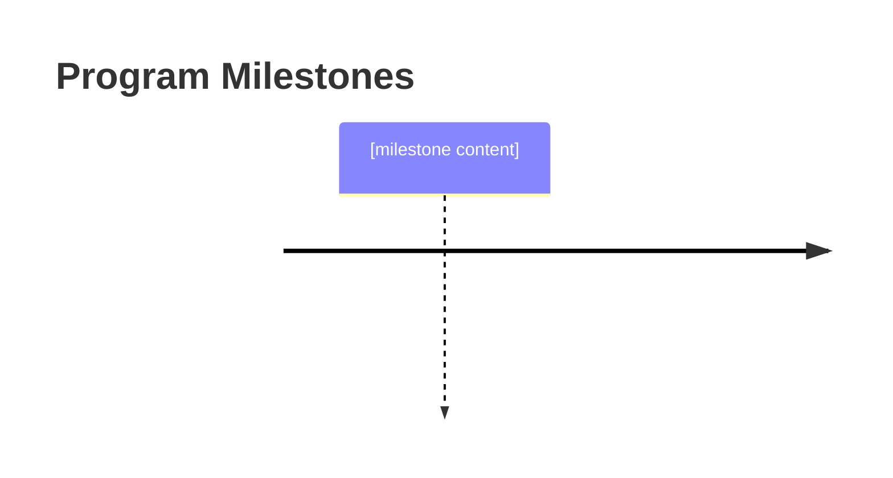

# Specification for Program Memo Documents

**This specification defines the structure and requirements for program memo documents that serve as executive primers for documentation packages consisting of an architecture, lifecycle, and program plan.**

## Purpose

Program memo documents answer the question: "What do I need to know?" They distill and synthesize key facts from the three detailed documents (architecture, lifecycle, program plan) into a single executive-friendly summary. The memo provides sufficient context for most stakeholders to understand the program without reading the full documentation package, while directing them to specific sections of the source documents when they need details.

This document type is designed to:
- Serve as the entry point to a documentation package
- Enable executives and stakeholders to quickly grasp program essentials
- Provide clear navigation to detailed information when needed
- Maintain traceability to authoritative source documents

## Required Frontmatter Fields

All program memo documents MUST include the following YAML frontmatter:

### Core Identification

| Field | Type | Requirement | Description |
|-------|------|-------------|-------------|
| `type` | string | REQUIRED | Must be `vertex/doc` |
| `extends` | string | REQUIRED | Must be `doc` |
| `id` | string | REQUIRED | Unique identifier (format: `v:doc:program-memo-<name>`) |
| `name` | string | REQUIRED | Human-readable program memo name |
| `tags` | array[string] | REQUIRED | Must include `[vertex, doc, program-memo]` |
| `version` | string | REQUIRED | Semantic version (e.g., `1.0.0`) |

### Timestamps

| Field | Type | Requirement | Description |
|-------|------|-------------|-------------|
| `created` | datetime | REQUIRED | ISO 8601 creation timestamp |
| `modified` | datetime | REQUIRED | ISO 8601 last modification timestamp |

### Program Memo-Specific Metadata

| Field | Type | Requirement | Description |
|-------|------|-------------|-------------|
| `program_name` | string | REQUIRED | Name of the program being summarized |
| `field_survey_ref` | string | REQUIRED | Reference to field survey document (id or path) |
| `architecture_ref` | string | REQUIRED | Reference to architecture document (id or path) |
| `lifecycle_ref` | string | REQUIRED | Reference to lifecycle document (id or path) |
| `program_plan_ref` | string | REQUIRED | Reference to program plan document (id or path) |
| `sponsor` | string | REQUIRED | Organization or entity providing funding |
| `recipient` | string | REQUIRED | Organization or stakeholder class receiving deliverables |
| `target_audience` | array[string] | REQUIRED | Intended readers (e.g., `[executives, board, funders, partners]`) |

### Optional Metadata

| Field | Type | Requirement | Description |
|-------|------|-------------|-------------|
| `description` | string | RECOMMENDED | Brief description of memo purpose |
| `classification` | string | OPTIONAL | Document classification (e.g., `internal`, `confidential`, `public`) |
| `distribution` | array[string] | OPTIONAL | Authorized distribution list |

## Required Body Sections

The markdown body of a program memo document MUST contain:

### 1. Program Overview

A brief, accessible introduction to the program suitable for any stakeholder.

**Format:**
```markdown
## Program Overview

[2-3 paragraphs covering:
- What problem is being solved and for whom
- What capability will be delivered
- Why this program matters (strategic importance)]

| Attribute | Value |
|-----------|-------|
| **Sponsor** | [sponsoring organization] |
| **Recipient** | [receiving organization/stakeholder] |
| **Target Completion** | [date] |
| **Budget Range** | [budget envelope] |
```

**Requirements:**
- MUST be understandable by non-technical readers
- MUST identify sponsor and recipient
- MUST state target completion and budget range
- MUST NOT require reading other documents to understand
- MUST include reference to field survey document for context
- Content MUST be drawn from field survey (context), architecture (problem statement), and program plan (sponsor, timeline, budget)

### 2. What We're Building

A distilled summary of the architecture document's key elements.

**Format:**
```markdown
## What We're Building

### Goal State

[1-2 paragraphs describing the target capability from architecture's conceptual layer]

### Key Components

[Bulleted list of 3-5 major components from architecture's logical layer]

### Success Criteria

[Bulleted list of 3-5 acceptance criteria from architecture's conceptual layer]

> **Details:** See [[architecture-document]] for complete architecture documentation.
```

**Requirements:**
- MUST summarize goal state from architecture's conceptual layer
- MUST list key components from architecture's logical layer (without implementation details)
- MUST include success criteria from architecture's acceptance criteria
- MUST include reference to full architecture document
- MUST NOT include physical layer implementation details (those belong in the architecture)

### 3. How We're Building It

A distilled summary of the V-model lifecycle document's key phases.

**Format:**
```markdown
## How We're Building It

### Development Approach

[1-2 paragraphs describing the V-model approach from lifecycle document, noting design-evaluation symmetry]

### Key Phases

| Phase Group | Purpose | Duration |
|-------------|---------|----------|
| Design | [requirements through physical design] | [duration] |
| Implementation | [build working system] | [duration] |
| Evaluation | [test from unit through acceptance] | [duration] |
| Operations | [deploy, monitor, maintain] | [duration] |

### Quality Assurance

[1-2 sentences distinguishing verification (automated, per-phase gates) from validation (human approval, acceptance)]

> **Details:** See [[lifecycle-document]] for complete lifecycle documentation.
```

**Requirements:**
- MUST summarize V-model development approach from lifecycle document
- MUST list key phase groups with purpose and approximate duration
- MUST distinguish verification (automated gates) from validation (human approval)
- MUST include reference to full lifecycle document
- MUST NOT duplicate detailed process steps (those belong in the lifecycle)
- SHOULD use phase groups (Design, Implementation, Evaluation, Operations) for executive brevity

### 4. Execution Summary

A distilled summary of the program plan's key execution elements.

**Format:**
```markdown
## Execution Summary

### Timeline

[Visual or tabular representation of major milestones]



### Team and Resources

| Resource | Allocation |
|----------|------------|
| [resource type] | [allocation] |

### Top Risks

| Risk | Impact | Mitigation |
|------|--------|------------|
| [Risk 1] | [H/M/L] | [brief mitigation] |
| [Risk 2] | [H/M/L] | [brief mitigation] |
| [Risk 3] | [H/M/L] | [brief mitigation] |

> **Details:** See [[program-plan-document]] for complete program plan.
```

**Requirements:**
- MUST include visual timeline with major milestones (≤7 milestones)
- MUST summarize resource allocation (not full breakdown)
- MUST list top 3-5 risks with impact and mitigation summary
- MUST include reference to full program plan document
- MUST NOT duplicate detailed schedules, RACI matrices, or risk registers

### 5. Document Package

A navigation guide to the full documentation package.

**Format:**
```markdown
## Document Package

This memo summarizes the following documentation package:

| Document | Purpose | When to Consult |
|----------|---------|-----------------|
| [[field-survey-ref]] | Establishes context | Stakeholder details, resource inventory, scope boundaries |
| [[architecture-ref]] | Defines what we're building | Technical details, component design, interfaces |
| [[lifecycle-ref]] | Defines how we build it | Process details, phase gates, verification procedures |
| [[program-plan-ref]] | Defines execution plan | Schedules, budgets, team assignments, full risk register |
| This Memo | Executive summary | Quick orientation, stakeholder briefings |

### Document Currency

| Document | Version | Last Updated |
|----------|---------|--------------|
| Field Survey | [version] | [date] |
| Architecture | [version] | [date] |
| Lifecycle | [version] | [date] |
| Program Plan | [version] | [date] |
| This Memo | [version] | [date] |
```

**Requirements:**

- MUST list all four source documents with links (field survey, architecture, lifecycle, program plan)
- MUST describe when to consult each document
- MUST include version and last-updated information for all documents
- MUST enable readers to navigate to detailed information

### 6. Approval and Accountability

Documents who prepared and approved the memo.

**Format:**
```markdown
## Approval and Accountability

| Role | Name | Date |
|------|------|------|
| Prepared By | [name] | [date] |
| Reviewed By | [name] | [date] |
| Approved By | [name] | [date] |

### Accountability Statement

[Statement of accountability for memo accuracy and currency]
```

**Requirements:**
- MUST identify preparer, reviewer, and approver
- MUST include accountability statement
- SHOULD identify responsibility for keeping memo current

## Optional Body Sections

### Key Decisions

Summary of major decisions made during planning.

**Format:**
```markdown
## Key Decisions

| Decision | Rationale | Impact |
|----------|-----------|--------|
| [decision] | [why] | [effect] |
```

### Open Questions

Items requiring future resolution.

**Format:**
```markdown
## Open Questions

| Question | Owner | Target Date |
|----------|-------|-------------|
| [question] | [owner] | [date] |
```

### Stakeholder Summary

Quick reference for different stakeholder groups.

**Format:**
```markdown
## Stakeholder Summary

### For Executives
[1-2 sentences on what executives need to know]

### For Technical Teams
[1-2 sentences on what technical teams need to know]

### For Partners/Vendors
[1-2 sentences on what external parties need to know]
```

## Type Constraints

1. **Type Field:** MUST be exactly `vertex/doc`
2. **Extends Field:** MUST be exactly `doc`
3. **ID Format:** MUST match pattern `v:doc:program-memo-[kebab-case-name]`
4. **Tag Requirement:** Tags MUST include `program-memo`

## Content Requirements

1. **Synthesis, Not Duplication:** Content MUST be distilled from source documents, not duplicated
2. **Traceability:** Every major claim MUST be traceable to a source document
3. **Navigation:** MUST provide clear paths to detailed information
4. **Currency:** MUST reflect current versions of all source documents
5. **Accessibility:** MUST be readable by non-technical stakeholders
6. **Brevity:** Total length SHOULD be 3-5 pages when rendered
7. **Self-Contained Understanding:** Reader MUST be able to understand the program without consulting other documents

## Source Document Requirements

A program memo MUST NOT be created until all four source documents exist:

- Field survey document (verified and validated)
- Architecture document (verified and validated)
- Lifecycle document (verified and validated)
- Program plan document (verified and validated)

The memo draws content from these sources as follows:

| Memo Section | Primary Source | Content Drawn |
|--------------|----------------|---------------|
| Program Overview | Field Survey, Program Plan, Architecture | Context, problem statement, sponsor, recipient, timeline, budget |
| What We're Building | Architecture | Conceptual layer, logical layer (summary), acceptance criteria |
| How We're Building It | Lifecycle | V-model phase groups, verification/validation distinction |
| Execution Summary | Program Plan | Milestones, resources, top risks |

## Coupling Requirement

Every program memo document SHOULD be:
1. Verified against this spec for structural compliance
2. Validated against `guidance-for-program-memo` for quality
3. Kept in sync with its source documents (architecture, lifecycle, program plan)

## Verification vs. Validation

- **Verification** (against this spec): Deterministic checking that all required sections, fields, and references are present
- **Validation** (against guidance-for-program-memo): Qualitative assessment that the memo effectively synthesizes source documents and serves its target audience

## Schema Summary

```yaml
# Required frontmatter
type: vertex/doc
extends: doc
id: v:doc:program-memo-<name>
name: <string>
tags: [vertex, doc, program-memo]
version: <semver>
created: <ISO8601>
modified: <ISO8601>
program_name: <string>
field_survey_ref: <string>
architecture_ref: <string>
lifecycle_ref: <string>
program_plan_ref: <string>
sponsor: <string>
recipient: <string>
target_audience: [<strings>]

# Optional frontmatter
description: <string>
classification: <string>
distribution: [<strings>]

# Required body sections
## Program Overview
  - Problem and capability summary
  - Key attributes table (sponsor, recipient, timeline, budget)
  > Reference to field survey
## What We're Building
  ### Goal State
  ### Key Components
  ### Success Criteria
  > Reference to architecture
## How We're Building It
  ### Development Approach
  ### Key Phases (table)
  ### Quality Assurance
  > Reference to lifecycle
## Execution Summary
  ### Timeline (visual)
  ### Team and Resources
  ### Top Risks (table)
  > Reference to program plan
## Document Package
  - Document navigation table
  - Document currency table
## Approval and Accountability
  - Roles table
  - Accountability statement

# Optional body sections
## Key Decisions
## Open Questions
## Stakeholder Summary
```

## Compliance

A document claiming to be a program memo document is compliant with this specification if and only if:

1. All REQUIRED frontmatter fields are present and correctly typed
2. All three source document references (architecture, lifecycle, program plan) are valid
3. All REQUIRED body sections are present with required subsections
4. Each section includes reference to its source document
5. Document package section lists all source documents with navigation guidance
6. Approval and accountability section is complete
7. Type constraints are satisfied
8. Total length is appropriate for executive consumption (3-5 pages target)

---

**Note:** This specification establishes program memo as the executive entry point to the architecture → lifecycle → program plan documentation package. The memo synthesizes rather than duplicates, maintaining traceability while providing accessible summaries for stakeholders who need understanding without full detail.
