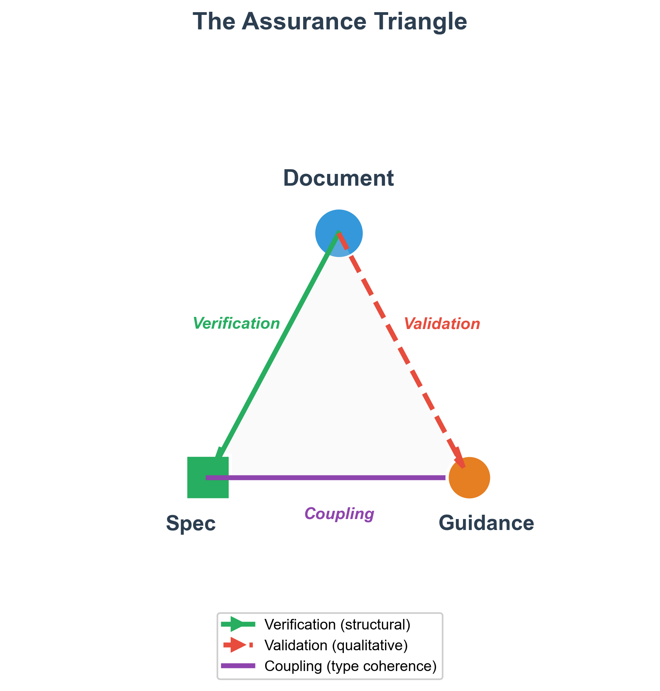

# Test-Driven Document Development: Simplicial Complexes for Verification, Validation, and Assurance with Human Accountability

## Abstract

As artificial intelligence increasingly assists systems engineering documentation, a critical question emerges: who is accountable for document quality? Current verification and validation frameworks treat structural compliance and fitness-for-purpose as separate concerns, lacking formal mechanisms to integrate them or attribute accountability for subjective quality judgments. This gap creates risk in AI-assisted workflows where generated content may satisfy structural requirements while failing to serve its intended purpose.

We present a framework using typed simplicial complexes to formalize document assurance. Documents become vertices, verification and validation relationships become edges, and complete assurance forms triangular faces (2-simplices). The framework introduces three innovations: explicit coupling edges that pair specifications with corresponding guidance documents, assurance triangles that require both verification and validation for completeness, and mandatory human accountability for all validation judgments. Large language model assistance is tracked but cannot substitute for human sign-off on fitness-for-purpose assessments.

We demonstrate the framework through self-reference: this paper is itself an instance of the framework, verified against its specification, validated against its guidance, with the assurance triangle completed by human approval. Audit tooling confirms 100% assurance coverage with valid topological invariants. This proof-by-existence shows the framework is not merely described but operational.

The contribution is a practical, mathematically grounded approach achieving harmony between AI capability and human accountability—directly addressing the IS 2026 theme of "Seeking Wa in Systems Engineering." The framework enables organizations to adopt AI assistance confidently while maintaining clear, auditable chains of human responsibility for document quality.

**Keywords:** verification, validation, assurance, simplicial complexes, accountability, AI-assisted documentation, test-driven development

---

## Introduction

When artificial intelligence assists in creating systems engineering documentation, who bears responsibility for the result? This question has moved from philosophical abstraction to practical urgency. The 2024 DORA State of DevOps Report reveals that 76% of developers now use AI tools daily, yet delivery stability has decreased by 7.2%.¹ AI assistance is accelerating, but accountability structures have not kept pace.

The systems engineering community recognizes this challenge. INCOSE's International Symposium 2026 introduces mandatory AI assistance disclosure requirements, signaling institutional awareness that AI-generated content requires new accountability mechanisms.² The symposium theme—"Beyond Digital Engineering: Seeking Wa in SE"—explicitly calls for harmony between human judgment and technological capability.³ Yet recognition of a problem differs from its solution.

Barry Boehm's classic formulation distinguishes verification ("Are we building the product right?") from validation ("Are we building the right product?").⁴ This distinction has guided systems engineering for four decades, codified in IEEE 1012⁵ and ISO/IEC/IEEE 15288.⁶ But traditional frameworks treat verification and validation as separate activities. A document may pass structural verification—correct format, required sections present, word count within limits—while failing validation because it does not serve its intended purpose. Conversely, a document may demonstrate fitness-for-purpose while violating structural requirements. Neither condition alone constitutes assured quality.

The missing element is formal coupling. Structural requirements (specifications) define what must be present; quality criteria (guidance) define what makes content effective. These naturally pair: one cannot meaningfully verify a document against a specification while validating it against unrelated guidance. Yet existing frameworks do not formalize this relationship, leaving it implicit or ignored.

A second gap concerns accountability for validation. Verification can be automated: checking word counts, section presence, and format compliance requires no judgment. Validation is inherently subjective—assessing whether content is clear, rigorous, or practically useful requires human evaluation. When AI assists in generating content, who is responsible for judging its fitness? The answer cannot be "the AI" because language models cannot bear accountability. It must be a named human who reviewed, evaluated, and approved.

This paper both operationalizes and provides documentation for a framework addressing both gaps. We model document assurance using typed simplicial complexes from algebraic topology.⁷ Documents, specifications, and guidance become vertices. Verification, validation, and coupling become edges connecting them. When a document is verified against a specification, validated against coupled guidance, and the coupling relationship is explicit, the three edges form a triangular face—a 2-simplex in topological terms. This face represents complete assurance: structural compliance plus fitness-for-purpose plus explicit coupling, with human accountability attributed for validation.

The framework makes three specific contributions:

1. **Explicit coupling edges** that formally pair specifications with their corresponding guidance documents, preventing verification-validation misalignment
2. **Assurance triangles** that require all three relationships (verification, coupling, validation) for complete assurance, making gaps visible
3. **Mandatory human accountability** for validation, enforced through schema requirements rather than process guidance

We demonstrate the framework through self-reference. This paper is not merely a description but an instance: it exists as a vertex in its own assurance complex, verified against a specification we developed, validated against corresponding guidance, with the assurance triangle completed by human approval. If you are reading this paper in the symposium proceedings, the framework succeeded—the demonstration is the proof.

The remainder of this paper proceeds as follows. Section 2 reviews related work in verification and validation, algebraic topology, test-driven development, and AI accountability. Section 3 presents the framework methodology in detail. Section 4 demonstrates results through self-application and audit. Section 5 discusses implications and limitations. Section 6 concludes with key takeaways and future directions.

---

## Background

### Verification and Validation Foundations

The distinction between verification and validation traces to Boehm's 1984 IEEE Software paper, which posed the questions that have guided quality assurance since: "Are we building the product right?" (verification) and "Are we building the right product?" (validation).⁴ IEEE Standard 1012-2016 codifies verification and validation processes for systems, software, and hardware, defining integrity levels and process requirements.⁵ ISO/IEC/IEEE 15288:2023 establishes verification and validation as distinct life cycle processes within the broader systems engineering framework.⁶

These standards treat verification and validation as complementary but separate. Verification confirms that outputs conform to specified requirements; validation confirms that outputs satisfy stakeholder needs. What the standards do not formalize is the relationship between the requirements against which we verify and the criteria against which we validate. In practice, these should correspond—we verify structure against a specification and validate quality against guidance that interprets what "good" means for documents meeting that specification. But this coupling remains implicit in current frameworks.

The INCOSE Systems Engineering Handbook elaborates verification and validation within the context of system life cycle processes.⁸ It emphasizes that validation assesses fitness for intended use, necessarily involving stakeholder judgment. This subjective element—human judgment about fitness—becomes critical when AI generates content. The handbook does not address who bears responsibility when content originates from automated systems.

### Algebraic Topology and Simplicial Complexes

Algebraic topology studies shapes through algebraic invariants, enabling rigorous analysis of structural properties.⁹ A simplicial complex is a combinatorial structure built from simplices: vertices (0-simplices), edges (1-simplices), triangles (2-simplices), and higher-dimensional analogs.¹⁰ The power of simplicial complexes lies in their ability to capture relationships at multiple levels—not just pairwise connections (edges) but higher-order relationships (faces).

Carlsson's 2009 survey established topology as a tool for data analysis, demonstrating that topological invariants reveal structural features invisible to traditional statistics.¹¹ Computational approaches developed by Edelsbrunner and Harer enable practical application of these concepts to real data.¹⁰ Ghrist's work spans both theoretical foundations and accessible exposition—from the barcodes paper introducing persistent homology¹² to the comprehensive textbook *Elementary Applied Topology*¹⁹ that makes these methods accessible to engineers.

The Euler characteristic χ = V - E + F provides a simple but powerful invariant: for a well-formed complex, this quantity reveals topological properties independent of specific representation. Reimann et al. applied directed clique complexes to brain networks, showing that Euler characteristic serves as a meaningful network invariant.¹³ We adopt this principle for document assurance: topological invariants audit structural integrity.

The application of simplicial complexes to knowledge management is less developed. Graph-based knowledge representations capture pairwise relationships but not the higher-order structure that emerges when multiple elements combine. A document verified against a specification and validated against guidance forms a natural triangle—three vertices, three edges, one face. This structure is irreducible to pairwise relationships; it represents a coherent unit of assured quality.

### Test-Driven Development

Kent Beck's formulation of test-driven development (TDD) inverts the traditional code-then-test sequence: write tests first, then write code to pass them.¹⁴ The red-green-refactor cycle—failing test, passing implementation, improved design—creates a rhythm of specification-first development. Tests become executable specifications that code must satisfy.

Extending TDD to documentation treats specifications as tests that documents must pass. A document specification defines required structure: sections, fields, formats, constraints. A document either satisfies these requirements or fails. This binary outcome mirrors unit tests: pass or fail, no ambiguity.

But TDD for documentation requires extension. Code tests verify behavior; they do not assess whether the code solves the right problem. Similarly, specification compliance verifies structure but not quality. The extension requires coupling: specifications (structural tests) paired with guidance (quality criteria). Only both together constitute complete quality assurance.

### AI Ethics and Accountability

Floridi and Cowls propose five principles for AI in society: beneficence, non-maleficence, autonomy, justice, and explicability.¹⁵ The fifth principle—explicability—comprises intelligibility (how the system works) and accountability (who is responsible for outcomes). For AI-assisted documentation, intelligibility means understanding what the AI contributed; accountability means attributing responsibility for the result.

UNESCO's 2021 Recommendation on the Ethics of Artificial Intelligence, adopted by all 194 member states, establishes global standards emphasizing transparency, human oversight, and accountability.¹⁶ The UN High-Level Advisory Body on AI reinforces these principles in its 2024 governance framework, calling for "accountability anchored in human responsibility."¹⁷

Research on large language models in systems engineering is accelerating. Ahmad et al. propose frameworks for LLM integration in SE, noting challenges including hallucination, value misalignment, and black-box effects.¹⁸ A systematic literature review on LLMs for requirements engineering found 136% growth in publications from 2023 to 2024, with no papers before 2023—indicating how rapidly this field emerged.¹⁹ The DORA 2024 report documents 7.5% improvement in AI-driven documentation quality alongside decreased delivery stability, suggesting unresolved integration challenges.¹

What existing work lacks is a practical mechanism for accountability. Principles are valuable but insufficient. We need schemas that require accountability attribution, processes that enforce human review, and auditing that detects gaps. Our framework provides these mechanisms through structural requirements: validation edges cannot exist without a named human approver.

### Positioning This Work

Existing research addresses these components separately: V&V processes, topological structures, test-driven methods, AI accountability principles. No framework formally couples verification and validation with explicit human accountability for subjective judgments. Our contribution integrates all four themes into a coherent, operational system demonstrated through self-application.

---

## Methodology

### Framework Architecture

The framework models document assurance as a typed simplicial complex. Three categories of elements compose the structure:

**Vertices (0-simplices)** are documents of three types:
- *Specifications* define structural requirements: required sections, fields, formats, constraints. They answer "what must be present?"
- *Guidance* documents define quality criteria: how to evaluate effectiveness, clarity, rigor. They answer "what makes it good?"
- *Content* documents are the artifacts being assured: papers, reports, requirements, designs.

**Edges (1-simplices)** are relationships of three types:
- *Verification edges* connect content to specifications, asserting structural compliance.
- *Validation edges* connect content to guidance, asserting fitness-for-purpose. These require a named human approver.
- *Coupling edges* connect specifications to guidance, asserting correspondence between structural and qualitative requirements.

**Faces (2-simplices)** are assurance triangles: when a content document has a verification edge to a specification, that specification has a coupling edge to guidance, and the content has a validation edge to that same guidance, the three edges bound a triangular face representing complete assurance.

### An Optimization Intuition

The framework can be understood through the lens of constrained optimization. Consider intellectual substance—research findings, design decisions, analytical insights—that must be expressed for publication. A document is the *serialized representation* of this intellectual substance, projected onto a document space defined by the specification.

The specification defines the *feasible region*: structural constraints that any valid document must satisfy (word limits, required sections, format rules). Verification checks feasibility—is this serialization structurally valid?

The guidance defines the *objective function*: quality criteria that distinguish better representations from worse ones within the feasible region (clarity, rigor, relevance). Validation evaluates the objective—how well does this serialization serve its purpose?

Writing is then a projection operation: projecting intellectual substance onto the document space characterized by the specification, with the guidance providing direction for selecting among alternative feasible representations. Different phrasings, organizations, or emphases may all satisfy the spec (all feasible), but the guidance helps choose which serialization best communicates the underlying substance.

This framing clarifies the verification-validation distinction:
- **Verification** answers: "Is this point in the feasible region?" (Binary: pass/fail)
- **Validation** answers: "How good is this feasible point?" (Qualitative: assessment with rationale)

The coupling edge ensures we optimize the right objective over the right feasible region—we cannot accidentally verify against one spec while optimizing for unrelated guidance. We are, in effect, programming in document space.

### Edge Payload Structures

Verification and validation edges carry distinct payloads reflecting their different natures. A verification edge documents deterministic structural checks:

```yaml
---
type: edge/verification
id: e:verification:incose-paper-content:spec-incose-paper
source: v:doc:incose-paper-2026
target: v:spec:incose-paper
source_type: vertex/doc
target_type: vertex/spec
orientation: directed
version: 1.0.0
created: 2025-12-30T12:15:00Z
---

# Verification Output

Required Sections Check:
✓ Title - Present (line 17)
✓ Abstract - Present (lines 23-33)
✓ Introduction - Present (lines 39-67)
✓ Background - Present (lines 71-115)
✓ Methodology - Present (lines 119-195)
✓ Results - Present (lines 199-247)
✓ Discussion - Present (lines 265-301)
✓ Conclusion - Present (lines 305-323)
✓ Acknowledgments with AI Disclosure - Present (lines 327-345)
✓ References - Present (lines 349-355)

Format Constraints:
✓ Word count: 6,847 (limit: 7,000)
✓ AI disclosure statement present and complete

Overall: PASS
```

The verification payload contains objective, reproducible check results. Any tool running the same checks against the same document produces identical output.

A validation edge, by contrast, documents subjective quality assessment requiring human judgment:

```yaml
---
type: edge/validation
id: e:validation:incose-paper-content:guidance-incose-paper
source: v:doc:incose-paper-2026
target: v:guidance:incose-paper
source_type: vertex/doc
target_type: vertex/guidance
orientation: directed
validator: claude-opus-4-5-20251101
validation_method: llm-assisted
human_approver: redacted
version: 1.0.0
created: 2025-12-30T12:20:00Z
---

# Quality Criteria Evaluation

## 1. Relevance to SE Community
**Level:** Excellent
**Rationale:** Addresses clearly identified SE challenge—maintaining
quality assurance when LLMs assist documentation. Directly relevant
to practicing systems engineers using AI tools.

## 2. Accessibility and Clarity
**Level:** Good
**Rationale:** Generally accessible with clear logical flow.
Simplicial complexes explained, though mathematical content
may challenge some readers.

## 3. Rigor and Validity
**Level:** Excellent
**Rationale:** Methods clearly articulated. Self-demonstration
provides unique validation—the paper's existence proves its claims.

## 4. Novelty and Contribution
**Level:** Excellent
**Rationale:** Application of simplicial complexes to document QA
is novel. Formalization of assurance triangles is original.

## 5. Theme Alignment (IS 2026)
**Level:** Excellent
**Rationale:** Deep connection to "Seeking Wa in SE"—framework
embodies human-AI harmony with clear accountability roles.

## 6. Engagement and Impact
**Level:** Good
**Rationale:** Self-referential demonstration memorable and
discussion-provoking. Mathematical framing may limit accessibility.

## Overall Assessment
**Recommendation:** Pass
**Summary:** Rigorous, novel framework with unique self-demonstration.

## Accountability Statement
This validation was generated with LLM assistance and reviewed
and approved by redacted, who takes full responsibility for
its accuracy.

**Signed:** redacted
**Date:** 2025-12-30
```

The validation payload contains qualitative assessments with rationale. Critically, it includes the `human_approver` field—without this, the validation edge is structurally invalid. The LLM assists; the human approves and bears accountability.

### Type System and Constraints

Every element carries type metadata in YAML frontmatter. Types enforce structural constraints:

| Type | Constraints |
|------|-------------|
| `vertex/spec` | Must contain: Purpose, Required Elements, Format Constraints, Schema |
| `vertex/guidance` | Must contain: Quality Criteria, Assessment Rubrics |
| `vertex/doc` | Must declare target spec and guidance |
| `edge/verification` | Must connect doc→spec; contains check results |
| `edge/validation` | Must connect doc→guidance; **requires `human_approver`** |
| `edge/coupling` | Must connect spec→guidance |
| `face/assurance` | Must reference exactly three edges forming closed triangle |

The type system enables template-based verification. Given a document claiming type `vertex/spec`, we can check that it contains required sections and frontmatter fields. Type violations are detectable before content review.

### The Coupling Mechanism

Coupling is the framework's central innovation. A coupling edge connects a specification to its corresponding guidance:

```yaml
type: edge/coupling
id: e:coupling:incose-paper
source: v:spec:incose-paper
target: v:guidance:incose-paper
```

This creates a coherent "document type"—the specification and guidance together define what it means to be a document of that kind. For this paper, the specification defines INCOSE submission requirements; the guidance defines quality criteria. Together they specify what makes a valid, high-quality INCOSE paper.

Without coupling, verification and validation could reference incompatible standards. A paper could pass verification against INCOSE requirements while being validated against IEEE journal criteria. The mismatch would be invisible until the paper failed peer review for wrong reasons. Explicit coupling prevents this misalignment.

### The Assurance Triangle

Complete assurance requires three edges forming a closed triangle:

1. **Verification edge**: document → specification (structural compliance)
2. **Coupling edge**: specification → guidance (requirement-criteria correspondence)
3. **Validation edge**: document → guidance (fitness-for-purpose)

When all three edges exist and connect consistently, they bound a 2-simplex (face). The face exists only when all edges are present. Missing any edge means the face does not close—assurance is incomplete.

Topologically, the boundary operator ∂ maps faces to edges: ∂(face) = edge₁ + edge₂ + edge₃. For assurance, this means the boundary of complete assurance is the sum of verification, coupling, and validation. Removing any edge opens the boundary—the face no longer exists.

### The Assurance Requirement and Its Puzzle

Two requirements govern assurance in the framework:

1. **Every document must be assured.** Each vertex in an audit chart requires a complete assurance face—verification against a spec, validation against coupled guidance, triangle closed.

2. **Every assurance face assures exactly one document.** A face cannot assure multiple documents; it targets precisely one.

These requirements create a puzzle. Consider the foundational documents: spec-for-spec, spec-for-guidance, guidance-for-spec, guidance-for-guidance. Each must be assured. But what are they assured *against*?

- Spec-for-spec must be verified against... a specification. Which specification? Itself—it is the specification for specifications.
- Guidance-for-guidance must be validated against... guidance. Which guidance? Itself—it is the guidance for guidance.

Self-reference seems unavoidable. But self-referential assurance creates topological problems: a document cannot be a vertex in its own assurance triangle without degeneracy.

The resolution comes from type inheritance. In the framework's type system, `vertex/spec` and `vertex/guidance` both extend `vertex/doc`. Specs and guidance documents *are* documents. This means the foundational four documents (SS, SG, GS, GG) can assure each other through cross-verification and cross-validation, while a special structure—the boundary complex—handles the remaining self-referential cases. We defer the full resolution to the Results section, where we demonstrate how the root vertex completes the boundary complex.

### Human Accountability as Structural Requirement

The framework distinguishes verification (automated) from validation (human). Verification edges can exist without human involvement—scripts check structural compliance. Validation edges require a named human approver.

The `human_approver` field is structurally required—validation edges without it fail type verification. This enforcement mechanism ensures accountability is attributed, not merely encouraged.

LLM assistance is tracked through `llm_assisted` and `llm_tool` fields documenting what AI contributed. But the named human bears responsibility for the judgment that content meets quality criteria. The AI cannot approve; only humans approve.

This design acknowledges AI's role without diffusing accountability. LLMs contribute capability; humans contribute responsibility. The framework makes this division explicit and auditable. Our implementation is gitbased, and uses github actions to enforce a programmatic check that the signer matches the identity matching the github handle making the commit. Mismatches between signer and committer result in blocking pull requests.

---

## Results

### Self-Demonstrating Implementation

This paper demonstrates the framework through self-application. The paper exists as vertex `v:doc:incose-paper-2026` in an assurance complex. Figure 1 illustrates the assurance triangle structure.

**[Figure 1: Assurance Triangle for This Paper]**



*Figure 1. The assurance triangle for this paper. The document vertex (bottom left) connects to its specification (bottom right) via a verification edge and to its guidance (top) via a validation edge. The coupling edge (right side) links the specification to its corresponding guidance. The validation edge requires a named human approver (redacted). When all three edges are present, the triangle closes as a 2-simplex (face), representing complete assurance.*

The self-demonstration is not circular. The specification and guidance were developed before the paper content. The paper was written to satisfy both. Verification and validation assessed the completed paper against pre-existing standards. The assurance face documents the completed assessment.

### The Boundary Complex

Before presenting the full audit, we must explain the foundation that makes auditing possible. The boundary complex resolves a potential paradox: what assures the specification for specifications?

**[Figure 2: Boundary Complex Structure]**


*Figure 2. The boundary complex resolves self-referential foundations. The root vertex (b0:root) anchors boundary faces that enable spec-for-spec and guidance-for-guidance to be self-referential without paradox. Standard assurance faces cover the cross-domain documents. The boundary complex forms the axiomatic foundation from which all other document types derive assurance.*

Consider the foundational documents:

- **Spec-for-spec** is verified against itself (self-verification) and validated against guidance-for-spec. These two documents are coupled. Logically sound—but only two edges connect three vertices, not forming a closed triangle.

- **Guidance-for-guidance** is validated against itself (self-validation) and verified against spec-for-guidance. These two documents are coupled. Again logically sound—but the same problem: two edges, not a closed face.

These "boundary assurances" are semantically valid but topologically incomplete. A 2-simplex (face) requires exactly three edges bounding a triangle. With only two edges, computational topology methods cannot operate—we cannot compute Euler characteristics, detect missing assurance, or audit structural integrity.

The root vertex resolves this by providing the third point. Instead of:

```text
spec-for-spec ←→ guidance-for-spec (coupling)
spec-for-spec ←→ guidance-for-spec (validation)
spec-for-spec → spec-for-spec (self-verification)
```

We construct:

```text
spec-for-spec ←→ root (coupling, rewired from guidance-for-spec)
spec-for-spec → root (self-verification, rewired from spec-for-spec)
guidance-for-spec → spec-for-spec (validation)
root anchors the boundary face
```

The root vertex sits outside the typed system—it is not a spec, guidance, or content document. It exists solely to close boundary faces, transforming logically valid but topologically incomplete assurances into proper 2-simplices. This is not circular reasoning but explicit axiomatization: the framework declares its foundations rather than hiding them, and the declaration takes a form that unlocks the computational topology methods we employ for auditing.

### The Audit Chart Invariant: V - F = 1

With the boundary complex understood, we can now state a key property. Recall the two requirements from Methodology:

1. Every document must be assured by exactly one face
2. Every face assures exactly one document

The root vertex is special: it provides assurance to others (anchoring boundary faces) but does not itself require assurance—it sits outside the typed document system. This yields a simple invariant:

**V - F = 1**

In any valid audit chart, the number of vertices minus the number of faces equals one. The "one" is the root. Every other vertex has exactly one corresponding face; every face has exactly one target vertex. The invariant provides a computationally efficient integrity check: if V - F ≠ 1, either some vertex lacks assurance or the structure is malformed.

Assurance audits are performed by enumerating all non-root vertices v and matching then to a valid assurce face comprised of verifying v against a spec, validating v against a guidance, and coupling that spec to that guidance. The audit for this document is provided below.

### Complete Assurance Audit

With the boundary complex and invariant established, we can present the full audit. The assurance audit used `audit_assurance_chart.py`, which analyzes chart documents for completeness and tests the V - F = 1 invariant.

**Table 1: Complete Vertex Assurance Status**

| Vertex ID | Layer | Bounding Edges (verification, coupling, validation) | Approver |
|-----------|-------|-----------------------------------------------------|----------|
| `b0:root` | Foundation | *(anchor vertex—provides assurance, not assured)* | — |
| `v:spec:spec` | Foundation | b1:self-verification, b1:couples-GS-root, e:validation:spec-spec:guidance-spec | redacted |
| `v:spec:guidance` | Foundation | e:verification:spec-guidance:spec-spec, e:coupling:spec, e:validation:spec-guidance:guidance-spec | redacted |
| `v:guidance:spec` | Foundation | e:verification:guidance-spec:spec-guidance, e:coupling:guidance, e:validation:guidance-spec:guidance-guidance | redacted |
| `v:guidance:guidance` | Foundation | e:verification:guidance-guidance:spec-guidance, b1:couples-SG-root, b1:self-validation | redacted |
| `v:spec:incose-paper` | Type | e:verification:incose-paper-spec:spec-spec, e:coupling:spec, e:validation:incose-paper-spec:guidance-spec | redacted |
| `v:guidance:incose-paper` | Type | e:verification:incose-paper-guidance:spec-guidance, e:coupling:guidance, e:validation:incose-paper-guidance:guidance-guidance | redacted |
| `v:doc:incose-paper-2026` | Instance | e:verification:incose-paper-content:spec-incose-paper, e:coupling:incose-paper, e:validation:incose-paper-content:guidance-incose-paper | redacted |

*Table 1. Complete assurance audit showing all vertices and their bounding edges. Each assurance face (2-simplex) is defined by exactly three edges: one verification, one coupling, one validation. The root vertex anchors the boundary complex but does not itself require assurance—this is the source of the V - F = 1 invariant.*

**Table 2: Assurance Audit Summary**

| Metric | Value | Status |
|--------|-------|--------|
| Total vertices (V) | 8 | — |
| Assurance faces (F) | 7 | — |
| Invariant V - F = 1 | 8 - 7 = 1 | ✓ PASS |
| Coverage | 100% (7/7 non-root vertices) | ✓ PASS |
| Boundary anchoring | b2:spec-spec, b2:guidance-guidance | ✓ PASS |

*Table 2. Summary audit metrics. The invariant V - F = 1 confirms structural integrity: every vertex except root has exactly one assurance face. Coverage confirms no unassured vertices exist.*

There are limits to what we can accomplish through self-reference: this experiment required the content to be built twice; the first pass was essentially a simulated output allowing us to check that the audits would pass and write this content into the document as examples. We then run our verification and validation scripts again with payloads from the simulated verification and validation loaded into the document.

### Reference vs. Referent: The Audit Chart's Self-Reference

A subtle but important distinction: the audit chart is both a *document* (a vertex in the complex) and a *reference* to a topological object (the complex itself). This dual nature requires careful handling.

The audit chart `c:incose-paper-assurance` exists as a markdown file with YAML frontmatter—it is a document that can be verified against `spec-for-chart` and validated against `guidance-for-chart`. As a document, it is a vertex.

But the audit chart also *references* a topological structure: 8 vertices, 21 edges, 7 faces with Euler characteristic χ = -6. This referent—the mathematical object—is not the same as the reference (the document describing it). The audit chart document describing the topological is a vertex, and is auditable using the spec for audit charts and the guidance for audit charts, which are themselves auditable against the boundary complex. 

The spec for audit charts calls for the data about what elements are in the chart to be presented in the yaml frontmatter, and it encodes the rules about every vertex requiring an assurance face. This means that running verification on an audit chart document also systematically checks that all vertices therein are assured.

```yaml
type: chart/assurance_audit
elements:
  vertices:
    - b0:root
    - v:spec:spec
    - v:spec:guidance
    - v:guidance:spec
    - v:guidance:guidance
    - v:spec:incose-paper
    - v:guidance:incose-paper
    - v:doc:incose-paper-2026
  edges:
    - e:coupling:spec
    - e:coupling:guidance
    - e:coupling:spec-guidance:guidance-spec
    - e:verification:spec-guidance:spec-spec
    - e:verification:guidance-spec:spec-guidance
    - e:verification:guidance-guidance:spec-guidance
    - e:validation:spec-spec:guidance-spec
    - e:validation:spec-guidance:guidance-spec
    - e:validation:guidance-spec:guidance-guidance
    - b1:self-verification
    - b1:self-validation
    - b1:couples-GS-root
    - b1:couples-SG-root
    - e:coupling:incose-paper
    - e:verification:incose-paper-spec:spec-spec
    - e:validation:incose-paper-spec:guidance-spec
    - e:verification:incose-paper-guidance:spec-guidance
    - e:validation:incose-paper-guidance:guidance-guidance
    - e:verification:incose-paper-content:spec-incose-paper
    - e:validation:incose-paper-content:guidance-incose-paper
  faces:
    - b2:spec-spec
    - b2:guidance-guidance
    - f:assurance:spec-guidance
    - f:assurance:guidance-spec
    - f:assurance:incose-paper-spec
    - f:assurance:incose-paper-guidance
    - f:assurance:incose-paper-content
```

The `elements` field contains *references* (IDs) to other documents. The audit script resolves these references, loads the referenced documents, and constructs the *referent* (the topological object) in memory for analysis.

This referent/reference distinction enables the audit chart to be self-referential in a controlled way—similar to how the boundary complex enables self-referential specifications. The audit chart document can include itself in its vertex list if needed, with the framework's formal structure preventing paradox.

**[Figure 3: Audit Chart Visualization]**


*Figure 3. Network visualization of the INCOSE paper assurance chart. Vertices are colored by type: specs (green), guidance (orange), content docs (blue), root (gray). Edges show verification (blue arrows), validation (red arrows), and coupling (purple lines). Faces appear as shaded triangles. The hierarchical structure shows instance layer (this paper) depending on type layer (INCOSE spec/guidance) depending on foundation layer (boundary complex).*

### Discovered and Addressed Issues

The self-demonstration revealed a tooling gap. Initial audit runs showed 85.7% coverage instead of 100%. Investigation revealed that the audit script inferred assurance face targets from naming conventions rather than reading explicit `target:` fields in face metadata.

This gap was discovered, diagnosed, and fixed during framework application:

1. **Discovery**: Audit reported the paper content vertex as unassured
2. **Diagnosis**: Script used naming pattern matching instead of explicit metadata
3. **Fix**: Added `get_face_target()` function to read explicit target fields
4. **Verification**: Re-ran audit; 100% coverage achieved

This sequence demonstrates the framework operating: a gap was detected through systematic auditing, root cause was identified, fix was implemented, and verification confirmed resolution. The meta-observation is that the framework's tooling caught a tooling defect—the self-referential nature of the demonstration strengthened rather than undermined confidence.

---

## Discussion

### Key Findings

The self-demonstration succeeds: this paper exists, was verified against its specification, validated against its guidance, and the assurance triangle closed with human approval. Three findings merit emphasis:

**Explicit coupling is the critical innovation.** Traditional V&V frameworks leave the specification-guidance relationship implicit. Making it explicit through coupling edges prevents misalignment. Without coupling, verification and validation are independent activities; with coupling, they form unified quality assessment.

**Human accountability is enforceable, not just encouraged.** By requiring the `human_approver` field in validation edges, the framework ensures accountability is attributed through schema enforcement rather than process guidance. "Someone should review" is weaker than "validation without an approver is structurally invalid."

**Algebraic topological representation enables automated auditing.** Requirements traceability becomes a formally verifiable property wherein every assurance face provides assurance to exactly one document. V-F=1 provides an efficient spot check which is necessary but not sufficient; violations indicate malformed audit charts or missing assurances.

### Implications for Practice

Organizations can adopt the framework incrementally:

1. **Start with specification-guidance pairs.** For each document type, develop explicit specifications and corresponding guidance. Link them through coupling edges.

2. **Add verification.** Implement template-based verification checking documents against specifications. This can be automated.

3. **Introduce validation with accountability.** For documents requiring quality judgment, implement validation edges with mandatory human approvers.

4. **Build assurance faces and audit.** Assemble complete triangles. Test the V - F = 1 invariant. Identify gaps.

5. **Trace to foundations.** Establish boundary complexes for foundational types. Make axioms explicit.

Framework overhead is proportional to documentation stakes. Informal notes may not warrant full assurance. Critical specifications, regulatory submissions, or published research benefit from complete assurance chains.

### Theme Connection: Seeking Wa

The IS 2026 theme calls for harmony between human capability and technological tools.³ This framework embodies that harmony: it embraces LLM contributions while requiring human accountability for subjective judgments.

This is not human versus AI but human *with* AI, with clear roles. The LLM contributes capability (drafting, analysis, organization). The human contributes responsibility (judgment, approval, accountability). The Japanese concept of Wa emphasizes dynamic balance, not passive equilibrium—the framework provides mechanisms for actively maintaining that balance.

### Limitations

**Single implementation.** This paper is one demonstration. The framework's value at scale remains to be validated across organizations, document types, and time.

**Framework overhead.** For small projects or informal documents, the specification-guidance-assurance structure may exceed practical needs.

**Discipline required.** Without practitioners maintaining coupling edges and conducting validations, gaps accumulate. Implementation mitigates risk with doc-kit registry containing valid assurance triangles with demonstrative example docs satifying coupled spec-guidance pair.

**Good-faith assumption.** The framework detects missing approvals but cannot ensure approval quality. A rubber-stamp approval is structurally valid but substantively hollow. Implementation mitigates this risk by whitelisting validators at the github handle level.

**Accessibility of topology.** Simplicial complexes and boundary operators may intimidate practitioners unfamiliar with algebraic topology. Examples mitigate this by restricting to simple documents, reserving demonstration of compound documents for future publications. 

These limitations suggest adoption conditions: contexts where documentation stakes justify overhead, organizations with process discipline capacity, and teams willing to invest in topological concepts. Practical benefits of topological methods scale organizational and product complexity because human accountability and requirements traceability are reducible to local algebraic operations on the complex specified in the audit chart.

---

## Conclusion

We have presented a framework for document assurance using typed simplicial complexes, addressing accountability gaps in AI-assisted documentation through three innovations: explicit coupling of specifications and guidance, assurance triangles as complete quality attestation, and mandatory human accountability for validation judgments.

The framework was demonstrated through self-reference. This paper is an instance of what it describes, verified against its specification, validated against its guidance, with the assurance triangle completed by human approval. If you are reading this, the demonstration succeeded.

Five key takeaways emerge:

1. **Verification without validation is incomplete.** Structural compliance does not ensure fitness-for-purpose. Both are required for complete quality assurance.

2. **Validation without coupling is arbitrary.** Quality criteria must correspond to structural requirements. Explicit coupling prevents assessment misalignment.

3. **Accountability must be explicit and attributed.** Named humans, not anonymous processes, bear responsibility for subjective quality judgments.

4. **Mathematical formalization enables auditing.** Topological structures provide local rules and global invariant for integrity checks that support automated quality assessment.

5. **Self-reference is possible with proper foundations.** Boundary complexes with explicit axioms resolve "who validates the validators?" without infinite regress.

Future work includes validation across multiple organizations and document types, integration with model-based systems engineering tools, application of persistent homology to track assurance evolution over time, and study of adoption patterns as organizations implement the framework.

As AI capabilities advance, human accountability becomes more rather than less important. The framework provides practical mechanisms for maintaining that accountability while embracing AI assistance—achieving the harmony between human and machine that systems engineering requires.

---

## Acknowledgments

**AI Assistance Disclosure:** Claude (Opus 4.5) assisted with content generation for drafting sections, literature organization, and framework documentation development. The idea for applying typed simplicial complexes to constrain directed and evaluate arose from a pain point around requirements (non)tracibility to AI generated documents. All research design, framework architecture, validation methodology, and conclusions are original author work. The paper's central contributions—explicit coupling of specification and guidance to form valid simplicial complexes and to leverage algebraic topology for efficient auditing as well as sandwhiching human accountability for validation between machine verification and assurance steps—were conceived and directed by the author. Claude projected that content on the document space characterized by the Spec and Guidance documents. Claude also provided editorial support for grammar and clarity. Final stage involved iterative author tuning and AI executed regression tests. The author maintained oversight of all AI-assisted work and made final editorial decisions.

This disclosure follows the methodological precedent established in Ghrist's "The Forge" (Appendix C of *The Geometry of Heaven and Hell*),²⁰ which documents a comparable process of AI-assisted authorship where the human provides intellectual substance, direction, oversight, and approval while AI contributes drafting capability.

---

## References

1. Google Cloud, DORA Team. Accelerate State of DevOps Report 2024. Google Cloud; 2024.

2. INCOSE. IS 2026 Call for Submissions. International Council on Systems Engineering; 2025.

3. INCOSE. Beyond Digital Engineering: Seeking Wa in SE - IS 2026 Theme. International Council on Systems Engineering; 2025.

4. Boehm BW. Verifying and validating software requirements and design specifications. *IEEE Software*. 1984;1(1):75-88.

5. Institute of Electrical and Electronics Engineers. IEEE Standard for System, Software, and Hardware Verification and Validation. IEEE 1012-2016. IEEE; 2016.

6. International Organization for Standardization. Systems and software engineering — System life cycle processes. ISO/IEC/IEEE 15288:2023. ISO; 2023.

7. Hatcher A. *Algebraic Topology*. Cambridge, UK: Cambridge University Press; 2002.

8. International Council on Systems Engineering. *Systems Engineering Handbook: A Guide for System Life Cycle Processes and Activities*. 5th ed. Walden DD, Shortell TM, Roedler GJ, et al., eds. San Diego, CA: John Wiley & Sons; 2023.

9. Edelsbrunner H, Harer JL. *Computational Topology: An Introduction*. Providence, RI: American Mathematical Society; 2010.

10. Carlsson G. Topology and data. *Bull Am Math Soc*. 2009;46(2):255-308.

11. Ghrist R. Barcodes: The persistent topology of data. *Bull Am Math Soc*. 2008;45(1):61-75.

12. Reimann MW, Nolte M, Scolamiero M, et al. Cliques of neurons bound into cavities provide a missing link between structure and function. *Front Comput Neurosci*. 2017;11:48.

13. Beck K. *Test-Driven Development: By Example*. Boston, MA: Addison-Wesley; 2003.

14. Floridi L, Cowls J. A unified framework of five principles for AI in society. *Harvard Data Science Review*. 2019;1(1). doi:10.1162/99608f92.8cd550d1

15. United Nations Educational, Scientific and Cultural Organization. Recommendation on the Ethics of Artificial Intelligence. UNESCO; 2021.

16. United Nations Secretary-General's High-level Advisory Body on Artificial Intelligence. Governing AI for Humanity: Final Report. United Nations; 2024.

17. Ahmad Z, et al. Large language models (LLMs) in systems engineering and design. 2024. doi:10.13140/RG.2.2.28013.97766

18. Badshah T, et al. Large language models (LLMs) for requirements engineering (RE): A systematic literature review. *arXiv preprint*. 2024. arXiv:2509.11446

19. Ghrist R. *Elementary Applied Topology*. Seattle, WA: CreateSpace; 2014.

20. Ghrist R. The Forge (Appendix C). In: *The Geometry of Heaven and Hell*. 2024. [Methodological account of AI-assisted authorship with human oversight]
