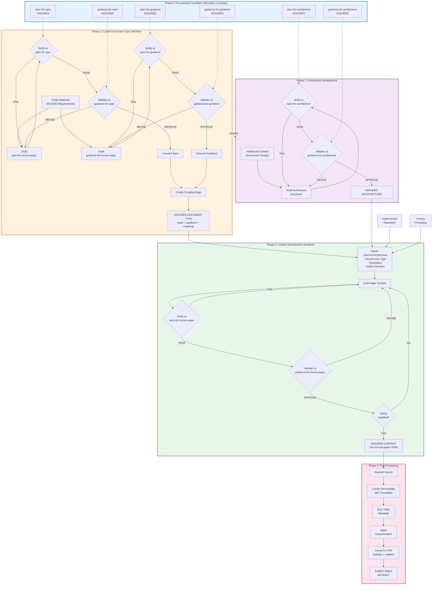

# Engineering Lifecycle for INCOSE Paper Development

## Introduction

This lifecycle documents the systematic process—the "algorithm"—for developing assured research papers within the typed simplicial complex framework. The target artifact is an INCOSE IS 2026 research paper that has been verified against its specification, validated against its guidance, and closed into an assurance triangle with explicit human accountability.

The lifecycle addresses a key challenge in AI-assisted documentation: maintaining clear accountability for document quality while leveraging LLM capabilities. By following this process, authors produce artifacts that are not merely "complete" but **assured**—with explicit evidence of structural compliance (verification), fitness-for-purpose assessment (validation), and named human responsibility for quality judgments.

This lifecycle was used to produce the paper "Test-Driven Document Development: Simplicial Complexes for Verification, Validation, and Assurance with Human Accountability" which serves as its own proof-of-concept.

## Foundation / Prerequisites

The lifecycle assumes a **boundary complex** of foundational documents already exists and is assured. These self-referential foundations are resolved through a root vertex that anchors the system.

| Element | Type | Assurance Status | Purpose |
|---------|------|------------------|---------|
| [[spec-for-spec]] | spec | Assured (b2:spec-spec) | Defines what makes valid specifications |
| [[guidance-for-spec]] | guidance | Assured | Quality criteria for specifications |
| [[spec-for-guidance]] | spec | Assured | Defines what makes valid guidance |
| [[guidance-for-guidance]] | guidance | Assured (b2:guidance-guidance) | Quality criteria for guidance |
| [[spec-for-architecture]] | spec | Assured | Defines 4-layer architecture documents |
| [[guidance-for-architecture]] | guidance | Assured | Quality criteria for architecture |
| [[spec-for-charts]] | spec | Assured | Defines audit chart structure |
| [[guidance-for-charts]] | guidance | Assured | Quality criteria for charts |

These form the **boundary complex**—the trusted foundation upon which custom document types are built. The boundary faces (`b2:spec-spec`, `b2:guidance-guidance`) provide assurance for the self-referential documents through the root vertex anchor.

**Why These Prerequisites Matter:**
- **spec-for-spec / guidance-for-spec:** Enable assurance of the custom paper specification
- **spec-for-guidance / guidance-for-guidance:** Enable assurance of the custom paper guidance
- **spec-for-architecture / guidance-for-architecture:** Enable assurance of the intellectual content reference
- **spec-for-charts / guidance-for-charts:** Enable assurance of the final audit chart

## Phase 1: Custom Document Type Definition

**Goal:** Create an assured specification and guidance pair defining what constitutes a valid INCOSE paper.

**Inputs:**
- INCOSE IS 2026 Call for Papers and submission requirements
- INCOSE paper templates and formatting guidelines
- Foundation spec/guidance documents (from prerequisites)
- Domain expertise on research paper quality

**Process:**

1. Analyze INCOSE's published requirements to extract structural constraints
2. Draft [[spec-for-incose-paper]] capturing:
   - Word count limits (≤7,000 words)
   - Required sections (Abstract, Introduction, Background, Methodology, Results, Discussion, Conclusion)
   - AI disclosure requirements
   - Formatting constraints
3. Draft [[guidance-for-incose-paper]] capturing:
   - Quality criteria for each section
   - Assessment rubrics (Excellent/Good/Acceptable/Needs Work)
   - Theme alignment criteria (IS 2026 "Seeking Wa")
4. Run `python scripts/verify_template_based.py spec-for-incose-paper.md --templates templates`
   - If FAIL → analyze errors, revise spec, return to step 4
5. Human reviews spec against [[guidance-for-spec]]
   - Assess: Is spec clear? Complete? Testable?
   - If concerns → revise and re-assess
   - If APPROVE → proceed
6. Run `python scripts/verify_template_based.py guidance-for-incose-paper.md --templates templates`
   - If FAIL → analyze errors, revise guidance, return to step 6
7. Human reviews guidance against [[guidance-for-guidance]]
   - Assess: Are criteria actionable? Measurable? Comprehensive?
   - If concerns → revise and re-assess
   - If APPROVE → proceed
8. Create [[coupling-incose-paper]] linking spec and guidance
9. Create assurance faces:
   - [[assurance-incose-paper-spec]] for the specification
   - [[assurance-incose-paper-guidance]] for the guidance

**Outputs:**
- Assured [[spec-for-incose-paper]]
- Assured [[guidance-for-incose-paper]]
- [[coupling-incose-paper]] edge

**Verification/Validation Gates:**

| Gate | Type | Criteria | Approver |
|------|------|----------|----------|
| Spec Verification | Automated | `verify_template_based.py` exit code 0 | Script |
| Spec Validation | Human | Passes [[guidance-for-spec]] criteria | Named human |
| Guidance Verification | Automated | `verify_template_based.py` exit code 0 | Script |
| Guidance Validation | Human | Passes [[guidance-for-guidance]] criteria | Named human |

## Phase 2: Architecture Development

**Goal:** Create an assured architecture document capturing the intellectual framework independently of any specific paper format.

**Inputs:**
- Framework design and intellectual content
- Implemented repository (scripts, tests, examples)
- Domain expertise
- [[spec-for-architecture]] and [[guidance-for-architecture]]

**Process:**

1. Draft architecture document capturing:
   - **Conceptual Layer:** Problem statement, stakeholder needs, ConOps
   - **Functional Layer:** What functions the framework performs
   - **Logical Layer:** Design-independent component structure (vertices, edges, faces)
   - **Physical Layer:** Implementation choices (Python scripts, markdown, YAML)
2. Include V-model mapping: each layer pairs design with testing
3. Run `python scripts/verify_template_based.py doc-architecture-*.md --templates templates`
   - If FAIL → analyze errors, revise architecture, return to step 3
4. Human reviews against [[guidance-for-architecture]]
   - Assess: Is architecture coherent? Complete? Traceable?
   - If concerns → revise and re-assess
   - If APPROVE → proceed
5. Create assurance face for architecture

**Outputs:**
- Assured architecture document
- Technical reference for content development

**Verification/Validation Gates:**

| Gate | Type | Criteria | Approver |
|------|------|----------|----------|
| Architecture Verification | Automated | `verify_template_based.py` exit code 0 | Script |
| Architecture Validation | Human | Passes [[guidance-for-architecture]] criteria | Named human |

**Note:** Phase 2 can proceed in parallel with Phase 1. The architecture captures "what we built" independently of "how we describe it for publication."

## Phase 3: Content Development (Iterative)

**Goal:** Create an assured content document that passes verification, satisfies validation, and adequately captures the author's work.

**Inputs:**
- Assured architecture document (from Phase 2)
- Assured document type—[[spec-for-incose-paper]] + [[guidance-for-incose-paper]] (from Phase 1)
- Implemented repository (scripts, tests, passing audits)
- Human prompting and author direction

**Process:**

1. Initialize draft using:
   - Architecture document as conceptual foundation
   - Repository as evidence (passing tests, audit trails)
   - Author direction on narrative, emphasis, framing

2. **Verification Loop (Automated):**
   ```
   while not verified:
       run: python scripts/verify_template_based.py doc-incose-paper-2026.md --templates templates
       if exit_code == 0:
           verified = true
       else:
           analyze failure output
           revise document to address failures
           # Typical issues: missing sections, word count, format
   ```

3. **Validation Loop (Human):**
   ```
   while not validated:
       human reviews against guidance-for-incose-paper
       assess each criterion (Excellent/Good/Acceptable/Needs Work)
       if author_satisfied AND quality_acceptable:
           validated = true
       else:
           identify improvements
           revise document
           # Return to verification loop if structure changed
   ```

4. **Author Satisfaction Check:**
   - Beyond passing checks: Does this adequately capture the work?
   - Does the narrative serve the author's intent?
   - Is the contribution clear and compelling?
   - If not satisfied → continue iteration

5. Create edges:
   - [[verification-incose-paper-content:spec-incose-paper]] (automated result)
   - [[validation-incose-paper-content:guidance-incose-paper]] (human approver named)

6. Close assurance triangle:
   - [[assurance-incose-paper-content]]
   - Document is now **assured**

**Outputs:**
- Assured [[doc-incose-paper-2026]]
- Verification edge with automated results
- Validation edge with named human approver
- Assurance face closing the triangle

**Verification/Validation Gates:**

| Gate | Type | Criteria | Approver |
|------|------|----------|----------|
| Content Verification | Automated | `verify_template_based.py` exit code 0 | Script |
| Content Validation | Human | Passes [[guidance-for-incose-paper]] criteria | Named human |
| Author Satisfaction | Human | Author judges content adequate | Author |

## Phase 4: Post-Processing for Submission

**Goal:** Transform the assured source document into a submittable artifact while maintaining traceability.

**Inputs:**
- Assured [[doc-incose-paper-2026]] (from Phase 3)
- INCOSE submission requirements (formatting, anonymization)

**Process:**

1. Create intermediate file in `submission/` directory
2. Add traceability header (HTML comment) documenting:
   - Source file and vertex ID
   - Derivation date
   - Assurance status reference
   - Transformations applied
3. Strip YAML frontmatter (not needed in PDF)
4. Remove horizontal rule separators
5. Apply anonymization:
   - Remove author names for blind review
   - Redact identifying information in examples
6. Convert to PDF:
   ```bash
   pandoc submission/incose-paper-2026-anonymous.md \
     -o submission/incose-paper-2026-anonymous.pdf \
     --pdf-engine=xelatex \
     -V geometry:margin=1in \
     -V fontsize=11pt \
     --number-sections
   ```
7. Visual inspection of PDF
8. Word count verification
9. Anonymization check

**Outputs:**
- `submission/incose-paper-2026-anonymous.md` (intermediate with traceability)
- `submission/incose-paper-2026-anonymous.pdf` (submittable artifact)

**Verification/Validation Gates:**

| Gate | Type | Criteria | Approver |
|------|------|----------|----------|
| Traceability | Manual | Header documents source and transformations | Author |
| PDF Quality | Manual | Visual inspection passes | Author |
| Anonymization | Manual | No identifying information visible | Author |

**Acknowledged Limitation:** A gap exists between the verified source (markdown in repository) and the submitted artifact (PDF). We mitigate this through:
- Explicit traceability in intermediate file
- Source repository as authoritative record
- Documentation of transformation steps

## Lifecycle Flowchart



## Narrative Walkthrough

### Step 1: Foundation Assumed

The lifecycle begins with an **assured boundary complex**. These foundational documents answer the bootstrap question "who validates the validators?" through a combination of self-reference and root anchoring. The spec-for-spec verifies against itself; boundary faces close through the root vertex. We assume this foundation exists and all elements are assured before beginning custom work.

This foundation is not arbitrary—it represents careful meta-level work establishing the rules of the assurance game. Without this foundation, we would have infinite regress: what validates the validators that validate the validators?

### Step 2: Document Type Creation (Phase 1)

Before creating content, we must define what "valid" content looks like. This is not arbitrary—we derive requirements from authoritative sources. For the INCOSE paper:

- **Specification** captures INCOSE's published structural requirements: word limits, required sections, formatting rules, AI disclosure mandate
- **Guidance** captures quality criteria: clarity, rigor, contribution significance, theme alignment

Each document is verified (automated structural checks) and validated (human quality judgment) against the foundational spec/guidance documents. Only when both are assured do we create a **coupling edge** linking them into a coherent "document type."

This coupling is crucial: it ensures that verification and validation use semantically related documents, not arbitrary pairings. You cannot verify against one spec while validating against unrelated guidance.

### Step 3: Architecture as Intellectual Anchor (Phase 2)

In parallel with document type definition, the author develops an **architecture document**. This captures the intellectual content—the actual framework being described—independently of any particular paper format. The architecture document:

- Uses the 4-layer model (Conceptual → Functional → Logical → Physical)
- Maps to the V-model (ConOps ↔ Acceptance, Functions ↔ System Testing, etc.)
- Serves as the authoritative technical reference

This separation matters: the architecture exists independently of how it's communicated. The INCOSE paper is one rendering of the architecture; other renderings (presentations, tutorials, implementations) can derive from the same assured source.

### Step 4: Iterative Content Development (Phase 3)

With an assured document type and an assured architecture, we begin content development. This is inherently iterative—writing is not a linear process. The author uses:

- The **architecture document** as conceptual foundation
- The **implemented repository** (scripts, tests, passing audits) as evidence
- **Human judgment** for narrative, emphasis, and framing

Each draft iteration runs through:
1. **Verification** (automated): Does it meet structural requirements?
2. **Validation** (human): Does it meet quality criteria?
3. **Author satisfaction**: Does it adequately capture the work?

The cycle continues until all three conditions are satisfied. Only then are formal edges created and the assurance triangle closed. This is important: iteration happens *before* claiming assurance, not after.

### Step 5: Post-Processing Gap (Phase 4)

The assured document exists as markdown with YAML frontmatter in a git repository. Submission to INCOSE requires transformation:

- Strip metadata (PDF doesn't need YAML)
- Convert formats (markdown → PDF via pandoc)
- Apply venue requirements (anonymization for blind review)

This creates an acknowledged gap between the **verified source** and the **submitted artifact**. We mitigate this by:

- Creating an intermediate file with explicit traceability
- Documenting all transformations applied
- Maintaining the source repository as the authoritative assurance record

Future work should integrate publication pipeline steps into the assurance framework itself.

## Key Properties

### Layered Trust
Instance documents (the paper) trace to type documents (spec/guidance for INCOSE papers) which trace to foundational documents (spec-for-spec, etc.). Trust propagates upward through this hierarchy. Each layer is assured before documents in higher layers can claim assurance.

### Parallel Independence
Architecture development (Phase 2) can proceed independently of document type definition (Phase 1). They converge only in Phase 3 when content development begins. This enables efficient use of time when different aspects can be developed concurrently.

### Iteration Within Assurance
Content development is highly iterative, but assurance is only claimed after convergence. You don't verify/validate every draft—you iterate until ready, then create the formal edges. The iteration loop has explicit exit conditions: verification passes AND validation approves AND author is satisfied.

### Human-in-the-Loop
Validation always requires human judgment. Verification can be automated (structural checks), but fitness-for-purpose assessment requires a named human approver who takes responsibility for the judgment. This is not optional—it is structurally enforced.

### Explicit Traceability
Every phase produces artifacts that trace to their inputs. The final submission traces to the assured source, which traces to its spec/guidance, which traces to the boundary complex. The chain of evidence is complete and auditable.

### Acknowledged Gaps
The lifecycle honestly documents where assurance cannot extend—specifically, the post-processing gap between verified source and submitted PDF. Rather than pretending this gap doesn't exist, we acknowledge it and provide mitigation (traceability documentation).

## Relationship to V-Model

This lifecycle maps naturally to the systems engineering V-model:

| V-Model Phase | Lifecycle Phase | Activity |
|---------------|-----------------|----------|
| **Left Side (Top-Down)** | | |
| Concept | Foundation | Boundary complex provides conceptual basis |
| Requirements | Phase 1 | Document type defines requirements (spec) |
| Design | Phase 1 | Quality criteria defined (guidance) |
| **Bottom (Implementation)** | | |
| Implementation | Phase 2 + 3 | Architecture + iterative content development |
| **Right Side (Bottom-Up)** | | |
| Unit Test | Phase 3 | Verification (automated structural checks) |
| Integration Test | Phase 3 | Validation (human quality assessment) |
| Acceptance | Phase 3 | Author satisfaction + assurance closure |
| **Deployment** | | |
| Delivery | Phase 4 | Post-processing and submission |

The V-model's key insight—that each design phase has a corresponding test phase—is preserved. Specifications (left side) are verified against; guidance (left side) is validated against. The assurance triangle formalizes the relationship between these paired activities.

## Accountability Statement

This lifecycle document was drafted with Claude (Opus 4.5) assistance based on author direction. The framework design, lifecycle structure, and assurance methodology are original author work. The author maintains responsibility for the accuracy and completeness of this process description.

**Human Approver:** mzargham
**LLM Assistance:** claude-opus-4-5-20251101
**Date:** 2025-12-30

## Examples

| Instance | Target Artifact | Status | Notes |
|----------|-----------------|--------|-------|
| INCOSE IS 2026 Paper | Research paper | Assured | Self-demonstrating instance |

---

**Note:** This lifecycle document is itself an instance that can be assured against [[spec-for-lifecycle]] and [[guidance-for-lifecycle]], demonstrating recursive applicability of the assurance framework.
