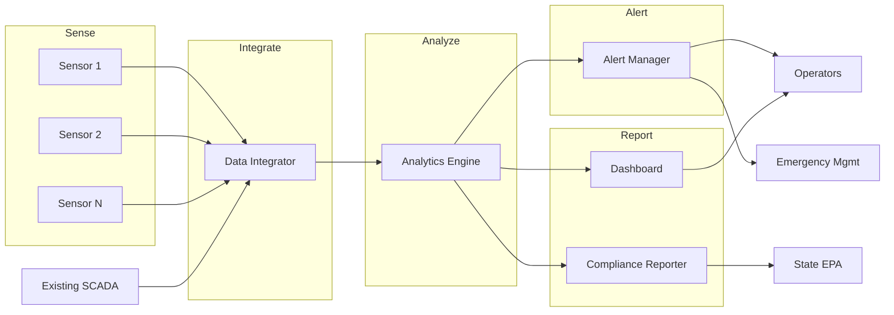
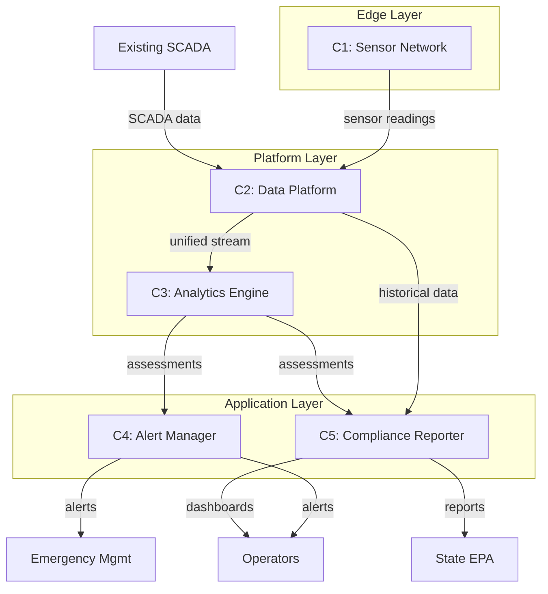
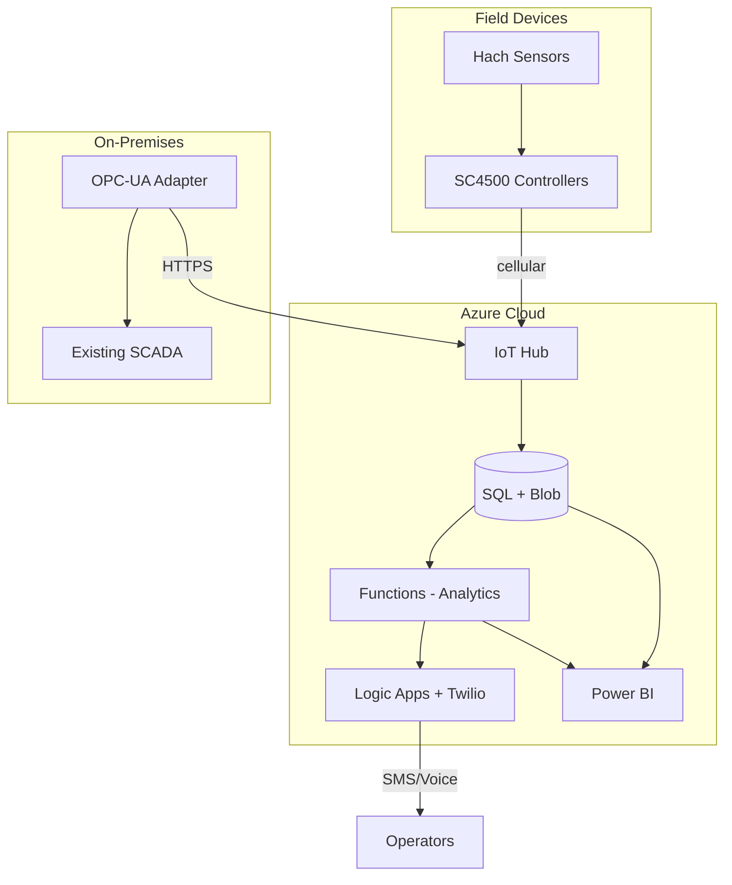

# Architecture - Municipal Water Quality Monitoring System

This architecture document defines the Clearwater Real-Time Water Quality Monitoring System across four layers aligned with the V-model lifecycle, addressing the detection gap identified in the field survey.

## Overview

The Clearwater Real-Time Water Quality Monitoring System addresses the critical 48-hour detection gap identified in the field survey by deploying continuous monitoring sensors throughout the distribution network, integrating data into a unified platform, and enabling automated alerting for rapid response.

This architecture builds on the existing SCADA infrastructure while extending monitoring capabilities to 25 distribution network points. The system will provide operators with unified situational awareness, automate compliance reporting, and trigger alerts when parameters exceed thresholds—reducing detection-to-response time from 48 hours to under 15 minutes.

The architecture is designed for phased implementation within the \$800K capital budget, with core capabilities delivered in Phase 1 and expansion capabilities enabled for future investment.

## V-Model Summary

| Layer | Left Side (Idealized) | Current Status | Right Side (Realized) |
|-------|----------------------|----------------|----------------------|
| **Conceptual** | ConOps: Real-time detection and rapid response to water quality issues | Design | Acceptance Testing: Stakeholder acceptance of system capabilities |
| **Functional** | Functional Architecture: Sense, Integrate, Analyze, Alert, Report | Design | System Testing: Verification of end-to-end functionality |
| **Logical** | Logical Architecture: Sensor Network, Data Platform, Analytics Engine, Alert Manager, Compliance Reporter | Design | Integration Testing: Component interaction verification |
| **Physical** | Physical Architecture: IoT sensors, Azure IoT Hub, Python analytics, Twilio alerts, Power BI dashboards | Design | Unit Testing: Individual component testing |

## Conceptual Layer

### Problem Statement (ConOps)

The Clearwater County Water Authority serves 45,000 households through a distribution network spanning urban and rural areas. Current monitoring depends on manual sampling at 12 locations with 48-hour lab turnaround, creating a significant window where water quality issues can affect customers before detection.

**Stakeholder Needs:**

- **Water Authority Management (from A1):** Need real-time visibility into system-wide water quality; need to demonstrate proactive public health protection to regulators and public; need to reduce emergency response costs
- **Water System Operators (from A4):** Need unified interface showing quality status across the network; need automated alerts for parameter exceedances; need to reduce manual data entry burden
- **State EPA (from A2):** Need timely and accurate compliance data; need confidence that the county exceeds minimum monitoring requirements
- **County Emergency Management (from A3):** Need automated triggers for notification system when thresholds are exceeded; need clear escalation protocols
- **Residential Customers (from A5):** Need confidence in water safety; need rapid notification when issues occur; need transparency about water quality

**Operational Context:**

The system operates 24/7 across the distribution network. Operators monitor from the central operations center at the Lakeside Treatment Facility during business hours, with on-call coverage after hours. Quality parameters must be monitored continuously with alerts routed to on-duty operators and escalated to management and emergency management as warranted.

### Acceptance Criteria

The system will be accepted by stakeholders when:

- **AC1:** Real-time quality data is available from all 25 monitoring points with <5 minute latency
- **AC2:** Operators can view unified dashboard showing network-wide quality status in single interface
- **AC3:** Automated alerts reach on-duty operators within 2 minutes of threshold exceedance
- **AC4:** Monthly compliance reports are generated automatically with <1 hour of manual review required
- **AC5:** Detection-to-response time for simulated quality events is <15 minutes (validated through drills)

## Functional Layer

### Functional Architecture

The system performs five core functions to transform sensor data into actionable intelligence and automated responses.

| Function | Inputs | Outputs | Description |
|----------|--------|---------|-------------|
| F1: Sense | Physical water parameters | Raw sensor readings | Continuously measure water quality parameters (chlorine, turbidity, pH, temperature) at distribution network points |
| F2: Integrate | Raw sensor readings, SCADA data | Unified data stream | Collect, validate, and normalize data from sensors and existing SCADA system into common format |
| F3: Analyze | Unified data stream, threshold rules | Quality assessments, anomaly flags | Apply threshold rules and anomaly detection to identify parameter exceedances and unusual patterns |
| F4: Alert | Quality assessments, alert rules | Notifications, escalations | Generate and route alerts to appropriate personnel based on severity and escalation rules |
| F5: Report | Historical quality data, compliance rules | Compliance reports, dashboards | Generate regulatory compliance reports and operational dashboards from integrated data |

### System Testing Criteria

The functional architecture will be verified through system testing:

- **ST1:** End-to-end data flow from sensor reading to dashboard display completes in <5 minutes
- **ST2:** Simulated parameter exceedance triggers correct alert within 2 minutes
- **ST3:** System correctly aggregates data from 25 sensors plus SCADA with no data loss over 24-hour test period
- **ST4:** Generated compliance report matches manually calculated values within 0.1% tolerance
- **ST5:** System maintains operation through simulated component failures with appropriate degradation alerts

## Logical Layer

### Logical Architecture

The logical architecture defines technology-independent components and their interactions.

| Component | Responsibility | Interfaces |
|-----------|---------------|------------|
| C1: Sensor Network | Collect water quality measurements at distribution points | Output: Sensor readings (parameter, value, timestamp, location) to Data Platform |
| C2: Data Platform | Ingest, validate, store, and serve quality data | Input: Sensor readings, SCADA data; Output: Unified data stream to Analytics, historical data to Reporter |
| C3: Analytics Engine | Apply rules and detect anomalies in quality data | Input: Unified data stream, threshold configuration; Output: Quality assessments to Alert Manager and Reporter |
| C4: Alert Manager | Route notifications based on severity and rules | Input: Quality assessments, escalation rules; Output: Alerts to operators, emergency management, management |
| C5: Compliance Reporter | Generate regulatory reports and dashboards | Input: Historical data, compliance rules; Output: Reports, dashboards, data exports |

**Component Interactions:**

- **C1 → C2:** Sensors transmit readings at configured intervals (default 1 minute); Data Platform validates, timestamps, and stores
- **C2 → C3:** Data Platform streams validated data to Analytics; Analytics maintains sliding window for anomaly detection
- **C3 → C4:** Analytics publishes assessments to Alert Manager; Alert Manager applies routing rules
- **C2/C3 → C5:** Compliance Reporter queries historical data and receives real-time assessments for dashboard updates

### Integration Testing Criteria

Component integration will be verified through:

- **IT1:** Sensor Network successfully transmits to Data Platform with <1% packet loss over 72-hour test
- **IT2:** Data Platform correctly ingests both sensor and SCADA data streams without conflicts
- **IT3:** Analytics Engine receives complete data stream from Data Platform with no gaps
- **IT4:** Alert Manager correctly receives and routes all assessment types from Analytics Engine
- **IT5:** Compliance Reporter can query all required data from Data Platform for report generation

## Physical Layer

### Physical Architecture

The physical architecture specifies concrete technology choices for each logical component.

| Element | Technology/Tool | Purpose |
|---------|----------------|---------|
| E1: Water Quality Sensors | Hach CL17sc (chlorine), Hach TU5300sc (turbidity), Hach pHD (pH) | Industrial-grade sensors proven in municipal water applications |
| E2: Sensor Controllers | Hach SC4500 controller with cellular modem | Local data logging and reliable cellular transmission |
| E3: IoT Gateway | Azure IoT Hub | Cloud-based ingestion with device management and security |
| E4: Data Store | Azure SQL Database + Blob Storage | Structured data for queries, blob storage for raw data archive |
| E5: Analytics Runtime | Python (Pandas, NumPy) on Azure Functions | Serverless analytics with familiar tooling |
| E6: Alert Service | Twilio (SMS/Voice) + Azure Logic Apps | Reliable multi-channel alerting with workflow automation |
| E7: Dashboard | Power BI Embedded | Self-service dashboards with familiar Microsoft tooling |
| E8: SCADA Integration | OPC-UA adapter | Industry-standard protocol for SCADA connectivity |

**Technology Rationale:**

- **Hach sensors:** Industry standard in municipal water; compatible with existing Water Authority equipment; proven reliability
- **Azure platform:** County IT uses Microsoft 365; Azure provides familiar environment and support; FedRAMP authorized
- **Cellular connectivity:** Sensors distributed across county; cellular provides coverage without requiring network infrastructure at each site
- **Power BI:** Operators already familiar with Excel; Power BI provides accessible interface with strong visualization

### Unit Testing Criteria

Individual components will be verified through:

- **UT1:** Each Hach sensor provides readings within manufacturer accuracy specifications when tested against lab standards
- **UT2:** SC4500 controllers successfully buffer 24 hours of readings during connectivity loss and transmit on reconnection
- **UT3:** Azure Functions correctly calculate threshold exceedances for all test parameter combinations
- **UT4:** Twilio integration delivers test alerts to configured numbers within 30 seconds
- **UT5:** Power BI dashboards correctly render test data sets matching expected visualizations
- **UT6:** OPC-UA adapter successfully reads all required SCADA points without errors

## Traceability Matrix

| Conceptual Need | Functional Requirement | Logical Component | Physical Element |
|-----------------|----------------------|-------------------|------------------|
| Real-time visibility (Management) | F1: Sense, F2: Integrate | C1: Sensor Network, C2: Data Platform | E1-E4: Sensors through Data Store |
| Unified interface (Operators) | F5: Report | C5: Compliance Reporter | E7: Power BI |
| Automated alerts (Operators, Emergency Mgmt) | F3: Analyze, F4: Alert | C3: Analytics Engine, C4: Alert Manager | E5-E6: Functions, Logic Apps, Twilio |
| Timely compliance data (EPA) | F5: Report | C5: Compliance Reporter | E4, E7: SQL + Power BI |
| Rapid notification (Customers via Emergency Mgmt) | F4: Alert | C4: Alert Manager | E6: Logic Apps + Twilio |

## Constraints and Assumptions

### Constraints

- **Budget:** \$800K capital budget for Phase 1; operational costs must fit within existing Water Authority budget
- **Cellular Coverage:** Sensor locations must have adequate cellular signal; 3 of 25 proposed locations may require signal boosters
- **SCADA Integration:** OPC-UA adapter must work with existing Wonderware system without disrupting operations
- **Compliance:** System must not disrupt existing compliance processes during transition
- **Staffing:** No new FTEs; operators must be able to manage system with training

### Assumptions

- **Azure Availability:** Azure services will maintain 99.9% availability per SLA
- **Sensor Reliability:** Hach sensors will perform to manufacturer specifications with annual calibration
- **Cellular Reliability:** Cellular networks will maintain sufficient uptime for near-real-time monitoring (brief outages acceptable with local buffering)
- **Operator Adoption:** Operators will adopt new dashboards if they reduce manual workload
- **Regulatory Acceptance:** State EPA will accept automated reports as valid compliance documentation

## Risks and Mitigations

| Risk | Impact | Likelihood | Mitigation |
|------|--------|------------|------------|
| Cellular coverage gaps at sensor sites | Medium - delays deployment | Medium | Pre-deployment site surveys; budget for signal boosters |
| SCADA integration complexity | High - delays integration | Medium | Engage Wonderware consultant; test in lab environment first |
| Operator resistance to new tools | Medium - reduces adoption | Low | Involve operators in design; emphasize workload reduction |
| Sensor maintenance burden | Medium - ongoing costs | Medium | Establish preventive maintenance schedule; train operators |
| Azure service outage | High - system unavailable | Low | Local buffering at controllers; manual procedures documented |

---

**Note:** This architecture addresses the detection gap identified in the field survey by extending monitoring from 12 manual sampling points to 25 real-time sensors. The phased approach enables delivery within budget constraints while establishing a platform for future expansion.
