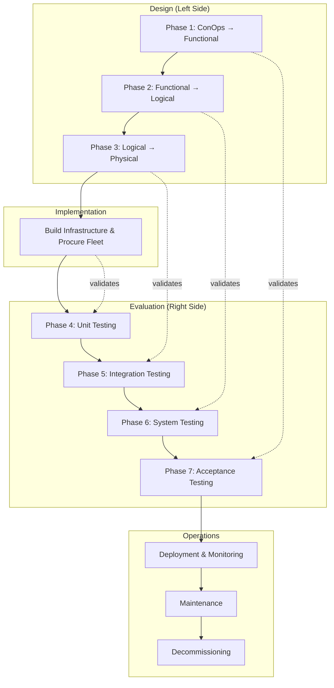

# Lifecycle - Bus Fleet Electrification

This lifecycle document defines the systematic engineering process for delivering the MRTA Fleet Electrification System, from architecture through operations and eventual decommissioning.

## Introduction

This lifecycle delivers the MRTA Fleet Electrification System as defined in [[architecture-bus-electrification]]. The system transitions 60 diesel buses to battery-electric through phased deployment at two depot facilities, with integrated charging infrastructure and fleet management capabilities.

The lifecycle follows the V-model pattern with particular attention to the infrastructure-vehicle sequencing challenge: utility upgrades require longer lead time than bus procurement. The lifecycle phases are structured to ensure infrastructure readiness before vehicle delivery.

**Stakeholders for Acceptance:**
- **MRTA Leadership:** Approve system capabilities, budget alignment, and mandate compliance trajectory
- **Maintenance Technicians:** Validate safety procedures, training adequacy, and tool availability
- **Bus Operators:** Validate vehicle operability, range adequacy, and training effectiveness
- **Regional Electric Utility:** Confirm interconnection meets requirements and demand management works
- **State DOT:** Verify compliance reporting and grant fund accountability

## Architecture Foundation

This lifecycle implements [[architecture-bus-electrification]].

### Architecture Summary

| Layer | Description | Evaluation |
|-------|-------------|------------|
| Conceptual | Maintain service reliability while transitioning to zero-emission fleet; 6 stakeholder needs; 6 acceptance criteria | Acceptance Testing |
| Functional | 5 functions: Charge, Dispatch, Operate, Maintain, Report | System Testing |
| Logical | 5 components: Charging System, Fleet Manager, Energy Optimizer, Maintenance System, Compliance Reporter | Integration Testing |
| Physical | New Flyer XE40 buses, ABB chargers, ChargePoint management, Trapeze integration, utility interconnection | Unit Testing |

### Key Requirements

The following requirements from the architecture drive this lifecycle:

1. **Fleet Availability:** Electric buses maintain ≥85% availability (AC3)
2. **Range Reliability:** No range-related service failures for 30 days (AC2)
3. **Workforce Readiness:** All 45 technicians HV-certified before bus arrival (AC4)
4. **Charging Capacity:** Infrastructure supports full fleet overnight charging (AC5)
5. **System Integration:** Fleet management accurately tracks SOC and optimizes charging (AC6)

## V-Model Overview

## Design Phases

### Phase 1: ConOps to Functional Architecture

**Goal:** Transform stakeholder needs into system functions with clear operational requirements.

**Inputs:**
- ConOps from architecture (conceptual layer)
- Stakeholder requirements (6 needs from architecture)
- Field survey context (actors, resources, constraints)
- Route analysis data (distances, schedules, layover times)

**Process:**
1. Analyze each route for electrification suitability (range, layover, depot assignment)
2. Map stakeholder needs to system functions
3. Define function boundaries and interfaces
4. Specify charging window requirements based on service schedule
5. Document dispatch rules for electric vs. diesel mixed fleet

**Outputs:**
- Route electrification plan (which routes can support electric buses)
- Functional requirements specification
- Charging window analysis
- Mixed-fleet dispatch rules

**Verification Gate:**
- [ ] All 6 stakeholder needs map to functions
- [ ] Route analysis identifies 60+ routes suitable for 150-mile range buses
- [ ] Charging window (6 hours overnight) validated sufficient
- [ ] Mixed-fleet dispatch rules reviewed by operations

### Phase 2: Functional to Logical Architecture

**Goal:** Transform functions into technology-independent components with defined interfaces.

**Inputs:**
- Functional requirements specification
- Integration constraints (existing Trapeze system, utility interfaces)
- Data requirements (SOC tracking, energy reporting, compliance data)

**Process:**
1. Group functions into logical components
2. Define component responsibilities and boundaries
3. Specify interfaces between components (data formats, protocols)
4. Design data flows for charging optimization
5. Define compliance reporting data requirements

**Outputs:**
- Component specifications (5 components)
- Interface definitions
- Data flow diagrams
- Compliance data dictionary

**Verification Gate:**
- [ ] All functions map to components
- [ ] Component interfaces fully specified
- [ ] Data flows support compliance reporting requirements
- [ ] Trapeze integration approach validated with vendor

### Phase 3: Logical to Physical Architecture

**Goal:** Select specific technologies and create implementation specifications.

**Inputs:**
- Component specifications
- Budget constraints (\$45M Phase 1)
- Vendor evaluations (buses, chargers, software)
- Utility infrastructure assessment

**Process:**
1. Evaluate and select bus manufacturer/model
2. Evaluate and select charging equipment vendor
3. Finalize Trapeze EV module configuration
4. Complete utility interconnection design
5. Develop infrastructure installation specifications
6. Create procurement specifications

**Outputs:**
- Technology selections with rationale
- Procurement specifications (buses, chargers, software)
- Utility interconnection agreement
- Infrastructure installation drawings
- Training curriculum requirements

**Verification Gate:**
- [ ] Selected technologies meet all functional requirements
- [ ] Total cost within \$45M budget
- [ ] Utility confirms interconnection timeline (18-24 months)
- [ ] Procurement specs ready for bid

## Implementation Phase

**Goal:** Procure vehicles, install infrastructure, and deploy software systems.

**Inputs:**
- Procurement specifications
- Utility interconnection agreement
- Infrastructure installation drawings
- Training curriculum

**Process:**
1. **Infrastructure Stream (start first due to lead time):**
   - Execute utility upgrade contract
   - Install charging infrastructure at Eastside Depot (Phase 1A)
   - Install charging infrastructure at Central Depot (Phase 1B)

2. **Vehicle Stream:**
   - Issue bus procurement RFP
   - Award contract and begin production
   - Conduct factory acceptance testing
   - Receive and inspect buses

3. **Software Stream:**
   - Configure ChargePoint fleet management
   - Implement Trapeze EV module
   - Integrate systems
   - Configure reporting

4. **Workforce Stream:**
   - Develop HV safety training curriculum
   - Train all 45 technicians
   - Certify training completion

**Outputs:**
- Installed and energized charging infrastructure
- Delivered electric buses
- Configured software systems
- Certified maintenance workforce

**Verification Gate:**
- [ ] Utility interconnection complete and energized
- [ ] All chargers installed and commissioned
- [ ] All 60 buses received and inspected
- [ ] All 45 technicians HV-certified
- [ ] Software systems configured and connected

## Evaluation Phases

### Phase 4: Unit Testing

**Goal:** Verify individual components meet physical specifications.

**Inputs:**
- Delivered components (buses, chargers, software)
- Physical architecture specifications
- Unit test criteria from architecture (UT1-UT6)

**Process:**
1. Bus acceptance testing (range, performance, systems) (UT1)
2. Charger commissioning and power verification (UT2)
3. ChargePoint system verification (UT3)
4. Trapeze EV module verification (UT4)
5. Smart Charging algorithm verification (UT5)
6. Utility interconnection load testing (UT6)

**Outputs:**
- Bus acceptance test results (60 buses)
- Charger commissioning certificates
- Software system test results
- Utility interconnection test results

**Verification Gate:**
- [ ] UT1: All 60 buses achieve 150+ mile range in test
- [ ] UT2: All chargers deliver rated 150 kW power
- [ ] UT3: ChargePoint reports accurate status for all sessions
- [ ] UT4: Trapeze displays correct SOC from telematics
- [ ] UT5: Smart Charging calculates correct schedules
- [ ] UT6: Utility interconnection supports full load

### Phase 5: Integration Testing

**Goal:** Verify component interactions work correctly.

**Inputs:**
- Verified components
- Integration test criteria from architecture (IT1-IT5)

**Process:**
1. Test Optimizer → Charger schedule transmission (IT1)
2. Test Charger → Fleet Manager status sync (IT2)
3. Test Fleet Manager → Maintenance System alerts (IT3)
4. Test all systems → Compliance Reporter aggregation (IT4)
5. Test utility demand response → charging adjustment (IT5)

**Outputs:**
- Integration test results
- Interface verification evidence
- End-to-end data flow validation

**Verification Gate:**
- [ ] IT1: Charge schedules correctly transmitted and executed
- [ ] IT2: SOC status reflected in Fleet Manager within 1 minute
- [ ] IT3: Maintenance alerts create work orders correctly
- [ ] IT4: Compliance data aggregates from all sources
- [ ] IT5: Demand response adjusts charging within 5 minutes

### Phase 6: System Testing

**Goal:** Verify end-to-end system functions work correctly.

**Inputs:**
- Integrated system
- System test criteria from architecture (ST1-ST5)

**Process:**
1. Test overnight charging cycle (ST1)
2. Test dispatch matching charge to route (ST2)
3. Conduct 30-day operational test on limited routes (ST3)
4. Test maintenance scheduling (ST4)
5. Generate and validate compliance reports (ST5)

**Outputs:**
- System test results
- 30-day operational test report
- Compliance report samples
- Performance metrics

**Verification Gate:**
- [ ] ST1: 6-hour overnight charge achieves 20%→95% SOC
- [ ] ST2: Dispatch correctly matches charge to route with 20% buffer
- [ ] ST3: No range-related failures in 30-day test
- [ ] ST4: Maintenance scheduling prioritizes correctly
- [ ] ST5: Compliance reports match manual calculations

### Phase 7: Acceptance Testing

**Goal:** Validate system meets stakeholder needs.

**Inputs:**
- Tested system
- Stakeholder requirements
- Acceptance criteria from architecture (AC1-AC6)

**Process:**
1. Demonstrate 60 buses in revenue service (AC1)
2. Validate route completion without range issues (AC2)
3. Measure fleet availability over 30 days (AC3)
4. Verify all technician certifications (AC4)
5. Demonstrate charging capacity (AC5)
6. Validate fleet management SOC tracking (AC6)

**Outputs:**
- Acceptance test results
- Stakeholder sign-off documentation
- Training completion records
- Operational readiness certification

**Validation Gate:**
- [ ] AC1: 60 electric buses operational in revenue service
- [ ] AC2: 30 consecutive days without range-related service failure
- [ ] AC3: Electric fleet availability ≥85%
- [ ] AC4: All 45 technicians HV-certified (documentation verified)
- [ ] AC5: Full fleet overnight charging demonstrated
- [ ] AC6: SOC tracking and optimization functioning
- [ ] MRTA Leadership signs acceptance
- [ ] Maintenance Technicians validate procedures
- [ ] Bus Operators validate training and vehicle operation
- [ ] Utility confirms interconnection performance
- [ ] State DOT approves compliance reporting

## Operations Phase

### Deployment

**Goal:** Transition electric buses to full revenue service.

**Process:**
1. Phase in electric buses on validated routes (10 buses/week)
2. Monitor performance metrics daily during ramp-up
3. Adjust charging schedules based on operational experience
4. Complete operator training for all affected routes
5. Transition diesel buses to other routes or retirement

**Outputs:**
- All 60 electric buses in revenue service
- Deployment completion report
- Updated route assignments
- Diesel bus disposition plan

### Monitoring

**Goal:** Continuously monitor fleet and infrastructure performance.

**Monitoring Requirements:**

| Metric | Target | Alert Threshold |
|--------|--------|-----------------|
| Electric fleet availability | ≥85% | <80% |
| Charger uptime | ≥98% | <95% |
| Average SOC at dispatch | ≥90% | <80% |
| Range-related service failures | 0 | Any occurrence |
| Energy cost per mile | ≤\$0.25 | >\$0.35 |

**Process:**
1. Daily fleet status review (availability, SOC, issues)
2. Weekly energy cost and consumption analysis
3. Monthly compliance report generation
4. Quarterly performance review with stakeholders

### Maintenance

**Goal:** Maintain fleet and infrastructure availability.

**Maintenance Types:**

| Type | Trigger | Process |
|------|---------|---------|
| Corrective | Vehicle or charger failure | Diagnose → Repair → Test → Return to service |
| Adaptive | Software updates, utility rate changes | Evaluate → Test → Deploy → Monitor |
| Perfective | Performance optimization | Analyze → Design → Implement → Validate |
| Preventive | Scheduled intervals (mileage, time) | Schedule → Execute → Document → Update records |

**Preventive Maintenance Schedule:**
- Bus: Every 6,000 miles (inspect brakes, HVAC, HV connections)
- Chargers: Quarterly inspection and cleaning
- Software: Monthly updates during low-usage window

**Change Management:**
- Changes affecting safety require safety review board approval
- Changes affecting utility interconnection require utility coordination
- Changes affecting compliance require State DOT notification
- All changes documented in maintenance records

## Decommissioning

### Decommissioning Triggers

| Trigger | Description |
|---------|-------------|
| Vehicle End-of-Life | Bus reaches 12-year/500,000-mile replacement threshold |
| Technology Obsolescence | Battery technology advances make replacement more economical than continued operation |
| Infrastructure Upgrade | New generation charging technology requires infrastructure replacement |
| Program Expansion | Phase 2 electrification replaces remaining diesel, requires infrastructure expansion |

### Decommissioning Process

1. **Planning:** Develop disposition plan 12 months before end-of-life
2. **Stakeholder Notification:** Inform DOT, utility, union of planned changes
3. **Data Preservation:** Archive all operational, maintenance, and compliance data
4. **Battery Disposition:** Coordinate battery recycling or second-life application per regulations
5. **Vehicle Disposition:** Auction, scrap, or transfer per FTA useful life requirements
6. **Infrastructure Transition:** Upgrade or replace charging infrastructure as needed
7. **Documentation:** Complete closeout report and lessons learned

### Post-Decommissioning

- Operational data retained for 7 years (FTA requirement)
- Battery recycling certificates retained permanently
- Lessons learned incorporated into Phase 2 planning
- Infrastructure may continue serving replacement fleet

## Traceability Matrix

| Architecture Layer | Design Phase | Implementation | Evaluation Phase |
|--------------------|--------------|----------------|------------------|
| Conceptual (ConOps) | Phase 1: ConOps → Functional | Route analysis, stakeholder requirements | Phase 7: Acceptance Testing |
| Functional | Phase 2: Functional → Logical | Functional specs, dispatch rules | Phase 6: System Testing |
| Logical | Phase 3: Logical → Physical | Component specs, interfaces | Phase 5: Integration Testing |
| Physical | Implementation | Buses, chargers, software, training | Phase 4: Unit Testing |

## Key Properties

### Infrastructure-First Sequencing

Due to the 18-24 month utility upgrade lead time vs. 12-18 month bus procurement, infrastructure work must start before vehicle orders. The lifecycle explicitly sequences these streams.

### Parallel Workforce Development

Technician training runs parallel to infrastructure and vehicle procurement to ensure readiness before first bus arrives. This is a critical path item with no float.

### Phased Depot Transition

Eastside Depot (lower electrical upgrade barrier) transitions first, allowing operational learning before the larger Central Depot investment. This reduces risk and builds confidence.

### Continuous Compliance

State mandate requires progress tracking. The lifecycle includes compliance reporting throughout, not just at completion, to demonstrate trajectory toward 50%/100% targets.

## Risk Considerations

| Risk | Impact | Mitigation |
|------|--------|------------|
| Utility upgrade delay | Stranded buses, schedule slip | Early contract execution; liquidated damages; Eastside-first sequencing |
| Bus delivery delay | Schedule slip | Factory visits; progress payments tied to milestones; contingency schedule |
| Training completion delay | Unsafe operations | Start training 9 months early; multiple training sessions; track completion weekly |
| Integration issues | System failures | Integration testing before acceptance; vendor support contracts |
| Operational learning curve | Service impacts | Gradual deployment (10 buses/week); enhanced monitoring during ramp |

---

**Note:** This lifecycle addresses the unique challenge of fleet electrification: infrastructure lead times exceed vehicle lead times. The sequencing ensures charging capacity exists before buses arrive. Workforce development runs in parallel to ensure technicians are ready.
