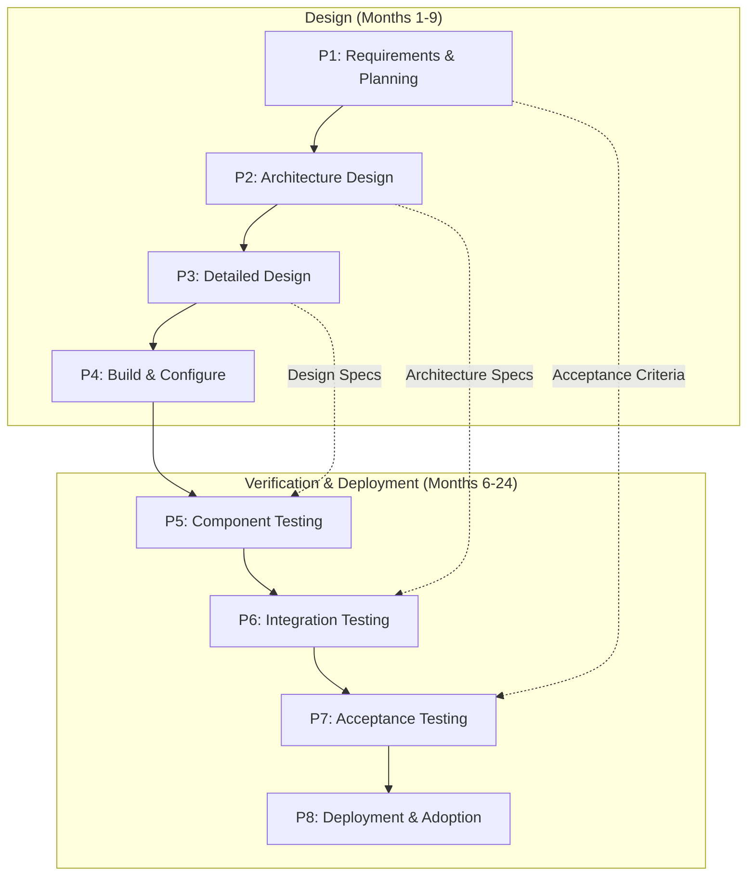

# Lifecycle - Digital Transformation Program

This lifecycle document defines the V-model execution approach for Meridian Consulting Group's digital transformation, from design through deployment and ongoing operations.

## Overview

The digital transformation follows a V-model lifecycle that sequences design activities (left side) with corresponding verification and validation activities (right side). Given the 24-month timeline and cultural change requirements, the lifecycle includes extended adoption support beyond initial deployment.

**Key Lifecycle Characteristics:**

- **Phased Rollout:** Changes deployed incrementally to manage disruption and enable learning
- **Early Wins:** Visible improvements within 6 months to build momentum
- **Parallel Streams:** Infrastructure, application, and change management work simultaneously
- **Extended Stabilization:** Recognition that cultural adoption requires sustained effort

## V-Model Structure

## Phase Definitions

### P1: Requirements & Planning (Months 1-2)

**Purpose:** Establish clear requirements, success criteria, governance, and detailed project plan.

**Activities:**

| Activity | Description | Deliverable |
|----------|-------------|-------------|
| Stakeholder Analysis | Document detailed needs from field survey stakeholders | Stakeholder requirements document |
| Requirements Definition | Translate needs into functional and non-functional requirements | Requirements specification |
| Success Metrics | Define measurable acceptance criteria | Success metrics framework |
| Governance Setup | Establish steering committee, change control, decision rights | Governance charter |
| Change Management Planning | Design communication, training, and adoption approach | Change management plan |
| Project Planning | Detailed work breakdown, resource plan, schedule, budget | Project management plan |
| Vendor Selection | RFP process for implementation partner if needed | Vendor contract |

**Entry Criteria:**
- [ ] Field survey completed and approved
- [ ] Budget authorization confirmed
- [ ] Executive sponsor identified
- [ ] Core project team assigned

**Exit Criteria:**
- [ ] Requirements specification approved by MPC
- [ ] Success metrics agreed with stakeholders
- [ ] Governance charter signed
- [ ] Change management plan approved
- [ ] Project plan baselined
- [ ] Implementation partner selected (if applicable)

**Stakeholder Validation:**
- MPC approves requirements and budget allocation
- Practice Leaders confirm operational requirements accuracy
- IT confirms technical requirements feasibility

### P2: Architecture Design (Months 2-4)

**Purpose:** Design solution architecture addressing requirements within constraints.

**Activities:**

| Activity | Description | Deliverable |
|----------|-------------|-------------|
| Architecture Elaboration | Detail logical and physical architecture from architecture document | Detailed architecture specification |
| Security Design | Design Zero Trust implementation, access policies | Security architecture document |
| Integration Design | Design data flows between systems | Integration architecture document |
| Migration Strategy | Plan data migration approach and tooling | Migration strategy document |
| Environment Design | Design dev/test/production environments | Environment specification |
| Capacity Planning | Size infrastructure for current and future needs | Capacity plan |

**Entry Criteria:**
- [ ] Requirements specification approved
- [ ] Architecture document reviewed
- [ ] Microsoft 365 tenant available

**Exit Criteria:**
- [ ] Detailed architecture approved by IT and implementation partner
- [ ] Security architecture approved (aligns with SOC 2)
- [ ] Integration architecture approved by Operations
- [ ] Migration strategy approved
- [ ] Environment specifications complete

**Verification Linkage:**
- Architecture specifications will be verified in P6 (Integration Testing)
- Security design will be verified through penetration testing in P6

### P3: Detailed Design (Months 4-6)

**Purpose:** Create detailed specifications for configuration, customization, and migration.

**Activities:**

| Activity | Description | Deliverable |
|----------|-------------|-------------|
| SharePoint Information Architecture | Design site structure, metadata, content types | SharePoint design document |
| Teams Governance Design | Design team creation policies, naming, lifecycle | Teams governance document |
| Security Configuration Design | Design Conditional Access policies, DLP rules | Security configuration spec |
| Dynamics 365 Design | Design CRM entities, processes, dashboards | Dynamics design document |
| Time & Expense Design | Design time tracking solution (custom or PSA) | Time solution design |
| Integration Specifications | Detail APIs, data mappings, frequencies | Integration specifications |
| Migration Specifications | Detail file mappings, metadata mapping, validation rules | Migration specifications |
| Training Curriculum Design | Design role-based training content | Training design document |

**Entry Criteria:**
- [ ] Architecture design approved
- [ ] Pilot user group identified
- [ ] Change Champions recruited (12)

**Exit Criteria:**
- [ ] All design documents reviewed and approved
- [ ] Migration specifications validated against source data samples
- [ ] Training curriculum approved
- [ ] Pilot group briefed and committed

**Verification Linkage:**
- Design specifications will be verified in P5 (Component Testing)
- Training design will be validated through pilot user feedback

### P4: Build & Configure (Months 5-9)

**Purpose:** Configure systems, develop customizations, prepare migration, and create training content.

**Activities:**

| Activity | Description | Deliverable |
|----------|-------------|-------------|
| M365 Tenant Configuration | Configure Azure AD, security policies, licenses | Configured M365 tenant |
| SharePoint Implementation | Create sites, libraries, metadata, templates | Configured SharePoint |
| Teams Implementation | Create team templates, governance controls | Configured Teams |
| Dynamics 365 Configuration | Configure CRM, import reference data | Configured Dynamics |
| Time Solution Build | Build or configure time tracking solution | Time solution ready |
| Integration Development | Build integrations (Power Automate, custom) | Working integrations |
| Migration Tool Setup | Configure migration tooling, run test migrations | Migration tools validated |
| Training Content Development | Create training videos, guides, exercises | Training materials |
| Change Champion Enablement | Train Champions ahead of main rollout | Enabled Champions |

**Entry Criteria:**
- [ ] Detailed design approved
- [ ] Development environment available
- [ ] Licenses procured

**Exit Criteria:**
- [ ] All systems configured per specifications
- [ ] Unit testing passed for all components
- [ ] Migration tooling validated on sample data
- [ ] Training content reviewed and approved
- [ ] Change Champions trained

**Verification Linkage:**
- Build outputs will be verified in P5 (Component Testing)
- Champions provide early validation feedback

### P5: Component Testing (Months 8-11)

**Purpose:** Verify individual components meet design specifications.

**Activities:**

| Activity | Description | Deliverable |
|----------|-------------|-------------|
| M365 Security Testing | Test Conditional Access, MFA, DLP policies | Security test results |
| SharePoint Functional Testing | Test sites, libraries, permissions, search | SharePoint test results |
| Teams Functional Testing | Test channels, meetings, guest access | Teams test results |
| Dynamics Testing | Test CRM processes, data quality | Dynamics test results |
| Time Solution Testing | Test time entry, approval, reporting | Time solution test results |
| Integration Testing (Unit) | Test individual integrations | Integration unit test results |
| Migration Validation | Test migration on production sample | Migration validation results |
| Accessibility Testing | Test for accessibility compliance | Accessibility test results |
| Performance Testing | Test response times under load | Performance test results |

**Entry Criteria:**
- [ ] Build complete for components being tested
- [ ] Test plans approved
- [ ] Test data prepared

**Exit Criteria:**
- [ ] All component tests passed
- [ ] Defects logged and resolved to acceptable level
- [ ] Security testing shows no critical vulnerabilities
- [ ] Migration validation successful on representative data

**Traceback:** Component tests verify P3 (Detailed Design) specifications.

### P6: Integration Testing (Months 10-14)

**Purpose:** Verify systems work together as designed; includes pilot deployment.

**Activities:**

| Activity | Description | Deliverable |
|----------|-------------|-------------|
| End-to-End Workflow Testing | Test complete business workflows across systems | Workflow test results |
| Integration Testing | Test data flows between systems | Integration test results |
| Security Architecture Testing | Penetration testing, vulnerability assessment | Security assessment report |
| Pilot Deployment | Deploy to 20-person pilot group | Pilot deployment |
| Pilot User Feedback | Collect structured feedback from pilot users | Pilot feedback report |
| Migration Dress Rehearsal | Full migration rehearsal to test environment | Dress rehearsal results |
| Runbook Development | Create operational procedures | Operations runbook |
| Support Readiness | Prepare help desk, escalation paths | Support readiness confirmation |

**Entry Criteria:**
- [ ] Component testing complete
- [ ] Pilot group ready
- [ ] Integration testing environment configured

**Exit Criteria:**
- [ ] All integration tests passed
- [ ] Penetration test shows no critical/high vulnerabilities
- [ ] Pilot users operational for 4 weeks
- [ ] Pilot feedback addressed
- [ ] Migration dress rehearsal successful
- [ ] Support team trained and ready

**Traceback:** Integration tests verify P2 (Architecture Design) specifications.

### P7: Acceptance Testing (Months 13-16)

**Purpose:** Validate system meets stakeholder needs and acceptance criteria.

**Activities:**

| Activity | Description | Deliverable |
|----------|-------------|-------------|
| User Acceptance Testing | Stakeholders verify against requirements | UAT sign-off |
| Acceptance Criteria Validation | Verify each AC from architecture document | AC validation report |
| Security Compliance Verification | SOC 2 readiness assessment | Compliance assessment |
| Migration Final Validation | Validate migrated data quality | Migration validation report |
| Training Delivery (Pilot) | Deliver training to pilot group | Training effectiveness data |
| Go/No-Go Decision | Steering committee decision on rollout | Go/No-Go decision |
| Rollout Planning | Final rollout schedule and communications | Rollout plan |
| Cutover Planning | Detailed cutover procedure and rollback | Cutover plan |

**Entry Criteria:**
- [ ] Integration testing complete
- [ ] Pilot stable for 4 weeks
- [ ] All stakeholder groups represented in UAT

**Exit Criteria:**
- [ ] UAT sign-off from all stakeholder groups
- [ ] All acceptance criteria verified
- [ ] SOC 2 readiness confirmed
- [ ] Go decision from steering committee
- [ ] Rollout and cutover plans approved

**Traceback:** Acceptance testing validates P1 (Requirements) acceptance criteria.

### P8: Deployment & Adoption (Months 15-24)

**Purpose:** Deploy to all users, support adoption, transition to operations.

**Activities:**

| Activity | Description | Deliverable |
|----------|-------------|-------------|
| Phased Rollout | Deploy by practice area/location | Deployment complete |
| Email Migration | Cutover email to Exchange Online | Email operational |
| File Migration | Migrate files to SharePoint/OneDrive | Files migrated |
| Training Delivery | Deliver training to all staff | Training complete |
| Champion Support | Champions provide peer support | Adoption metrics |
| Hypercare Support | Enhanced support during transition | Support metrics |
| Issue Resolution | Address post-deployment issues | Issue log cleared |
| Legacy Decommission | Retire legacy systems | Decommission complete |
| Adoption Measurement | Measure against success metrics | Adoption report |
| SOC 2 Audit | Complete SOC 2 Type II audit | SOC 2 report |
| Operations Handover | Transition to IT operations | Operations handover |
| Benefits Realization | Document achieved benefits | Benefits report |
| Lessons Learned | Capture transformation lessons | Lessons learned document |

**Entry Criteria:**
- [ ] Go decision received
- [ ] Cutover plan approved
- [ ] All staff informed and training scheduled
- [ ] Support team ready

**Exit Criteria:**
- [ ] All 150 users deployed and productive
- [ ] Legacy systems decommissioned
- [ ] SOC 2 Type II certification achieved
- [ ] Adoption targets met (70% satisfaction, search time reduction)
- [ ] Operations transitioned to IT

**Validation:** Final deployment validates that the system meets all stakeholder needs identified in field survey.

## Rollout Sequence

### Wave Structure

| Wave | Timing | Users | Scope | Rationale |
|------|--------|-------|-------|-----------|
| Pilot | Month 11-14 | 20 | Full platform | Test all components with friendly users |
| Wave 1 | Month 15-16 | 40 | Full platform | IT, Operations, willing early adopters |
| Wave 2 | Month 17-18 | 50 | Full platform | Two practice areas (Technology, People & Org) |
| Wave 3 | Month 19-20 | 40 | Full platform | Remaining practices (FS, Healthcare, Strategy, Ops) |

### Wave 1 Details (Month 15-16)

**Users:** IT (4), Operations (12), Change Champions (12), selected consultants (12)

**Preparation (Week 1-2):**
- Final communications to Wave 1 users
- Pre-migration data backup
- User accounts provisioned
- Training scheduled

**Email Migration (Week 2):**
- Friday evening cutover (minimal disruption)
- DNS propagation over weekend
- Support desk staffed Saturday
- Verification Monday morning

**Training (Week 2-3):**
- 4-hour core training (email, Teams, OneDrive)
- Role-specific follow-up sessions
- Quick reference guides distributed

**Hypercare (Week 3-4):**
- Champions available for peer support
- Daily stand-up to address issues
- Executive visibility on adoption metrics

### Wave 2-3 Details

Subsequent waves follow similar pattern with lessons learned incorporated. Each wave:
- 1 week preparation
- 1 weekend email cutover
- 2 weeks intensive training and support
- 2 weeks hypercare with tapering support

## Operations Phase

### Transition to Operations (Month 22-24)

| Responsibility | From Project | To Operations |
|----------------|--------------|---------------|
| System administration | Implementation partner | IT Department |
| User support | Project help desk | IT help desk |
| Change management | Transformation Office | HR/Communications |
| Security operations | Implementation partner | IT/MSSP |
| Continuous improvement | Project team | IT + Business owners |

### Ongoing Operations

| Activity | Frequency | Owner |
|----------|-----------|-------|
| License management | Monthly | IT |
| Security monitoring | Continuous | IT/MSSP |
| System updates | Per Microsoft schedule | IT |
| User provisioning | As needed | IT |
| Training (new hires) | Per onboarding | HR/IT |
| Adoption monitoring | Quarterly | Business owners |
| Architecture review | Annual | IT + Executive |
| SOC 2 audit | Annual | IT + Compliance |

## Change Management

### Communication Plan

| Phase | Audience | Channel | Frequency | Message Focus |
|-------|----------|---------|-----------|---------------|
| Planning | All staff | Town hall + email | Monthly | Vision, why change, timeline |
| Design | Stakeholders | Working sessions | Bi-weekly | Input on design decisions |
| Build | All staff | Newsletter | Bi-weekly | Progress updates, previews |
| Testing | Pilot users | Direct | Daily | Feedback collection |
| Deployment | Wave users | All channels | Daily | Practical guidance |
| Post-Deploy | All staff | Newsletter | Monthly | Tips, success stories, metrics |

### Training Strategy

| Role | Training Hours | Format | Content Focus |
|------|----------------|--------|---------------|
| All Staff | 8 | Classroom + online | Core platform (Teams, SharePoint, OneDrive) |
| Consultants | +4 | Workshop | Knowledge management, client collaboration |
| Operations | +4 | Workshop | Business applications, reporting |
| Practice Leaders | +2 | Executive briefing | Dashboard, analytics, governance |
| IT | +16 | Technical | Administration, security, troubleshooting |
| Champions | +8 | Train-the-trainer | Deep platform knowledge, support skills |

### Adoption Metrics

| Metric | Target | Measurement |
|--------|--------|-------------|
| Active users (Teams) | 95% weekly | Usage analytics |
| Document search time | <5 minutes | User survey |
| Knowledge repository contributions | 80% templates migrated | Content audit |
| Mobile time entry | 90% weekly compliance | System reports |
| Client portal usage | 5+ clients active | Portal analytics |
| User satisfaction | >70% positive | Survey |
| Help desk tickets | <20/week (steady state) | Ticket system |

## Risk Management

### Phase-Specific Risks

| Phase | Risk | Mitigation |
|-------|------|------------|
| P1 Requirements | Scope creep | Governance board approval for changes |
| P2 Architecture | Technology decisions regretted | Proof of concept before commitment |
| P3 Design | Design doesn't meet needs | Stakeholder review at each stage |
| P4 Build | Implementation delays | Buffer in schedule; parallel work streams |
| P5 Testing | Critical defects found late | Early testing; continuous integration |
| P6 Integration | Systems don't work together | API-first design; middleware if needed |
| P7 Acceptance | Stakeholders won't sign off | Early involvement; no surprises |
| P8 Deployment | User adoption failure | Champions; intensive support; leadership modeling |

### Escalation Path

| Issue Type | First Response | Escalation | Final Authority |
|------------|----------------|------------|-----------------|
| Technical | IT / Implementation partner | Project Manager | IT Director |
| Schedule | Project Manager | Steering Committee | MPC |
| Budget | Project Manager | Steering Committee | MPC |
| Adoption | Change Lead / Champions | Practice Leaders | MPC |
| Security | IT Director | External security consultant | MPC |

## Quality Gates

### Gate Structure

| Gate | Timing | Decision Maker | Criteria |
|------|--------|----------------|----------|
| G1: Requirements Complete | Month 2 | Steering Committee | Requirements approved; plan baselined |
| G2: Design Complete | Month 6 | Steering Committee | Architecture and design approved |
| G3: Build Complete | Month 9 | Project Manager | All components built and unit tested |
| G4: Testing Complete | Month 14 | Steering Committee | Pilot stable; UAT signed off |
| G5: Go/No-Go | Month 14 | MPC | All readiness criteria met |
| G6: Deployment Complete | Month 20 | Steering Committee | All users deployed |
| G7: Transformation Complete | Month 24 | MPC | All acceptance criteria met |

---

**Note:** This lifecycle document was created as part of a runbook demonstration. In production, this lifecycle would be tailored to specific organizational constraints and validated by the steering committee before execution.
