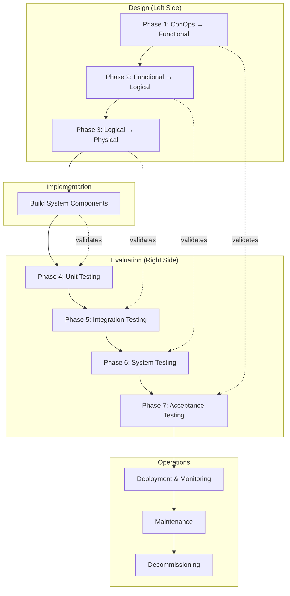

# Lifecycle - Water Quality Monitoring System

This lifecycle document defines the systematic engineering process for delivering the Clearwater Real-Time Water Quality Monitoring System, from architecture through operations and eventual decommissioning.

## Introduction

This lifecycle delivers the Clearwater Real-Time Water Quality Monitoring System as defined in [[architecture-water-quality-monitoring]]. The system transforms water quality monitoring from 48-hour manual sampling to real-time continuous monitoring at 25 distribution network points.

The lifecycle follows the V-model pattern, progressing through three design phases (Conceptual→Functional, Functional→Logical, Logical→Physical), implementation, and four evaluation phases (Unit, Integration, System, Acceptance) before entering operations. Each phase has explicit gates that verify outputs before proceeding.

**Stakeholders for Acceptance:**
- **Water Authority Management:** Approve system capabilities and budget alignment
- **Water System Operators:** Validate operational usability and workload impact
- **State EPA:** Confirm compliance reporting meets regulatory requirements
- **County Emergency Management:** Verify alerting integration with notification system

## Architecture Foundation

This lifecycle implements [[architecture-water-quality-monitoring]].

### Architecture Summary

| Layer | Description | Evaluation |
|-------|-------------|------------|
| Conceptual | Real-time detection and rapid response to water quality issues; 5 stakeholder needs; 5 acceptance criteria | Acceptance Testing |
| Functional | 5 functions: Sense, Integrate, Analyze, Alert, Report with defined inputs/outputs | System Testing |
| Logical | 5 components: Sensor Network, Data Platform, Analytics Engine, Alert Manager, Compliance Reporter | Integration Testing |
| Physical | Hach sensors, Azure IoT Hub, Python analytics, Twilio alerts, Power BI dashboards | Unit Testing |

### Key Requirements

The following requirements from the architecture drive this lifecycle:

1. **Detection Latency:** Real-time data with <5 minute latency (AC1)
2. **Unified Interface:** Single dashboard for network-wide status (AC2)
3. **Alert Speed:** Automated alerts within 2 minutes of exceedance (AC3)
4. **Compliance Automation:** Monthly reports with <1 hour manual review (AC4)
5. **Response Time:** Detection-to-response <15 minutes (AC5)

## V-Model Overview

## Design Phases

### Phase 1: ConOps to Functional Architecture

**Goal:** Transform stakeholder needs into system functions with clear inputs, outputs, and responsibilities.

**Inputs:**
- ConOps from architecture (conceptual layer)
- Stakeholder requirements (5 needs from architecture)
- Field survey context (actors and resources)

**Process:**
1. Review each stakeholder need and map to system functions
2. Define function boundaries (what each function does and does not do)
3. Specify inputs and outputs for each function
4. Document function interactions and data flows
5. Create functional flow diagram

**Outputs:**
- Functional requirements specification (5 functions with I/O)
- Function-to-need traceability matrix
- Functional flow diagram

**Verification Gate:**
- [ ] All 5 stakeholder needs map to at least one function
- [ ] Each function has defined inputs and outputs
- [ ] Functions collectively address all acceptance criteria
- [ ] Functional flow diagram reviewed by Water Authority technical lead

### Phase 2: Functional to Logical Architecture

**Goal:** Transform functions into design-independent components with clear interfaces.

**Inputs:**
- Functional requirements specification
- Interface constraints (SCADA integration, alerting requirements)
- Non-functional requirements (latency, reliability, security)

**Process:**
1. Group related functions into logical components
2. Define component responsibilities (single responsibility principle)
3. Specify component interfaces (APIs, data formats, protocols)
4. Document component interactions and dependencies
5. Create logical architecture diagram

**Outputs:**
- Component specifications (5 components with responsibilities)
- Interface definitions (data formats, protocols)
- Function-to-component traceability matrix
- Logical architecture diagram

**Verification Gate:**
- [ ] All functions map to at least one component
- [ ] Each component has single clear responsibility
- [ ] Interfaces defined for all component interactions
- [ ] No technology-specific decisions embedded in logical design
- [ ] Logical architecture reviewed by Water Authority technical lead

### Phase 3: Logical to Physical Architecture

**Goal:** Transform logical components into implementation specifications with concrete technology choices.

**Inputs:**
- Component specifications
- Technology constraints (budget, existing infrastructure, skills)
- Vendor evaluation results

**Process:**
1. Evaluate technology options for each component
2. Select technologies based on constraints and requirements
3. Specify implementation details (configurations, integrations)
4. Document deployment architecture (cloud, on-premises, edge)
5. Create physical architecture diagram

**Outputs:**
- Implementation specifications (8 elements with technologies)
- Technology selection rationale
- Component-to-implementation traceability matrix
- Physical architecture diagram
- Deployment plan outline

**Verification Gate:**
- [ ] All logical components have corresponding physical elements
- [ ] Technology choices fit within \$800K budget
- [ ] Selected technologies integrate with existing SCADA
- [ ] Deployment architecture addresses security requirements
- [ ] Physical architecture reviewed and approved by Water Authority IT

## Implementation Phase

**Goal:** Build the system according to physical architecture specifications.

**Inputs:**
- Physical architecture specifications
- Implementation standards (coding standards, configuration management)
- Development environment setup

**Process:**
1. Provision cloud infrastructure (Azure IoT Hub, SQL, Functions)
2. Configure sensor controllers and cellular connectivity
3. Develop analytics functions (Python threshold rules, anomaly detection)
4. Configure alerting workflows (Logic Apps, Twilio integration)
5. Build Power BI dashboards
6. Develop SCADA integration adapter
7. Document all configurations and code

**Outputs:**
- Implemented system components
- Configuration documentation
- Source code in version control
- Deployment scripts
- Implementation test results (developer testing)

**Verification Gate:**
- [ ] All 8 physical elements implemented
- [ ] Code reviewed and meets standards
- [ ] Developer testing completed with documented results
- [ ] Documentation complete for each component
- [ ] Implementation matches physical architecture specifications

## Evaluation Phases

### Phase 4: Unit Testing

**Goal:** Verify individual components meet physical specifications.

**Inputs:**
- Implemented components
- Physical architecture specifications
- Unit test criteria from architecture (UT1-UT6)

**Process:**
1. Test each Hach sensor against lab standards (UT1)
2. Test SC4500 controller buffering and reconnection (UT2)
3. Test Azure Functions with comprehensive parameter combinations (UT3)
4. Test Twilio alert delivery timing (UT4)
5. Test Power BI dashboard rendering (UT5)
6. Test OPC-UA adapter SCADA connectivity (UT6)

**Outputs:**
- Unit test results for all components
- Component verification evidence
- Defect log for any failures
- Remediation documentation

**Verification Gate:**
- [ ] UT1: All sensors within manufacturer accuracy specifications
- [ ] UT2: Controllers buffer 24 hours and reconnect successfully
- [ ] UT3: Functions correctly calculate all threshold combinations
- [ ] UT4: Alerts delivered within 30 seconds
- [ ] UT5: Dashboards render correctly for all test data
- [ ] UT6: OPC-UA adapter reads all required SCADA points

### Phase 5: Integration Testing

**Goal:** Verify component interactions meet logical architecture.

**Inputs:**
- Verified components (from unit testing)
- Logical architecture specifications
- Integration test criteria from architecture (IT1-IT5)

**Process:**
1. Connect sensors to data platform; verify transmission (IT1)
2. Integrate sensor and SCADA data streams (IT2)
3. Verify analytics receives complete data from platform (IT3)
4. Verify alert manager receives all assessment types (IT4)
5. Verify compliance reporter can query all required data (IT5)

**Outputs:**
- Integration test results
- Interface verification evidence
- End-to-end data flow validation
- Defect log for any integration issues

**Verification Gate:**
- [ ] IT1: <1% packet loss from sensors over 72 hours
- [ ] IT2: Sensor and SCADA data integrated without conflicts
- [ ] IT3: Analytics receives complete data stream with no gaps
- [ ] IT4: Alert manager routes all assessment types correctly
- [ ] IT5: Compliance reporter queries all required data successfully

### Phase 6: System Testing

**Goal:** Verify system functions meet functional requirements.

**Inputs:**
- Integrated system (from integration testing)
- Functional requirements specification
- System test criteria from architecture (ST1-ST5)

**Process:**
1. Test end-to-end data flow latency (ST1)
2. Simulate parameter exceedances and verify alerts (ST2)
3. Test 24-hour continuous operation with all sensors (ST3)
4. Generate compliance report and verify accuracy (ST4)
5. Simulate component failures and verify degradation handling (ST5)

**Outputs:**
- System test results
- Function verification evidence
- Performance test results
- Failure mode analysis

**Verification Gate:**
- [ ] ST1: End-to-end latency <5 minutes
- [ ] ST2: Alerts triggered within 2 minutes of exceedance
- [ ] ST3: No data loss over 24-hour continuous test
- [ ] ST4: Reports match manual calculations within 0.1%
- [ ] ST5: System handles failures with appropriate alerts

### Phase 7: Acceptance Testing

**Goal:** Validate system meets stakeholder needs (ConOps).

**Inputs:**
- Tested system (from system testing)
- ConOps / stakeholder requirements
- Acceptance criteria from architecture (AC1-AC5)

**Process:**
1. Demonstrate real-time data availability to stakeholders (AC1)
2. Operator walkthrough of unified dashboard (AC2)
3. Alert response drill with on-duty operators (AC3)
4. Compliance report review with Water Authority management (AC4)
5. Full detection-to-response drill simulating quality event (AC5)

**Outputs:**
- Acceptance test results
- Stakeholder sign-off documentation
- Training completion records
- Operational readiness assessment

**Validation Gate:**
- [ ] AC1: Stakeholders verify real-time data from 25 points with <5 min latency
- [ ] AC2: Operators confirm dashboard provides unified network view
- [ ] AC3: Alert drill achieves <2 minute notification time
- [ ] AC4: Management approves compliance report format and automation level
- [ ] AC5: Detection-to-response drill achieves <15 minute response
- [ ] Water Authority Management signs acceptance
- [ ] Water System Operators validate operational usability
- [ ] State EPA confirms compliance reporting approach
- [ ] Emergency Management verifies alert integration

## Operations Phase

### Deployment

**Goal:** Deploy accepted system to production.

**Process:**
1. Install sensors at 25 distribution network locations (phased over 2 weeks)
2. Activate cellular connectivity for each sensor
3. Cutover to production Azure environment
4. Enable alerting to on-duty operators
5. Transition from manual sampling to real-time monitoring (parallel operation for 30 days)
6. Communicate go-live to stakeholders

**Outputs:**
- Deployed system at all 25 locations
- Deployment documentation
- Go-live communication
- Parallel operation comparison report

### Monitoring

**Goal:** Continuously monitor system health and performance.

**Monitoring Requirements:**

| Metric | Target | Alert Threshold |
|--------|--------|-----------------|
| Sensor uptime | 99.5% per sensor | <95% over 24 hours |
| Data latency | <5 minutes | >10 minutes |
| Alert delivery success | 100% | Any failure |
| Azure service health | 99.9% | Degraded status |
| Dashboard availability | 99% | Unavailable >5 minutes |

**Process:**
1. Azure Monitor configured for all cloud services
2. Sensor connectivity monitoring via IoT Hub
3. Daily automated health check report
4. Weekly performance review by operations team
5. Monthly dashboard availability review

### Maintenance

**Goal:** Maintain system health and address issues.

**Maintenance Types:**

| Type | Trigger | Process |
|------|---------|---------|
| Corrective | Defect or failure reported | Triage → Root cause → Fix → Test → Deploy |
| Adaptive | Azure service changes, regulatory updates | Impact assessment → Update → Test → Deploy |
| Perfective | Enhancement request, performance improvement | Evaluate → Prioritize → Implement → Test → Deploy |
| Preventive | Scheduled sensor calibration (annual), infrastructure updates | Schedule → Execute → Verify → Document |

**Change Management:**
- All changes logged in change management system
- Minor changes (configuration) approved by operations lead
- Major changes (code, infrastructure) approved by Water Authority IT
- Emergency changes documented within 24 hours of implementation
- Changes affecting compliance reporting require EPA notification

**Sensor Calibration Schedule:**
- Chlorine sensors: Calibration every 6 months
- Turbidity sensors: Calibration annually
- pH sensors: Calibration every 6 months
- All sensors: Annual preventive maintenance inspection

## Decommissioning

### Decommissioning Triggers

| Trigger | Description |
|---------|-------------|
| Technology Obsolescence | Azure services deprecated or sensors end-of-life without replacement path |
| Regulatory Change | EPA requirements change making current approach non-compliant |
| System Replacement | New generation system deployed that supersedes this system |
| Budget Elimination | County eliminates funding for real-time monitoring |
| Infrastructure Change | Distribution network restructured making sensor placement invalid |

### Decommissioning Process

1. **Stakeholder Notification:** Notify Water Authority management, EPA, and emergency management of decommissioning decision and timeline (minimum 90 days notice)
2. **Data Preservation:** Export all historical data to long-term archive (Azure Blob with 7-year retention); document data format and access procedures
3. **Compliance Transition:** Coordinate with EPA on return to manual sampling or transition to replacement system; ensure no compliance gaps
4. **Service Transition:** If replacing with new system, run parallel operations during transition; if discontinuing, restore manual sampling procedures
5. **Resource Cleanup:** Remove sensors from field locations; decommission Azure resources; return controllers to inventory or dispose per county policy
6. **Documentation Archival:** Archive all system documentation, configurations, and procedures; document lessons learned

### Post-Decommissioning

- Historical data retained in Azure Blob storage for 7 years (regulatory requirement)
- System documentation archived in county document management system
- Sensors and controllers inventoried or disposed per county asset policy
- Lessons learned incorporated into future system planning

## Traceability Matrix

| Architecture Layer | Design Phase | Implementation | Evaluation Phase |
|--------------------|--------------|----------------|------------------|
| Conceptual (ConOps) | Phase 1: ConOps → Functional | Stakeholder requirements document | Phase 7: Acceptance Testing |
| Functional | Phase 2: Functional → Logical | Functional requirements specification | Phase 6: System Testing |
| Logical | Phase 3: Logical → Physical | Component specifications | Phase 5: Integration Testing |
| Physical | Implementation | Implemented components | Phase 4: Unit Testing |

## Key Properties

### Test-Driven Development

Each design phase produces testable outputs that drive corresponding evaluation phases. The V-model ensures that acceptance criteria defined at the conceptual level are validated through acceptance testing, creating end-to-end traceability.

### Gate-Based Progression

No phase begins until the preceding phase passes its verification or validation gate. This prevents defects from propagating and ensures each phase builds on a solid foundation.

### Human Validation at Acceptance

While verification gates (Phases 1-6) use automated or semi-automated checks, the acceptance testing gate (Phase 7) requires explicit human validation from each stakeholder group. This ensures the system meets not just specifications but actual stakeholder needs.

### Phased Deployment Risk Reduction

Deployment proceeds in phases (sensors installed over 2 weeks, parallel operation for 30 days) to reduce risk and allow early detection of field issues before full commitment.

### Continuous Operations Feedback

Operations monitoring feeds back into maintenance processes. Metrics that consistently miss targets trigger adaptive or perfective maintenance to improve system performance.

## Risk Considerations

| Risk | Impact | Mitigation |
|------|--------|------------|
| Design phase delays | Schedule slip | Time-boxed phases with clear exit criteria |
| Integration failures | Rework, schedule slip | Dedicated integration test environment; early integration testing |
| Acceptance criteria misunderstanding | Stakeholder rejection | Stakeholder involvement in all design reviews |
| Deployment failures | System unavailable | Phased deployment; rollback procedures documented |
| Operations knowledge loss | Degraded support | Documentation requirements; cross-training plan |

---

**Note:** This lifecycle implements the V-model for delivering the Water Quality Monitoring System, ensuring traceability from stakeholder needs through validation. Each phase has explicit gates that must pass before proceeding, with human validation required at the acceptance testing phase.
