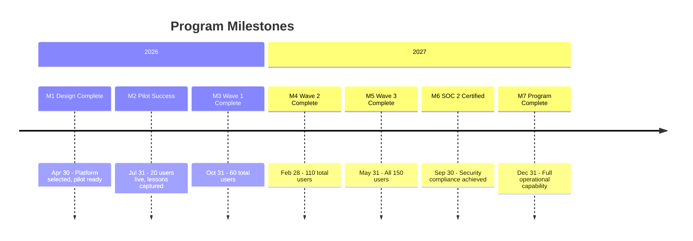

# Program Memo - Digital Transformation Program

This memo provides an executive summary of the Meridian Consulting Group Digital Transformation Program, synthesizing the field survey, architecture, lifecycle, and program plan into a single reference for stakeholders.

## Program Overview

Meridian Consulting Group is a 150-person professional services firm facing critical technology and operational challenges. Founded in 1998 and grown through acquisition, the firm operates with fragmented systems, inconsistent processes, and a culture that relies on senior partner relationships rather than institutionalized knowledge management.

Three forcing functions demand immediate action:

1. **Client Expectations:** Enterprise clients require secure collaboration platforms, real-time project dashboards, and demonstrated data governance—capabilities Meridian currently lacks
2. **Competitive Pressure:** Competitors offer integrated technology stacks that Meridian cannot match with current infrastructure
3. **Workforce Demographics:** 40% of staff are under 35 and expect modern tools; senior partners retiring within 5 years hold institutional knowledge that must be captured

The current state is unsustainable: $800K annual productivity loss from document management inefficiency, three lost RFPs citing technology gaps ($2M+ revenue opportunity), end-of-support email servers creating security exposure, and inability to pass enterprise security assessments limiting addressable market.

| Attribute | Value |
|-----------|-------|
| **Sponsor** | Managing Partner Committee |
| **Recipient** | All Meridian Consulting Group |
| **Target Completion** | December 2027 |
| **Budget** | \$2.5M over 24 months |

> **Details:** See [[field-survey-digital-transformation]] for complete stakeholder inventory, resource analysis, pain points, and readiness assessment.

## What We're Building

### Goal State

The program delivers a modern, integrated technology platform enabling Meridian to compete effectively for enterprise clients, capture institutional knowledge before partner retirements, and provide the collaborative environment that attracts and retains talent. Staff can find any document in seconds, collaborate seamlessly across locations, and demonstrate security compliance to clients.

### Key Components

- **Cloud Collaboration Platform:** Microsoft 365 with Teams, SharePoint, and OneDrive replacing on-premises email and file servers
- **Knowledge Management System:** Searchable repository with AI-assisted discovery capturing institutional expertise
- **Integrated CRM:** Salesforce or Dynamics 365 providing pipeline visibility and client relationship management
- **Modern Business Systems:** Cloud-based time/expense, integrated with accounting for real-time financial visibility
- **Security Infrastructure:** Zero Trust architecture with SOC 2 Type II compliance enabling enterprise client work

### Success Criteria

- Document search time reduced from 30 minutes to under 2 minutes
- SOC 2 Type II certification achieved by Month 18
- 85% staff adoption of core platform features by Month 24
- New consultant ramp time reduced from 6 months to 3 months
- Client security assessments passed without remediation findings
- Month-end close reduced from 10 days to 3 days

> **Details:** See [[architecture-digital-transformation]] for complete architecture documentation including capability model, technology selections, and security design.

## How We're Building It

### Development Approach

The program follows a V-model lifecycle designed to manage change across a 150-person organization while maintaining client delivery. A phased rollout strategy—Pilot (20 users), Wave 1 (40), Wave 2 (50), Wave 3 (40)—enables learning and refinement before firm-wide deployment.

This systematic approach ensures:
- Change Champions network prepares the organization for each wave
- Each phase verified before proceeding to next
- Adoption support and training precede each deployment
- Rollback capability maintained until stabilization confirmed

### Key Phases

| Phase Group | Purpose | Duration |
|-------------|---------|----------|
| Design | Requirements, architecture, platform selection, pilot preparation | 4 months |
| Implementation | Phased rollout across 4 waves with training and support | 14 months |
| Evaluation | Integration testing, security certification, acceptance | 4 months |
| Operations | Steady-state operations, continuous improvement, knowledge growth | Ongoing |

### Quality Assurance

The program distinguishes verification (confirming technical implementation meets specifications) from validation (confirming the solution meets stakeholder needs). Quality gates at each phase transition require explicit sign-off. The Champions network provides ongoing feedback to identify adoption barriers and usability issues before they become systemic.

> **Details:** See [[lifecycle-digital-transformation]] for complete lifecycle documentation including phase details, gate criteria, and change management approach.

## Execution Summary

### Timeline

### Team and Resources

| Resource | Allocation |
|----------|------------|
| Total Budget | \$2.5M |
| Technology & Licensing | \$975K |
| Implementation Services | \$625K |
| Training & Adoption | \$250K |
| Change Management | \$200K |
| Contingency | \$250K |
| Program Duration | 24 months |
| Expected Annual Benefit | \$1.55M (productivity + reduced turnover + new revenue) |

### Top Risks

| Risk | Impact | Mitigation |
|------|--------|------------|
| Partner resistance to change | High - adoption failure | Executive sponsorship visible; Champions from each practice; early wins communicated |
| Data migration errors | High - lost documents, broken links | Phased migration with validation; parallel operation period; rollback capability |
| Implementation partner performance | Medium - delays and rework | Milestone-based payments; weekly progress reviews; reference checks |
| Scope creep from practices | Medium - budget pressure | Governance board controls scope; change request process; reserve contingency |
| Staff productivity dip during transition | Medium - client delivery risk | Wave approach limits concurrent disruption; super-user support; buffer time |

> **Details:** See [[program-plan-digital-transformation]] for complete program plan including work breakdown, RACI matrix, full risk register, and governance structure.

## Document Package

This memo summarizes the following documentation package:

| Document | Purpose | When to Consult |
|----------|---------|-----------------|
| [[field-survey-digital-transformation]] | Establishes context | Stakeholder details, resource inventory, pain points, readiness |
| [[architecture-digital-transformation]] | Defines what we're building | Capability model, technology selections, security design |
| [[lifecycle-digital-transformation]] | Defines how we build it | Phase details, quality gates, change management |
| [[program-plan-digital-transformation]] | Defines execution plan | Schedules, budgets, team assignments, full risk register |
| This Memo | Executive summary | Quick orientation, partner briefings, stakeholder updates |

### Document Currency

| Document | Version | Last Updated |
|----------|---------|--------------|
| Field Survey | 1.0.0 | 2026-01-05 |
| Architecture | 1.0.0 | 2026-01-05 |
| Lifecycle | 1.0.0 | 2026-01-05 |
| Program Plan | 1.0.0 | 2026-01-05 |
| This Memo | 1.0.0 | 2026-01-05 |

## Approval and Accountability

| Role | Name | Date |
|------|------|------|
| Prepared By | Claude (LLM-assisted, dry run) | 2026-01-05 |
| Reviewed By | (Test document - not reviewed) | - |
| Approved By | (Test document - not approved) | - |

### Accountability Statement

This memo synthesizes information from the field survey, architecture, lifecycle, and program plan documents. It provides executive-level understanding of the program but should not substitute for source documents when detailed information is required.

The Transformation Program Manager is responsible for keeping this memo current with any changes to the underlying documentation. Material changes to scope, timeline, or budget require memo update within 5 business days and notification to all Managing Partner Committee members.

---

**Note:** This program memo was created as part of a runbook demonstration. In production, this memo would require human review and approval before distribution to firm leadership and stakeholders.
