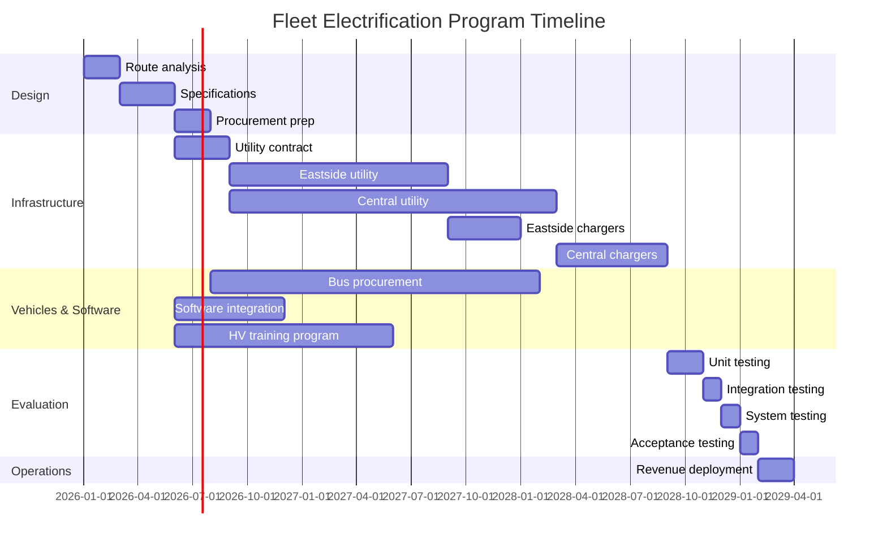
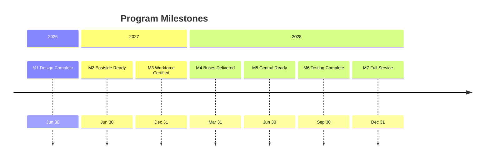

# Program Plan - Bus Fleet Electrification

This program plan operationalizes the MRTA Fleet Electrification System architecture through the defined lifecycle, equipping execution with teams, timelines, resources, and risk management.

## Executive Summary

The MRTA Fleet Electrification Program Phase 1 will replace 60 aging diesel buses with battery-electric buses and install depot charging infrastructure at both maintenance facilities. This positions MRTA to meet the state mandate of 50% zero-emission fleet by 2032 and establishes the foundation for 100% electrification by 2040.

**Key Deliverables:**
- 60 New Flyer XE40 battery-electric buses
- 60 ABB 150kW depot chargers across two facilities
- Utility interconnection upgrades (Eastside: 1.5→3MW, Central: 0.8→4MW)
- ChargePoint fleet management integrated with existing Trapeze system
- 45 maintenance technicians with high-voltage certification

**Timeline:** 36 months (January 2026 - December 2028)

**Budget:** \$45M total (\$38M federal/state grants, \$7M local match)

**Key Risks:** Utility upgrade delay (18-24 month lead time), bus delivery delay, workforce training completion. All risks have identified mitigations with infrastructure work starting first to address sequencing.

**Confidence Statement:** This program has HIGH confidence for on-time delivery based on: proven technology from peer agencies, conservative infrastructure sequencing, strong grant funding commitment, and union support for workforce transition. Budget confidence is MEDIUM due to potential construction cost escalation; contingency addresses this.

## Scope and Objectives

### Program Scope

**In Scope:**
- 60 battery-electric buses to replace retiring diesel fleet
- Charging infrastructure at both depots (20 chargers Eastside, 40 chargers Central)
- Utility service upgrades at both locations
- ChargePoint charging management system
- Trapeze EV module integration
- High-voltage safety training for all 45 maintenance technicians
- 30-day operational validation period

**Out of Scope:**
- Remaining 120 diesel buses (future phases)
- On-route charging infrastructure (future consideration)
- Paratransit fleet electrification (separate program)
- Facility building modifications beyond electrical (separate capital project)

### Objectives

| Objective | Success Criteria | Architecture Trace |
|-----------|-----------------|-------------------|
| O1: Deploy electric fleet | 60 buses operational in revenue service | AC1: Electric buses operational |
| O2: Ensure route reliability | Zero range-related service failures for 30 days | AC2: Route completion |
| O3: Maintain fleet availability | Electric fleet ≥85% availability | AC3: Fleet availability |
| O4: Prepare workforce | 45 technicians HV-certified before bus arrival | AC4: Workforce readiness |
| O5: Enable overnight charging | Full fleet charged during 6-hour overnight window | AC5: Charging capacity |
| O6: Integrate fleet management | SOC tracking and optimization operational | AC6: System integration |

### Constraints

- **Budget:** \$45M total capital; federal grants require 20% local match
- **Timeline:** Phase 1 complete by December 2028 to support 2032 mandate trajectory
- **Infrastructure Sequencing:** Utility upgrade must precede charger installation; chargers must precede bus delivery
- **Grant Compliance:** FTA Buy America requirements; ADA compliance; useful life tracking
- **Labor:** Union agreement requires negotiated training provisions; no layoffs during transition
- **Service:** No service reductions; all routes must remain operational during transition

### Assumptions

- State ZETF funding continues through 2028 as authorized
- Pacific Power proceeds with grid upgrade on committed timeline
- New Flyer maintains 18-month delivery schedule
- ATU Local 1287 ratifies training provisions in 2027 contract negotiation
- Battery technology remains stable (no mid-program obsolescence)

## Execution Approach

### Lifecycle Summary

This program follows the V-model lifecycle defined in [[lifecycle-bus-electrification]]. The lifecycle addresses the infrastructure-vehicle sequencing challenge unique to fleet electrification:

- **Design phases** establish requirements, component specifications, and technology selections
- **Implementation** executes four parallel streams: infrastructure, vehicles, software, workforce
- **Evaluation phases** verify components, integration, system function, and stakeholder acceptance
- **Operations** transitions to sustained fleet management with monitoring and maintenance

The V-model creates design-evaluation symmetry: conceptual requirements validate through acceptance testing, functional requirements through system testing, logical components through integration testing, and physical elements through unit testing.

### Phase Overview

| Phase Group | Phases | Duration | Key Activities | Gate Type |
|-------------|--------|----------|----------------|-----------|
| Design | ConOps→Functional, Functional→Logical, Logical→Physical | 6 months | Route analysis, specifications, technology selection, procurement prep | Verification |
| Implementation | Infrastructure, Vehicles, Software, Workforce (parallel) | 24 months | Utility upgrade, charger install, bus procurement, training | Verification |
| Evaluation | Unit, Integration, System, Acceptance Testing | 4 months | Component testing, integration, 30-day operational validation | Verification / Validation |
| Operations | Deploy, Monitor, Maintain | Ongoing | Revenue service deployment, performance monitoring | Validation |

### Verification and Validation Strategy

**Verification Gates (automated/document-based):**
- Design phase gates verify specifications completeness through document review
- Implementation gates verify work completion through inspection and commissioning
- Unit testing verifies components meet specifications through defined test procedures
- Integration testing verifies interfaces work through automated and manual tests
- System testing verifies functions operate end-to-end

**Validation Gates (human approval required):**
- Acceptance testing requires explicit sign-off from: MRTA Leadership, Maintenance Technicians, Bus Operators, Utility, State DOT
- Operational readiness requires safety certification before revenue service
- Final acceptance requires 30-day successful operation demonstration

## Work Breakdown

### Activity Structure

| ID | Activity | Phase | Dependencies | Estimated Effort |
|----|----------|-------|--------------|------------------|
| A1 | Route analysis and electrification planning | Design | - | 2 months |
| A2 | Specifications and technology selection | Design | A1 | 3 months |
| A3 | Procurement preparation and RFP | Design | A2 | 2 months |
| A4 | Utility interconnection design and contract | Implementation | A2 | 3 months |
| A5 | Eastside utility upgrade construction | Implementation | A4 | 12 months |
| A6 | Central utility upgrade construction | Implementation | A4 | 18 months |
| A7 | Bus procurement and production | Implementation | A3 | 18 months |
| A8 | Eastside charger installation | Implementation | A5 | 4 months |
| A9 | Central charger installation | Implementation | A6 | 6 months |
| A10 | Software configuration and integration | Implementation | A2 | 6 months |
| A11 | Technician HV training program | Implementation | A2 | 12 months |
| A12 | Unit testing (buses, chargers, software) | Evaluation | A7, A8, A9, A10 | 2 months |
| A13 | Integration testing | Evaluation | A12 | 1 month |
| A14 | System testing | Evaluation | A13 | 1 month |
| A15 | Acceptance testing | Evaluation | A14 | 1 month |
| A16 | Revenue service deployment | Operations | A15 | 2 months |

### Critical Path

The critical path runs through: A1 → A2 → A4 → A6 → A9 → A12 → A13 → A14 → A15 → A16

**Critical path duration:** 36 months

**Critical path analysis:**
- Central Depot utility upgrade (A6, 18 months) is the longest single activity
- Infrastructure must complete before charger installation; chargers before bus testing
- Bus procurement (A7, 18 months) runs parallel but is NOT on critical path
- Workforce training (A11) runs parallel; must complete before A12

## Teams and Responsibilities

### Team Structure

| Team | Lead | Responsibilities | Phases |
|------|------|-----------------|--------|
| Program Management Office | Sarah Johnson (MRTA Capital Projects) | Program coordination, budget management, stakeholder communication, risk management | All |
| Infrastructure Team | Pacific Power + MRTA Facilities | Utility upgrades, charger installation, commissioning | Implementation, Evaluation |
| Fleet Acquisition | David Park (MRTA Procurement) | Bus procurement, factory oversight, delivery coordination | Design, Implementation, Evaluation |
| Technology Integration | Maria Santos (MRTA IT) | Software configuration, Trapeze integration, data systems | Implementation, Evaluation |
| Workforce Development | ATU 1287 + MRTA Training | HV training curriculum, certification, operator training | Implementation, Evaluation |

### RACI Matrix

| Activity | PMO | Infrastructure | Fleet | Technology | Workforce | Sponsor |
|----------|-----|----------------|-------|------------|-----------|---------|
| A1: Route analysis | A | I | C | C | I | I |
| A2: Specifications | A | C | R | R | C | I |
| A3: Procurement prep | A | I | R | I | I | I |
| A4: Utility contract | A | R | I | I | I | I |
| A5-A6: Utility construction | I | R | I | I | I | I |
| A7: Bus procurement | A | I | R | I | I | I |
| A8-A9: Charger install | I | R | I | C | I | I |
| A10: Software config | I | C | I | R | I | I |
| A11: HV training | I | I | I | I | R | I |
| A12-A15: Testing | A | R | R | R | R | I |
| A16: Deployment | A | C | R | R | C | I |

**Legend:** R = Responsible, A = Accountable, C = Consulted, I = Informed

### External Dependencies

| External Party | Dependency | Impact if Delayed | Mitigation |
|----------------|------------|-------------------|------------|
| Pacific Power | Utility upgrade completion | Chargers cannot be installed; buses stranded | Contractual schedule with liquidated damages; early start |
| New Flyer | Bus delivery on schedule | Testing delayed; revenue service delayed | Factory visits; milestone payments; schedule contingency |
| ABB | Charger delivery and commissioning | Testing delayed | Order with 6-month lead time; domestic inventory |
| ChargePoint | Software delivery and configuration | Integration testing delayed | Early engagement; standard product configuration |
| State DOT | Grant fund disbursement | Cash flow issues | Quarterly drawdown requests; working capital reserve |

## Timeline and Milestones

### Milestone Schedule

| Milestone | Target Date | Criteria | Dependencies |
|-----------|-------------|----------|--------------|
| M1: Design Complete | 2026-06-30 | All specifications approved; utility contract signed; bus RFP issued | A1, A2, A3, A4 |
| M2: Eastside Infrastructure Ready | 2027-06-30 | Utility upgrade complete; chargers installed and commissioned | A5, A8 |
| M3: Workforce Certified | 2027-12-31 | All 45 technicians HV-certified | A11 |
| M4: Buses Delivered | 2028-03-31 | All 60 buses received and inspected | A7 |
| M5: Central Infrastructure Ready | 2028-06-30 | Utility upgrade complete; chargers installed and commissioned | A6, A9 |
| M6: Testing Complete | 2028-09-30 | All testing phases passed; acceptance sign-off obtained | A12-A15 |
| M7: Full Revenue Service | 2028-12-31 | All 60 buses in revenue service; 30-day validation complete | A16 |

### Schedule Visualization

### Schedule Confidence

**Overall Confidence: HIGH for schedule; MEDIUM for budget**

Basis for estimate:
- Pacific Power has completed similar transit agency projects; timeline validated with their engineering
- New Flyer production schedule confirmed; slot reserved in 2026 factory plan
- Technician training timeline based on OEM curriculum; peer agency experience
- Schedule includes 3-month buffer between M6 (Testing Complete) and M7 (Full Service)

**Risk factors:**
- Central utility upgrade is critical path with little float
- Supply chain disruptions could affect charger delivery
- Labor availability for construction trades uncertain

## Resource Requirements

### Personnel

| Role | Count | Duration | Skills Required |
|------|-------|----------|-----------------|
| Program Manager | 1 | 36 months (1.0 FTE) | Capital project management, transit experience |
| Infrastructure Manager | 1 | 30 months (0.75 FTE) | Electrical construction, utility coordination |
| Fleet Manager | 1 | 24 months (0.5 FTE) | Procurement, vehicle acceptance |
| Technology Lead | 1 | 18 months (0.5 FTE) | Fleet management systems, integration |
| Training Coordinator | 1 | 18 months (0.5 FTE) | Technical training, certification tracking |

### Budget

| Category | Estimate | Confidence | Notes |
|----------|----------|------------|-------|
| Electric Buses (60) | \$27,000,000 | High | \$450K/bus including ZETF offset |
| Charging Equipment (60) | \$4,200,000 | High | \$70K/charger installed |
| Utility Upgrades | \$6,500,000 | Medium | Eastside \$1.5M + Central \$5M |
| Software & Integration | \$800,000 | High | ChargePoint + Trapeze EV module |
| Training | \$500,000 | High | OEM training + certification fees |
| Project Management | \$1,200,000 | High | Internal staff + consultants |
| Contingency (10%) | \$4,000,000 | - | Construction cost escalation reserve |
| **Total Capital** | **\$44,200,000** | | Within \$45M budget |

**Funding Sources:**

| Source | Amount | Status |
|--------|--------|--------|
| FTA 5339 (Low-No Program) | \$18,000,000 | Application submitted; high probability |
| State ZETF | \$15,000,000 | Pre-qualified; formal application Q2 2026 |
| FTA 5307 (Formula - flex) | \$5,000,000 | Available; board authorization required |
| MRTA Local Match | \$7,000,000 | Budgeted in capital plan |
| **Total** | **\$45,000,000** | |

### Infrastructure and Tools

| Resource | Purpose | Procurement |
|----------|---------|-------------|
| Electric Bus Fleet | Revenue service vehicles | New Flyer procurement |
| Depot Chargers | Overnight charging | ABB procurement |
| ChargePoint Fleet | Charging management | Software license |
| Trapeze EV Module | Fleet management integration | Existing vendor add-on |
| Telematics | Vehicle monitoring | Included with buses |

## Risks and Mitigations

### Risk Register

| ID | Risk | Probability | Impact | Mitigation | Owner |
|----|------|-------------|--------|------------|-------|
| R1 | Central utility upgrade delay | Medium | High | Early contract execution; liquidated damages; Eastside-first | Infrastructure Team |
| R2 | Bus delivery delay | Low | High | Factory visits; milestone payments; 3-month schedule buffer | Fleet Acquisition |
| R3 | Training completion delay | Medium | High | Start 9 months early; multiple cohorts; weekly tracking | Workforce Development |
| R4 | Construction cost escalation | Medium | Medium | 10% contingency; early procurement; fixed-price contracts | PMO |
| R5 | Grant funding reduction | Low | High | Diversified sources; multi-year commitments; phase spending | PMO |
| R6 | Integration issues | Medium | Medium | Early integration testing; vendor support contracts | Technology Integration |
| R7 | Charger reliability issues | Low | Medium | N+2 redundancy; 4-hour service SLA; spare parts inventory | Infrastructure Team |
| R8 | Range shortfall in service | Low | High | Conservative route assignment; 20% buffer; mid-day charge option | Fleet Acquisition |

### Risk Matrix

|  | Low Impact | Medium Impact | High Impact |
|---|------------|---------------|-------------|
| **High Prob** | | | |
| **Medium Prob** | | R4, R6 | R1, R3 |
| **Low Prob** | | R7 | R2, R5, R8 |

### Contingency Plans

**R1 - Central Utility Delay:**
If utility upgrade falls more than 3 months behind:
1. Deploy all 60 buses to Eastside initially (charger sharing increases charge time)
2. Implement mid-day charging rotation for Central routes
3. Negotiate utility acceleration with cost sharing
4. Report schedule impact to State DOT; request extension if needed

**R3 - Training Delay:**
If technician certification falls behind schedule:
1. Prioritize first cohort (20 technicians) to enable initial bus acceptance
2. Extend OEM on-site support period (budget from contingency)
3. Temporarily restrict electric bus maintenance to certified technicians only
4. Implement overtime training sessions (union coordination required)

## Deliverables and Acceptance

### Deliverable Schedule

| Deliverable | Milestone | Acceptance Criteria | Recipient |
|-------------|-----------|---------------------|-----------|
| D1: Design Package | M1 | Specifications approved; procurement ready | MRTA Leadership |
| D2: Eastside Charging | M2 | 20 chargers commissioned; utility energized | Operations Division |
| D3: Certified Workforce | M3 | 45 technicians with HV certification | Operations Division |
| D4: Electric Bus Fleet | M4 | 60 buses received; factory acceptance complete | Operations Division |
| D5: Central Charging | M5 | 40 chargers commissioned; utility energized | Operations Division |
| D6: Integrated System | M6 | All testing passed; stakeholder sign-off | Operations Division |
| D7: Operational Fleet | M7 | 60 buses in revenue service; 30-day validation | Operations Division |

### Acceptance Process

1. **Technical Acceptance:** MRTA Operations reviews and approves technical deliverables (D1-D5)
2. **Safety Acceptance:** Safety Committee certifies HV procedures and training adequacy (D3)
3. **System Acceptance:** Technology team validates integration and reporting (D6)
4. **Stakeholder Acceptance:** Leadership, Operations, Union, Utility, DOT sign acceptance (D6)
5. **Final Acceptance:** MRTA Board accepts program completion (D7)

## Operations and Assessment

### Governance Structure

| Body | Membership | Cadence | Authority |
|------|------------|---------|-----------|
| Program Steering Committee | MRTA CEO, CFO, COO, State DOT Rep | Monthly | Budget approval, scope changes, risk escalation |
| Program Team | PMO + Team Leads | Weekly | Task coordination, issue resolution |
| Technical Working Group | Technology + Infrastructure Leads | Bi-weekly | Technical decisions, integration issues |
| Labor-Management Committee | MRTA HR + ATU Leadership | Monthly | Workforce issues, training coordination |

### Progress Reporting

| Report | Frequency | Audience | Content |
|--------|-----------|----------|---------|
| Weekly Status | Weekly | Program Team | Task status, issues, next week |
| Monthly Dashboard | Monthly | Steering Committee | Milestones, budget, risks, schedule |
| Quarterly Grant Report | Quarterly | State DOT, FTA | Expenditures, progress, compliance |
| Board Update | Quarterly | MRTA Board | Executive summary, key decisions |

### Performance Metrics

| Metric | Target | Measurement Method |
|--------|--------|-------------------|
| Schedule Performance Index | ≥0.95 | Earned value: EV/PV |
| Cost Performance Index | ≥0.90 | Earned value: EV/AC |
| Training Completion Rate | 100% by M3 | Certifications issued / 45 |
| Infrastructure On-Time | 100% | Milestones M2, M5 met |
| Grant Compliance | 100% | No audit findings |

### Change Management

**Change Request Process:**
1. Submit change request with scope, schedule, budget impact
2. PMO assesses impact and prepares recommendation
3. Changes <\$100K or <1 month: PMO approval
4. Changes \$100K-\$500K or 1-3 months: Steering Committee approval
5. Changes >\$500K or >3 months: Board approval + DOT notification

**Grant Impact Policy:**
Changes affecting grant-funded scope require State DOT approval before implementation.

---

**Note:** This program plan executes Phase 1 of MRTA's fleet electrification, delivering 60 electric buses and supporting infrastructure. The plan addresses the infrastructure sequencing challenge by starting utility work first and running workforce development in parallel.
