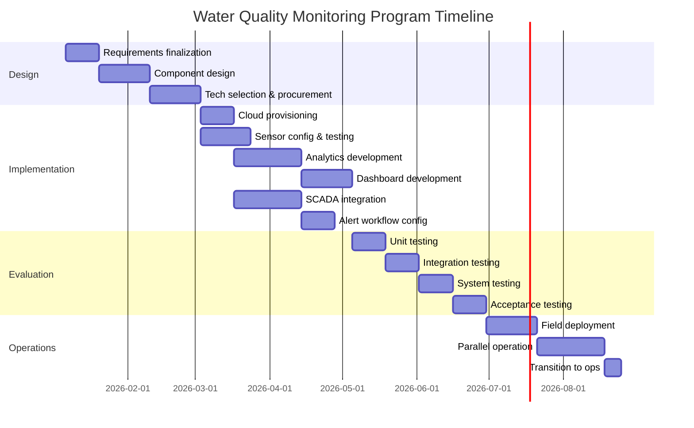
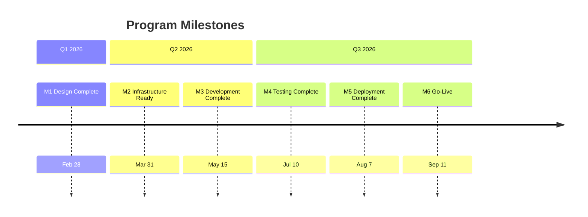

# Program Plan - Water Quality Monitoring System

This program plan operationalizes the Clearwater Real-Time Water Quality Monitoring System architecture through the defined lifecycle, equipping execution with teams, timelines, resources, and risk management.

## Executive Summary

The Clearwater Real-Time Water Quality Monitoring Program will deploy continuous water quality monitoring at 25 distribution network points, reducing detection-to-response time from 48 hours to under 15 minutes. This program directly addresses the vulnerabilities exposed by three water quality incidents in the past 18 months.

**Key Deliverables:**
- 25 water quality sensors deployed across the distribution network
- Unified data platform integrating sensors with existing SCADA
- Automated alerting to operators and emergency management
- Compliance reporting automation reducing manual effort by 80%

**Timeline:** 9 months (January 2026 - September 2026)

**Budget:** \$780K capital investment plus \$93K annual operating costs

**Key Risks:** SCADA integration complexity, sensor site cellular coverage, operator adoption. All risks have identified mitigations and owners.

**Confidence Statement:** This program has HIGH confidence for on-time, on-budget delivery based on: proven technology selections, conservative schedule with contingency, dedicated project team, and strong executive sponsorship. The Water Authority board has approved funding and expressed commitment to the program's success following the 2025 incidents.

## Scope and Objectives

### Program Scope

**In Scope:**
- Real-time monitoring sensors at 25 distribution network locations
- Cloud-based data platform on Azure
- SCADA integration via OPC-UA adapter
- Automated alerting via SMS and voice
- Power BI dashboards for operators and management
- Compliance reporting automation
- Operator training and documentation
- 30-day parallel operation period

**Out of Scope:**
- Treatment plant process monitoring (existing SCADA sufficient)
- Source water quality monitoring (separate program)
- Customer-facing water quality portal (future phase)
- Predictive analytics and machine learning (future phase)

### Objectives

| Objective | Success Criteria | Architecture Trace |
|-----------|-----------------|-------------------|
| O1: Deploy real-time monitoring network | 25 sensors operational with <5 min data latency | AC1: Real-time data availability |
| O2: Provide unified operator interface | Single dashboard shows all sensor and SCADA data | AC2: Unified dashboard |
| O3: Enable automated alerting | Threshold exceedances generate alerts within 2 minutes | AC3: Automated alert speed |
| O4: Automate compliance reporting | Monthly reports generated with <1 hour manual review | AC4: Compliance automation |
| O5: Reduce detection-to-response time | Detection-to-response <15 minutes demonstrated in drill | AC5: Response time validation |

### Constraints

- **Budget:** \$800K capital budget approved by Water Authority board; operating costs must fit existing budget
- **Timeline:** System must be operational before next summer peak demand (July 2026)
- **Integration:** Must integrate with existing Wonderware SCADA without disrupting operations
- **Staffing:** No new permanent staff; existing operators must be able to manage system
- **Procurement:** Must follow county procurement requirements (competitive bids >\$50K)

### Assumptions

- Azure cloud services remain available per SLA
- Hach sensors available from distributor with 4-week lead time
- Cellular coverage adequate at 22 of 25 sites (3 sites may need boosters)
- Operators can be trained within 2 days per shift team
- State EPA will accept automated reports as valid compliance documentation

## Execution Approach

### Lifecycle Summary

This program follows the V-model lifecycle defined in [[lifecycle-water-quality-monitoring]]. The lifecycle ensures traceability from stakeholder needs through validation:

- **Design phases** progressively refine requirements into implementation specifications
- **Implementation** builds system components according to physical architecture
- **Evaluation phases** systematically verify each layer, culminating in stakeholder acceptance
- **Operations** deploys and maintains the system with defined monitoring and maintenance processes

The V-model creates design-evaluation symmetry: conceptual requirements map to acceptance testing, functional requirements to system testing, logical components to integration testing, and physical elements to unit testing.

### Phase Overview

| Phase Group | Phases | Duration | Key Activities | Gate Type |
|-------------|--------|----------|----------------|-----------|
| Design | ConOps→Functional, Functional→Logical, Logical→Physical | 8 weeks | Requirements analysis, component design, technology selection, procurement | Verification |
| Implementation | Build components | 10 weeks | Cloud setup, sensor configuration, analytics development, dashboard creation | Verification |
| Evaluation | Unit, Integration, System, Acceptance Testing | 8 weeks | Component testing, integration testing, end-to-end validation, stakeholder acceptance | Verification / Validation |
| Operations | Deploy, Monitor, Maintain | Ongoing | Phased sensor deployment, parallel operation, transition to operations | Validation |

### Verification and Validation Strategy

**Verification Gates (automated, per-phase):**
- Design phase gates verify completeness and traceability through document reviews
- Implementation gate verifies code quality and test coverage through automated tools
- Unit and integration testing gates use automated test suites with defined pass criteria
- System testing gates use automated performance and accuracy checks

**Validation Gates (human approval):**
- Acceptance testing requires explicit sign-off from Water Authority Management, Operators, EPA liaison, and Emergency Management
- Operations handoff requires operations readiness assessment approval
- All validation gates require documented human approval before proceeding

## Work Breakdown

### Activity Structure

| ID | Activity | Phase | Dependencies | Estimated Effort |
|----|----------|-------|--------------|------------------|
| A1 | Requirements finalization | Design | - | 2 weeks |
| A2 | Component design and specifications | Design | A1 | 3 weeks |
| A3 | Technology selection and procurement | Design | A2 | 3 weeks |
| A4 | Cloud infrastructure provisioning | Implementation | A3 | 2 weeks |
| A5 | Sensor configuration and testing | Implementation | A3 | 3 weeks |
| A6 | Analytics development | Implementation | A4 | 4 weeks |
| A7 | Dashboard development | Implementation | A4, A6 | 3 weeks |
| A8 | SCADA integration development | Implementation | A4 | 4 weeks |
| A9 | Alert workflow configuration | Implementation | A6 | 2 weeks |
| A10 | Unit testing | Evaluation | A5, A6, A7, A8, A9 | 2 weeks |
| A11 | Integration testing | Evaluation | A10 | 2 weeks |
| A12 | System testing | Evaluation | A11 | 2 weeks |
| A13 | Acceptance testing | Evaluation | A12 | 2 weeks |
| A14 | Sensor field deployment | Operations | A13 | 3 weeks |
| A15 | Parallel operation | Operations | A14 | 4 weeks |
| A16 | Transition to operations | Operations | A15 | 1 week |

### Critical Path

The critical path runs through: A1 → A2 → A3 → A4 → A6 → A10 → A11 → A12 → A13 → A14 → A15 → A16

Total critical path duration: 36 weeks (9 months)

**Key observations:**
- SCADA integration (A8) is parallel to analytics but could become critical if delayed
- Procurement (A3) includes sensor lead time; delays here impact entire schedule
- Parallel operation (A15) duration fixed at 4 weeks per EPA coordination requirement

## Teams and Responsibilities

### Team Structure

| Team | Lead | Responsibilities | Phases |
|------|------|-----------------|--------|
| Program Management | Jane Chen (Water Authority PM) | Overall program coordination, stakeholder communication, budget management, risk management | All phases |
| Technical Integration | Bob Martinez (Water Authority IT) | Cloud infrastructure, SCADA integration, security, operations transition | Implementation, Evaluation, Operations |
| Sensor Deployment | Carlos Rivera (Operations Supervisor) | Sensor installation, field testing, operator training, operations support | Implementation, Evaluation, Operations |
| Analytics Development | TechWater Solutions (vendor) | Analytics development, dashboard creation, alert configuration, vendor support | Implementation, Evaluation |

### RACI Matrix

| Activity | Program Mgmt | Technical Int | Sensor Deploy | Analytics Dev | Sponsor |
|----------|--------------|---------------|---------------|---------------|---------|
| A1: Requirements | A | C | C | C | I |
| A2: Component design | A | R | C | R | I |
| A3: Procurement | A | R | C | I | I |
| A4: Cloud setup | I | R | I | C | I |
| A5: Sensor config | I | C | R | C | I |
| A6: Analytics dev | I | C | I | R | I |
| A7: Dashboard dev | I | C | C | R | I |
| A8: SCADA integration | I | R | I | C | I |
| A9: Alert config | I | C | C | R | I |
| A10-A13: Testing | A | R | R | R | I |
| A14: Field deployment | I | C | R | C | I |
| A15-A16: Operations | A | R | R | C | I |

**Legend:** R = Responsible, A = Accountable, C = Consulted, I = Informed

### External Dependencies

| External Party | Dependency | Impact if Delayed | Mitigation |
|----------------|------------|-------------------|------------|
| Hach (sensor vendor) | Sensor delivery (4-week lead time) | 4+ week schedule slip | Order immediately after procurement approval; establish backup supplier |
| TechWater Solutions | Analytics development | Schedule slip on A6, A7, A9 | Detailed statement of work; milestone-based payments; backup vendor identified |
| Azure | Cloud service availability | Unable to develop/deploy | Azure SLA 99.9%; no specific mitigation needed |
| Verizon | Cellular connectivity at sensor sites | Sensors unable to transmit | Site surveys before deployment; signal boosters budgeted for 3 sites |

## Timeline and Milestones

### Milestone Schedule

| Milestone | Target Date | Criteria | Dependencies |
|-----------|-------------|----------|--------------|
| M1: Design Complete | 2026-02-28 | All design documents approved; procurement initiated | A1, A2, A3 started |
| M2: Infrastructure Ready | 2026-03-31 | Azure environment provisioned; SCADA integration tested | A4, A8 partial |
| M3: Development Complete | 2026-05-15 | All components developed; ready for testing | A5-A9 |
| M4: Testing Complete | 2026-07-10 | All tests passed; acceptance sign-off obtained | A10-A13 |
| M5: Deployment Complete | 2026-08-07 | All 25 sensors operational in field | A14 |
| M6: Go-Live | 2026-09-11 | Parallel operation complete; full transition to operations | A15, A16 |

### Schedule Visualization

### Schedule Confidence

**Overall Confidence: HIGH**

Basis for estimate:
- Hach sensor implementation is proven technology with published installation timelines
- Azure cloud setup follows standard patterns with well-documented procedures
- TechWater Solutions has completed similar projects; timeline based on their proposal
- Schedule includes 4 weeks of contingency (target completion Sep 30 vs. calculated Sep 11)
- Parallel operation period (4 weeks) is fixed requirement; cannot be shortened

**Risk factors to schedule:**
- SCADA integration complexity (MEDIUM risk) - could add 2-3 weeks if Wonderware adapter issues arise
- Procurement delays (LOW risk) - county procurement typically efficient; sensors commodity items
- Weather delays for field deployment (LOW risk) - deployment scheduled for late summer

## Resource Requirements

### Personnel

| Role | Count | Duration | Skills Required |
|------|-------|----------|-----------------|
| Program Manager | 1 | 9 months (0.5 FTE) | Project management, water utility experience |
| Technical Lead | 1 | 9 months (0.75 FTE) | Azure, SCADA, systems integration |
| Operations Lead | 1 | 6 months (0.5 FTE) | Water operations, sensor maintenance |
| Analytics Developer (vendor) | 2 | 5 months | Python, Azure Functions, Power BI |
| Field Technician | 2 | 3 months | Sensor installation, cellular configuration |

### Budget

| Category | Estimate | Confidence | Notes |
|----------|----------|------------|-------|
| Sensors & Equipment | \$320,000 | High | 25 sensor stations @ \$12K each + spares |
| Cloud Infrastructure | \$48,000 | High | Azure IoT Hub, SQL, Functions (Year 1) |
| Analytics Development | \$180,000 | Medium | TechWater Solutions fixed-price contract |
| SCADA Integration | \$85,000 | Medium | OPC-UA adapter + Wonderware consulting |
| Installation & Deployment | \$65,000 | High | Field technician labor + cellular setup |
| Training & Documentation | \$25,000 | High | Operator training, documentation |
| Contingency | \$57,000 | - | 7.5% program contingency |
| **Total Capital** | **$780,000** | | Within \$800K budget |

**Annual Operating Costs (post-deployment):**

| Category | Annual Cost | Notes |
|----------|-------------|-------|
| Azure Services | $48,000 | Cloud hosting and services |
| Sensor Maintenance | $30,000 | Calibration, repairs, replacements |
| Vendor Support | $15,000 | TechWater maintenance contract |
| **Total Operating** | **$93,000** | Within existing operations budget |

### Infrastructure and Tools

| Resource | Purpose | Procurement |
|----------|---------|-------------|
| Azure Subscription | Cloud hosting for all services | Existing county agreement |
| Development Environment | Separate Azure environment for testing | Included in Azure costs |
| Sensor Test Bench | Lab testing before field deployment | \$5K included in equipment |
| Project Management Tools | Tracking and communication | Existing county licenses (MS Project, Teams) |

## Risks and Mitigations

### Risk Register

| ID | Risk | Probability | Impact | Mitigation | Owner |
|----|------|-------------|--------|------------|-------|
| R1 | SCADA integration complexity exceeds estimate | Medium | High | Engage Wonderware consultant early; test in lab; add 3-week buffer | Bob Martinez |
| R2 | Cellular coverage inadequate at sensor sites | Medium | Medium | Pre-deployment site surveys; budget for 3 signal boosters ($15K) | Carlos Rivera |
| R3 | Vendor (TechWater) delivery delays | Low | High | Milestone-based payments; backup vendor identified; detailed SOW | Jane Chen |
| R4 | Operator resistance to new system | Medium | Medium | Involve operators in design; emphasize workload reduction; phased training | Carlos Rivera |
| R5 | Budget overrun | Low | High | 7.5% contingency; fixed-price vendor contract; competitive procurement | Jane Chen |
| R6 | Sensor reliability issues in field | Low | Medium | Use proven Hach sensors; spare sensor inventory; manufacturer warranty | Carlos Rivera |
| R7 | Azure service disruption | Low | High | Local data buffering at controllers; documented manual procedures | Bob Martinez |
| R8 | State EPA rejects automated reports | Low | Medium | Early EPA liaison engagement; pilot report review before full deployment | Jane Chen |

### Risk Matrix

|  | Low Impact | Medium Impact | High Impact |
|---|------------|---------------|-------------|
| **High Prob** | | | |
| **Medium Prob** | | R2, R4 | R1 |
| **Low Prob** | | R6, R8 | R3, R5, R7 |

### Contingency Plans

**R1 - SCADA Integration:**
If SCADA integration proves more complex than estimated:
1. Engage Wonderware professional services (budgeted in contingency)
2. Implement OPC-DA fallback if OPC-UA fails
3. Accept manual SCADA data entry as temporary workaround (max 30 days)
4. Escalate to Water Authority IT Director if delays exceed 3 weeks

**R3 - Vendor Delays:**
If TechWater Solutions fails to deliver on schedule:
1. Invoke contract penalty clauses (10% per week late)
2. Engage backup vendor (Aqua Analytics) to complete work
3. Water Authority IT can complete dashboard development in-house if needed
4. Adjust testing schedule to accommodate compressed development

**R7 - Azure Disruption:**
If Azure experiences extended outage (>4 hours):
1. Sensors continue local logging (24-hour buffer)
2. Manual sampling procedures activated per existing SOP
3. SCADA continues operating independently
4. Alert operators via phone tree (non-Azure backup)

## Deliverables and Acceptance

### Deliverable Schedule

| Deliverable | Milestone | Acceptance Criteria | Recipient |
|-------------|-----------|---------------------|-----------|
| D1: Design Package | M1 | All design documents complete and approved | Water Authority IT |
| D2: Cloud Platform | M2 | Azure environment operational; security review passed | Water Authority IT |
| D3: Analytics System | M3 | Functions developed; unit tests passing | Water Authority IT |
| D4: Dashboards | M3 | Power BI dashboards functional with test data | Operations Division |
| D5: SCADA Integration | M3 | OPC-UA adapter reading all required SCADA points | Water Authority IT |
| D6: Tested System | M4 | All testing complete; acceptance sign-off obtained | Water Authority Management |
| D7: Deployed Sensors | M5 | 25 sensors operational in field | Operations Division |
| D8: Operational System | M6 | Parallel operation complete; operations team trained | Operations Division |

### Acceptance Process

1. **Technical Acceptance:** Water Authority IT reviews and approves technical deliverables (D1-D5, D7)
2. **Functional Acceptance:** Operations Division validates operational deliverables (D4, D8)
3. **Stakeholder Acceptance:** Water Authority Management, EPA liaison, and Emergency Management sign off on D6
4. **Final Acceptance:** Program sponsor (Water Authority Director) signs acceptance certificate at M6

All acceptance requires documented sign-off. Partial acceptance not permitted for milestones—all criteria must be met.

## Operations and Assessment

### Governance Structure

| Body | Membership | Cadence | Authority |
|------|------------|---------|-----------|
| Program Steering Committee | Water Authority Director, IT Director, Operations Director | Monthly | Budget approval, scope changes, risk escalation |
| Program Team Meeting | Program Manager, Team Leads | Weekly | Task coordination, issue resolution, progress tracking |
| Technical Review | Technical Lead, Vendor Lead | Weekly | Technical decisions, integration issues |
| Stakeholder Briefing | All stakeholders | Quarterly | Progress updates, feedback gathering |

### Progress Reporting

| Report | Frequency | Audience | Content |
|--------|-----------|----------|---------|
| Weekly Status | Weekly | Program Team, Steering Committee | Task status, issues, risks, next week plan |
| Monthly Dashboard | Monthly | Steering Committee, Stakeholders | Milestone status, budget tracking, risk summary |
| Milestone Report | At milestones | Steering Committee | Detailed milestone review, acceptance status |
| Quarterly Review | Quarterly | Board of Directors | Program health, major issues, budget status |

### Performance Metrics

| Metric | Target | Measurement Method |
|--------|--------|-------------------|
| Schedule Performance Index (SPI) | ≥0.95 | Earned value: EV/PV |
| Cost Performance Index (CPI) | ≥0.95 | Earned value: EV/AC |
| Milestone On-Time Rate | 100% | Milestones met on target date |
| Defect Escape Rate | <5% | Defects found post-phase vs. total |
| Stakeholder Satisfaction | ≥4/5 | Quarterly survey |

### Change Management

**Change Request Process:**
1. Requestor submits change request form (scope, schedule, or budget impact)
2. Program Manager assesses impact on baseline
3. Changes <\$10K or <1 week: Program Manager approval
4. Changes \$10K-\$50K or 1-3 weeks: Steering Committee approval
5. Changes >\$50K or >3 weeks: Board approval required
6. Approved changes incorporated into project plan; baseline updated

**Scope Change Policy:**
Scope changes affecting architecture require lifecycle re-evaluation. Changes to acceptance criteria require stakeholder re-approval.

### Lessons Learned

- Lessons captured at each milestone review
- Post-deployment retrospective within 30 days of M6
- Lessons documented in program closeout report
- Key lessons shared with county IT and operations for future projects

---

**Note:** This program plan equips the Water Quality Monitoring System architecture and lifecycle with specific teams, timelines, and resources. The plan is designed for strategic-level oversight with phase-group activities and quarterly milestones appropriate for a 9-month program.
