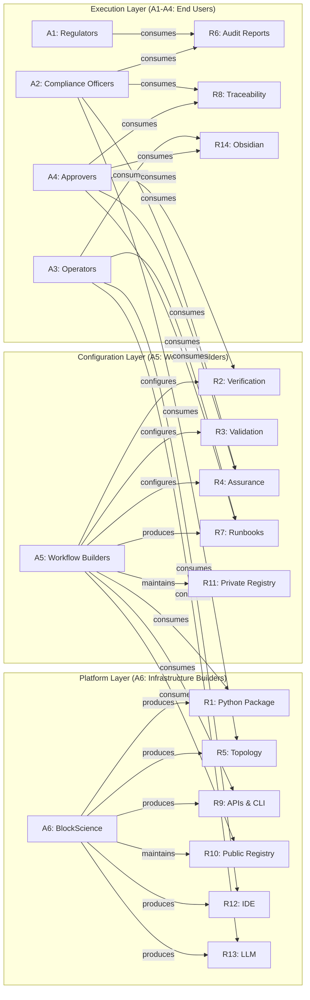

# Field Survey for Knowledge Complex Repository Refactor

**This survey maps the stakeholders (actors) and resources relevant to refactoring the assurances-audits-accountability repository for use by BlockScience team members, collaborators, and clients.**

## Animating Purpose

### Why This Survey

This repository houses a knowledge complex for assurances, audits, and accountability—a sophisticated system of typed documents, verification scripts, and compositional architectures. Currently, it serves as a working prototype and internal tool. The refactor aims to make this repository valuable and accessible to a broader audience: internal BlockScience team members, external collaborators, and clients who may adopt or adapt the framework.

Before redesigning the repository structure, documentation, and tooling, we must understand who will use it, what resources exist, and how these actors interact with the resources. This survey establishes that foundation.

### Scope Statement

This survey covers stakeholders who will use or contribute to this repository and the resources (documentation, tooling, templates) that must serve them, limited to the current repository and its immediate evolution.

### Key Questions

1. Who are the distinct stakeholder categories that will interact with this repository?
2. What resources exist in the repository that different stakeholders need?
3. What are the different modes of engagement (consumption vs. contribution)?
4. What barriers currently exist for each stakeholder category?

## Actors

The following stakeholder categories have been identified. Note: "Internal" means internal to the organization using the knowledge complex framework, not specifically to BlockScience.

| ID | Name | Type | Description | Accountability |
|----|------|------|-------------|----------------|
| A1 | Regulators | External Party | External authorities who make rules that organizations must demonstrably adhere to | Define compliance requirements; audit adherence; enforce consequences |
| A2 | Compliance Officers | Role | Stakeholders ensuring workflows are demonstrably compliant with regulator rules | Demonstrate compliance to regulators; maintain audit trails; report violations |
| A3 | Operators | Role | Stakeholders who perform activities, produce and consume documents | Execute workflows; produce/consume work products; follow procedures |
| A4 | Approvers | Role | Domain experts who take formal accountability for specific work products | Sign off on deliverables; attest to quality; accept accountability |
| A5 | Workflow & Knowledge Builders | Role | Stakeholders who configure ontologies, curate knowledge, develop domain-specific workflows | Design workflows operators follow; maintain knowledge structures; configure document types for specific domains |
| A6 | Infrastructure Builders | Organization | BlockScience (and contributors) who develop and maintain the core framework | Build Python package; maintain public registry; develop generic tooling and integrations; provide reference architecture |

### Actor Definitions

#### A1: Regulators

External authorities—government agencies, industry bodies, standards organizations, or contractual counterparties—who establish rules and requirements that organizations must follow. Regulators do not use the knowledge complex directly; they consume its outputs (audit reports, compliance evidence) to verify adherence. Their requirements drive the structure of workflows and the rigor of assurance processes. (Compliance evidence consumer)

#### A2: Compliance Officers

Internal stakeholders responsible for ensuring organizational workflows demonstrably meet regulatory requirements. They use audit reports, traceability features, and assurance charts to prepare compliance evidence. They need to understand what the system produces and how to interpret its outputs, but may not build or configure workflows themselves. (Compliance evidence producer)

#### A3: Operators

The hands-on users who perform day-to-day activities within defined workflows. They produce and consume documents, follow runbooks, and execute procedures. Operators need intuitive interfaces (IDE, Obsidian, LLM assistance) and clear guidance. They should not need to understand the underlying mathematics—the system should be transparent to them. (responsible for effective & compliant performance)

#### A4: Approvers

Domain experts who formally attest to the quality and correctness of specific work products. They sign off on validation edges and assurance faces, accepting accountability for deliverables. Approvers need to efficiently review documents, understand what they're signing, and trust that the verification infrastructure has done its job before their approval is requested. (accountable for demonstrably effective & compliant performance)

#### A5: Workflow & Knowledge Builders

The configurers and maintainers of domain-specific knowledge complexes. They use the core framework (provided by Infrastructure Builders) to configure document types, define templates, write runbooks, and maintain ontologies for specific organizational contexts. They may be internal to the client organization or provided as a professional service by BlockScience. They consume the Python package, APIs, and registry infrastructure to build workflows that operators can follow and approvers can sign off on. They need to understand the framework's concepts but not necessarily its mathematical foundations. (responsible for faithfully implementing organizational ontologies and policies which comply with regulatory requirements)

#### A6: Infrastructure Builders

BlockScience and open-source contributors who develop and maintain the core knowledge complex framework. They build the Python package, maintain the public registry, develop generic tooling (verification, validation, assurance, topology), and create reference architectures and integrations. They own the mathematical foundations and abstract them into usable APIs. Their work enables Workflow Builders to configure domain-specific instances without deep mathematical expertise. Revenue comes from commercial licensing and professional services (acting as Workflow Builders for clients).

## Resources

The following resources describe the target state of the knowledge complex framework—what the refactored system will provide.

| ID  | Name                          | Type       | Description                                                                     | Status |
| --- | ----------------------------- | ---------- | ------------------------------------------------------------------------------- | ------ |
| R1  | Python Package (core)         | Technology | Abstracts mathematics of typed simplicial complexes for non-mathematicians      | Target |
| R2  | Verification Tooling          | Technology | Template-based verification ensuring documents conform to specs                 | Target |
| R3  | Validation Tooling            | Technology | Support for validation edges with human accountability                          | Target |
| R4  | Assurance Tooling             | Technology | Assurance audit, triangle closure                                               | Target |
| R5  | Chart Construction & Topology | Technology | Chart building, topological analysis                                            | Target |
| R6  | Audit Reports & Remediation   | Technology | Charts for auditing, compliance reports, remediation support                    | Target |
| R7  | Runbooks                      | Process    | Step-by-step workflows with embedded performance metrics for effectiveness      | Target |
| R8  | Requirements Traceability     | Technology | Trace documents produced by workflows to requirements                           | Target |
| R9  | APIs & CLI Tools              | Technology | Programmatic and command-line access to all features                            | Target |
| R10 | Public Registry               | Service    | Package-manager-like registry for document types and runbooks                   | Target |
| R11 | Private Registry Support      | Service    | Tools for access-controlled, version-controlled registries via git              | Target |
| R12 | IDE Integration               | Technology | VS Code`*` layer for document construction                                      | Target |
| R13 | LLM Facilitator               | Technology | Claude Code`*` as intelligent assistant for knowledge complex work              | Target |
| R14 | Knowledge Complex Explorer    | Technology | Obsidian`*` for navigation, reading, reviewing, light editing                   | Target |
| R15 | Auditor Interface             | Technology | Analytics via scientific Python, contextual views for auditors                  | Target |

> `*` VS Code, Claude Code and Obsidian are examples of integration with user interfaces; our design must be able to integrate with the user-organization's existing platforms and procured tools. VS Code, Claude Code and Obsidian are used for "out-of-box" interface functionality

### Resource Definitions

#### R1: Python Package (core)

An installable Python package that abstracts the mathematics of typed simplicial complexes. Users get the benefits of rigorous knowledge management—type safety, topological invariants, compositional structures—without needing to understand the underlying mathematics. The package provides the foundation on which all other tooling is built. (APIs and CLIs which serve as legible logical interface for access to various tool kits: authoring, verification, validation, assurances, traceability, charts, analysis, etc)

#### R2: Verification Tooling

Spec-based verification that checks documents against their type specifications. Deterministic, automated checking ensures structural compliance: required fields present, correct types, valid references. Currently implemented as scripts; target state packages these as library functions with CLI and API access.

#### R3: Validation Tooling

Support for creating and managing validation edges—the qualitative assessment that a document meets its guidance criteria. Validation requires human judgment and formal accountability. The tooling tracks who validated what, when, and with what authority.

#### R4: Assurance Tooling

Infrastructure for creating assurance triangles (2-simplices) that close the spec-guidance-document loop. Includes the audit chart construction and reporting ensuring every vertex has at least as many incident faces as its in-degree. Provides audit capabilities to verify complete assurance coverage.

#### R5: Chart Construction & Topology

Tools for building charts (subcomplexes), computing requirements traceability charts and assurance charts, enabling topological analysis that can identify and interpret gaps. Charts behave like database views and enable modular organization and contextual interpretation of knowledge complexes. Topological data analysis tools verify structural integrity and detect holes or inconsistencies.

#### R6: Audit Reports & Remediation

Generation of audit-ready reports from assurance charts and requirements traceability charts. Includes compliance summaries, gap analysis, and remediation tracking. Reports demonstrate that policies were followed (compliance). Outputs should be consumable by an organization's leaders as well as regulators and compliance officers without requiring knowledge complex expertise.

#### R7: Runbooks

Step-by-step procedural guides that operators follow to produce work products. Runbooks encode best practices and ensure consistent execution. Critically, runbooks include embedded performance metrics that define what "effective" means for each workflow—enabling approvers to attest not just to compliance (the process was followed) but to effectiveness (outcomes met expectations). The system should include runbooks for developing new runbooks. These runbooks leverage document types and knowledge complexes containing structured organizational knowledge. There must be runbooks for ingesting and conforming existing organizational knowledge and policies. Runbooks may support identification, documentation and assurance of insights gleaned during operations to inform future operations. Runbooks are designed for use by accountable human operators and approvers with LLM support.

#### R8: Requirements Traceability

Ability to trace any document produced by a workflow back to its originating requirements. This supports compliance demonstration by showing how regulatory requirements flow through workflows to produce verifiable outputs. Must be able to identify and remediate traceability gaps.

#### R9: APIs & CLI Tools

Programmatic access to all knowledge complex features. CLI tools for interactive use; APIs for integration with other systems. Enables automation, batch processing, and embedding knowledge complex capabilities in larger workflows.

#### R10: Public Registry

A package-manager-like registry where document types and runbooks can be published and discovered. Some types and runbooks ship with the core package; others can be installed from the registry. Enables ecosystem growth and reuse.

#### R11: Private Registry Support

Tools for organizations to create their own registries with access control and version control. Built on git for familiar workflows. Enables organizations to maintain proprietary types and runbooks while leveraging the core framework.

#### R12: IDE Integration

VS Code integration for document construction. Syntax highlighting, validation on save, template snippets, and navigation support. The IDE is where operators and workflow builders do their primary authoring work.

#### R13: LLM Facilitator

Claude Code (or similar LLM tools) configured to assist with knowledge complex work. The LLM understands document types, can draft documents, run verification, and guide users through workflows. Acts as an intelligent assistant that makes the system more accessible.

#### R14: Knowledge Complex Explorer

Obsidian (or organization specific document and workflow interface platform) configured for navigating, reading, reviewing, and light editing of knowledge complexes. Provides graph visualization, backlink navigation, and a reading-optimized interface. Supports review workflows for approvers.

#### R15: Auditor Interface

A dedicated interface for auditors providing contextual relational views derived from audit charts. Built using scientific Python for analytics and writing to analytic databases. Provides traceability from compliance claims to supporting evidence.

## Relationships

The following relationships form a bipartite graph connecting actors to resources. Not every actor relates to every resource—the graph is intentionally sparse, reflecting actual dependencies.

| Actor ID | Resource ID | Relationship | Description |
|----------|-------------|--------------|-------------|
| A1 | R6 | Consumes | Reviews audit reports and compliance evidence |
| A2 | R4 | Consumes | Uses assurance tooling to verify complete coverage |
| A2 | R5 | Consumes | Uses topology tools to validate chart integrity |
| A2 | R6 | Consumes | Generates and reviews audit reports for regulators |
| A2 | R8 | Consumes | Traces documents to requirements for compliance |
| A3 | R7 | Consumes | Follows runbooks to execute workflows |
| A3 | R12 | Consumes | Uses IDE for document authoring |
| A3 | R13 | Consumes | Uses LLM assistant for guidance and drafting |
| A3 | R14 | Consumes | Uses Obsidian for navigation and review |
| A4 | R2 | Consumes | Reviews verification results before approval |
| A4 | R4 | Consumes | Reviews assurance status before signing |
| A4 | R6 | Consumes | Reviews audit reports to understand scope |
| A4 | R14 | Consumes | Uses Obsidian to review documents for sign-off |
| A4 | R8 | Consumes | Reviews traceability to understand requirements context |
| A4 | R7 | Consumes | Reviews runbook performance metrics to attest to effectiveness |
| A5 | R1 | Consumes | Uses Python package to build domain workflows |
| A5 | R2 | Configures | Configures verification templates for domain |
| A5 | R3 | Configures | Configures validation workflows for domain |
| A5 | R4 | Configures | Configures assurance processes for domain |
| A5 | R7 | Produces | Authors domain-specific runbooks for operators |
| A5 | R9 | Consumes | Uses APIs/CLI to build and test workflows |
| A5 | R10 | Consumes | Pulls document types and runbooks from public registry |
| A5 | R11 | Maintains | Manages organization's private registry |
| A6 | R1 | Produces | Develops and maintains core Python package |
| A6 | R5 | Produces | Develops chart and topology tools |
| A6 | R9 | Produces | Develops APIs and CLI tools |
| A6 | R10 | Maintains | Operates and maintains public registry |
| A6 | R12 | Produces | Develops IDE integration and extensions |
| A6 | R13 | Produces | Develops LLM integration and system prompts |

### Relationship Diagram

### Key Dependencies

1. **Regulators depend on Audit Reports (A1 → R6)**: The framework exists to produce outputs that satisfy regulatory requirements. Without consumable audit reports, the framework fails its primary purpose.
2. **Workflow Builders depend on Infrastructure Builders (A5 → A6)**: Workflow Builders consume the Python package, APIs, and public registry that Infrastructure Builders produce. This is the platform/customer relationship.
3. **Operators depend on Interfaces (A3 → R12, R13, R14)**: Operators interact with the system through interfaces, not directly with the underlying tooling. Poor interface design blocks operator adoption.
4. **Approvers depend on Verification and Traceability (A4 → R2, R8)**: Approvers must trust that verification has been done and understand the requirements context before they sign. If verification tooling is unreliable or traceability is unclear, approver confidence erodes.
5. **Approvers depend on runbooks for effectiveness criteria (A4 → R7)**: Approvers depend on operators to perform their functions effectively in addition to complying with relevant policies. Runbooks embed performance metrics that define effectiveness, enabling approvers to attest not just to compliance but to outcomes meeting expectations.
6. **Compliance Officers bridge internal work and external requirements (A2 → R4, R5, R6, R8)**: They consume the most diverse set of resources because they must translate internal work into external evidence. User Interfaces tailored to the Compliance Officer role are critical to reduce friction and framework-specfic expertise needed for the compliance officers to fulfill their role. Noteably their interfaces must provide: reports demonstrating compliance and tools for identifying gaps and associated accountable parties, as well as actionable feedback for remediation.
7. **Three-layer architecture**: Infrastructure Builders (A6) enable Workflow Builders (A5) who enable End Users (A1-A4). Each layer depends on the one above it.

## Scope Boundaries

### In Scope

- Six stakeholder categories across three layers: Platform (Infrastructure Builders), Configuration (Workflow Builders), and Execution (Regulators, Compliance Officers, Operators, Approvers)
- The knowledge complex framework as a product serving organizations with compliance needs
- Protocols, schemas, data standards and API specifications
- Python package, tooling, registries, and interfaces as resources
- Target state architecture for the refactored system
- Actor-resource relationships that drive design decisions
- BlockScience as Infrastructure Builder (platform provider) and optionally as Workflow Builder (professional services)

### Out of Scope

- Specific regulatory domains (healthcare, finance, etc.)—framework is domain-agnostic
- Pricing, licensing, or business model for the framework
- Detailed implementation timelines or sprint planning
- Specific technology choices within resource categories (e.g., which database for analytics)
- Training curriculum or certification programs for users
- Integration with specific third-party compliance tools

### Boundary Rationale

This survey establishes who the framework serves and what it must provide. The scope is deliberately technology-agnostic within resource categories to allow implementation flexibility. Specific regulatory domains are excluded because the framework's value is its domain-agnostic structure—the same typed simplicial complex approach works for any compliance context. Business model considerations are excluded to focus on product design.

## Key Findings

### Summary Observations

1. **Three-layer architecture emerges**: Infrastructure Builders (A6) create the platform → Workflow Builders (A5) configure domain instances → End Users (A1-A4) execute and consume. Each layer has distinct concerns and resource needs.

2. **Clear separation of platform and configuration**: Infrastructure Builders own the mathematical foundations and abstract them into APIs. Workflow Builders consume those APIs to build domain-specific workflows without needing deep mathematical expertise.

3. **Two revenue streams for BlockScience**: (1) Platform revenue from commercial licensing of the Python package and tooling. (2) Professional services revenue from acting as Workflow Builders for client organizations.

4. **Operators need complete abstraction**: A3 (Operators) interact only with interfaces (R12, R13, R14) and runbooks (R7). They should never encounter typed simplicial complexes directly. The refactor must ensure complete abstraction at the operator layer.

5. **Regulators are pure consumers**: A1 interacts with exactly one resource (R6: Audit Reports). The framework exists to produce outputs regulators can consume. This is necessary but not sufficient for success.

6. **Workflow Builders as the key adoption bottleneck**: If Workflow Builders cannot easily configure domain instances, organizations cannot adopt the framework. The platform must make A5's job tractable—good APIs, clear documentation, reusable components from the public registry.

7. **Effectiveness is distinct from compliance**: Demonstrating that operators followed policies (compliance) is necessary but not sufficient. Approvers must also attest that outcomes were effective—that performance met expectations. Runbooks (R7) embed performance metrics that define effectiveness; audit reports (R6) focus on compliance. This dual accountability (compliance + effectiveness) flows through the entire system.
   
8. **Human Accountability is explicit throughout**: Validation with named signatures attesting to fitness-for-purpose are required for all documents produced, including automatically generated reports assessing effectiveness, in addition compliance with policy.

### Gaps and Tensions

| Gap/Tension                        | Description                                                                     | Implication                                                                      |
| ---------------------------------- | ------------------------------------------------------------------------------- | -------------------------------------------------------------------------------- |
| Python Package Gap                 | Core tooling exists as scripts but not as an installable, documented package    | Workflow builders cannot easily install, extend, or integrate the framework      |
| API Gap                            | No programmatic API exists; CLI-only access                                     | Integration with external systems requires shell calls; no library usage         |
| Registry Gap                       | No public or private registry infrastructure                                    | Cannot share document types and runbooks across organizations                    |
| Auditor Interface Gap              | No dedicated analytics/reporting layer for regulators                           | Audit reports require manual construction; no automated compliance dashboards    |
| Requirements Traceability Gap      | Runbooks leverage document types with explicit record of input and output docs. | Have not yet automated methods to trace documents to requirements for compliance |
| Mathematical Abstraction Tension   | Framework is mathematically rigorous but requires simplicial complex knowledge  | Operators and approvers may struggle; workflow builders are bottlenecked         |
| Power vs. Simplicity Tension       | Full verification infrastructure is powerful but complex to configure           | Steep learning curve limits adoption                                             |
| Internal vs. External User Tension | Current docs assume deep familiarity                                            | External users (clients, collaborators) need onboarding materials                |

### Implications for Architecture

The refactor should prioritize:

1. **Package the Python tooling for pip installation**: Transform scripts into a proper Python package with clear API, documentation, and versioning. This enables Workflow Builders (A5) to install, extend, and integrate.

2. **Design APIs for Workflow Builders**: Every feature should be accessible programmatically. The API is the contract between Infrastructure Builders (A6) and Workflow Builders (A5).

3. **Develop registry infrastructure on git**: Use git repositories as the backend for registries. Public registry managed by A6; private registries managed by A5 for their organizations.

4. **Build dedicated auditor views**: Create an analytics layer that transforms audit charts into regulator-consumable reports. Use scientific Python (pandas, plotly) for analysis and visualization.

5. **Layer abstraction appropriately**:
   - A6 works with full mathematical concepts (simplicial complexes, topology)
   - A5 works with framework concepts (document types, templates, runbooks)
   - A1-A4 work with domain concepts (documents, workflows, approvals)

6. **Create tiered documentation for each layer**:
   - Infrastructure Builders: Mathematical foundations, API reference, extension guides
   - Workflow Builders: Configuration guides, template authoring, runbook design
   - End Users: Quickstart guides, review checklists, audit procedures

7. **Implement requirements traceability**: Add mechanisms to link documents to originating requirements, enabling automated compliance demonstration.

8. **Support BlockScience's dual role**: The platform must work both for external Workflow Builders (customers) and for BlockScience acting as Workflow Builder (professional services).

---

**Note:** This field survey establishes the foundation for refactoring the knowledge complex framework. The three-layer architecture (Platform → Configuration → Execution) defines the product structure; BlockScience operates at both the Platform layer (as A6) and optionally at the Configuration layer (as A5, providing professional services).
