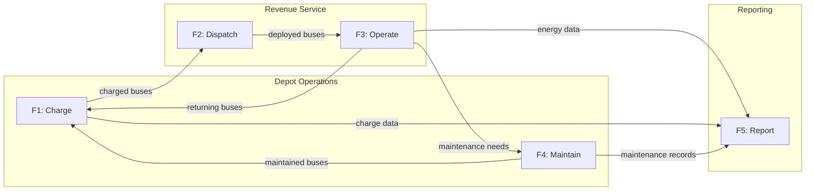
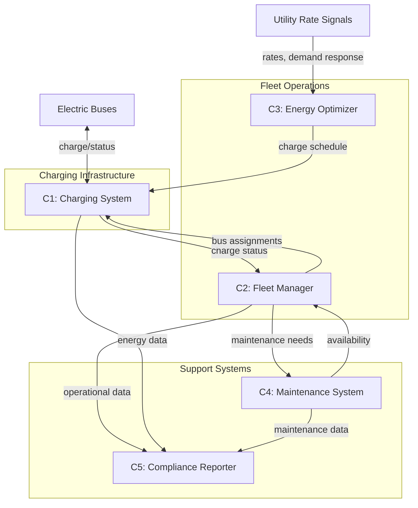
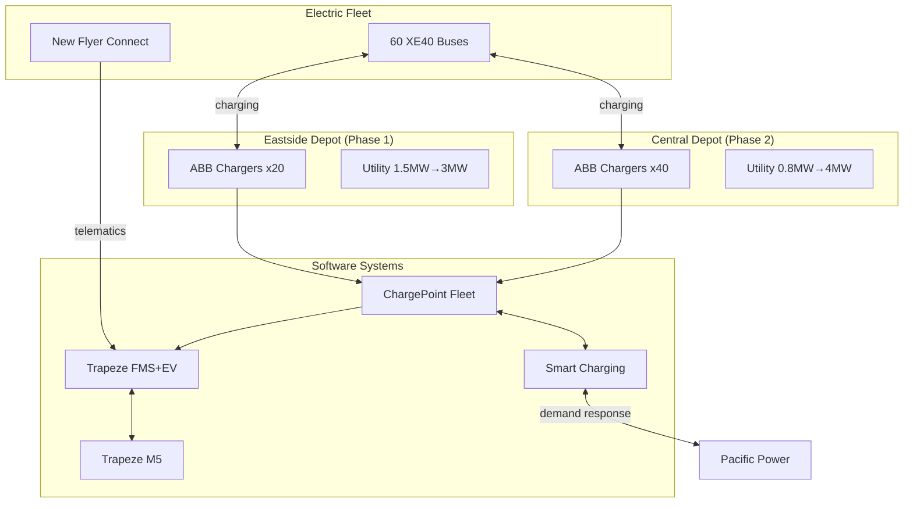

# Architecture - Regional Bus Fleet Electrification

This architecture document defines the MRTA Fleet Electrification System across four layers aligned with the V-model lifecycle, enabling transition from diesel to battery-electric buses while maintaining service reliability.

## Overview

The MRTA Fleet Electrification System transforms the agency's 180-bus diesel fleet to battery-electric propulsion through a phased approach over 6 years (2026-2032). The architecture addresses the infrastructure lead time challenge identified in the field survey by sequencing depot transitions: Eastside Depot first (lower electrical upgrade barrier), Central Depot second (requires utility infrastructure upgrade).

This architecture covers three integrated subsystems:
1. **Electric Bus Fleet:** 60 battery-electric buses replacing diesel units due for retirement
2. **Charging Infrastructure:** Depot-based overnight charging at both facilities
3. **Fleet Management Integration:** Charging coordination with existing Trapeze scheduling system

The phased approach achieves 50% zero-emission fleet by 2032 (state mandate) while establishing the foundation for 100% by 2040.

## V-Model Summary

| Layer | Left Side (Idealized) | Current Status | Right Side (Realized) |
|-------|----------------------|----------------|----------------------|
| **Conceptual** | ConOps: Maintain service reliability while transitioning to zero-emission fleet | Design | Acceptance Testing: Stakeholder validation of service quality and compliance |
| **Functional** | Functional Architecture: Charge, Dispatch, Operate, Maintain, Report | Design | System Testing: End-to-end fleet operation verification |
| **Logical** | Logical Architecture: Charging System, Fleet Manager, Energy Optimizer, Maintenance System | Design | Integration Testing: Subsystem interaction verification |
| **Physical** | Physical Architecture: New Flyer XE40 buses, ABB chargers, Trapeze EV module, utility interconnection | Design | Unit Testing: Individual component verification |

## Conceptual Layer

### Problem Statement (ConOps)

MRTA must transition its bus fleet to zero-emission while maintaining the service reliability that 45,000 daily riders depend on. The current diesel fleet provides operational flexibility (quick refueling, 300+ mile range) that electric buses must match or accommodate through operational adjustments.

**Stakeholder Needs:**

- **MRTA Leadership (from A1):** Achieve state mandate compliance (50% ZE by 2032); manage capital and operating costs; maintain service levels; position agency for full electrification by 2040
- **Maintenance Technicians (from A5):** Safe working environment with high-voltage systems; adequate training before electric fleet arrives; clear maintenance procedures; career continuity
- **Bus Operators (from A4 union members):** Reliable vehicles for daily service; adequate range for assigned routes; comfortable operating environment; training on new vehicle systems
- **Regional Electric Utility (from A2):** Managed demand growth; predictable load profiles; opportunity for beneficial electrification partnership; grid stability
- **State DOT (from A3):** Demonstrated progress toward mandates; proper use of grant funds; accurate reporting; replicable model for other agencies
- **Daily Riders (from A6):** Uninterrupted service; on-time performance maintained; comfortable vehicles; reduced emissions in communities served

**Operational Context:**

MRTA operates 24 routes with peak service requiring 140 buses in operation. Routes range from 80 to 180 miles daily. Service runs 5 AM to midnight weekdays, reduced weekends. Buses return to depots for overnight layover (6-8 hours available for charging). Peak morning pull-out requires 140 buses available by 5 AM.

### Acceptance Criteria

The system will be accepted by stakeholders when:

- **AC1:** 60 electric buses operational and assigned to revenue service routes
- **AC2:** All assigned routes completed without range-related service failures for 30 consecutive days
- **AC3:** Fleet availability (buses ready for service) maintains ≥85% for electric buses (matching diesel baseline)
- **AC4:** All maintenance technicians (45) complete high-voltage safety certification before electric bus arrival
- **AC5:** Charging infrastructure supports overnight charging of full electric fleet at each depot
- **AC6:** Fleet management system accurately tracks state-of-charge and optimizes charging schedules

## Functional Layer

### Functional Architecture

The system performs five core functions to enable electric bus operations.

| Function | Inputs | Outputs | Description |
|----------|--------|---------|-------------|
| F1: Charge | Buses at depot, electricity, charge schedule | Charged buses ready for service | Overnight depot charging of electric buses to target state-of-charge |
| F2: Dispatch | Charged buses, route assignments, operator assignments | Buses deployed to routes | Assign appropriately charged buses to routes matching range requirements |
| F3: Operate | Buses on routes, operators, passengers | Completed service, energy consumption data | Revenue service operation on assigned routes |
| F4: Maintain | Buses, maintenance schedule, parts, technicians | Maintained buses, maintenance records | Preventive and corrective maintenance for electric fleet |
| F5: Report | Operational data, energy data, compliance rules | Compliance reports, performance dashboards | Generate required state/federal reports and internal performance tracking |

### System Testing Criteria

The functional architecture will be verified through system testing:

- **ST1:** Overnight charging window (6 hours) sufficient to charge fleet from 20% to 95% SOC
- **ST2:** Dispatch correctly matches bus charge level to route range requirement with 20% buffer
- **ST3:** No range-related service failures during 30-day operational test
- **ST4:** Maintenance scheduling correctly prioritizes by mileage, usage, and diagnostic alerts
- **ST5:** Compliance reports accurately reflect fleet composition and energy consumption

## Logical Layer

### Logical Architecture

The logical architecture defines technology-independent components and their interactions.

| Component | Responsibility | Interfaces |
|-----------|---------------|------------|
| C1: Charging System | Manage charging hardware, monitor charge status, coordinate power demand | Input: Charge schedule, power availability; Output: Bus charge status, energy consumption |
| C2: Fleet Manager | Track bus assignments, status, location; coordinate dispatch | Input: Bus availability, route requirements; Output: Dispatch assignments, operational status |
| C3: Energy Optimizer | Optimize charging schedules to minimize cost and manage demand | Input: Rate schedules, bus needs, grid signals; Output: Optimal charge schedule |
| C4: Maintenance System | Track maintenance schedules, work orders, parts inventory | Input: Bus diagnostics, mileage, schedules; Output: Work orders, parts needs, maintenance records |
| C5: Compliance Reporter | Generate regulatory reports, track mandate progress | Input: Fleet data, energy data, operational data; Output: State/federal compliance reports |

**Component Interactions:**

- **C3 → C1:** Energy Optimizer provides charge schedule; Charging System executes
- **C1 → C2:** Charging System reports bus charge status; Fleet Manager uses for dispatch decisions
- **C2 → C4:** Fleet Manager identifies maintenance needs; Maintenance System creates work orders
- **All → C5:** All systems provide data; Compliance Reporter generates required reports

### Integration Testing Criteria

Component integration will be verified through:

- **IT1:** Energy Optimizer charge schedule correctly transmitted to and executed by Charging System
- **IT2:** Charging System status correctly reflected in Fleet Manager within 1 minute
- **IT3:** Fleet Manager maintenance alerts correctly create work orders in Maintenance System
- **IT4:** Compliance Reporter correctly aggregates data from all source systems
- **IT5:** Utility demand response signals correctly adjust charging behavior within 5 minutes

## Physical Layer

### Physical Architecture

The physical architecture specifies concrete technology choices for each logical component.

| Element | Technology/Tool | Purpose |
|---------|----------------|---------|
| E1: Electric Buses | New Flyer XE40 (40-ft battery-electric, 440 kWh) | Revenue service vehicles with 150+ mile range |
| E2: Depot Chargers | ABB HVC-150 (150 kW DC fast chargers) | Overnight depot charging; 3-hour full charge |
| E3: Charging Management | ChargePoint Fleet Management | Monitor chargers, manage sessions, report energy |
| E4: Fleet Management | Trapeze FMS with EV Module | Existing system extended for electric fleet |
| E5: Energy Optimization | ChargePoint Smart Charging + utility API | Rate optimization, demand response integration |
| E6: Maintenance System | Trapeze M5 Maintenance Module | Existing system extended for EV maintenance |
| E7: Utility Interconnection | Pacific Power commercial service upgrade | Grid connection; Central 4MW, Eastside 3MW |
| E8: Telematics | New Flyer Connect (OEM telematics) | Real-time bus status, diagnostics, SOC |

**Technology Rationale:**

- **New Flyer XE40:** MRTA's existing vendor; parts/training commonality with diesel fleet; proven platform at peer agencies
- **ABB chargers:** Industry leader; compatible with New Flyer; proven reliability; 150kW balances charge time vs. infrastructure cost
- **ChargePoint:** Integration partnership with ABB; demand response capability; transit agency references
- **Trapeze:** Existing MRTA system; EV module provides integration without replacing core system

### Unit Testing Criteria

Individual components will be verified through:

- **UT1:** Each XE40 bus achieves manufacturer range specification (150+ miles) in acceptance test
- **UT2:** Each ABB charger delivers rated power (150 kW) and completes charge session without fault
- **UT3:** ChargePoint correctly reports charge status for all connected sessions
- **UT4:** Trapeze EV module correctly displays SOC from telematics feed
- **UT5:** Smart Charging correctly calculates optimal schedule given test rate inputs
- **UT6:** Utility interconnection supports full load without voltage issues

## Traceability Matrix

| Conceptual Need | Functional Requirement | Logical Component | Physical Element |
|-----------------|----------------------|-------------------|------------------|
| Service reliability (Riders) | F2: Dispatch, F3: Operate | C2: Fleet Manager | E1: Buses, E4: Trapeze, E8: Telematics |
| Range adequacy (Operators) | F1: Charge, F2: Dispatch | C1: Charging, C3: Optimizer | E2: Chargers, E5: Smart Charging |
| Workforce safety (Technicians) | F4: Maintain | C4: Maintenance System | E6: Trapeze M5, training (program) |
| Managed demand (Utility) | F1: Charge | C3: Energy Optimizer | E5: Smart Charging, E7: Interconnection |
| Compliance (State DOT) | F5: Report | C5: Compliance Reporter | E4: Trapeze, E3: ChargePoint |
| Cost management (MRTA) | F1: Charge | C3: Energy Optimizer | E5: Smart Charging |

## Constraints and Assumptions

### Constraints

- **Budget:** \$45M capital over 3 years (Phase 1); funded through ZETF and FTA grants
- **Timeline:** Phase 1 complete by end of 2028; 50% ZE by 2032 mandate
- **Infrastructure Lead Time:** Utility upgrade requires 18-24 months; must start before bus order
- **Workforce:** All training must complete before first electric bus arrives; 40 hours per technician minimum
- **Service:** No service reductions during transition; all routes must remain operational

### Assumptions

- **Bus Performance:** XE40 achieves 150+ mile range in MRTA operating conditions (moderate climate, mixed terrain)
- **Utility Cooperation:** Pacific Power proceeds with grid upgrade on committed timeline
- **Grant Availability:** ZETF funding continues through 2028 as currently authorized
- **Technology Stability:** Battery and charger technology remains compatible through program duration
- **Union Support:** ATU 1287 ratifies training provisions in 2027 contract

## Risks and Mitigations

| Risk | Impact | Likelihood | Mitigation |
|------|--------|------------|------------|
| Utility upgrade delay | High - stranded buses | Medium | Early utility engagement; contractual commitments; Eastside first (lower upgrade) |
| Bus range shortfall | High - service failures | Low | Route analysis before assignment; buffer margin; mid-day charge capability at Central |
| Technician training gap | High - maintenance delays | Medium | Training starts 6 months before bus arrival; OEM on-site support first year |
| Charger reliability | Medium - reduced availability | Low | Redundant chargers (N+2); service contract with 4-hour response |
| Grant funding reduction | High - incomplete program | Low | Secure multi-year commitments; phase spending to match funding |

---

**Note:** This architecture enables phased fleet electrification while managing infrastructure lead time risk. Starting at Eastside Depot provides operational learning before the larger Central Depot transition. The 60-bus Phase 1 achieves 33% zero-emission, positioning for 50% mandate compliance by 2032.
