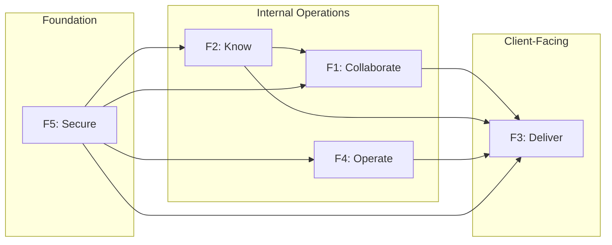
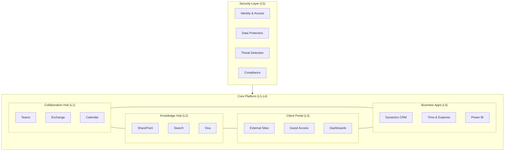
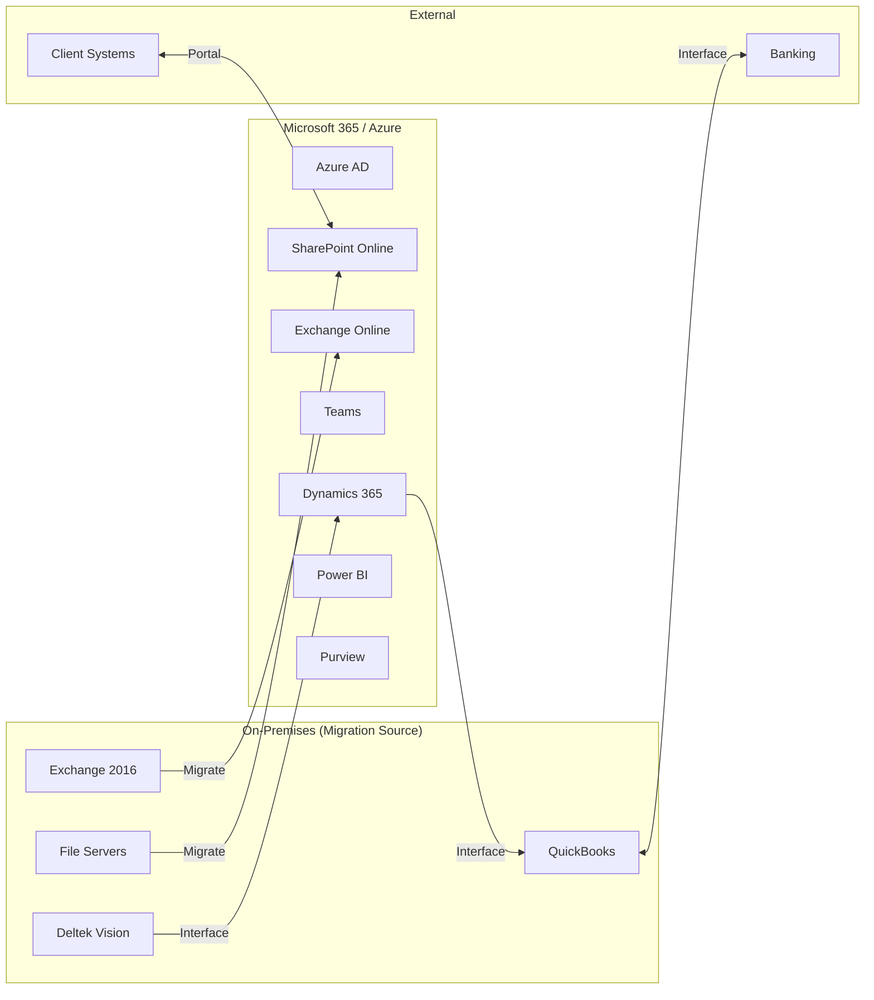

# Architecture - Digital Transformation Program

This architecture document defines the Meridian Digital Workplace system across four layers aligned with the V-model lifecycle, enabling comprehensive digital transformation while maintaining business continuity and consultant productivity.

## Overview

The Meridian Digital Workplace transforms the firm's technology foundation from fragmented legacy systems to an integrated cloud platform over 24 months. The architecture addresses the pain points identified in the field survey: scattered documents, lost institutional knowledge, security gaps, and inability to meet enterprise client expectations.

This architecture covers five integrated capability areas:

1. **Modern Collaboration:** Microsoft 365 for email, Teams, and real-time collaboration
2. **Knowledge Management:** SharePoint-based repository with AI-powered search and metadata
3. **Client Delivery Platform:** Secure client portals, project dashboards, document sharing
4. **Back-Office Integration:** Unified time tracking, CRM, and financial visibility
5. **Security & Compliance:** Zero Trust architecture, SOC 2 compliance, data governance

The phased approach minimizes disruption while delivering visible improvements within 6 months to build momentum and demonstrate value.

## V-Model Summary

| Layer | Left Side (Idealized) | Current Status | Right Side (Realized) |
|-------|----------------------|----------------|----------------------|
| **Conceptual** | ConOps: Enable competitive, secure, knowledge-driven consulting firm | Design | Acceptance Testing: Stakeholder validation of capabilities and culture change |
| **Functional** | Functional Architecture: Collaborate, Know, Deliver, Operate, Secure | Design | System Testing: End-to-end workflow verification |
| **Logical** | Logical Architecture: M365 Platform, Knowledge Hub, Client Portal, Business Apps, Security Layer | Design | Integration Testing: Cross-system interaction verification |
| **Physical** | Physical Architecture: Azure AD, Exchange Online, Teams, SharePoint, Dynamics, Power Platform | Design | Unit Testing: Individual component verification |

## Conceptual Layer

### Problem Statement (ConOps)

Meridian Consulting Group must transform from a relationship-driven firm with fragmented technology to a digitally-enabled organization that can compete for enterprise engagements, retain institutional knowledge, and attract modern talent. The transformation must occur without disrupting ongoing client work or forcing uncomfortable change on autonomous partners.

**Stakeholder Needs:**

- **Managing Partner Committee (from A1):** Competitive positioning for enterprise clients; demonstrable security posture; reduced real estate costs through effective remote work; knowledge preservation as partners retire; ROI on \$2.5M investment
- **Practice Area Leaders (from A2):** Tools that make client delivery easier, not harder; visibility into project economics; ability to staff across geographies; preservation of client relationships during transition
- **IT Department (from A3):** Sustainable, modern infrastructure they can manage; reduced firefighting; skills development opportunity; clear vendor relationships; elimination of technical debt
- **Consultants (from A4):** Modern tools matching client environments; easy access to prior work; seamless collaboration with team members; mobile access; reduced administrative burden
- **Operations Team (from A5):** Integrated systems reducing manual work; real-time financial visibility; streamlined month-end; better recruiting tools
- **Enterprise Clients (from A6):** Secure collaboration; project visibility; confidence in data handling; professional external presence

**Operational Context:**

Meridian operates across four locations with 150 staff. Consultants spend 60% of time on client sites (pre-transformation) with increasing hybrid arrangements. Billable utilization targets of 75% mean training and transition activities must be carefully scheduled. Partner culture values autonomy; mandated adoption will face resistance. The firm handles confidential client data subject to various regulatory frameworks (financial services clients have heightened requirements).

### Acceptance Criteria

The system will be accepted by stakeholders when:

- **AC1:** All 150 staff migrated to Microsoft 365 with email, Teams, and SharePoint functional
- **AC2:** Knowledge repository contains 80%+ of active methodology templates with accurate metadata and working search
- **AC3:** At least 5 enterprise clients actively using client portal for project collaboration
- **AC4:** Time and expense entry available on mobile with 90% weekly compliance
- **AC5:** SOC 2 Type II audit passed with no critical findings
- **AC6:** Staff satisfaction survey shows >70% positive response on "tools help me do my job"
- **AC7:** Document search time reduced from 30 minutes to <5 minutes (measured via user survey)

## Functional Layer

### Functional Architecture

The system performs five core functions to enable the digital workplace.

| Function | Inputs | Outputs | Description |
|----------|--------|---------|-------------|
| F1: Collaborate | People, content, context | Coordinated work, decisions, communication records | Real-time and asynchronous collaboration across locations and with clients |
| F2: Know | Documents, expertise, questions | Answers, templates, prior work, insights | Capture, organize, and surface institutional knowledge |
| F3: Deliver | Client needs, team capabilities, methodologies | Client deliverables, project visibility, satisfied clients | Execute client engagements with modern tools and transparency |
| F4: Operate | Business data, workflows, policies | Operational efficiency, financial visibility, compliance | Run back-office functions with integrated, automated systems |
| F5: Secure | Users, devices, data, threats | Protected assets, demonstrated compliance, client confidence | Protect firm and client data; enable compliant operations |



### Functional Decomposition

#### F1: Collaborate

| Sub-Function | Description | Key Capability |
|--------------|-------------|----------------|
| F1.1 Communicate | Email, chat, voice, video | Microsoft Teams, Exchange Online |
| F1.2 Meet | Virtual and hybrid meetings | Teams Meetings with transcription |
| F1.3 Co-Author | Simultaneous document editing | Office Online, SharePoint |
| F1.4 Coordinate | Project coordination, task management | Planner, Teams channels |

#### F2: Know

| Sub-Function | Description | Key Capability |
|--------------|-------------|----------------|
| F2.1 Capture | Ingest documents, tag with metadata | SharePoint with managed metadata |
| F2.2 Organize | Structure knowledge taxonomically | Information architecture, content types |
| F2.3 Search | Find relevant content quickly | Microsoft Search, Copilot |
| F2.4 Surface | Proactively suggest relevant content | Viva Topics, contextual recommendations |

#### F3: Deliver

| Sub-Function | Description | Key Capability |
|--------------|-------------|----------------|
| F3.1 Engage | Secure client communication | External sharing, guest access |
| F3.2 Share | Controlled document exchange | Client portal (SharePoint) |
| F3.3 Report | Project status and deliverables | Power BI dashboards |
| F3.4 Handover | Final deliverable and archive | Document management workflow |

#### F4: Operate

| Sub-Function | Description | Key Capability |
|--------------|-------------|----------------|
| F4.1 Track Time | Capture billable and non-billable time | Dynamics 365 PSA or integrated app |
| F4.2 Manage Pipeline | Track opportunities through closure | Dynamics 365 Sales (CRM) |
| F4.3 Bill | Generate and manage invoices | Integration with billing system |
| F4.4 Report Financials | Real-time financial visibility | Power BI, integrated data model |

#### F5: Secure

| Sub-Function | Description | Key Capability |
|--------------|-------------|----------------|
| F5.1 Identify | Verify user and device identity | Azure AD, MFA, Conditional Access |
| F5.2 Protect | Prevent unauthorized access | Zero Trust, data classification |
| F5.3 Detect | Identify threats and anomalies | Microsoft Defender, Security Center |
| F5.4 Respond | React to security incidents | Incident response procedures |
| F5.5 Comply | Demonstrate regulatory compliance | Compliance Manager, audit trails |

## Logical Layer

### Logical Architecture

The logical architecture organizes capabilities into five integrated components.



### Component Specifications

#### L1: Collaboration Hub

**Purpose:** Unified communication and teamwork platform

**Components:**
- Microsoft Teams (chat, channels, meetings)
- Exchange Online (email, calendar)
- OneDrive for Business (personal files, sync)

**Integration Points:**
- Teams integrates with SharePoint (files in channels)
- Teams integrates with Dynamics (CRM tabs)
- Exchange integrates with Teams (calendar, presence)

**Key Design Decisions:**
- Teams-first communication strategy (reduce email volume)
- Channel structure mirrors practice areas
- Guest access enabled for client collaboration (governed)

#### L2: Knowledge Hub

**Purpose:** Institutional knowledge capture, organization, and retrieval

**Components:**
- SharePoint Online (document libraries, metadata, content types)
- Microsoft Search (unified search across M365)
- Viva Topics (AI-powered knowledge organization)

**Integration Points:**
- Teams channels backed by SharePoint document libraries
- Search indexes all M365 content plus business applications
- Viva Topics surfaces in Teams, Outlook, SharePoint

**Key Design Decisions:**
- Managed metadata taxonomy (industries, services, document types)
- Mandatory metadata on key document types
- Migration of prior work with metadata enrichment
- AI-assisted tagging for consistency

#### L3: Client Portal

**Purpose:** Secure client-facing collaboration and visibility

**Components:**
- SharePoint External Sites (client-specific sites)
- Power Pages (if advanced portal needed)
- Power BI Embedded (dashboards for clients)

**Integration Points:**
- External sites share from Knowledge Hub (controlled)
- Guest access governed by Azure AD B2B
- Project dashboards pull from business applications

**Key Design Decisions:**
- Branded experience for enterprise clients
- Granular sharing controls (item-level permissions)
- Client data isolated by site
- Activity logging for compliance

#### L4: Business Applications

**Purpose:** Integrated back-office operations

**Components:**
- Dynamics 365 Sales (CRM, pipeline management)
- Dynamics 365 Project Operations or custom Power App (time, expense, resource management)
- Power BI (operational dashboards, financial reporting)

**Integration Points:**
- CRM opportunity converts to project in time system
- Time data flows to billing/accounting (integration TBD)
- Power BI connects to all data sources for unified reporting

**Key Design Decisions:**
- Dynamics 365 for CRM over Salesforce (M365 integration)
- Evaluate PSA vs. custom Power App for time tracking
- Integration with existing accounting system (interface, not replace initially)

#### L5: Security Layer

**Purpose:** Protect firm and client data; enable compliance

**Components:**
- Azure Active Directory (identity, MFA, Conditional Access)
- Microsoft Purview (data classification, DLP, retention)
- Microsoft Defender for Endpoint (device security)
- Microsoft 365 Compliance Center (audit, eDiscovery)

**Integration Points:**
- Azure AD is identity provider for all components
- Purview policies apply across M365 content
- Defender data feeds Security Center
- Compliance Center provides unified audit log

**Key Design Decisions:**
- Zero Trust model (verify explicitly, least privilege, assume breach)
- Data classification scheme (Public, Internal, Confidential, Restricted)
- Sensitivity labels automatically applied based on content
- SOC 2 controls mapped to Microsoft compliance features

## Physical Layer

### Technology Stack

| Component | Technology Selection | Rationale |
|-----------|---------------------|-----------|
| Identity | Azure Active Directory P2 | Advanced security features, Conditional Access |
| Email | Exchange Online | Cloud-native, integrated, replaces legacy |
| Collaboration | Microsoft Teams | Industry standard, client familiarity |
| File Storage | SharePoint Online, OneDrive | Unified with Teams, strong governance |
| Knowledge | SharePoint + Viva Topics | AI-powered, M365 native |
| CRM | Dynamics 365 Sales Professional | M365 integration, adequate for firm size |
| Time/Expense | Power Apps custom or D365 PSA | Flexible, integrated; decision TBD |
| Reporting | Power BI Pro | Self-service BI, embedded capability |
| Security | Microsoft Defender suite | Integrated, sufficient for SOC 2 |
| Compliance | Microsoft Purview | Native compliance, reduced complexity |

### Integration Architecture



### Migration Approach

| Source System | Target | Approach | Timeline |
|---------------|--------|----------|----------|
| Exchange 2016 | Exchange Online | Cutover migration (small org) | Month 3-4 |
| File Servers | SharePoint/OneDrive | Phased by practice; metadata enrichment | Month 4-9 |
| ACT! CRM | Dynamics 365 | Data cleanse, selective migration | Month 6-8 |
| Deltek Vision | Custom/D365 | Interface for time data; parallel run | Month 9-15 |

### Infrastructure Decommissioning

| Asset | Decommission Timing | Dependencies |
|-------|---------------------|--------------|
| Exchange servers | Month 6 (after migration verified) | Email migration complete, DNS updated |
| File servers | Month 12 (after migration verified) | All active files migrated, archives handled |
| VPN concentrators | Month 12 (after cloud identity) | All applications cloud or Azure-connected |
| Server room equipment | Month 15 | All workloads migrated |

### Deployment Environments

| Environment | Purpose | Configuration |
|-------------|---------|---------------|
| Production | Live firm operations | Full Microsoft 365 E3/E5 tenant |
| Pilot | Early adopter testing | Same tenant, targeted release ring |
| Development | Configuration testing | Separate dev tenant (M365 Developer) |

## Security Architecture

### Zero Trust Model

```
Never Trust, Always Verify
├── Identity: Strong authentication (MFA) for all users
├── Devices: Compliant devices required for sensitive access
├── Network: Cloud-native; no implicit trust for location
├── Applications: Sanctioned apps only; shadow IT controlled
├── Data: Classification and protection based on sensitivity
└── Visibility: Comprehensive logging and monitoring
```

### Data Classification

| Classification | Description | Handling | Example |
|----------------|-------------|----------|---------|
| Public | Approved for external distribution | No restrictions | Marketing materials |
| Internal | General business information | Firm employees only | Internal announcements |
| Confidential | Sensitive business or client data | Need-to-know, logged access | Client proposals |
| Restricted | Highly sensitive, regulated | Strict access control, encryption | Client financial data |

### SOC 2 Alignment

| Trust Service Criteria | Architecture Response |
|------------------------|----------------------|
| Security | Azure AD, Defender, Conditional Access, MFA |
| Availability | Microsoft 365 SLA (99.9%), geo-redundancy |
| Processing Integrity | Audit logging, change management, testing |
| Confidentiality | Data classification, DLP, encryption, access controls |
| Privacy | Data retention policies, access controls, consent management |

## Non-Functional Requirements

| Requirement | Target | Measurement |
|-------------|--------|-------------|
| Availability | 99.9% for core services | Microsoft SLA, monitoring |
| Performance | Search returns results in <3 seconds | User testing |
| Scalability | Support growth to 300 users | Architecture review |
| Security | Zero critical vulnerabilities | Security scanning |
| Compliance | SOC 2 Type II certification | Annual audit |
| Usability | <4 hours training for basic proficiency | Training assessment |

## Architecture Decisions

| Decision | Options Considered | Selection | Rationale |
|----------|-------------------|-----------|-----------|
| Cloud Platform | Microsoft, Google, AWS | Microsoft 365 | Best integration, client familiarity, security features |
| CRM | Salesforce, Dynamics, HubSpot | Dynamics 365 | M365 integration, cost-effective for firm size |
| Time Tracking | Deltek, Dynamics PSA, Custom | TBD (Phase 2 detailed design) | Depends on requirements analysis |
| Portal | SharePoint, Power Pages, Custom | SharePoint External Sites | Simplest, adequate capability |
| Security Model | Traditional perimeter, Zero Trust | Zero Trust | Modern best practice, supports hybrid work |

## Risks and Mitigations

| Risk | Impact | Probability | Mitigation |
|------|--------|-------------|------------|
| User adoption failure | High | Medium | Change Champions, phased rollout, feedback loops |
| Data migration errors | High | Medium | Automated validation, parallel running, rollback plan |
| Integration complexity | Medium | High | Phased integration, middleware if needed |
| Scope creep | High | Medium | Governance board, change control process |
| Budget overrun | High | Medium | Fixed-price where possible, contingency reserve |
| Key person dependency (IT) | Medium | High | Cross-training, documentation, vendor support |

---

**Note:** This architecture document was created as part of a runbook demonstration. In production, this architecture would undergo stakeholder review, technical validation, and formal approval before implementation.
