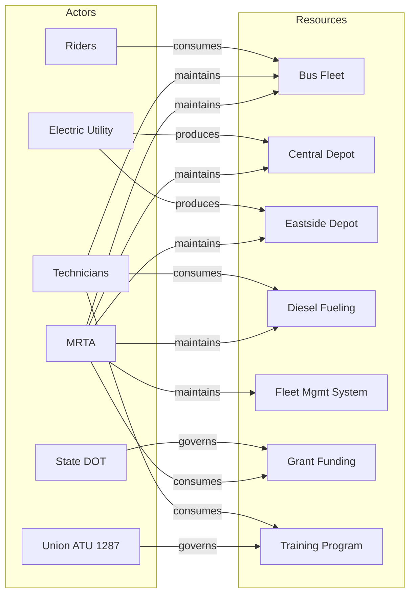

# Field Survey - Regional Bus Fleet Electrification

This field survey documents the current state of the Metro Regional Transit Authority's bus fleet and supporting infrastructure to inform the design of a fleet electrification program.

## Animating Purpose

### Why This Survey

Metro Regional Transit Authority (MRTA) operates 180 diesel buses across 24 routes serving 45,000 daily riders. The state has mandated that all transit agencies achieve 50% zero-emission fleet by 2032 and 100% by 2040. MRTA's current fleet averages 9 years old, with 60 buses due for replacement in the next 3 years under normal replacement cycles.

The authority faces a strategic decision point: replace aging diesel buses with new diesel (lower upfront cost, non-compliant long-term) or begin electric transition now (higher upfront cost, positions for compliance). Federal and state grants currently favor electric transitions, creating a funding window.

This survey documents the current landscape of stakeholders, infrastructure, and resources to inform architecture decisions for fleet electrification. Understanding operational constraints, utility relationships, and workforce readiness is essential before designing the transition.

### Scope Statement

This survey covers MRTA bus operations, maintenance facilities, utility relationships, and workforce across the three-county service area, focusing on elements that would be affected by or required for fleet electrification.

### Key Questions

This survey aims to answer:

1. Who are the key actors involved in bus procurement, operations, maintenance, and infrastructure?
2. What facilities, equipment, and utility infrastructure currently support bus operations?
3. How do actors depend on resources, and where are the critical dependencies for electrification?
4. What workforce skills exist, and what gaps would electrification create?
5. What utility grid capacity exists at depot locations, and what upgrades would be required?

## Actors

The following actors have been identified within the survey scope.

| ID | Name | Type | Description | Accountability |
|----|------|------|-------------|----------------|
| A1 | Metro Regional Transit Authority | Organization | Public transit agency operating fixed-route bus service across three counties | Fleet procurement, operations, maintenance, service delivery, capital planning |
| A2 | Regional Electric Utility | Organization | Investor-owned utility providing electricity to two of three MRTA depots | Power supply, grid infrastructure, rate structures, demand response programs |
| A3 | State Department of Transportation | External Party | State agency administering federal and state transit grants | Grant administration, compliance oversight, fleet reporting requirements |
| A4 | Bus Operators Union (ATU Local 1287) | Organization | Labor union representing 220 bus operators and 45 maintenance technicians | Workforce representation, training requirements, safety standards |
| A5 | Maintenance Technicians | Role | Skilled technicians maintaining bus fleet at two depot facilities | Diesel engine repair, preventive maintenance, fleet availability |
| A6 | Daily Riders | User Class | 45,000 daily passengers using MRTA bus service | Service reliability expectations, accessibility needs, route coverage |

### Actor Definitions

#### A1: Metro Regional Transit Authority

MRTA was established in 1978 as a regional transit authority with taxing authority across three counties. The Authority is governed by a 9-member board with representatives from each county and major cities. Annual operating budget is \$85M, with capital budget varying by project. The Authority operates two maintenance depots: Central Depot (capacity 120 buses) and Eastside Depot (capacity 80 buses).

#### A2: Regional Electric Utility

Pacific Power serves Metro and Eastside counties where both depots are located. The utility has a commercial EV rate program and has partnered with other transit agencies on fleet electrification. Grid capacity at the Central Depot location is constrained; preliminary assessment indicates 2-3 MW upgrade required for full electrification.

#### A3: State Department of Transportation

State DOT administers FTA formula funds and state transit grants. Recent state legislation created a Zero-Emission Transit Fund providing \$50M annually statewide for electric bus purchases and infrastructure. DOT requires annual fleet composition reports and compliance plans toward 2032/2040 mandates.

#### A4: Bus Operators Union (ATU Local 1287)

The union represents all operators and maintenance technicians under a collective bargaining agreement expiring in 2027. The current agreement includes provisions for retraining when technology changes. Union leadership has expressed support for electrification contingent on job preservation and adequate training.

#### A5: Maintenance Technicians

45 technicians across two shifts maintain the 180-bus fleet. Current skills focus on diesel engine repair, HVAC, pneumatic brakes, and electrical systems (12V/24V). High-voltage training (required for EV maintenance) is limited to 3 technicians who maintain hybrid support vehicles. Average technician tenure is 12 years.

#### A6: Daily Riders

Ridership is 45,000 daily boardings across 24 routes. Peak routes serve downtown employment centers and regional hospitals. Service reliability (on-time performance) is a key satisfaction driver. Riders are generally unaware of propulsion technology but sensitive to service disruptions during any transition.

## Resources

The following resources have been identified within the survey scope.

| ID | Name | Type | Description | Status |
|----|------|------|-------------|--------|
| R1 | Diesel Bus Fleet | Technology | 180 New Flyer diesel buses, model years 2012-2022, 40-foot standard | Active - 60 buses due for replacement 2026-2028 |
| R2 | Central Depot Facility | Infrastructure | 120-bus capacity maintenance and storage facility with fueling station | Active - Built 1995, electrical service 480V/800A |
| R3 | Eastside Depot Facility | Infrastructure | 80-bus capacity maintenance and storage facility with fueling station | Active - Built 2008, electrical service 480V/1200A |
| R4 | Diesel Fueling Infrastructure | Infrastructure | Underground storage tanks and dispensers at both depots | Active - Central depot tanks due for replacement 2028 |
| R5 | Fleet Management System | Technology | Trapeze fleet management and scheduling software | Active - Includes vehicle tracking, maintenance scheduling |
| R6 | Federal/State Grant Funding | Capital | FTA 5307/5339 formula funds plus state Zero-Emission Transit Fund | Active - \$12M annual formula; ZETF competitive |
| R7 | Maintenance Training Program | Process | In-house and vendor training for technician skill development | Active - Currently focused on diesel systems |

### Resource Definitions

#### R1: Diesel Bus Fleet

The fleet consists of 180 New Flyer XD40 and XDE40 (diesel-electric hybrid) buses. 45 buses are hybrids acquired 2018-2022. Hybrids have provided operational experience with electric drive systems. The 60 buses due for replacement are oldest diesel units with highest maintenance costs. Average fleet fuel economy is 4.2 MPG.

#### R2: Central Depot Facility

Central Depot handles 110 buses daily with maintenance bays for 8 buses simultaneously. Current electrical service (480V, 800A, ~660kW) powers shop equipment and building. Utility assessment indicates service upgrade to 4 MW would require transformer replacement and possible feeder upgrade. Land is available for charging infrastructure.

#### R3: Eastside Depot Facility

Eastside Depot is newer with better electrical capacity. Current service (480V, 1200A, ~1MW) could support initial charging deployment (10-15 buses) without upgrade. Full electrification would require upgrade to approximately 3 MW. Facility has covered parking suitable for charging installation.

#### R4: Diesel Fueling Infrastructure

Both depots have diesel fueling with underground storage. Central depot tanks (installed 1995) require replacement or decommissioning by 2028 under EPA regulations. This creates a decision point: invest in new diesel infrastructure or transition to electric. Eastside tanks are newer (2008) with 15+ years remaining life.

#### R5: Fleet Management System

Trapeze FMS handles scheduling, dispatch, and maintenance tracking. System would require integration with charging management systems for electric fleet. Vendor offers EV module add-on. Current system lacks energy consumption tracking needed for electric fleet optimization.

#### R6: Federal/State Grant Funding

FTA Section 5307 (urbanized area formula) provides \$8M annually. Section 5339 (bus and facilities) provides \$4M. State ZETF provides competitive grants up to \$500K per electric bus (vs. \$350K bus cost) effectively covering vehicle premium plus infrastructure. Grant compliance requires buy-America, ADA, and reporting.

#### R7: Maintenance Training Program

Training is provided through New Flyer (OEM), community college partnership, and in-house programs. Current curriculum is diesel-focused. High-voltage safety and EV-specific training would require new curriculum. Union agreement requires 40 hours annual training; additional hours require negotiation.

## Relationships

The following relationships document how actors connect to resources within the survey scope.

| Actor ID | Resource ID | Relationship | Description |
|----------|-------------|--------------|-------------|
| A1 | R1 | Maintains | MRTA operates and maintains the bus fleet through in-house staff |
| A1 | R2 | Maintains | MRTA owns and operates Central Depot facility |
| A1 | R3 | Maintains | MRTA owns and operates Eastside Depot facility |
| A1 | R6 | Consumes | MRTA receives and expends federal/state grant funds |
| A2 | R2 | Produces | Utility provides electrical service to Central Depot |
| A2 | R3 | Produces | Utility provides electrical service to Eastside Depot |
| A3 | R6 | Governs | State DOT administers grant programs and compliance |
| A4 | R7 | Governs | Union agreement defines training requirements and hours |
| A5 | R1 | Maintains | Technicians perform maintenance on bus fleet |
| A5 | R7 | Consumes | Technicians receive training through program |
| A6 | R1 | Consumes | Riders depend on bus fleet for transportation service |
| A1 | R5 | Maintains | MRTA operates fleet management system |
| A1 | R4 | Maintains | MRTA maintains fueling infrastructure |
| A5 | R4 | Consumes | Technicians use fueling infrastructure for fleet operations |

### Relationship Diagram

### Key Dependencies

**Critical Dependencies Identified:**

1. **Grid Capacity Constraint:** Electrification at Central Depot (A1's primary facility) depends on utility (A2) infrastructure upgrades. Current capacity supports only 5-10 buses. Full electrification requires 2-3 MW upgrade with 18-24 month lead time.

2. **Workforce Transition:** Fleet maintenance (A5→R1) depends on training (A5→R7), which is governed by union agreement (A4→R7). Electrification requires high-voltage certification that current program doesn't provide. Union negotiation required.

3. **Funding Timing:** Electric transition depends on grant funding (A1→R6) governed by state (A3→R6). Current ZETF program has 3-year authorization; future funding uncertain. Window for favorable funding may close.

4. **Diesel Infrastructure Decision:** Central Depot fueling tanks (R4) require replacement by 2028. Decision to invest in new diesel vs. transition to electric must be made by 2026 to allow implementation time.

## Scope Boundaries

### In Scope

The following are explicitly within the scope of this survey:

- MRTA fixed-route bus operations and fleet
- Both maintenance depot facilities and infrastructure
- Utility electrical service to depot locations
- Maintenance workforce skills and training
- Federal and state grant programs for transit
- Fleet management and scheduling systems
- Union labor agreements affecting workforce transition

### Out of Scope

The following are explicitly outside the scope of this survey:

- Paratransit services (separate fleet and operations)
- Commuter rail operations (separate MRTA division)
- On-route charging infrastructure (future consideration)
- Hydrogen fuel cell technology (not selected for this program)
- Private transit operators in the region

### Boundary Rationale

These boundaries focus on fixed-route bus operations where the electrification mandate applies and where MRTA has direct operational control. Paratransit and commuter rail have different vehicle types and operational patterns requiring separate analysis. On-route charging is a future optimization once depot charging is established. Hydrogen was evaluated and rejected due to regional fueling infrastructure gaps.

## Key Findings

### Summary Observations

1. **Favorable Replacement Timing:** 60 buses due for replacement in 2026-2028 align with electrification opportunity. Normal replacement cycle provides natural transition point without early retirement costs.

2. **Infrastructure Lead Time Mismatch:** Bus procurement (12-18 months) is faster than grid upgrade (18-24 months). Infrastructure planning must start before bus orders to avoid stranded assets.

3. **Eastside Depot Advantage:** Eastside facility has better electrical capacity for initial deployment. Starting there reduces utility upgrade risk while building operational experience.

4. **Workforce Readiness Gap:** Only 3 of 45 technicians have high-voltage training. Significant training investment required, but union is supportive with proper negotiation.

5. **Grant Window Open:** Current ZETF program plus federal BIL funds create favorable funding environment. Delaying decision risks missing this window.

### Gaps and Tensions

| Gap/Tension | Description | Implication |
|-------------|-------------|-------------|
| Grid capacity gap | Central Depot needs 2-3 MW upgrade; 18-24 month lead time | Architecture must sequence depot transitions; start at Eastside |
| Training gap | 42 of 45 technicians lack high-voltage certification | Program plan must include comprehensive training before fleet arrives |
| Diesel tank timing | Central depot tanks expire 2028; decision needed 2026 | Creates forcing function for electrification decision |
| Funding uncertainty | ZETF authorized through 2028; future unknown | Program should maximize use of current funding window |

### Implications for Architecture

The architecture for fleet electrification must address infrastructure lead times by sequencing depot transitions. Eastside Depot should be prioritized for initial deployment due to better electrical capacity.

Key architectural considerations:

- **Phased depot transition:** Eastside first (lower infrastructure barrier), Central second (requires utility upgrade)
- **Charging infrastructure:** Depot charging as primary; on-route charging as future enhancement
- **Fleet management integration:** Charging management integrated with existing Trapeze FMS
- **Workforce development:** Training program redesign as parallel workstream
- **Utility partnership:** Formal agreement with Pacific Power for infrastructure coordination

The architecture should enable 50% fleet electrification by 2032 mandate while establishing foundation for 100% by 2040.

## Methodology

### Data Sources

- MRTA fleet inventory and replacement schedule
- Pacific Power commercial service records and grid capacity assessment
- State DOT grant program guidelines and compliance requirements
- ATU Local 1287 collective bargaining agreement
- Depot facility assessments and electrical surveys
- Industry data from peer transit agencies (Denver RTD, LA Metro)

### Collection Methods

Information gathered through interviews with MRTA operations and maintenance leadership, Pacific Power commercial accounts team, union leadership, and document review of fleet records, facility assessments, and grant program materials.

### Limitations

- Utility grid assessment is preliminary; detailed engineering study required
- Grant program guidelines subject to annual appropriation changes
- Peer agency data may not fully transfer to MRTA context
- Technology costs changing rapidly; estimates valid for 12-18 months

---

**Note:** This field survey establishes context for fleet electrification architecture. The diesel tank replacement deadline at Central Depot creates a forcing function for decision-making. The favorable grant environment and natural replacement cycle create an opportunity window for transition.
