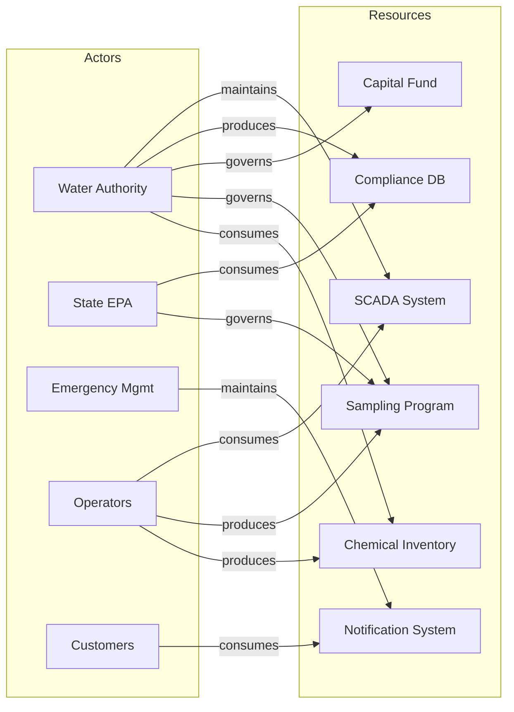

# Field Survey - Municipal Water Quality Monitoring

This field survey documents the current state of water quality monitoring in Clearwater County to inform the design of an enhanced real-time monitoring system.

## Animating Purpose

### Why This Survey

Clearwater County has experienced three water quality incidents in the past 18 months, including a turbidity event that affected 15,000 residents and a chlorine level exceedance that required a boil-water advisory. Current monitoring relies on manual sampling at 12 locations with 48-hour lab turnaround times. The county water authority is considering investment in real-time monitoring capabilities to detect issues earlier and respond faster.

This survey documents the current landscape of stakeholders, technologies, and relationships to inform architecture decisions for an enhanced monitoring system. Understanding who is involved, what resources exist, and how they relate is essential before designing solutions.

### Scope Statement

This survey covers the Clearwater County water distribution network, including all entities involved in water treatment, distribution, monitoring, and regulatory compliance, along with the technologies and resources they use or depend upon.

### Key Questions

This survey aims to answer:

1. Who are the key actors responsible for water quality across treatment, distribution, and oversight?
2. What monitoring technologies and data resources currently exist, and what is their status?
3. How do actors currently depend on resources to fulfill their water quality responsibilities?
4. What gaps exist in the current monitoring and response capabilities?
5. Where are the boundaries of county authority versus state or federal jurisdiction?

## Actors

The following actors have been identified within the survey scope, representing organizations and roles accountable for water quality in Clearwater County.

| ID | Name | Type | Description | Accountability |
|----|------|------|-------------|----------------|
| A1 | Clearwater County Water Authority | Organization | Public utility responsible for water treatment and distribution across the county | Accountable for water quality from treatment through delivery; regulatory compliance; public communications |
| A2 | State Environmental Protection Agency | External Party | State regulatory body with oversight of public water systems | Sets water quality standards; conducts compliance audits; issues violations and advisories |
| A3 | County Emergency Management | Organization | County office coordinating emergency response across departments | Coordinates multi-agency response to water quality emergencies; manages public notification systems |
| A4 | Water System Operators | Role | Licensed operators who manage treatment plants and distribution | Daily operations of treatment processes; manual sampling; equipment maintenance; compliance documentation |
| A5 | Residential Customers | User Class | Approximately 45,000 households served by the county water system | Receive water service; report quality concerns; affected by advisories and outages |

### Actor Definitions

#### A1: Clearwater County Water Authority

The Water Authority operates two treatment plants serving the county: the main Lakeside Treatment Facility (capacity 25 MGD) and the Eastern Treatment Plant (capacity 8 MGD). The Authority employs 45 staff including licensed operators, maintenance personnel, and administrative staff. Decision-making authority for capital investments rests with the Authority's board, which reports to the County Commission.

#### A2: State Environmental Protection Agency

The State EPA enforces the Safe Drinking Water Act requirements at the state level. They conduct triennial audits of the county system, review monthly compliance reports, and have authority to issue violations, fines, or emergency orders. The regional office in Capitol City handles Clearwater County.

#### A3: County Emergency Management

Emergency Management coordinates the county's response to public health emergencies including water quality events. They manage the public alert system (text, phone, email) and coordinate with state emergency management when events exceed county response capacity.

#### A4: Water System Operators

The county employs 12 licensed operators across shifts at both treatment plants. Operators hold state certifications (Class II minimum for treatment, Class I for distribution). They perform manual sampling, operate SCADA systems, adjust treatment processes, and document all operations for compliance records.

#### A5: Residential Customers

Customers represent diverse demographics across urban Clearwater City (pop. 62,000) and rural townships. Customer concerns are received through a call center and online portal. During the 2025 boil-water advisory, the call center received 3,400 calls in 48 hours.

## Resources

The following resources have been identified within the survey scope, representing technologies, data, infrastructure, and capital that actors produce, consume, or depend upon.

| ID | Name | Type | Description | Status |
|----|------|------|-------------|--------|
| R1 | SCADA Control System | Technology | Supervisory control system managing treatment processes and distribution pumps | Active - Installed 2018; vendor support until 2028 |
| R2 | Manual Sampling Program | Process | 12-point sampling with lab analysis; 48-hour turnaround for standard tests | Active - Meets minimum regulatory requirements |
| R3 | Compliance Database | Data | Historical water quality records, sampling results, violation history since 2010 | Active - MS Access database; limited query capability |
| R4 | Public Notification System | Infrastructure | Multi-channel alert system (SMS, phone, email) for emergency communications | Active - Managed by Emergency Management; 78% customer enrollment |
| R5 | Capital Improvement Fund | Capital | Annual allocation for water system improvements; current balance \$2.3M | Active - FY26 budget includes \$800K for monitoring improvements |
| R6 | Treatment Chemical Inventory | Data | Real-time tracking of chlorine, fluoride, and coagulant supplies | Active - Manual tracking in spreadsheets; weekly updates |

### Resource Definitions

#### R1: SCADA Control System

The Wonderware-based SCADA system monitors approximately 200 points across both treatment plants and 15 distribution system locations. It controls treatment processes but has limited water quality monitoring capability (turbidity at plants only, no distribution network quality sensing). Data retention is 90 days; longer-term storage requires manual export.

#### R2: Manual Sampling Program

Operators collect samples at 12 locations per state requirements. Standard tests (coliform, chlorine residual, turbidity) are sent to the regional lab with 48-hour typical turnaround. Lead/copper and DBP testing follows regulatory schedules. The process meets compliance but does not enable rapid detection of quality issues.

#### R3: Compliance Database

The database contains 15 years of sampling records but lacks robust query tools. Monthly compliance reports are generated manually. Integration with SCADA is one-way (manual data entry). The database was custom-built by a former staff member; documentation is limited.

#### R4: Public Notification System

The Everbridge-based system can reach enrolled customers within 15 minutes. Coverage gaps exist in rural areas with poor cell service. The system was successfully used during the 2025 boil-water advisory but capacity limits were approached during peak notification periods.

#### R5: Capital Improvement Fund

The fund receives annual appropriations from county general fund and water rate revenues. The board has earmarked \$800K in FY26 specifically for monitoring system improvements following the 2025 incidents. Additional state grants may be available for water infrastructure.

#### R6: Treatment Chemical Inventory

Chemical tracking is critical for treatment operations but currently managed through spreadsheets updated weekly. Low inventory situations have caused emergency procurement twice in the past year. Real-time integration with SCADA is desired but not implemented.

## Relationships

The following relationships document how actors connect to resources within the survey scope, forming a bipartite graph of dependencies and accountabilities.

| Actor ID | Resource ID | Relationship | Description |
|----------|-------------|--------------|-------------|
| A1 | R1 | Maintains | Water Authority owns and maintains the SCADA system through IT staff |
| A1 | R3 | Produces | Water Authority generates compliance records through sampling and operations |
| A1 | R5 | Governs | Water Authority board controls capital improvement fund allocation |
| A2 | R3 | Consumes | State EPA reviews compliance database during audits and for monthly reports |
| A3 | R4 | Maintains | Emergency Management operates the public notification system |
| A4 | R1 | Consumes | Operators use SCADA daily for treatment control and monitoring |
| A4 | R2 | Produces | Operators execute sampling program and submit samples to lab |
| A4 | R6 | Produces | Operators update chemical inventory records (currently manual) |
| A5 | R4 | Consumes | Customers receive alerts through public notification system |
| A1 | R2 | Governs | Water Authority defines sampling program scope and schedule |
| A2 | R2 | Governs | State EPA sets minimum sampling requirements that program must meet |
| A1 | R6 | Consumes | Water Authority uses inventory data for procurement planning |

### Relationship Diagram

### Key Dependencies

**Critical Dependencies Identified:**

1. **Detection Gap:** Operators (A4) depend on SCADA (R1) for real-time awareness, but SCADA has minimal water quality sensing. Quality issues in the distribution network are invisible until manual sampling (R2) detects them 48+ hours later.

2. **Response Bottleneck:** Customer notification (A5→R4) depends on Emergency Management (A3) activation, which depends on Water Authority (A1) declaring an emergency based on compliance data (R3). This chain has multiple decision delays.

3. **Regulatory Compliance Chain:** State EPA (A2) oversight depends on compliance database (R3) accuracy, which depends on operators (A4) correctly executing sampling program (R2) and entering data. Manual processes create error risk.

4. **Capital Constraint:** All improvements depend on Capital Fund (R5) governed by Water Authority (A1). The \$800K earmark is significant but may not cover comprehensive real-time monitoring.

## Scope Boundaries

### In Scope

The following are explicitly within the scope of this survey:

- Clearwater County Water Authority operations and governance
- Both treatment plants (Lakeside and Eastern) and the distribution network
- All county-owned monitoring and control systems
- State EPA regulatory interface as it affects county operations
- Emergency notification systems and processes
- Customer-facing communications and feedback systems
- Capital funding mechanisms for water system improvements

### Out of Scope

The following are explicitly outside the scope of this survey:

- Source water quality (lake and groundwater sources are monitored by different programs)
- Wastewater treatment operations (separate county department)
- Private well systems (not served by county water)
- Industrial water users (covered under separate industrial permits)
- Neighboring county water systems (no interconnections)

### Boundary Rationale

These boundaries focus on what the county water authority can directly influence and improve. Source water is managed through separate watershed programs with different stakeholders. Wastewater is organizationally separate. Private wells and industrial users fall under different regulatory frameworks. The goal is to define a coherent system where improvements to monitoring can be implemented under unified governance.

## Key Findings

### Summary Observations

1. **Detection-to-Response Gap:** The 48-hour lag between quality issues occurring and detection through manual sampling creates significant public health risk. The 2025 incidents demonstrated that issues can affect thousands of customers before the current system detects them.

2. **Siloed Data Systems:** SCADA, compliance database, and chemical inventory exist as separate systems with manual integration. Operators must work across multiple interfaces, and no unified view of system health exists.

3. **Notification Readiness:** The public notification system (R4) is relatively modern and effective, but the decision chain to activate it depends on slow detection. Faster detection would enable faster response.

4. **Investment Alignment:** The \$800K capital earmark signals organizational readiness for improvement. Stakeholder awareness from recent incidents creates a window for change.

5. **Operator Capability:** Licensed operators (A4) have deep system knowledge but are constrained by tools. They report frustration with manual processes and limited real-time visibility.

### Gaps and Tensions

| Gap/Tension | Description | Implication |
|-------------|-------------|-------------|
| Real-time Monitoring Gap | No continuous water quality monitoring in distribution network | Architecture must include distributed sensing capability |
| Data Integration Gap | No unified data platform connecting SCADA, compliance, and inventory | Architecture should consider data integration layer |
| Alert Automation Tension | Emergency Management controls notifications but Water Authority detects issues | Architecture should clarify automated vs. human alert triggers |
| Budget vs. Scope Tension | \$800K may not cover comprehensive solution | Architecture should enable phased implementation |

### Implications for Architecture

The architecture for an enhanced monitoring system must address the core detection gap through real-time sensing in the distribution network. Integration with existing SCADA provides a foundation, but the system must go beyond current SCADA capabilities.

Key architectural considerations:
- **Real-time sensors** at critical points in the distribution network (beyond the 12 manual sampling locations)
- **Data integration platform** that unifies SCADA, quality monitoring, and compliance reporting
- **Automated alerting** with clear thresholds that can trigger notifications without waiting for manual decisions
- **Phased deployment** approach that delivers value within budget constraints while enabling future expansion
- **Operator interface** that provides unified situational awareness without requiring new certifications

The architecture should preserve regulatory compliance (State EPA requirements) while exceeding minimum standards for public health protection.

## Methodology

### Data Sources

- Interviews with Water Authority management and operations staff (December 2025)
- State EPA compliance records for Clearwater County (2020-2025)
- SCADA system documentation and capability assessment
- Post-incident reports from 2025 water quality events
- County budget documents and capital improvement plans

### Collection Methods

Information was gathered through structured interviews with key stakeholders, document review, and site visits to both treatment plants. SCADA capabilities were assessed through vendor documentation and operator demonstrations.

### Limitations

- Customer perspective based on call center data and satisfaction surveys; no direct customer interviews conducted
- Chemical supplier relationships not explored (may affect inventory management options)
- IT infrastructure assessment limited to water-specific systems; enterprise IT capabilities not evaluated

---

**Note:** This field survey establishes the context for designing an enhanced water quality monitoring system. The bipartite graph of actors and resources reveals a system capable of compliance but vulnerable to detection delays. Architecture work should focus on closing the detection gap while working within identified constraints.
