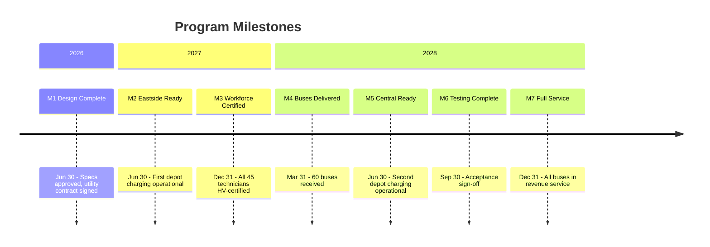

# Program Memo - Bus Fleet Electrification

This memo provides an executive summary of the MRTA Fleet Electrification Program Phase 1, synthesizing the architecture, lifecycle, and program plan into a single reference for stakeholders.

## Program Overview

Metro Regional Transit Authority must transition its bus fleet to zero-emission to meet state mandates: 50% by 2032 and 100% by 2040. Currently, MRTA operates 180 diesel buses, with 60 due for replacement in the next three years under normal replacement cycles. This creates a strategic opportunity: instead of replacing diesel with diesel, MRTA can begin electric transition now while favorable federal and state grants are available.

The Fleet Electrification Program Phase 1 replaces 60 diesel buses with battery-electric buses and installs depot charging infrastructure at both maintenance facilities. This achieves 33% zero-emission fleet, positioning MRTA for 50% by 2032 with subsequent phases.

Beyond regulatory compliance, electrification reduces operating costs (electricity cheaper than diesel), improves air quality in the communities we serve, and reduces maintenance complexity (fewer moving parts in electric drivetrains). The favorable grant environment—federal Bipartisan Infrastructure Law plus state Zero-Emission Transit Fund—makes this the optimal time to begin.

| Attribute | Value |
|-----------|-------|
| **Sponsor** | State DOT (grant funding) + MRTA (local match) |
| **Recipient** | MRTA Operations Division |
| **Target Completion** | December 2028 |
| **Budget Range** | \$43M - \$47M |

> **Details:** See [[field-survey-bus-electrification]] for complete stakeholder inventory, resource analysis, and operational context.

## What We're Building

### Goal State

The program delivers a fleet of 60 battery-electric buses capable of serving MRTA's routes with no service degradation. Buses charge overnight at depot facilities during the 6-hour layover window, eliminating the need for complex on-route charging. The system integrates with existing fleet management, enabling dispatchers to assign buses to routes based on state-of-charge and route distance requirements.

### Key Components

- **Electric Bus Fleet:** 60 New Flyer XE40 battery-electric buses with 150+ mile range, replacing oldest diesel units
- **Charging Infrastructure:** 60 ABB 150kW depot chargers (20 at Eastside, 40 at Central) enabling overnight charging
- **Utility Interconnection:** Grid upgrades at both depots (Eastside: 3MW, Central: 4MW) to support charging load
- **Fleet Management Integration:** ChargePoint charging management integrated with existing Trapeze scheduling system
- **Certified Workforce:** All 45 maintenance technicians trained and certified for high-voltage systems

### Success Criteria

- 60 electric buses operational in revenue service
- Zero range-related service failures for 30 consecutive days
- Electric fleet maintains ≥85% availability (matching diesel baseline)
- All 45 technicians high-voltage certified before bus arrival
- Full fleet overnight charging demonstrated within 6-hour window

> **Details:** See [[architecture-bus-electrification]] for complete architecture documentation including functional specifications, component designs, and technology selections.

## How We're Building It

### Development Approach

The program follows a V-model lifecycle that addresses a unique challenge: charging infrastructure requires longer lead time (18-24 months for utility upgrades) than bus procurement (18 months). The lifecycle sequences these dependencies: utility work starts first, enabling charger installation, which must complete before buses arrive.

This systematic approach ensures:
- Infrastructure ready before vehicles arrive (no stranded buses)
- Workforce trained before first electric bus delivery
- Each phase verified before proceeding to next
- Stakeholder validation at key decision points

### Key Phases

| Phase Group | Purpose | Duration |
|-------------|---------|----------|
| Design | Route analysis, specifications, technology selection, procurement preparation | 6 months |
| Implementation | Utility upgrades, charger installation, bus procurement, workforce training (parallel streams) | 24 months |
| Evaluation | Component testing, integration testing, system testing, acceptance validation | 4 months |
| Operations | Revenue service deployment, performance monitoring, ongoing maintenance | Ongoing |

### Quality Assurance

The program distinguishes verification (confirming work meets specifications) from validation (confirming system meets stakeholder needs). Design and implementation phases use verification gates with documented criteria. Acceptance testing requires explicit validation sign-off from MRTA Leadership, Maintenance Technicians, Bus Operators, Pacific Power, and State DOT before proceeding to revenue service.

> **Details:** See [[lifecycle-bus-electrification]] for complete lifecycle documentation including phase details, gate criteria, and operations procedures.

## Execution Summary

### Timeline

### Team and Resources

| Resource | Allocation |
|----------|------------|
| Capital Budget | \$44.2M (within \$45M authorization) |
| Federal Grants (FTA) | \$23M (5339 + 5307) |
| State ZETF | \$15M |
| Local Match | \$7M |
| Program Duration | 36 months |
| Annual Operating Savings | ~\$1.2M (fuel + maintenance vs. diesel) |

### Top Risks

| Risk | Impact | Mitigation |
|------|--------|------------|
| Central utility upgrade delay | High - buses stranded without charging | Start utility work 6 months before bus order; contractual schedule with liquidated damages |
| Bus delivery delay | High - testing delayed | Factory visits; milestone payments; 3-month schedule buffer |
| Training completion delay | High - safety concerns | Start 9 months early; multiple training cohorts; weekly tracking |
| Construction cost escalation | Medium - budget pressure | 10% contingency (\$4M); fixed-price contracts where possible |
| Grant funding reduction | High - incomplete program | Diversified funding sources; multi-year commitments secured |

> **Details:** See [[program-plan-bus-electrification]] for complete program plan including work breakdown, RACI matrix, full risk register, and governance structure.

## Document Package

This memo summarizes the following documentation package:

| Document | Purpose | When to Consult |
|----------|---------|-----------------|
| [[field-survey-bus-electrification]] | Establishes context | Stakeholder details, resource inventory, scope boundaries |
| [[architecture-bus-electrification]] | Defines what we're building | Technical specifications, component design, technology rationale |
| [[lifecycle-bus-electrification]] | Defines how we build it | Phase details, verification gates, operations procedures |
| [[program-plan-bus-electrification]] | Defines execution plan | Schedules, budgets, team assignments, full risk register |
| This Memo | Executive summary | Quick orientation, board presentations, stakeholder briefings |

### Document Currency

| Document | Version | Last Updated |
|----------|---------|--------------|
| Field Survey | 1.0.0 | 2026-01-04 |
| Architecture | 1.0.0 | 2026-01-04 |
| Lifecycle | 1.0.0 | 2026-01-04 |
| Program Plan | 1.0.0 | 2026-01-04 |
| This Memo | 1.0.0 | 2026-01-04 |

## Approval and Accountability

| Role | Name | Date |
|------|------|------|
| Prepared By | Claude (LLM-assisted, dry run) | 2026-01-04 |
| Reviewed By | (Test document - not reviewed) | - |
| Approved By | (Test document - not approved) | - |

### Accountability Statement

This memo synthesizes information from the architecture, lifecycle, and program plan documents. It provides executive-level understanding of the program but should not substitute for source documents when detailed information is required.

The Program Management Office is responsible for keeping this memo current with any changes to the underlying documentation. Material changes to scope, timeline, or budget require memo update within 5 business days and notification to all document distribution recipients.

---

**Note:** This program memo was created as part of a runbook dry run. In production, this memo would require human review and approval before distribution to the MRTA Board and stakeholders.
