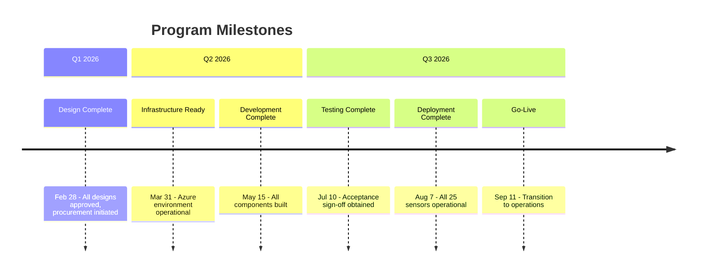

# Program Memo - Water Quality Monitoring System

This memo provides an executive summary of the Clearwater Real-Time Water Quality Monitoring Program, synthesizing the architecture, lifecycle, and program plan into a single reference document for stakeholders.

## Program Overview

Clearwater County has experienced three water quality incidents in the past 18 months that exposed a critical gap in our monitoring capabilities. Our current system relies on manual sampling at 12 locations with 48-hour lab turnaround times—meaning quality issues can affect thousands of residents before we detect them. The 2025 turbidity event and subsequent boil-water advisory demonstrated the consequences of this detection gap.

The Real-Time Water Quality Monitoring Program addresses this vulnerability by deploying continuous monitoring sensors throughout our distribution network, reducing detection time from 48 hours to under 15 minutes. The system will integrate with our existing SCADA infrastructure, provide operators with unified dashboards, and automate alerts when parameters exceed thresholds.

This investment directly responds to public concern following the 2025 incidents and positions Clearwater County as a leader in proactive public health protection.

| Attribute | Value |
|-----------|-------|
| **Sponsor** | Clearwater County Water Authority |
| **Recipient** | Water Authority Operations Division |
| **Target Completion** | September 2026 |
| **Budget Range** | \$750K - \$850K |

> **Details:** See [[field-survey-water-quality-monitoring]] for complete stakeholder inventory, resource analysis, and operational context.

## What We're Building

### Goal State

The program delivers a real-time water quality monitoring network that continuously measures chlorine levels, turbidity, pH, and temperature at 25 points across our distribution system. Operators will see network-wide quality status on a single dashboard, receive automated alerts within minutes of any parameter exceedance, and generate compliance reports with minimal manual effort.

### Key Components

- **Sensor Network:** 25 monitoring stations with industrial-grade Hach sensors, each transmitting readings every minute via cellular connection
- **Data Platform:** Azure-based cloud platform that integrates sensor data with our existing SCADA system, providing unified data access
- **Analytics Engine:** Automated threshold monitoring and anomaly detection, triggering alerts when parameters exceed configured limits
- **Alert System:** Multi-channel notification (SMS, voice) to on-duty operators with escalation to management and emergency services
- **Compliance Reporter:** Automated generation of regulatory reports and Power BI dashboards for operational visibility

### Success Criteria

- Real-time data available from all 25 monitoring points with less than 5-minute latency
- Unified dashboard showing network-wide quality status in a single operator interface
- Automated alerts reaching on-duty operators within 2 minutes of threshold exceedance
- Monthly compliance reports generated automatically with less than 1 hour of manual review
- Detection-to-response time reduced to under 15 minutes (validated through drills)

> **Details:** See [[architecture-water-quality-monitoring]] for complete architecture documentation including functional specifications, component designs, and technology selections.

## How We're Building It

### Development Approach

The program follows a V-model lifecycle that ensures systematic progression from requirements through validation. The V-model creates traceability between what we need (stakeholder requirements) and how we verify delivery (acceptance testing), with each design phase having a corresponding evaluation phase.

This approach was chosen because:
- Water quality monitoring is safety-critical; systematic verification reduces risk
- Stakeholder acceptance is essential—operators, management, and regulators must all approve
- The phased approach allows early detection of issues before they become expensive to fix

### Key Phases

| Phase Group | Purpose | Duration |
|-------------|---------|----------|
| Design | Transform requirements into implementation specifications through 3 phases | 8 weeks |
| Implementation | Build all system components: sensors, cloud platform, analytics, dashboards | 10 weeks |
| Evaluation | Systematically test from individual components through stakeholder acceptance | 8 weeks |
| Operations | Deploy sensors to field, run parallel operation, transition to normal operations | 8 weeks |

### Quality Assurance

The program distinguishes between verification (automated checks that confirm components work as designed) and validation (human approval that confirms the system meets actual stakeholder needs). Each design and implementation phase has verification gates with specific pass/fail criteria. Acceptance testing requires sign-off from Water Authority Management, Operations, State EPA liaison, and Emergency Management before proceeding to deployment.

> **Details:** See [[lifecycle-water-quality-monitoring]] for complete lifecycle documentation including phase details, gate criteria, and operations procedures.

## Execution Summary

### Timeline

### Team and Resources

| Resource | Allocation |
|----------|------------|
| Capital Budget | \$780,000 (within \$800K authorization) |
| Program Manager | 0.5 FTE for 9 months (Jane Chen) |
| Technical Lead | 0.75 FTE for 9 months (Bob Martinez) |
| Operations Lead | 0.5 FTE for 6 months (Carlos Rivera) |
| Vendor (TechWater) | Fixed-price analytics development contract |
| Annual Operating | \$93,000/year post-deployment |

### Top Risks

| Risk | Impact | Mitigation |
|------|--------|------------|
| SCADA integration complexity | High - could delay schedule | Engage Wonderware consultant early; test in lab before production |
| Cellular coverage at sensor sites | Medium - affects 3 of 25 sites | Pre-deployment site surveys; signal boosters budgeted |
| Operator resistance to new tools | Medium - reduces adoption | Involve operators in design; emphasize workload reduction |
| Vendor delivery delays | High - schedule slip | Fixed-price contract with milestones; backup vendor identified |
| Budget overrun | High - exceeds authorization | 7.5% contingency; competitive procurement; fixed-price contracts |

> **Details:** See [[program-plan-water-quality-monitoring]] for complete program plan including full work breakdown, RACI matrix, risk register, and governance structure.

## Document Package

This memo summarizes the following documentation package:

| Document | Purpose | When to Consult |
|----------|---------|-----------------|
| [[field-survey-water-quality-monitoring]] | Establishes context | Stakeholder details, resource inventory, scope boundaries |
| [[architecture-water-quality-monitoring]] | Defines what we're building | Technical details, component design, interfaces, technology rationale |
| [[lifecycle-water-quality-monitoring]] | Defines how we build it | Process details, phase gates, verification procedures, operations |
| [[program-plan-water-quality-monitoring]] | Defines execution plan | Schedules, budgets, team assignments, full risk register, governance |
| This Memo | Executive summary | Quick orientation, stakeholder briefings, board presentations |

### Document Currency

| Document | Version | Last Updated |
|----------|---------|--------------|
| Field Survey | 1.0.0 | 2026-01-04 |
| Architecture | 1.0.0 | 2026-01-04 |
| Lifecycle | 1.0.0 | 2026-01-04 |
| Program Plan | 1.0.0 | 2026-01-04 |
| This Memo | 1.0.0 | 2026-01-04 |

## Approval and Accountability

| Role | Name | Date |
|------|------|------|
| Prepared By | Claude (LLM-assisted, dry run) | 2026-01-04 |
| Reviewed By | (Test document - not reviewed) | - |
| Approved By | (Test document - not approved) | - |

### Accountability Statement

This memo synthesizes information from the architecture, lifecycle, and program plan documents. It is intended to provide accurate executive-level understanding of the program but should not substitute for the authoritative source documents when detailed information is required.

The program team is responsible for keeping this memo current with any changes to the underlying documentation package. Material changes to scope, timeline, or budget require memo update within 5 business days.

---

**Note:** This program memo was created as part of a runbook dry run to test the program development workflow. In a real program, this memo would require human review and approval before distribution to stakeholders.
