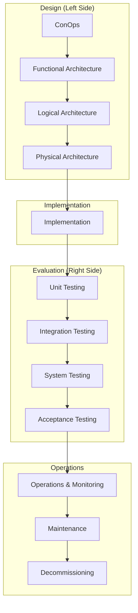

# Lifecycle - <Name>

## Introduction

[Introduction content - 1-3 paragraphs explaining:
- What system this lifecycle delivers
- Reference to the architecture document
- How this lifecycle maps to the V-model
- Who the stakeholders are for acceptance]

## Architecture Foundation

This lifecycle implements [[architecture-ref]].

### Architecture Summary

| Layer | Description | Evaluation |
|-------|-------------|------------|
| Conceptual | [ConOps summary] | Acceptance Testing |
| Functional | [Functions summary] | System Testing |
| Logical | [Components summary] | Integration Testing |
| Physical | [Implementation summary] | Unit Testing |

### Key Requirements

[Key Requirements content - Summary of key requirements from architecture that drive this lifecycle]

## V-Model Overview

## Design Phases

### Phase 1: ConOps to Functional Architecture

**Goal:** Transform stakeholder needs into system functions

**Inputs:**

- ConOps from architecture (conceptual layer)
- Stakeholder requirements

**Process:**

1. [Step 1]
2. [Step 2]

**Outputs:**

- Functional requirements specification
- Function-to-need traceability

**Verification Gate:**

- [Criteria for functional completeness]

### Phase 2: Functional to Logical Architecture

**Goal:** Transform functions into design-independent components

**Inputs:**

- Functional requirements
- Interface constraints

**Process:**

1. [Step 1]
2. [Step 2]

**Outputs:**

- Component specifications
- Interface definitions
- Function-to-component traceability

**Verification Gate:**

- [Criteria for logical completeness]

### Phase 3: Logical to Physical Architecture

**Goal:** Transform logical components into implementation specifications

**Inputs:**

- Component specifications
- Technology constraints

**Process:**

1. [Step 1]
2. [Step 2]

**Outputs:**

- Implementation specifications
- Technology selections
- Component-to-implementation traceability

**Verification Gate:**

- [Criteria for physical completeness]

## Implementation Phase

**Goal:** Build the system according to physical architecture specifications

**Inputs:**

- Physical architecture specifications
- Implementation standards

**Process:**

1. [Implementation steps]

**Outputs:**

- Implemented system components
- Implementation documentation

**Verification Gate:**

- Code/artifact review completed
- Implementation matches specifications

## Evaluation Phases

### Phase 4: Unit Testing

**Goal:** Verify individual components meet physical specifications

**Inputs:**

- Implemented components
- Physical architecture specifications

**Process:**

1. [Testing steps]

**Outputs:**

- Unit test results
- Component verification evidence

**Verification Gate:**

- All unit tests pass
- Coverage meets threshold

### Phase 5: Integration Testing

**Goal:** Verify component interactions meet logical architecture

**Inputs:**

- Verified components
- Logical architecture specifications

**Process:**

1. [Integration testing steps]

**Outputs:**

- Integration test results
- Interface verification evidence

**Verification Gate:**

- All integration tests pass
- Interfaces verified

### Phase 6: System Testing

**Goal:** Verify system functions meet functional requirements

**Inputs:**

- Integrated system
- Functional requirements

**Process:**

1. [System testing steps]

**Outputs:**

- System test results
- Function verification evidence

**Verification Gate:**

- All system tests pass
- Functions verified

### Phase 7: Acceptance Testing

**Goal:** Validate system meets stakeholder needs (ConOps)

**Inputs:**

- Tested system
- ConOps / stakeholder requirements

**Process:**

1. [Acceptance testing steps]

**Outputs:**

- Acceptance test results
- Stakeholder sign-off

**Validation Gate:**

- Stakeholders accept system
- Human approval documented

## Operations Phase

### Deployment

**Goal:** Deploy accepted system to production

**Process:**

1. [Deployment steps]

**Outputs:**

- Deployed system
- Deployment documentation

### Monitoring

**Goal:** Continuously monitor system health and performance

**Monitoring Requirements:**

| Metric | Target | Alert Threshold |
|--------|--------|-----------------|
| [metric] | [target] | [threshold] |

**Process:**

1. [Monitoring setup]
2. [Alert handling]

### Maintenance

**Goal:** Maintain system health and address issues

**Maintenance Types:**

| Type | Trigger | Process |
|------|---------|---------|
| Corrective | Defect discovered | [fix process] |
| Adaptive | Environment change | [adaptation process] |
| Perfective | Enhancement request | [enhancement process] |
| Preventive | Scheduled review | [review process] |

**Change Management:**

- [How changes are evaluated and approved]
- [How changes propagate through V-model]

## Decommissioning

### Decommissioning Triggers

| Trigger | Description |
|---------|-------------|
| [trigger 1] | [when this applies] |
| [trigger 2] | [when this applies] |

### Decommissioning Process

1. [Step 1: Stakeholder notification]
2. [Step 2: Data preservation]
3. [Step 3: Service transition]
4. [Step 4: Resource cleanup]
5. [Step 5: Documentation archival]

### Post-Decommissioning

- [What remains after decommissioning]
- [Archive location and retention]

## Traceability Matrix

| Architecture Layer | Design Phase | Implementation | Evaluation Phase |
|--------------------|--------------|----------------|------------------|
| Conceptual (ConOps) | ConOps → Functional | Stakeholder Requirements Document | Acceptance Testing |
| Functional | Functional → Logical | System-Level Functional Requirements | System Testing |
| Logical | Logical → Physical | Component-level Specifications | Integration Testing |
| Physical | Physical → Implementation | Implementation | Unit Testing |

---

**Note:** This lifecycle document follows the V-model pattern, transforming the architecture through design phases and validating through evaluation phases.
